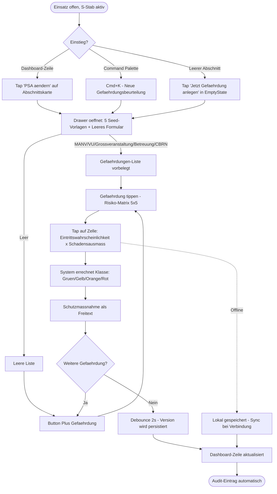
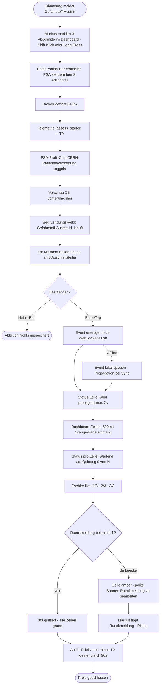
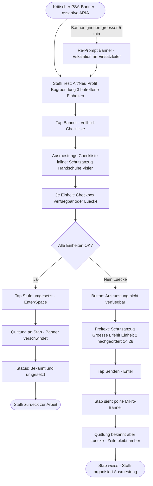
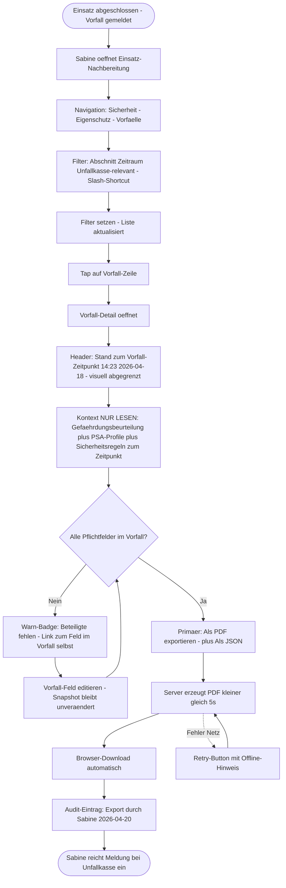

---
stepsCompleted:
  - step-01-init
  - step-02-discovery
  - step-03-core-experience
  - step-04-emotional-response
  - step-05-inspiration
  - step-06-design-system
  - step-07-defining-experience
  - step-08-visual-foundation
  - step-09-design-directions
  - step-10-user-journeys
  - step-11-component-strategy
  - step-12-ux-patterns
  - step-13-responsive-accessibility
  - step-14-complete
lastStep: 14
completedAt: 2026-04-21
status: Final
project_name: 'Bluelight Hub – Modul Eigenschutz (Einsatzkräfte-Sicherheit & PSA)'
source_prd: '_bmad-output/planning-artifacts/prd.md'
source_issue: 'https://github.com/rubenvitt/bluelight-hub/issues/415'
inputDocuments:
  - _bmad-output/planning-artifacts/prd.md
  - docs/project-documentation/00-index.md
  - docs/project-documentation/01-projektueberblick.md
  - docs/project-documentation/03-frontend-architektur.md
  - docs/project-documentation/06-datenmodell.md
  - github-issue:rubenvitt/bluelight-hub#415
---

# UX Design Specification – Modul Eigenschutz (Einsatzkräfte-Sicherheit & PSA)

**Author:** Ruben Vitt
**Date:** 2026-04-20
**Quelle:** [Issue #415](https://github.com/rubenvitt/bluelight-hub/issues/415) · [PRD](./prd.md)
**Status:** Final – collaborative UX Design Workflow (BMad) abgeschlossen 2026-04-21

---

<!-- UX design content will be appended sequentially through collaborative workflow steps -->

## Executive Summary

### Project Vision

Das Modul Eigenschutz wird als **Live-Ops-Werkzeug** entworfen, nicht als Dokumentations-Nachspiel. Arbeitsschutz wird während des Einsatzes handlungsfähig gemacht: Gefährdungsbeurteilung, PSA-Verwaltung, Sicherheitsregeln, Sicherungsposten und Vorfallmeldung sind in Echtzeit bedien- und propagierbar, versioniert und auditierbar by design.

**Nord-Stern:** Der Sicherheitsbeauftragte wechselt vom reaktiven Dokumentierer zum proaktiven Schutz-Lotsen. **Leitmetrik:** drei Abschnitte in < 10 Minuten vollständig mit Gefährdungsbeurteilung + PSA-Profilzuweisung + Bekanntgabe + Quittung abgedeckt.

### Target Users

Vier Personas — alle davon MVP-relevant; weitergehende Spezialschutz-Workflows sind bewusst ausgelagert:

1. **Markus — Sicherheitsbeauftragter im S-Stab (Primary).** Treibt Gefährdungsbeurteilung, PSA-Profile und Bekanntgabe. Arbeitet am Stabs-Tablet oder Desktop, unter Zeitdruck, erwartet Vorlagen-Start + schnelle Anpassung.
2. **Steffi — Einsatzabschnittsleiterin (Secondary / Recipient).** Empfängt PSA-Änderungen, prüft Ausrüstung je Einheit, quittiert, eskaliert Lücken zurück.
3. **Thomas — Stabs-Admin / Template-Pflege.** MVP-minimal: Nutzt die Seed-Vorlagen, volle Vorlagen-Pflege-UI erst Phase 2.
4. **Sabine — Nachbereitung / Unfallkassen-Meldung.** Filtert Vorfälle, nutzt Zeitpunkt-Snapshot, erzeugt PDF + JSON-Export.
   **Zielgruppen-Kontext:** Weiße Hilfsorganisationen (DRK/JUH/MHD/ASB/DLRG, RD/SEG/KatS). Terminologie, Rollen-Modell und PSA-Profile orientieren sich an TRBA 250 / DGUV Regel 105-003, **nicht** an Feuerwehr-Einsatzmustern.

### Device & Platform Priorisierung

**Primary (gleichrangig):**

- Stabs-Tablet 10–13" Landscape, Touch (Markus, Steffi vor Ort)
- Desktop ≥ 1440 px, Maus + Tastatur (Markus im Lagezentrum, Sabine in der Nachbereitung)

**Secondary:**

- Smartphone ≥ 360 px (Einheitsführer, Empfangs-/Quittungs-Flows)

**Offline-Fähigkeit** über alle Geräte durchgängig (ADR-010 Platform Storage).

### Key Design Challenges

1. **Safety-Critical UI ohne „Sicherheits-Theater".** Tempo und Auditierbarkeit gleichzeitig liefern — sonst wird die Ampel ignoriert oder die Versionierungs-UX durch Sammel-Freitext umgangen.
2. **PSA als additives Profil-Set, nicht lineare Skala.** Mental-Modell-Shift gegenüber klassischer „Stufe hochschalten": Profile (Basis, Infektion, VU/Absicherung, CBRN-Patientenversorgung, Vollschutz-Grenzbereich) sind kombinierbar pro Einheit/Bereich. UI darf nicht in Skalen-Metapher zurückfallen.
3. **Nicht-ignorierbare kritische Änderungen ohne Alarm-Müdigkeit.** PSA-Hochstufung braucht Full-Attention; Routine-Updates nicht. Eskalations-UX muss zwischen „Stop, lies das" und „Kenntnis nehmen" unterscheiden.
4. **Zeitpunkt-Snapshot in der Vorfall-UI.** Beim Öffnen eines Vorfalls muss sofort klar sein: der gezeigte Gefährdungs-/PSA-Kontext ist der **Stand zur Vorfallzeit**, nicht der aktuelle Stand. Verwechslung hat juristische Folgen.
5. **Lagekarte-Eigenschutz-Verzahnung ohne Doppelpflege.** Sicherungsposten in MapGL-Layer + Liste synchron, bi-direktional navigierbar, ohne Modus-Wechsel-Friktion.
6. **Konflikt-Auflösung als skalierbarer Flow.** Multi-Device-Parallelarbeit am PSA-Modell (≥ 50 Clients) erzeugt Konflikte — NFR-C3 verlangt Tabellen-/Listen-basierte Auflösung, keine modal-stacked Dialoge. **MVP-Scope (nicht Phase 2).**

### Design Opportunities

**Must-Have (werden umgesetzt):**

- **Ampel-Dashboard als Ops-Room-First-Impression.** Eine Sicht, die ohne Scrollen zeigt „welche Abschnitte sind heiß?" — die Einstiegs-Sicht für den S-Stab.
- **Risiko-Matrix als Touch-first Gesture.** Das 5×5-qualitative Schema (Q1-Entscheidung) als Touch-Matrix statt Dropdowns — schneller, fehlerärmer am Tablet, klickfähig am Desktop.

**Opportunistic (wenn Headroom vorhanden):**

- **Versionsdiff als First-Class-Citizen.** „Was hat sich seit der letzten Runde geändert?" als operativ relevante Sicht, nicht nur Admin-Feature.
- **PSA-Profil-Chips mit Begründungs-Kette.** Jedes aktive Profil zeigt inline, welche Gefährdung es ausgelöst hat — Grund sichtbar ohne Historien-Dialog.
- **Vorlagen-Seed als Kickstart, nicht Zwang.** Seed-Szenarien als Entry-Cards auf „Neue Gefährdungsbeurteilung" — „leeres Formular" ist ein gleichwertiger Button, nicht der Default.

### Platform- & Design-System-Constraints

- **Atomic Design vorhanden:** 46 Atoms, 30 Molecules, 22 Organisms in `shared/ui/`. Tailwind 4 + Headless UI + CVA Variants. Eigenschutz wiederverwendet bestehende Bausteine, führt keine Parallel-UI-Sprache ein.
- **Route-Integration:** Sub-Tab unter `/app/einsatz/$einsatzId/sicherheit/eigenschutz` (neben `hygiene` und `gefahren` — `sicherheit`-Tab existiert bereits).
- **Kartenintegration:** MapGL-Layer für Sicherungsposten (nicht Leaflet).
- **Accessibility:** WCAG 2.1 AA + BITV 2.0 verpflichtend — Farbe allein genügt nie; Tastaturnavigation, ARIA-Live-Regions, Kontrast ≥ 4.5:1 (kritische Warnungen ≥ 7:1).

## Core User Experience

### Defining Experience — Kern-Loop

Der zentrale User-Loop, der alles andere strukturell ableitet:

```
Lage wahrnehmen → Gefährdung bewerten (5×5 Risikomatrix)
   → PSA-Profil setzen (additiv, Multi-Select)
   → kritische Bekanntgabe an Abschnitt(e) → Quittung einholen
   → Status im Ampel-Dashboard auf Grün
```

**Ziel-Durchlaufzeit unter Stress: < 90 s für eine PSA-Hochstufung auf mehrere Abschnitte (Journey 1b — CBRN-Moment).**

Sekundäre, gleichberechtigte Mini-Loops:

- **Sicherheitsregel-Bekanntgabe:** Freitext-Regel → Zuordnung zu Abschnitt → Bekanntgabe → Quittung (kürzere Variante des Kern-Loops).
- **Vorfallmeldung mit Zeitpunkt-Snapshot:** Vorfall erfassen → automatischer Kontext-Snapshot (Gefährdungs-/PSA-Stand zur Vorfallzeit) → Kennzeichnung „Unfallkasse-relevant".

Alles darüber hinaus (Sicherungsposten, Vorlagen-Pflege, Export) hängt nachrangig an diesen Schleifen.

### Platform Strategy

**Primär-Targets (gleichrangig priorisiert):**

- **Stabs-Tablet (10–13", Landscape, Touch).** Hauptarbeitsfläche für Markus vor Ort und Steffi im Abschnitt.
- **Desktop (≥ 1440 px, Maus/Tastatur).** Gleichwertig für Markus im Lagezentrum und Sabine in der Nachbereitung.

**Secondary:**

- **Smartphone (≥ 360 px).** Empfangs-/Quittungs-Flows für Einheitsführer.

**Technik-Basis:**

- React 19 + Vite in **einer** Code-Basis, ausgeliefert als Web-App und Tauri-Desktop-Shell (macOS 13+, Windows 10/11, Linux Ubuntu 22.04+).
- **Tauri-Native Notifications sind MVP-Scope** für kritische PSA-/Vorfall-Events (via `tauri-plugin-notification`). Web-Push für Browser-Deployments parallel im MVP, wo technisch zumutbar; sonst In-App-Banner als Fallback.
- **Offline-First:** Schreibzugriffe ohne Netz verfügbar, Sync via bestehender Platform-Storage-Strategie (ADR-010). UI zeigt Offline-Zustand dezent, keine blockierenden Modale.
- **Realtime:** Bestehender Socket-Kanal (`socket.io-client`), kein neuer Transport.
- **Touch + Maus/Tastatur gleichrangig.** Hover-Only-Interaktionen verboten. Alle Primäraktionen tap-, maus- und tastaturbedienbar.

### Effortless Interactions

Diese Interaktionen müssen sich „magisch" anfühlen und ohne Nachdenken gelingen:

1. **Multi-Select auf Abschnitte + eine PSA-Änderung.** Drei Abschnitte markieren, PSA-Profil-Set ändern, Begründung tippen, senden — **eine Geste, nicht drei** (Journey 1b).
2. **Risiko-Matrix-Tap.** 5×5-Raster (Eintrittswahrscheinlichkeit × Schadensausmaß); Finger/Klick auf die Zielzelle — fertig, kein „Speichern"-Dialog. Direkte Manipulation.
3. **Vorlagen-Kickstart.** Neuer Abschnitt → Szenario wählen (MANV, VU, Großveranstaltung, Betreuung, CBRN-Patientenversorgung) → Gefährdungs-Set ist bereits vorbelegt, Nutzer ergänzt nur die Lage-Spezifika. „Leeres Formular" als gleichwertige Option verfügbar, aber nicht Default.
4. **Quittungs-Banner am Empfänger-Ende.** Steffi sieht den nicht-ignorierbaren Banner → ein Tap „Verstanden, Ausrüstung vorhanden" → erledigt. Wer nichts quittiert, bekommt den Banner nicht weg.
5. **Automatischer Zeitpunkt-Snapshot bei Vorfall.** Nutzer erfasst einen Vorfall → System hängt Gefährdungs-/PSA-Stand automatisch an, ohne manuellen Klick. **Das ist der Innovations-Anker** des Moduls.
6. **Offline-Weiterarbeit ohne Pop-up.** Verbindung weg → nur dezenter Offline-Badge. Sync läuft bei Rückkehr im Hintergrund, Konflikte nur sichtbar, wenn sie existieren.

### Critical Success Moments

Momente, die über Adoption oder Ablehnung entscheiden:

1. **Erstkontakt-Moment:** Erste Gefährdungsbeurteilung in < 2 min anlegbar? Wenn nein, wird das Tablet weggelegt, das Klemmbrett kommt zurück.
2. **CBRN-Moment:** PSA-Hochstufung auf „CBRN-Patientenversorgung" bei drei Abschnitten parallel, in < 90 s alle empfangen + mindestens zwei quittiert haben.
3. **Rück-Eskalations-Moment:** Steffi meldet „Ausrüstung nicht verfügbar" → Markus sieht das **ohne aktiv zu suchen** im Dashboard, idealerweise als Mikro-Banner, der nicht schreit.
4. **Unfallkassen-Export-Moment:** Sabine klickt Export → PDF ist korrekt, vollständig, keine „Felder nachpflegen"-Fallback-Route. Ein einziger gescheiterter Export kostet Vertrauen.
5. **Dashboard-Lesbarkeit unter Stress:** Drei rot, zwei gelb, einer grün — in 2 s erkennbar, wo Aufmerksamkeit fällig ist.

### Experience Principles

Diese Leitplanken gelten für alle weiteren UX-Entscheidungen:

1. **Geschwindigkeit schlägt Vollständigkeit.** Im Einsatz zählt „jetzt gut genug". Pflichtfelder nur, wo absolut nötig; Rest in Zweitrunde nachtragbar.
2. **Status sichtbar, Historie auf Anfrage.** Aktueller Stand in < 1 Klick erreichbar; Änderungshistorie einen Tap entfernt, aber nicht Default-Sicht.
3. **Kritisches eskaliert unmissverständlich — Routine stört nicht.** Zweigleisige Banner-Logik: ARIA-`assertive` für PSA-/Vorfall-Events, ARIA-`polite` für Vorlagen-Updates und Quittungs-Reminder.
4. **Multi-Select als Default-Haltung.** Wo eine Aktion auf mehrere Abschnitte/Einheiten greifen kann, ist Multi-Select der Hauptpfad.
5. **Vorlagen überall — aber nie zwingend.** Seed-Vorlagen als Startpunkt, Anpassung als Standard-Arbeitsweise. Leeres Formular bleibt gleichwertige Option.
6. **Farbe ist nie alleiniger Informationsträger.** Ampel, PSA-Stufe, Quittungs-Status immer mit Icon + Text. Kontrast ≥ 4.5:1, kritische Warnungen ≥ 7:1.
7. **Offline ist kein Ausnahmezustand.** UI-Sprache unterscheidet „synchronisiert" vs. „lokal" beiläufig; keine blockierenden „Keine Verbindung"-Modale.
8. **Zeitpunkt-Genauigkeit ist Pflichtmerkmal.** Bei jedem historischen Kontext (Vorfall-Snapshot) ist das Datum + „Stand zur Vorfallzeit"-Label prominent, nie verwechselbar mit aktuellem Stand.

## Desired Emotional Response

Das Modul ist safety-critical, nicht delightful. Ziel-Emotion ist nicht „WOW", sondern **ruhiges Vertrauen unter Druck**.

### Primary Emotional Goals

- **Markus (S-Stab):** „Ich decke meine Leute." — Kontrolle und Übersicht, kein Blinder-Fleck-Gefühl. Die Ampel ist sein Gewissen made visible; das System entlastet ihn, überwacht ihn nicht.
- **Steffi (Abschnittsleiterin):** „Ich weiß, was zu tun ist." — Klarheit ohne Interpretations-Arbeit. Banner, Checkliste, Quittung, Rückmeldung bei Lücken — alles direkt greifbar.
- **Sabine (Nachbereitung):** „Ich muss niemanden anrufen." — Selbstvertrauen in die Datenintegrität. Exporte sind korrekt, vollständig, juristisch belastbar.

Thomas (Admin) wird im MVP emotional nicht eigens adressiert, da die Admin-UI-Oberfläche minimal bleibt.

### Emotional Journey Mapping

| Phase                                      | Gewünschte Emotion                        | Design-Implikation                                                           |
| ------------------------------------------ | ----------------------------------------- | ---------------------------------------------------------------------------- |
| Erstkontakt im Einsatz                     | „Ich finde mich sofort zurecht."          | Vorlagen-Kickstart, klarer Einstieg, keine Tutorial-Overlays                 |
| Routine-Operation (Gefährdungsbeurteilung) | Flow — kein Rauschen gegen das System     | Direct Manipulation, Multi-Select-Default, Tastatur-Shortcuts                |
| CBRN-Moment (kritische Hochstufung)        | Fokus, nicht Panik                        | Unmissverständliche UI, keine schreienden Animationen, klare Zielhandlung    |
| Quittung empfangen (Steffi)                | „Das ist ernst — und ich schaffe es."     | Banner prominent aber nicht aggressiv; Checkliste hilfreich, nicht belehrend |
| Rück-Eskalation (Lücke melden)             | Erleichterung — „Der Stab weiß es jetzt." | Rückmelde-Button immer erreichbar, keine Rechtfertigungs-Felder              |
| Nach dem Einsatz (Sabine)                  | Vertrauen in die Daten                    | Vollständige Snapshots, klare Zeitangaben, Export in einem Klick             |
| Vorfall-Erinnerung im Nachgang             | Keine Scham, kein Schuld-Gefühl           | Vorfall-Formular neutral-sachlich, keine Schuld-Zuweisungs-Sprache           |

### Micro-Emotions (kritische Abgrenzungen)

| Gewünscht                                       | Statt ihr Gegenteil                               |
| ----------------------------------------------- | ------------------------------------------------- |
| Vertrauen                                       | Skepsis („stimmt das wirklich?")                  |
| Kompetenz-Gefühl                                | Bevormundung („das System erlaubt mir nicht ...") |
| Fokus                                           | Alarm-Müdigkeit (zu viele Banner)                 |
| Beiläufigkeit der Doku                          | Bürokratie-Pflicht-Gefühl                         |
| Ruhe auch offline                               | Angst vor Datenverlust                            |
| Gemeinsamkeit (Stab + Abschnitt sehen dasselbe) | Isoliertheit / Silobildung                        |
| Würde in der Vorfallmeldung                     | Schuld-/Strafe-Konnotation                        |

### Design Implications — Emotionen zu UX-Entscheidungen

1. **Ruhe unter Druck → keine „schreienden" Animationen.** Kritische Banner pulsieren nicht, blinken nicht. Prominenz über Kontrast, Größe, Position und ARIA-`assertive`. Farbton: tiefes Rot, nicht Neon-Rot.
2. **Vertrauen in Datenintegrität → Zeitstempel immer sichtbar.** Jede Entität zeigt „Stand: 14:23, Markus" als Mikro-Typografie unter dem Inhalt. Kein separater Klick nötig.
3. **Kompetenz-Gefühl → Tastatur-Shortcuts durchgängig.** Multi-Select per Shift-Klick, Risiko-Matrix per Pfeiltasten, Quittung per Enter. Power-User-Pfad ohne Maus/Finger.
4. **Fokus statt Alarm-Müdigkeit → Zwei-Kanal-Banner-Logik.** `assertive` (PSA-Hochstufung, Vorfall) unterbricht; `polite` (Vorlagen-Update, Quittungs-Reminder) reiht sich unauffällig ein. **Soft-Guideline:** nicht mehr als 3 `assertive` Banner gleichzeitig im Stapel — darüber hinaus aggregiert das System zu einer Sammel-Meldung.
5. **Würde → strenge Neutral-Sprache in der Vorfallmeldung.** Felder heißen „Beteiligte" nicht „Verursacher"; „Maßnahmen" nicht „Fehlerbehebung"; „Umstände" nicht „Ursache". Keine Smiley-/Emoji-Indikatoren auf Schweregrad.
6. **Offline-Ruhe → Sync-Status ist Statuszeile, nicht Modal.** Offline = dezenter Badge in der Statuszeile („lokal, 3 ungesynct"). Keine Full-Screen-Hinweise, keine Erfolgs-Toasts beim Re-Sync.
7. **Gemeinsamkeit → Quittungs-Status inline.** Markus sieht „3 von 3 quittiert" als grüne Ikone direkt am Event, nicht in einem Admin-Report. Steffi weiß, dass der Stab weiß, dass sie quittiert hat — Kreis geschlossen.

### Emotionen, die explizit vermieden werden

1. **„Das ist noch ein Papier-Ersatz."** Mitigation: sichtbarer Ops-Room-Wert (Ampel-Dashboard), < 90 s Tempo-Versprechen als nicht-verhandelbare Eigenschaft.
2. **„Die Software macht mich unsicher, ob ich alles richtig gemacht habe."** Versionen sind _sichtbar richtig_, nicht nur _korrekt abgelegt_.
3. **„Ich muss auswendig wissen, was in welchem PSA-Profil drin ist."** Ausrüstungs-Checkliste immer inline beim Profil.
4. **„Die Alarme nerven, ich klick sie nur noch weg."** Alarm-Hygiene als Produkt-Regel (siehe Soft-Guideline oben).
5. **„Ich weiß nicht, ob ich online oder offline bin."** Netz-Status jederzeit dezent ablesbar.

### Emotional Design Principles

1. **Ruhe ist ein Feature.** Safety-Themen brauchen ruhige UI — keine Alarm-Optik, keine dramatischen Farbschläge, keine Pulsations-Animationen. Schwere kommt aus Größe, Kontrast, Position.
2. **Vertrauen wird durch Transparenz gebaut.** Wer, wann, mit welcher Begründung — immer inline sichtbar. Keine „heimlichen" Daten.
3. **Bevormundung ist verboten.** System schlägt vor, Nutzer entscheidet. Pflichtfelder nur, wo rechtlich zwingend.
4. **Dokumentation ist beiläufig.** Versionierung passiert automatisch beim Speichern, nicht als separates Audit-Kommentar-Feld.
5. **Würde zählt.** Neutral-sachliche Sprache bei Vorfällen, keine Schuld-Zuweisungs-Felder, keine Wertungs-Emojis.
6. **Offline ist normal.** Sync-Status ist Mikro-Information. Keine Modalen, keine Panik-Toasts bei Netz-Verlust.

## UX Pattern Analysis & Inspiration

### Inspiring Products Analysis

| #   | Produkt / Kategorie                                                   | Was sie gut machen                                                                                 | Übertragbar auf Eigenschutz                                                                          |
| --- | --------------------------------------------------------------------- | -------------------------------------------------------------------------------------------------- | ---------------------------------------------------------------------------------------------------- |
| A   | **Incident-Response** (PagerDuty, Opsgenie, Grafana OnCall)           | Severity-Tiers mit Eskalation, unignorable-but-dignified Notifications, 1-Tap-Ack, Runbooks inline | PSA-Hochstufungs-Banner (`assertive`), Ausrüstungs-Checkliste inline, Ein-Tap-Quittung               |
| B   | **Status-Dashboards** (Datadog, Grafana, Linear Cycles)               | Rot/Gelb/Grün at-a-glance, Filter-Bar oben, Drill-down, Auto-Refresh ohne Flackern                 | Ampel-Dashboard-Layout, Filter (offene Vorfälle, nicht quittiert, aktiv kritisch), Optimistic UI     |
| C   | **Code-Review** (GitHub, Linear, Gerrit)                              | Diff als First-Class-View, Timeline, Inline-Kommentare, Versionierung beiläufig                    | Versionsdiff der Gefährdungsbeurteilung, PSA-Timeline, Begründungs-Kette inline                      |
| D   | **Field-Ops** (ATAK, Gaia GPS, What3Words)                            | Map-as-primary-canvas, Offline-First ohne Dramatik, große Touch-Targets (handschuhtauglich)        | Sicherungsposten auf MapGL, Map = Primärsicht, Tab-to-List, ≥ 48 px Touch-Targets                    |
| E   | **Professional Docs** (Notion, Obsidian, Linear)                      | Inline-Versioning ohne Save-Button, Keyboard-First, Templates als Starting-Points                  | Kein „Speichern"-Button in Forms, Seed-Vorlagen als Entry-Cards, Tastatur-Shortcuts                  |
| F   | **Emergency-Notifications** (iOS Alert, Google SOS, Twilio)           | Unmissable ohne Panik-Ästhetik, ruhige Typografie, klare Zielhandlung, nach Aktion weg             | Tiefes Rot + hoher Kontrast, keine Animation/Pulsation, nach Quittung Banner-Disposal                |
| G   | **Safety-Critical Ops** (Cerner/Epic EHR, aviation EFBs, SCADA)       | Zeitstempel + Urheber immer sichtbar, Doppel-Confirm nur bei destruktiven Aktionen, Icon + Text    | „Stand: HH:MM, Name" als Mikro-Footer, Doppel-Confirm für PSA-Herabstufung, durchgängig Icon + Label |
| H   | **Ack-Collaboration** (Slack Huddles, Teams Priority, GitHub Reviews) | Wer-hat-was-gesehen explizit, Eskalation bei Ignore, ohne Passiv-Aggressivität                     | „3 von 5 quittiert"-Inline-Status, automatisches Re-Prompt nach X min, Fallback-Kanal                |

### Transferable UX Patterns — Mapping

| Pattern (Quelle)                                | Eigenschutz-Anwendung                                                                | Loop-Zuordnung     |
| ----------------------------------------------- | ------------------------------------------------------------------------------------ | ------------------ |
| Severity-Tier + 1-Tap-Ack (PagerDuty)           | PSA-Hochstufungs-Banner mit `assertive`-Prio, Quittung via Enter/Tap                 | Kern-Loop          |
| Traffic-Light-Status-Board (Datadog, Linear)    | Ampel-Dashboard: Abschnitte als Zeilen, Status + Kennzahlen pro Zeile                | Dashboard          |
| Diff-as-First-Class (GitHub)                    | Gefährdungsbeurteilungs-Historie als Feld-basierter Vorher/Nachher-Block             | Audit-Trail        |
| Map-primary mit Tab-to-List (ATAK)              | Sicherungsposten: MapGL = Primär, Tab 2 = Listen-Darstellung                         | Sicherungsposten   |
| Offline-Dezent (ATAK, Gaia)                     | Statuszeile-Badge „lokal, 3 ungesynct", keine Modalen                                | Offline-Flow       |
| Templates als Starting Points (Notion)          | Seed-Szenario-Cards (MANV, VU, Großveranstaltung, Betreuung, CBRN-Patient) als Entry | Vorlagen-Kickstart |
| Auto-Save mit Status-Indicator (Notion, Linear) | Keine „Speichern"-Buttons; Indicator „lokal · synchronisiert"                        | Forms              |
| Unmissable-ohne-Panik (iOS Emergency)           | Tiefes Rot (nicht Neon), keine Pulsation, Fokus-Trap                                 | Kritische Banner   |
| Data-Provenance-Footer (EHR)                    | „Stand HH:MM, Name" an jeder Entität                                                 | Vertrauen / Audit  |
| Escalation-Ladder (PagerDuty)                   | Nach N min ohne Quittung: Re-Prompt + Fallback-Kanal                                 | Bekanntgabe        |
| Review-Request-Status (GitHub)                  | „3 von 5 quittiert" inline am PSA-Event                                              | Quittungs-Tracking |

### Anti-Patterns to Avoid

1. **Compliance-Silo-UX** (FireBoard-Stil) — Eigenschutz integriert in Lagekarte, Gefahren-Modul, Einsatz-Dashboard. Niemals entkoppelte Doku-Seite.
2. **Notification-Spam mit Badge-Bloat** — keine roten Punkte auf jedem Tab; nur wirklich kritische Events signalisieren prominent.
3. **Modal-Stacking bei Konflikten** — NFR-C3: Tabellen-/Listen-basierte Konfliktauflösung, nie mehrere Dialoge übereinander.
4. **Wizard-First / Pflicht-Schritte** — kein „Schritt 1 von 7". Ausnahme: Vorfall-Formular darf Pflichtfelder haben (juristisch relevant).
5. **Form-before-Context** — Seed-Vorlagen sind Default-Einstieg, „leeres Formular" steht daneben.
6. **Farbcode-only-Status** — nie Rot/Gelb/Grün ohne Icon + Label. BITV-Pflicht.
7. **Tutorial-Overlays im Erstkontakt** — keine Coach-Marks. Kontextuelle Tooltips on-demand, leere Zustände mit klarem CTA.
8. **Save-Button-Modell** — Auto-Save mit Status-Indicator ist Default.
9. **Destruktive Actions ohne Undo** — Append-only (FR42) oder Undo-Fenster.
10. **Consumer-App-Personalisierungs-Spielereien** — Dark-/Light-Mode erbt Plattform-Setting; kein Theme-Playground.

### Design Inspiration Strategy

**1:1 adoptieren:**

- **PagerDuty Severity-Model** für PSA-Events (`assertive` vs. `polite`).
- **Notion Auto-Save** mit Mikro-Status-Indicator an jeder Form.
- **iOS-Emergency-Alert-Ästhetik** für kritische Banner (ruhig, groß, kontrastreich).
- **ATAK Offline-UX** (dezenter Statusbadge, kein Modal).
- **ATAK Map-primary + Tab-to-List** für Sicherungsposten (Default-Variante; Split-View wird nicht verfolgt).

**Adaptieren:**

- **GitHub-Diff-View** → feldbasierter Vorher/Nachher-Block statt zeilenbasiertem Code-Diff.
- **Datadog-Dashboard** → reduziert auf 1 Zeile je Abschnitt + Seitenpanel für offene Vorfälle.
- **Slack-Huddle-Ack** → deutsche Sprach-Konventionen + Rollen-Terminologie („an Abschnittsleiter:innen", nicht „@channel").
- **Notion-Templates** → Entry-Cards mit 1-Satz-Beschreibung (wenig Entdeckungs-Zeit im Einsatz).

**Explizit vermeiden:**

- FireBoard-Compliance-Silo-Ästhetik (Eigenschutz ist kein separates Dokumenten-System).
- Consumer-Notification-Spam mit Badge-Bloat.
- Modal-gestützte Konflikt-Auflösung.
- Wizard-First-Onboarding und Coach-Marks.
- Save-Button-Modell.
- Schuld-Zuweisungs-Sprache in Vorfall-Formularen („Ursache"/„Fehler" → „Umstände"/„Maßnahmen").

### Keyboard-Shortcuts als MVP-First-Class-Feature

Bestätigt für MVP (nicht Phase 2):

- **Multi-Select:** `Shift+Klick` / `Shift+Pfeil` auf Abschnitts-Zeilen im Dashboard und in der PSA-Verwaltung.
- **Risiko-Matrix:** Pfeiltasten zum Zellen-Navigieren, `Enter` zum Bestätigen.
- **Quittung:** `Enter` oder `Space` auf fokussiertem Banner.
- **Neu-Einstieg:** `N` → neue Gefährdungsbeurteilung; `V` → neuer Vorfall; `Esc` → aktuellen Dialog/Drawer schließen.
- **Suche:** `/` fokussiert die Filter-Bar im Dashboard.

Shortcut-Legende erreichbar über `?` (kontextuell), keine Modal-Pop-up-Hilfe.

## Design System Foundation

### Design System Choice

**Entscheidung: Extend existing — Bluelight-Hub Atomic-Design-System + themeable Tailwind-Layer.**

Eigenschutz führt keine neue UI-Sprache ein. Das Modul erweitert das bestehende `shared/ui/` um safety-critical-spezifische Molecules/Organisms und erweitert die globalen Design-Tokens um severity-, sync- und PSA-profile-Farbachsen.

**Typ-Klassifikation:** Themeable System on top of Atomic Design (46 Atoms · 30 Molecules · 22 Organisms bestehend), built on Tailwind CSS 4 + Headless UI + class-variance-authority.

### Rationale for Selection

1. **Konsistenz schlägt Eigenheit.** Der S-Stab nutzt im selben Einsatz Befehl, ETB, Lagekarte und Eigenschutz — UI-Brüche kosten Sekunden im CBRN-Moment.
2. **Accessibility ist vorgelöst.** Bestehende Atoms sind WCAG-geprüft; neue Komponenten erben die ARIA-/Keyboard-Semantik.
3. **MVP-Budget.** 6–8 Wochen Zeitrahmen verbietet UI-Framework-Experimente.
4. **Themeable bereits.** Tailwind + CVA erlaubt Variant-Erweiterung ohne Änderung der Atoms.
5. **Handschuh-Tauglichkeit erbbar.** Touch-Target-Konventionen (≥ 48 px Primärhandlung, ≥ 44 px Minimum) existieren bereits.

### Implementation Approach

**Ort der Komponenten:**

- **Feature-spezifische Molecules/Organisms** leben in `frontend/src/features/eigenschutz/ui/{molecules,organisms}/`.
- **Shared-Promotion-Kandidaten** (z. B. `SeverityBanner`, `StatusIndicator`, `VersionTimestampFooter`, `SyncStatusBadge`, `AcknowledgmentStatusBadge`, `ConflictResolutionList`) starten im Feature-Ordner. **Promotion-Regel:** Migration nach `shared/ui/` erst, wenn ein zweiter plattformweiter Use-Case aktiv ist. Kein verfrühtes Promovieren.
- **Ausnahme:** Design-Tokens gehören **sofort** ins Tailwind-Theme, nicht in Feature-Ordner.

**Komponenten-Konventionen:**

- **CVA-Variants** für severity/status-Achsen (`<Banner variant="critical" tone="assertive">`), keine boolean-Props.
- **Polymorphic `as`-Prop** wo semantisch sinnvoll.
- **Headless UI Primitives** für Modal/Drawer/Menu — kein eigenes Portal-Handling.
- **ARIA-Live-Regions** in `SeverityBanner` eingebaut, nicht extern verdrahtet.
- **Touch-Target ≥ 48 px** für Primärhandlungen (CBRN-Quittung, PSA-Hochstufung), ≥ 44 px als Minimum für Sekundäraktionen.

### Customization Strategy

**Design-Token-Ergänzungen (global im Tailwind-Theme):**

- `severity-{critical,warning,ok,info}-{bg,fg,border}` — kritische Rot-Palette aus iOS-Emergency-Range (tiefes Rot, nicht Neon).
- `psa-profile-{basis,infection,vu,cbrn,fullshield}` — Farb-Chips je Profil, AA-Kontrast gegen Hintergrund verifiziert.
- `sync-status-{synced,pending,offline,conflict}` — Statuszeile-Varianten.
- `focus-ring-critical` — eigene Focus-Outline für kritische Banner (dicker, höherer Kontrast).

**Dark-Mode (Pflicht-Anforderung):**

Bluelight-Hub-Einsatz findet oft nachts im Stabs-Zelt / Fahrzeug statt. Helles Rot im Dark-Mode blendet und zerstört die Nachtsicht. Die `severity-critical-*`-Tokens im Dark-Mode liefern **gedämpfte, warme Rot-Töne** (OLED-freundlich, blendarm) statt voller Sättigung. Diese Dark-Mode-Anpassung ist nicht „nice to have", sondern Pflicht-Token-Set mit WCAG-AA-Kontrast-Verifikation.

**Typografie:** Bestehende Inter/Montserrat/Nunito bleiben. Evtl. `text-dashboard-label` als neue Größe für dicht gepackte Ampel-Rows.

**Iconographie:**

- **Phosphor Duotone** für PSA-Profile (Shield, Mask, HardHat, Radiation, Biohazard, BandAid). Metaphorik-Bandbreite rechtfertigt die zweite Icon-Familie — Phosphor existiert bereits im Repo.
- **Heroicons** für Navigation/Actions (bestehender Stil).
- **Custom-MapGL-Marker für Sicherungsposten:** Primär Anlehnung an `features/taktische-zeichen/` (DIN-basiert, wenn ein passendes taktisches Zeichen existiert); sonst eigene SVG-Symbole im Eigenschutz-Feature. Cross-Referenz vor Implementation klären.

**Keine Theme-Personalisierung je Nutzer** (konsistent mit Anti-Pattern „Consumer-App-Personalisierung"). Dark-/Light-Mode erbt Plattform-Setting via `next-themes`.

### Erwartete Neu-Komponenten

| Komponente                  | Ebene    | Ort                                  | Promotion-Kandidat?                   |
| --------------------------- | -------- | ------------------------------------ | ------------------------------------- |
| `SeverityBanner`            | Organism | `features/eigenschutz/ui/organisms/` | Ja                                    |
| `StatusIndicator`           | Atom     | `features/eigenschutz/ui/atoms/`     | Ja                                    |
| `RiskMatrix5x5`             | Organism | feature                              | Nein (domänenspezifisch)              |
| `PSAProfileChip`            | Molecule | feature                              | Nein                                  |
| `PSAProfileMultiSelect`     | Organism | feature                              | Nein                                  |
| `AcknowledgmentStatusBadge` | Molecule | feature                              | Ja                                    |
| `VersionTimestampFooter`    | Molecule | feature                              | Ja                                    |
| `SyncStatusBadge`           | Molecule | feature                              | Ja                                    |
| `AmpelDashboardRow`         | Organism | feature                              | Nein (abschnitts-spezifische Spalten) |
| `ConflictResolutionList`    | Organism | feature                              | Ja                                    |
| `IncidentContextSnapshot`   | Organism | feature                              | Nein                                  |
| `SecurityPostMapMarker`     | Organism | feature                              | Nein                                  |
| `SeedTemplateEntryCard`     | Molecule | feature                              | Nein                                  |
| `RiskEvaluationDiff`        | Organism | feature                              | Nein (opportunistic)                  |

## The Defining Experience — CBRN-Moment (PSA-Hochstufung mit Bekanntgabe)

### Signatur-Interaktion

**„PSA-Hochstufung mit Bekanntgabe" ist die definierende Interaktion des Moduls.** Wenn Markus im Stab drei betroffene Abschnitte in unter 90 s auf ein neues PSA-Profil hochstuft — inklusive Begründung, Lese-Quittung und Ausrüstungs-Checkliste am Empfänger-Ende — ist das Modul erfolgreich. Alles andere folgt. Das ist die Interaktion, die Markus seinen Kollegen erzählt.

Begründung gegenüber Alternativen (z. B. Ampel-Dashboard-Lesen): Ampel ist die frequenteste Interaktion, aber passiv. PSA-Hochstufung ist die aktivste definierende Aktion und enthält alle Kern-Fähigkeiten (Multi-Select, Profil-Modell, kritische Bekanntgabe, Quittung, Audit) in einer Sequenz.

### User Mental Model

**Papier-Ist-Zustand (wie Nutzer heute denken):**

1. **„Ich sammle erst, ich propagiere dann."** Bekanntgabe ist heute eine separate Zweitrunde mit Klemmbrett.
2. **„Stufe" als lineare Eskalation** (1 → 2 → 3 → 4). Muss durch additives Profil-Modell abgelöst werden — Mental-Modell-Shift.
3. **„Doku mache ich abends."** Zeitstempel/Versionierung fühlt sich heute wie Büro-Nacharbeit an.
4. **„Kritisches per Funk, Routine per Post-it."** Kanalgetrennte Bekanntgabe nach Dringlichkeit muss sich in der UI widerspiegeln (zwei Banner-Kanäle).

**Was wir erwarten dürfen:** Risiko-Matrizen sind aus DGUV-Schulungen vertraut; Quittung als Konzept bekannt (Funk-„verstanden, Ende").

**Verwechslungsrisiken (UI muss klarziehen):**

- „Aktuell" vs. „zum Zeitpunkt" im Vorfall-Snapshot.
- „Hochstufen" = zusätzliches Profil aktivieren (additiv), nicht Wechsel von Stufe 2 auf 3.
- UI-Label „Abschnitt" bleibt, Datenbank-Referenz `einheitId`.

### Success Criteria

| Metric                                                            | Zielwert (MVP)    | Mess-Vorgehen                                                                  |
| ----------------------------------------------------------------- | ----------------- | ------------------------------------------------------------------------------ |
| End-to-End-Zeit (Entscheidung → 100 % Empfänger informiert)       | ≤ 90 s (p95)      | Telemetrie: Timestamp `assess_started` → `all_banners_delivered` (MVP-Pflicht) |
| Quittungs-Rate innerhalb 120 s                                    | ≥ 80 %            | Audit-Trail-Auswertung                                                         |
| Abbruchrate mitten im Flow                                        | ≤ 5 %             | Client-Telemetrie                                                              |
| Falscher Abschnitt hochgestuft                                    | 0 im Piloteinsatz | Manuelle Nachbetrachtung                                                       |
| Nutzer-Selbsteinschätzung „Ich habe verstanden, was passiert ist" | ≥ 4/5             | Post-Pilot-Interview                                                           |

**Qualitative Success-Signale:**

- Markus nach der 3. Nutzung: „Ich mache das jetzt nur noch so." (Gewohnheits-Shift)
- Steffi: „Der Banner hat mich nicht genervt, er war genau richtig." (keine Alarm-Müdigkeit)
- Einheitsführer: „Ich wusste sofort, was ich anziehen muss." (Checkliste-Inline-Value)

**Fail-Indikatoren:**

- Nutzer brechen PSA-Hochstufung ab, machen es doch per Funk.
- Quittungen „blind" gedrückt (Tap < 2 s nach Banner-Öffnen).
- Feedback „ich weiß nicht, ob es angekommen ist".

### Novel vs. Established Patterns

**Etabliert — wir adoptieren:**

- Severity-Banner mit 1-Tap-Ack (PagerDuty).
- Multi-Select auf Listen mit Batch-Aktion (GitHub-Style).
- Begründungs-Feld bei kritischen Aktionen (Gitlab/Jira-Muster).
- Fortschrittsanzeige bei Propagation (Slack-Read-Receipts).

**Novel — brauchen User-Education:**

- **Additive PSA-Profile als Chips** statt Slider. Metapher: „aktivieren", nicht „wechseln".
- **Zeitpunkt-Snapshot-Framing** im Vorfall-Detail (Wayback-Machine-/Git-Blame-analog, aber nicht in Stabs-Software üblich).
- **5×5-Risiko-Matrix-Tap** — eng auf 10"-Tablet, braucht durchdachtes Layout.

**User-Education-Ansatz:** kontextuelle Tooltips (`?`-Icon in der Chip-Gruppe), 1-Zeilen-Hinweise bei Erstnutzung. Keine Walkthroughs, keine Coach-Marks.

### Experience Mechanics — CBRN-Moment im Detail

**Phase 1 — Initiation**

- Primärer Einstieg: Ampel-Dashboard → Zeile eines Abschnitts hat „PSA ändern"-Primary-Button.
- Alternativ: Command-Palette via `cmdk` → „Neue Aktion" → „PSA ändern".
- Multi-Select: Shift-Klick (Desktop) oder Long-press → weitere Taps (Touch). Batch-Action-Bar erscheint oben.
- Telemetrie-Timestamp `assess_started` startet.

**Phase 2 — Interaktion (Drawer, nicht Modal)**

Drawer statt Modal, weil das Ampel-Dashboard im Hintergrund sichtbar bleiben soll (Kontext-Erhalt).

- Drawer-Kopf: „PSA-Profile ändern für 3 Abschnitte" mit Abschnitts-Chips (abwählbar).
- **PSA-Profil-Chip-Gruppe** mit aktuell aktiven Profilen. Tap toggelt. Vorschau zeigt Diff vorher/nachher.
- **Begründungs-Feld** (Pflicht, Placeholder „Gefahrstoff-Austritt, Identifikation läuft").
- **Kritikalitäts-Hinweis** bei CBRN-/Vollschutz-Profilen: „Dies erzeugt eine kritische Bekanntgabe an 3 Abschnittsleiter."
- Tastatur-Pfad: Tab zwischen Chips (Space togglen) → Begründungsfeld → Enter bestätigt.

**Phase 3 — Feedback / Propagation**

- Bestätigen → Drawer schließt.
- **System-Status-Zeile** oben: „Wird propagiert ..." (max. 2 s).
- **Ampel-Dashboard-Feedback:** Die 3 Abschnitts-Zeilen zeigen einmalig einen Orange-Fade (600 ms) als Propagations-Indikator. Diese Pulsation ist explizit erlaubt: sie betrifft das Dashboard-Status-Feedback, nicht den kritischen Banner selbst. Danach: Status „Wartend auf Quittung 0/3", live hochzählend bis „3/3 quittiert" (grün).
- **Rückmeldung bei Ausrüstungs-Lücke:** Zeile bleibt amber, Rückmeldungs-Text inline sichtbar, Mikro-Banner `polite` „1 Rückmeldung zu bearbeiten".

**Phase 4 — Completion**

- **Erfolgs-Indikator:** Alle Zeilen grün, Badge „3/3 quittiert". Kein Erfolgs-Toast.
- **Audit-Eintrag:** automatisch mit Zeitstempel, Urheber, Abschnitten, Vorstufen, Neue-Stufen, Begründung. Sichtbar im Versionsverlauf.
- **Next-Step-Cues:** nur wenn Rückmeldung offen; sonst keine.

**Fehler-/Edge-Flows:**

- **Offline während Aktion:** lokal gespeichert, Propagation bei Verbindung. Kein Abbruch.
- **Sync-Konflikt** (parallel 2. S-Stab): Konflikt-Auflösungs-Listen-Zeile, kein Modal.
- **Keine Quittung nach 5 min:** polite Mikro-Banner erinnert Markus, Option „Nachfragen per Plattform-Kanal".
- **Abbruch (Esc):** nichts gespeichert, Dashboard unverändert.

## Visual Design Foundation

Grundsatz: Eigenschutz nutzt die bestehende Plattform-Token-Palette (`--ring-1-*` in `frontend/src/index.tailwind.css`) und erweitert sie nur, wo semantisch wirklich neu. Keine Parallel-Palette.

### Color System

**Wiederverwendung bestehender Tokens (keine Neueinführung nötig):**

| Eigenschutz-Use-Case                               | Bestehender Token                                                                                    |
| -------------------------------------------------- | ---------------------------------------------------------------------------------------------------- |
| Ampel-Grün (Abschnitt OK, 3/3 quittiert)           | `status-success-{surface,border,text}`                                                               |
| Ampel-Gelb (Warten auf Quittung, teilweise)        | `status-warning-{surface,border,text}`                                                               |
| Ampel-Rot (kritisch, offener Vorfall)              | `status-danger-{surface,border,text}`                                                                |
| Info-Badge (Offline-Hinweis etc.)                  | `status-info-{surface,border,text}`                                                                  |
| Risiko-Matrix-Ergebnisklassen Grün/Gelb/Orange/Rot | `warnstufe-{keine,niedrig,mittel,hoch}-*` aus Issue #627 (Gefahrenmatrix) — Konsistenz mit Lagekarte |
| Primär-Aktionen                                    | `action-primary-*`                                                                                   |
| Sekundär-Aktionen                                  | `action-secondary-*`                                                                                 |
| Multi-Select-Zeilen (Selektion)                    | `selection-surface`                                                                                  |
| Fokus-Indikator (regulär)                          | `focus-ring`                                                                                         |

**Mapping Risiko-Matrix 5×5 → Ergebnisklassen:**

- **Grün** (1 × 1 bis 2 × 2): `warnstufe-keine` (vernachlässigbar)
- **Gelb** (2 × 3 bis 3 × 2): `warnstufe-niedrig`
- **Orange** (3 × 3 bis 4 × 3): `warnstufe-mittel`
- **Rot** (4 × 4 bis 5 × 5): `warnstufe-hoch`

Gefährdungsbeurteilung ist damit visuell konsistent mit der Gefahrenzonen-Darstellung auf der Lagekarte.

**Neu einzuführende Tokens (minimale Erweiterung):**

```
--ring-1-color-severity-critical-assertive-{surface,border,text}
--ring-1-color-psa-{basis,infection,vu,cbrn,fullshield}-{surface,text}
--ring-1-color-sync-{synced,pending,offline,conflict}-text
--ring-1-color-focus-ring-critical
```

- `severity-critical-assertive` ist ein neues eigenes Token (nicht nur stärkerer Border auf `status-danger`), um die Bereichsunterscheidung „kritischer CBRN-Banner" klar vom „Abschnitt hat offenen Vorfall"-Ampel-Rot zu trennen.
- **PSA-Profil-Chip-Farben** sind 5 distinkte Chip-Farben, AA-Kontrast gegen Canvas + Panel in Light und Dark, dark-mode-tauglich. Konkrete Hex-Werte werden in der Architecture/Implementation-Phase festgelegt und in `index.tailwind.css` gepflegt.
- `sync-*`-Text-Tokens sind bewusst dezent, kein Surface/Border (passen in Statuszeile-Kontext).
- `focus-ring-critical` ist ein dickerer, höher-kontrastiger Fokus speziell für `SeverityBanner` mit `variant="critical"`.

**Dark-Mode-Pflicht (harte Anforderung):**

- `severity-critical-assertive-surface` im Dark-Mode als gedämpftes Warm-Rot, OLED-freundlich, blendarm für Nacht-Einsatz im Stabs-Zelt.
- `warnstufe-hoch-fill` und `status-danger-surface` im Dark-Mode ebenfalls dumpfer; Nacht-Einsatz-Tauglichkeit wird vor Release mit A/B-Screenshots geprüft.
- Kontrast WCAG AA (Normal-Text) bzw. AAA (kritische Warnungen) in beiden Modi.

**Accessibility-Verifikation:**

- Alle neuen Tokens werden via automatisiertem Kontrast-Check (axe-core o. ä.) in beiden Themes gegen Canvas + Panel getestet.
- Token mit Kontrast < 4.5:1 (Normal) bzw. < 7:1 (kritisch) sind nicht zulässig.

### Typography System

Keine neuen Fonts. Bestehende `--ring-1-font-sans` (Inter Variable) und `--ring-1-font-mono` (SFMono) bleiben.

| Use-Case                                    | Klasse                                                         | Neu?      |
| ------------------------------------------- | -------------------------------------------------------------- | --------- |
| Seiten-Titel                                | `text-2xl` / `text-3xl`                                        | nein      |
| Dashboard-Abschnitts-Name (Row-Header)      | `text-base font-semibold`                                      | nein      |
| Ampel-Status-Badge                          | `text-sm font-medium`                                          | nein      |
| **Dashboard-Dense-Label** (Metadaten-Zeile) | neue Utility `text-dashboard-label` (`text-xs tracking-tight`) | ja, minor |
| Versions-Timestamp-Footer                   | `text-xs text-muted`                                           | nein      |
| Kritikalitäts-Banner-Headline               | `text-lg font-bold`                                            | nein      |
| Kritikalitäts-Banner-Body                   | `text-base`                                                    | nein      |
| Begründungs-Feld (Pflicht-Input)            | `text-base`                                                    | nein      |
| Risiko-Matrix-Zellen-Label                  | `text-sm`                                                      | nein      |
| Quittungs-Status-Pill („3/5 quittiert")     | `text-xs font-semibold tabular-nums`                           | nein      |

**Tabulare Ziffern (`font-variant-numeric: tabular-nums`) verpflichtend** bei Quittungs-Zählern, Zeitstempeln, Ablöse-Zeit-Feldern — jeder Zahl, die sich live ändert, damit kein Breiten-Sprung entsteht.

**Zeilenhöhen:** Tailwind-Defaults — `leading-tight` für Dashboard-Rows, `leading-normal` für Body. Keine Custom-Line-Heights.

### Spacing & Layout Foundation

Bestehende Tailwind-Spacing-Scale unverändert (4px-Basis).

**Layout-Prinzipien:**

1. **Dashboard-Dichte:** eine Ampel-Zeile je Abschnitt, Höhe `h-14` (56 px) — Touch-Target + Metadaten-Zeile.
2. **Drawer-Breite:** Standard `w-[480px]` (Desktop), `w-full` (Mobile). Bei CBRN-Hochstufung mit Multi-Select ≥ 3 Abschnitten optional `w-[640px]`.
3. **Sicherungsposten-Layout:** kein Split-View; Map-primär mit Tab-Switch zu Liste (ATAK-Pattern).
4. **Formular-Stack:** `gap-4` zwischen FormField-Molecules, `gap-6` zwischen Form-Sections. Keine Tabellen-Layouts für Eingabe.
5. **Touch-Target-Pflicht:**
   - **≥ 48 × 48 px** für Primärhandlungen (PSA-Chip-Toggle, Quittungs-Tap, „Bekanntgabe senden").
   - **≥ 44 × 44 px** für Sekundär (Abbrechen, Filter-Toggle).
   - Risiko-Matrix-Zelle: 48 px → 5×5-Matrix = 240 × 240 px, passt in `w-[480px]`-Drawer.

**Grid-System:** Plattform-12er-Grid bei Desktop-Layouts; responsive Stacking ≤ 1024 px. Eigenschutz-Dashboard ist 1-Spalten-Layout; Seitenpanel für offene Vorfälle ab ≥ 1440 px.

### Accessibility Considerations

WCAG 2.1 AA + BITV 2.0 verpflichtend für alle Komponenten.

- **`SeverityBanner`:** `role="alert"` (assertive) bzw. `role="status"` (polite); fokusfähig; Quittung per Enter/Space; Kontrast ≥ 7:1 für `critical-assertive`.
- **`StatusIndicator`:** Icon + Text immer kombiniert; `aria-label` in Volltext („Wartend auf Quittung, 2 von 3 empfangen").
- **`RiskMatrix5x5`:** `role="grid"`, Pfeiltasten-Navigation, `aria-selected`, Zell-Label lesbar ohne Zoom.
- **`PSAProfileMultiSelect`:** Chips als `role="checkbox"` mit `aria-checked`; Space togglen; Screen-Reader-Liste trennt aktiv/inaktiv.
- **`ConflictResolutionList`:** `role="table"` mit sortierbaren Spalten; jede Konflikt-Zeile hat eigene Action-Buttons (keine Row-Click-Only-Interaktion).
- **Focus-Management nach Drawer-Schließen:** Fokus kehrt zur geänderten Dashboard-Zeile zurück; SR-Ansage „PSA-Profil aktualisiert für Abschnitt X, Bekanntgabe versendet, 0 von 3 quittiert".
- **`prefers-reduced-motion`:** 600 ms Orange-Fade (Propagations-Indikator) wird weggelassen; Status wechselt abrupt.
- **Zoom-Festigkeit:** bis 200 % ohne horizontales Scrollen (WCAG 1.4.10).

### Visuelles Leitbild in einem Satz

**Ruhig, sachlich, zeitstempel-transparent, im Dark-Mode Nachteinsatz-tauglich — nie Feuerwerk, nie Drama, nie Hobby-Projekt-Ästhetik.**

## Design Direction Decision — Dashboard-Layout

Drei substantielle Layout-Alternativen für die wichtigste Sicht (das Ampel-Dashboard) wurden gegen die Experience-Principles und den Kontext der Zielgruppen geprüft. Visuelle Tokens und Typografie sind in Step 8 bereits festgelegt — diese Entscheidung betrifft Informations-Hierarchie und Dichte.

### Design Directions Explored

**Direction A — Dense Rows (verworfen):** Eine Zeile je Abschnitt, Datadog/Linear-Stil. Zu dicht für Touch auf 10"-Tablet, zu trocken für die Safety-Critical-Emotion.

**Direction B — Card Grid (Tablet-First, gewählt als Default):** Pro Abschnitt eine Karte mit Status-Farbe, PSA-Chip-Gruppe, Quittungs-Balken, Primär-Action sichtbar. 1/2/3 Spalten je nach Breite.

**Direction C — Focus + List (gewählt als opt-in ab ≥ 1024 px):** Linke Spalte kompakte Liste, rechte Spalte Detail des ausgewählten Abschnitts. Überblick + Tiefe gleichzeitig.

### Chosen Direction

**Hybrid: Direction B als Default, Direction C als opt-in „Fokus-Ansicht".**

- **Default:** Card Grid (Direction B).
  - 1 Spalte ≤ 1024 px (Mobile, kleines Tablet-Portrait).
  - 2 Spalten 1024–1440 px (Tablet-Landscape, kleiner Desktop).
  - 3 Spalten ≥ 1440 px (großer Desktop, Breitbild).
- **Opt-in:** Focus + List (Direction C) ab ≥ 1024 px Breite als alternative Ansicht.
- **View-Toggle** in der Dashboard-Toolbar: `[Überblick]` / `[Fokus]`. Unter 1024 px ist `[Fokus]` deaktiviert mit Tooltip-Hinweis.

**View-Toggle persistent pro User** (nicht nur pro Session): TanStack Store + `tauri-plugin-store`/`localStorage`, damit Wechsel zwischen Einsatz-Sessions die gewählte Sicht beibehält.

### Design Rationale

| Kriterium (aus Steps 2/3/4)   | Direction B (Default)                              | Direction C (Fokus)              |
| ----------------------------- | -------------------------------------------------- | -------------------------------- |
| Ruhe & Würde                  | ✓ Große Karten mit Weiß-Luft                       | ✓ Nur relevante Details sichtbar |
| Geschwindigkeit (< 90 s CBRN) | ✓ Primary-Action je Karte                          | ✓ Schnelle Abschnitts-Wechsel    |
| Multi-Select als Default      | ✓ Karten selektierbar via Long-Press / Shift-Klick | ✓ Liste links multi-selectable   |
| Touch-First (Tablet)          | ✓ Perfect fit                                      | △ erfordert Landscape            |
| Desktop-Gleichrangigkeit      | ✓ Skaliert auf mehrspaltig                         | ✓ Nutzt Breitbild optimal        |
| Ampel-at-a-glance (2 s)       | ✓ Farbe + Icon + Rand sofort                       | ✓ Linke Liste kompakt            |
| Handschuh-Tauglichkeit        | ✓ ≥ 48 px Targets                                  | ✓ 44–56 px Listen-Zeilen         |

Direction A wurde verworfen, weil die Zeilen-Dichte zwar Ops-Room-Feeling liefert, aber die Touch-Qualität auf dem Primär-Gerät (Stabs-Tablet) und die Emotion „ruhiges Vertrauen" (Step 4) beschädigt.

### Implementation Approach

- **Komponenten:** `AmpelDashboard` (Page-Container), `AmpelCard` (Direction B), `AmpelList` + `AbschnittDetailPanel` (Direction C).
- **View-State:** TanStack Store-gestützter Store-Slice `eigenschutz.dashboardView: 'cards' | 'focus'`, persistiert pro User.
- **Breakpoint-Gating:** Direction C nur verfügbar ab `lg` (1024 px+); Toggle unter dieser Breite disabled mit Tooltip „Fokus-Ansicht benötigt ≥ 1024 px".
- **Gleiche Datenquelle:** Beide Directions nutzen denselben TanStack-Query-Hook (`useEigenschutzAmpelStatus(einsatzId)`); kein zweiter Endpoint.
- **Card-Inhalt (Direction B):** Status-Icon + Abschnitts-Name | aktive PSA-Profil-Chips | Quittungs-Balken (`AcknowledgmentStatusBadge`) | Letzte-Änderung-Zeit | Primäraktion „PSA ändern" + Sekundär „Verlauf".
- **Detail-Panel-Inhalt (Direction C):** Header mit Primäraktionen | PSA-Status-Block | Einheiten-Liste mit Quittungs-Status + Rückmeldungen | Gefährdungen-Liste | Sicherheitsregeln-Liste.

**HTML-Mockup-Showcase** wird nicht als separate Artifact-Datei erzeugt; die beschriebenen Directions reichen für die UX-Spec. Wireframes entstehen in der Implementation-Phase auf Basis dieser Spezifikation.

## User Journey Flows

Detaillierte Mechanics für die 4 MVP-Journeys aus dem PRD. Journey 3 (Admin/Template) ist MVP-minimal (Seed-Nutzung ohne eigenen Flow). Weitergehende Spezialschutz- und Sonderlagen-Workflows sind bewusst **nicht** Teil dieser UX-Spezifikation.

### Journey 1a — Gefährdungsbeurteilung für neuen Abschnitt (Markus)



**Auto-Save-Verhalten:** Änderungen werden mit 2 s Debounce persistiert — nicht jeder Tastendruck erzeugt eine neue Version. Der Debounce-Trigger schließt die aktuelle Version ab und startet die nächste. Optional kann der Nutzer „Version abschließen" manuell auslösen (z. B. vor Bekanntgabe an den Abschnitt), was die Audit-Log-Konsistenz scharfstellt.

**Success-Kriterium:** < 2 min für die erste Gefährdungsbeurteilung eines neuen Abschnitts (Erstkontakt-Moment).

### Journey 1b — CBRN-Hochstufung (Markus, Defining Experience)



**Success-Kriterium:** End-to-End ≤ 90 s (p95) im Piloteinsatz; Telemetrie-Timestamps `assess_started` → `all_banners_delivered`.

### Journey 2 — PSA-Änderung empfangen und umsetzen (Steffi)



**Re-Prompt-Zeitfenster:** 5 min ohne Quittung → automatisches Re-Prompt + parallele `polite`-Eskalation an den Einsatzleiter (über Plattform-Notification-Kanal). Der Original-Banner bleibt bis Quittung oder Deeskalation.

**Success-Kriterium:** ≥ 80 % Quittungs-Rate innerhalb 120 s; „Blind-Ack"-Detection (< 2 s zwischen Banner-Öffnen und Tap) per Telemetrie, Auswertung im Post-Pilot.

### Journey 4 — Unfallkassen-Export (Sabine)



**Snapshot-Editier-Regel:** Der Zeitpunkt-Kontext (Gefährdungsbeurteilung, PSA-Profile, Sicherheitsregeln) ist **Nur-Lese**. Sabine kann nur den Vorfall-Eintrag selbst ergänzen (Beteiligte, Maßnahmen). Die Unveränderlichkeit des historischen Kontexts ist juristisch zwingend.

**Success-Kriterium:** 0 Rückfragen beim Stab nach Export; PDF-Erzeugung ≤ 5 s (NFR-P5).

### Journey Patterns

**Navigation-Patterns:**

- **Einstieg via Einsatz-Route:** alle Flows unter `/app/einsatz/$einsatzId/sicherheit/eigenschutz`. Einsatz-Kontext in Brotkrume + Header immer sichtbar.
- **Command-Palette als Parallel-Weg:** `⌘K` (`cmdk` vorhanden) für „Neue Aktion"-Power-User-Entry-Points. Jede MVP-Aktion hat einen Palette-Befehl.
- **Keyboard-first-Primary:** jeder Flow hat einen Keyboard-Shortcut-Pfad ohne Maus.

**Decision-Patterns:**

- **Critical Action → Begründungs-Pflicht:** PSA-Stufenänderung, kritische Sicherheitsregel, PSA-Herabstufung verlangen eine Kurz-Begründung. Keine zusätzlichen Doppel-Confirm-Modale.
- **Soft-Cancel per Esc:** jeder Drawer/Dialog abbrechbar; nichts gespeichert. Keine „Bist du sicher?"-Modale.
- **Multi-Select-Default:** wo eine Aktion auf mehrere Abschnitte/Einheiten greifen könnte, ist Multi-Select verfügbar; Single-Select ist Sonderfall.

**Feedback-Patterns:**

- **Status-Zeile, nicht Toast:** synchrone Aktionen (Propagation, Sync, Export) in dezenter Status-Zeile am oberen Rand. Kein Erfolgs-Toast.
- **Zählende Live-Indikatoren:** Quittungs-/Sync-Counter mit tabularen Ziffern, ohne Breiten-Sprünge.
- **Audit-Trail beiläufig:** jede relevante Aktion erzeugt einen Audit-Eintrag ohne User-Klick.
- **Offline-Queueing unsichtbar:** Aktionen offline werden lokal gespeichert, Sync im Hintergrund. Statuszeile zeigt nur, wenn Queue > 0.

### Flow Optimization Principles

1. **Keine mehr-als-3-Schritte-Wizards.** MVP-Flows: max. 3 Klicks zum wichtigsten Ergebnis (PSA-Hochstufung: Select + Chip + Confirm).
2. **Progressive Disclosure bei optionalen Details.** Schutzmaßnahme-Feld optional, erscheint nach Risiko-Klasse. Urheber-/Zeitstempel-Footer kompakt präsent.
3. **Tipp-Ersparnis durch Seeds & Vorschläge.** Seed-Vorlagen, Checklisten, Standard-Begründungs-Placeholder reduzieren Freitext.
4. **Fehler-Recovery ohne Neubeginn.** Offline, Sync-Fehler, Teilaufträge lokal gehalten; Fortschritt sichtbar, kein Neustart.
5. **Zero-Success-Toast-Policy.** Erfolg über Status-Änderung (Zeile grün, Banner weg), nie durch Pop-up-Toast.

## Component Strategy

### Design System Components (wiederverwendet)

Aus `shared/ui/` ohne Änderungen genutzt: `Button`, `Input`, `Textarea`, `Checkbox`, `Radio`, `Select`, `Badge`, `Icon`, `Kbd`, `Spinner`, `Typography`, `FormField`, `Toast` (Sonner), `Tooltip`, `Popover`, `Tabs`, `Breadcrumb`, `EmptyState`, `Pagination`, `SearchBar`, `Modal`/`Drawer` (Headless UI), `Table` (TanStack), `Card`, `Navigation`.

Forms: `@tanstack/react-form` + Zod · Map-Primitives: aus `features/lagekarte/`.

### Custom Components — Detailspecs

#### `SeverityBanner` (Organism · Promotion-Kandidat)

- **Purpose:** Kritikalitäts-skalierter Banner für PSA-Events, Vorfall-Meldungen, Sicherheitsregel-Bekanntgabe.
- **Anatomy:** Linke Kritikalitäts-Ikone (Phosphor) · Headline (`text-lg font-bold`) · Body · Primär-Action · Sekundär-Action · Timestamp-Footer.
- **Variants (CVA):** `variant: critical | warning | info` × `tone: assertive | polite` × `dismissible: boolean`.
- **States:** `default`, `focused` (mit `focus-ring-critical` bei `critical-assertive`), `acknowledged` (Fade-out mit `prefers-reduced-motion`-Respekt), `expired`.
- **A11y:** `role="alert"` / `role="status"`; `aria-live` entsprechend; Quittung per Enter/Space; initial Fokus auf Primary-Action bei `critical-assertive`; Tab-order Primary → Secondary → Dismiss.
- **Content-Guidelines:** Headline ≤ 60 Zeichen, Body ≤ 140 Zeichen, Begründung als eigene Zeile unterhalb Body.
- **Interaction:** keine Modal-Zwischenschritte für Quittung; Rückmeldung öffnet Inline-Dialog.

#### `RiskMatrix5x5` (Organism)

- **Purpose:** 5×5-Raster für Risikobewertung (Eintrittswahrscheinlichkeit × Schadensausmaß, Q1).
- **Anatomy:** X-Achse (Schadensausmaß) oben · Y-Achse (Eintrittswahrscheinlichkeit) links · 25 Zellen mit `warnstufe-*`-Hintergrund · Legende rechts.
- **States:** Zelle `idle`, `hover`, `focused`, `selected`, `disabled`. Keine Hover-Transitions bei `prefers-reduced-motion`.
- **A11y:** `role="grid"`; Zellen `role="gridcell"` mit Volltext-`aria-label`; Pfeiltasten-Navigation; Enter/Space zum Auswählen; `aria-selected` auf aktiver Zelle.
- **Size:** Zell-Größe ≥ 48 × 48 px, Gesamt 240 × 240 px.

#### `PSAProfileMultiSelect` (Organism)

- **Purpose:** Multi-Select auf additive PSA-Profile (Basis, Infektion, VU, CBRN-Patient, Vollschutz).
- **Anatomy:** Horizontale Chip-Gruppe · pro Chip Phosphor-Duotone-Icon + Profilname + aktiver Status · Tooltip mit Ausrüstungs-Checkliste bei Hover/Focus.
- **States:** Chip `inactive`, `active`, `focused`, `changing`, `conflict`.
- **A11y:** Chips `role="checkbox"` mit `aria-checked`; Gruppe `role="group"` mit `aria-label="PSA-Profile"`; Space togglet; SR-Announce bei Toggle („Profil Infektion aktiviert. 2 Profile aktiv: …").
- **Interaction:** kein Drag-to-reorder; Deaktivierung des letzten Basis-Profils verlangt Bestätigung. Bei Sync-Konflikt Chip `conflict`-markiert mit Link zu `ConflictResolutionList`.

#### `AcknowledgmentStatusBadge` (Molecule · Promotion-Kandidat)

- **Purpose:** Kompakt-Anzeige Quittungs-Stand („3 von 5 quittiert").
- **Anatomy:** Icon + Zähler (`tabular-nums`) + Rahmen-Farbe je Vollständigkeit.
- **States:** `pending`, `partial`, `complete`, `overdue`.
- **A11y:** `aria-label="Quittungsstand: 3 von 5 empfangen, 2 ausstehend"`; Klick öffnet Popover mit Empfänger-Liste.

#### `IncidentContextSnapshot` (Organism)

- **Purpose:** Zeitpunkt-genauer historischer Snapshot für Vorfall-Detail.
- **Anatomy:** Prominenter Header „Stand zum Vorfall-Zeitpunkt: …" mit `surface-raised` + `border-strong` · Nur-Lese-Kontext-Blöcke (Gefährdungen, PSA-Profile, Sicherheitsregeln) · Mikro-Footer-Hinweis „historischer Stand, nicht aktuell".
- **States:** `loading`, `loaded`, `error`.
- **A11y:** Container-`aria-label` mit Zeitangabe; interaktive Elemente `aria-readonly="true"`; keine Tab-Reihenfolge innerhalb Snapshot.
- **Content-Guidelines:** Timestamp mit vollem Datum + Uhrzeit, Sprache im Präteritum („PSA war: …").

#### `ConflictResolutionList` (Organism · Promotion-Kandidat)

- **Purpose:** Listen-basierte Auflösung von Multi-Device-Sync-Konflikten (NFR-C3).
- **Anatomy:** Tabelle mit Entität, Feld, Version A (mein Gerät), Version B (anderes Gerät), Aktionen pro Zeile.
- **States:** `clean`, `has-conflicts`, `resolving`.
- **A11y:** `role="table"` mit sortierbaren Spalten; jede Aktion als `<button>` mit eindeutigem `aria-label`; SR-Ansage nach Auflösung.
- **Skalierbarkeit:** ≥ 20 parallele Konflikte ohne Modal-Stack; Filter nach Entität/Schweregrad.

#### `EquipmentChecklist` (Organism)

Eigenständige Komponente, nicht Subkomponente des Banners — weil sie auch in der Abschnitts-Detail-Ansicht ohne Banner erscheint.

- **Purpose:** Ausrüstungs-Checkliste je aktivem PSA-Profil, je Einheit abhakbar, mit Lücken-Meldung.
- **Anatomy:** Profil-Header · Checklisten-Items mit Checkbox + Equipment-Name · Rück-Eskalations-Button „Ausrüstung nicht verfügbar" je Einheit.
- **States:** `pristine` (nichts gehakt), `in-progress` (teilweise), `complete`, `gap-reported`.
- **A11y:** Checkboxen nach bestehender Atom-Spezifikation; Rück-Eskalations-Button mit `aria-label="Lücke für Einheit X melden"`.

#### Kürzere Specs

- **`StatusIndicator` (Atom · Promotion-Kandidat):** Ampel-Icon + Label. Varianten `ok | warning | critical | info | offline`. Immer Icon + Text. `aria-label` liest Volltext.
- **`SyncStatusBadge` (Molecule · Promotion-Kandidat):** Statuszeile-Badge „Lokal · 3 ungesynct". Varianten `synced | pending | offline | conflict`. Klick öffnet Sync-Detail-Popover.
- **`VersionTimestampFooter` (Molecule · Promotion-Kandidat):** Mikro-Footer „Stand HH:MM · Name" mit Klick → Versions-Timeline-Popover.
- **`AmpelDashboardRow` (Organism):** Kompakte Zeile für Focus-Ansicht (Direction C). Klick lädt Detail-Panel.
- **`AmpelCard` (Organism):** Card für Direction B (Default). Status-Balken, PSA-Chips, `AcknowledgmentStatusBadge`, Primär-Action „PSA ändern".
- **`SecurityPostMapMarker` (Organism):** MapGL-Layer-Symbol; Anlehnung an `features/taktische-zeichen/` wo DIN-Symbol vorhanden, sonst eigene SVG.
- **`SeedTemplateEntryCard` (Molecule):** Einstiegs-Karte Seed-Szenario mit Titel, 1-Satz-Beschreibung, Icon, Gefährdungen-Zähler.
- **`RiskEvaluationDiff` (Organism · opportunistic):** Versionsdiff der Gefährdungsbeurteilung als feldbasierter Vorher/Nachher-Block.

### Component Implementation Strategy

- **Feature-Ordner als Quellort:** `frontend/src/features/eigenschutz/ui/{atoms,molecules,organisms}/`. Promotion nach `shared/ui/` erst beim zweiten plattformweiten Use-Case.
- **CVA-Variants** statt boolean-Props-Explosion.
- **Storybook-Stories pflichtig je Komponente** (Plattform-Standard). State-Matrix: idle / hover / focus / disabled / error / loading / empty.
- **Tests pro Komponente:** Vitest + Testing-Library; axe-Snapshot für A11y; visuelle Regressions-Snapshots pro State.
- **Forms:** `@tanstack/react-form` + Zod-Schemas in `schemas/`; Form-Component in `forms/`; Präsentation getrennt.

### Implementation Roadmap

**Phase MVP-1 (Sprint 1–2) — Journey 1b-Signatur-Interaktion:**

- `SeverityBanner` (assertive + polite, kritisch)
- `PSAProfileMultiSelect` (mit Vorschau-Diff, ohne Konflikt-Visualisierung)
- `AcknowledgmentStatusBadge`
- `StatusIndicator`
- `AmpelCard` (Direction B Default)
- `AmpelDashboard` Page-Container

**Phase MVP-2 (Sprint 3–4) — Journey 1a + Vollständigkeit:**

- `RiskMatrix5x5`
- `SeedTemplateEntryCard`
- `VersionTimestampFooter`
- `SyncStatusBadge`
- `AmpelDashboardRow` + Direction C Focus-View
- Auto-Save mit 2 s Debounce + manuelles „Version abschließen"

**Phase MVP-3 (Sprint 5–6) — Journey 2 + 4 + Robustness:**

- `EquipmentChecklist`
- Rück-Eskalations-Dialog
- `IncidentContextSnapshot`
- Vorfall-Export (PDF + JSON)
- `ConflictResolutionList` (minimal funktionsfähig)
- `SecurityPostMapMarker` + Eigenschutz-Layer in MapGL

**Phase MVP-Polish (Sprint 7–8) — Feinschliff vor Pilot:**

- Keyboard-Shortcut-Legende per `?` (Popover)
- Telemetrie-Hooks (`assess_started` / `all_banners_delivered`)
- Dark-Mode-Severity-Token-Fine-Tuning für Nacht-Einsatz
- Accessibility-Audit (axe-core + manuelle SR-Durchläufe)
- Performance-Audit (Route-TTI ≤ 2 s, Bundle ≤ 150 kB gzip)

**Phase 2 (Post-MVP):**

- `RiskEvaluationDiff`
- Vorlagen-Versionierung-UI (Admin-Bereich)
- `ConflictResolutionList` erweitert (Filter, Bulk-Actions)
- PSA-Empfehlung aus Gefahren-Modul (FR15)
- Weitergehende Spezialschutz-/Sonderlagen-Workflows in separatem Folge-PRD

## UX Consistency Patterns

### Button Hierarchy

| Stufe                | Visueller Stil                       | Verwendung                                                                                                    |
| -------------------- | ------------------------------------ | ------------------------------------------------------------------------------------------------------------- |
| **Primary**          | `action-primary` filled              | Genau 1 pro Kontext — die erwartete Haupthandlung („PSA ändern", „Bekanntgabe senden", „Als PDF exportieren") |
| **Secondary**        | `action-secondary` filled            | Sekundär-Aktionen; mehrere pro Kontext erlaubt                                                                |
| **Tertiary (Ghost)** | Text-Only mit Hover-Background       | Neutrale Aktionen („Abbrechen", „Verlauf ansehen")                                                            |
| **Destructive**      | `status-danger` Outline, NICHT solid | Herabstufung PSA, Sicherungsposten löschen — immer mit Begründungs-Feld                                       |

**Position:** Primary rechts (Desktop LTR), Secondary daneben, Cancel ganz links. Auf Mobile vertikal gestapelt, Primary oben. **Label-Sprache:** imperative Verben ohne Punkt. Cancel immer „Abbrechen".

### Feedback Patterns

| Feedback-Typ           | Komponente                                           | Position                      | ARIA                                             |
| ---------------------- | ---------------------------------------------------- | ----------------------------- | ------------------------------------------------ |
| Kritisch unterbrechend | `SeverityBanner variant="critical" tone="assertive"` | Top-of-Screen/zentriert       | `role="alert"`, initial Fokus auf Primary-Action |
| Warnung                | `SeverityBanner variant="warning" tone="polite"`     | Top-Stack                     | `role="status"`                                  |
| Info                   | `SeverityBanner variant="info"` oder `sonner` Toast  | Toast oben rechts für ephemer | `role="status"`                                  |
| Erfolg                 | keine Toast → Status-Änderung + Zielzustand          | —                             | Status-Änderung ist Feedback                     |
| Feldebene-Fehler       | Inline unter `FormField` mit `aria-describedby`      | am Feld                       | `aria-invalid="true"`                            |
| Server-Fehler (Submit) | Banner oberhalb Form                                 | über Form                     | `role="alert"`                                   |

**Zero-Success-Toast-Policy** (aus Step 4). Ausnahme: Export-Download startet einen einmaligen Info-Toast mit Retry-Link.

**Alarm-Budget:** max. 3 `assertive`-Banner gleichzeitig; darüber aggregiert ein Sammel-Banner („3 weitere kritische Ereignisse").

### Form Patterns

- **Auto-Save mit 2 s Debounce** für alle versionierten Entitäten. Indikator in Statuszeile: „Lokal gespeichert" → „Synchronisiert".
- **„Version abschließen"-Button** optional für bewusste Audit-Trail-Schnitte (vor Bekanntgabe, vor Export).
- **Pflichtfelder minimal**, gekennzeichnet durch `*` + `aria-required="true"`.
- **Validierung on-blur** bei Text-Feldern, sofort bei direkter Manipulation (Matrix/Chips).
- **Character-Count** ab 80 % der Länge; keine harten Limits für Begründungen.
- **Zod-Schemas** in `schemas/`, geteilt zwischen Form und Backend-DTO via `shared/client/`.
- **Field-Groups** mit `fieldset` + `legend` für verwandte Felder (z. B. Eintrittswahrscheinlichkeit + Schadensausmaß als „Risikobewertung").

### Navigation Patterns

- **Brotkrume persistent:** `Einsatz › Sicherheit › Eigenschutz › [Sicht]`. Erste 3 Ebenen klickbar.
- **Sub-Tab-Navigation** innerhalb Eigenschutz (`Dashboard · Gefährdungen · Sicherungsposten · Vorfälle`). Aktive Tab mit `action-primary`-Underline.
- **Command-Palette `⌘K`** als globaler Einsprungs-Punkt; Eigenschutz-Befehle mit Präfix „Eigenschutz: …".
- **History:** TanStack-Router; Drawer-/Modal-Aufrufe schieben keinen History-Eintrag.
- **Deep-Links MVP:** jede Entität direkt erreichbar (`/app/einsatz/$einsatzId/sicherheit/eigenschutz/gefaehrdungen/$id`). „Link kopieren"-Button im Detail-Header — ebenfalls MVP.

### Modal vs. Drawer vs. Popover — Entscheidungsregel

| Use-Case                                                          | Komponente  | Regel                                                                     |
| ----------------------------------------------------------------- | ----------- | ------------------------------------------------------------------------- |
| Kontext sichtbar bleiben (PSA-Hochstufung zeigt Dashboard weiter) | **Drawer**  | Side-Panel rechts; `w-[480px]` Standard, `w-[640px]` bei Multi-Select ≥ 3 |
| Destruktive Bestätigung (letztes Basis-Profil entfernen)          | **Modal**   | Zentriert, explizit Destructive-Button                                    |
| Kurze Zusatz-Info (Quittungs-Details je Empfänger)                | **Popover** | Ankert am Auslöser; `Esc` schließt                                        |
| Tooltip-Hilfe (nicht interaktiv)                                  | **Tooltip** | Headless UI; Hover/Focus; kein Fokus-Trap                                 |

**Grundregel:** kein Modal-Stacking. Drawer → Dialog-Folge: Drawer schließt zuerst.

### Empty States & Loading States

**Empty State:** dezentes Icon · Headline („Keine Gefährdungsbeurteilung angelegt") · 1-Satz-Kontext + primärer CTA.

**Loading States:**

- **Skeleton-Loader** für Listen/Karten.
- **Inline-Spinner** mit Label („Wird propagiert…") für Submits.
- **Kein Blocker-Overlay** auf Seiten-Ebene.

**Error States:** Feldebene inline; Seite-Ebene (Netz) `EmptyState` mit Retry + Offline-Indikator; Submit-Fehler Banner über Form, Form-Daten bleiben.

### Search & Filtering

- **Filter-Bar** persistent über Session via TanStack-Store + URL-Query-Params (Shared-Link-fähig).
- **`/`-Shortcut** fokussiert Suchfeld im Dashboard und Vorfall-Archiv.
- **Multi-Facet-Filter:** Abschnitt · PSA-Profil · Zeitraum · „Unfallkasse-relevant" · Status. Chips für aktive Filter + „Alle zurücksetzen"-Button.
- **Leere-Ergebnis-UX:** freundliche Message mit Filter-Aufheben-CTA.

### Destructive Actions Pattern

- **Begründungs-Feld Pflicht** (1 Satz Kurz-Text).
- **Destructive-Button** als `status-danger`-Outline, nie filled.
- **Position rechts, mit extra `gap-4`** zum Primary abgesetzt.
- **Kein „Bist du sicher?"-Modal** — Begründungs-Feld + rote Outline sind Friction genug. Gilt auch für PSA-Herabstufung aus CBRN-Profilen auf Basis.
- **Hinweis „Diese Änderung wird historisiert und kann nicht gelöscht werden"** direkt über dem Button.

### Offline / Sync Pattern

- **Offline-Badge** dezent in Statuszeile; Klick öffnet Sync-Detail-Popover.
- **Keine blockierenden Modalen** bei Netz-Verlust.
- **Konflikt-Hinweis** als Mikro-`warning`-Banner mit Link „Konflikte auflösen" → `ConflictResolutionList`.
- **Sync-Erfolgs-Feedback** durch Statuszeile-Wechsel auf `synced`, kein Toast.

### Keyboard-Shortcut-Pattern

**Globale Shortcuts (konsistent, kontextunabhängig):**

- `⌘K` Command-Palette
- `/` Filter-/Such-Fokus
- `N` Neue Gefährdungsbeurteilung
- `V` Neuer Vorfall
- `Esc` Drawer/Dialog schließen
- `?` Shortcut-Hilfe

**Kontextuelle Shortcuts (Drawer/Formular):**

- `Enter` Bestätigen
- `Shift+Enter` Neue Zeile in Textarea
- `Pfeiltasten` Matrix-Navigation
- `Space` Chip-Toggle / Checkbox

**Anzeige:** `<Kbd>`-Atom mit Plattform-Auto-Detect (`⌘N` macOS, `Ctrl+N` Windows/Linux).

## Responsive Design & Accessibility

### Responsive Strategy

**Ansatz:** Mobile-first im CSS, aber **Design-Primat auf Tablet-Landscape + Desktop gleichrangig** (Step 2-Entscheidung). Smartphone-Layout ist für Empfangs-/Quittungs-Flows (Journey 2) funktional gleichwertig, aber Markus arbeitet nicht am Smartphone.

| Device                       | Layout                                                                  | Besonderheiten                                                                         |
| ---------------------------- | ----------------------------------------------------------------------- | -------------------------------------------------------------------------------------- |
| Desktop ≥ 1440 px            | Card Grid 3-spaltig (Direction B) oder Focus-View (Direction C, opt-in) | Drawer `w-[480/640px]`; Seitenpanel für offene Vorfälle; Keyboard-Shortcut-Ersparnis   |
| Desktop 1024–1440 px         | Card Grid 2-spaltig; Direction C verfügbar                              | Seitenpanel kollabierbar                                                               |
| Tablet Landscape 768–1023 px | Card Grid 2-spaltig                                                     | Touch-First; Drawer als Side-Panel                                                     |
| Tablet Portrait 641–767 px   | Card Grid 1-spaltig                                                     | Sub-Tab-Navigation kann zu Hamburger werden                                            |
| Smartphone ≤ 640 px          | 1-Spalten-Stack                                                         | Drawer wird Full-Screen-Modal (slide-up); Brotkrume kompakt; primäre Filter off-canvas |

**Gesten:**

- **Long-Press (500 ms)** aktiviert Multi-Select auf Karten/Listen.
- **Swipe** wird NICHT als primäre Gestik genutzt (konkurriert mit Scroll, zu fehleranfällig für Safety-Critical).
- **Pinch-Zoom** auf MapGL-Lagekarte erlaubt (Standard).
- **Pull-to-Refresh nicht umsetzen** — Live-Sync macht es redundant.

### Breakpoint Strategy

Tailwind-Default-Breakpoints unverändert. Mobile-first-Regel: alle Komponenten ohne Breakpoint-Prefix, Desktop-Varianten via `md:` / `lg:` / `xl:`.

| Name     | Min-Width | Eigenschutz-Nutzung                                           |
| -------- | --------- | ------------------------------------------------------------- |
| — (base) | 0 px      | Mobile-Layout                                                 |
| `sm`     | 640 px    | Kleine Tablets, große Smartphones — Card Grid 1-spaltig       |
| `md`     | 768 px    | Tablet Portrait — Card Grid 2-spaltig möglich                 |
| `lg`     | 1024 px   | Tablet Landscape / kleiner Desktop — Direction C opt-in aktiv |
| `xl`     | 1280 px   | Desktop — Seitenpanel für offene Vorfälle                     |
| `2xl`    | 1536 px   | Breitbild — Card Grid 3-spaltig                               |

**Container-Queries** (CSS `@container`) im MVP nur für `AmpelCard` (rendert in unterschiedlich breiten Slots — Main-Grid vs. Seitenpanel). Andere Komponenten nutzen klassische Media-Queries. Erweiterung auf weitere Komponenten ist Phase 2.

### Accessibility Strategy

**Zielniveau:** WCAG 2.1 Level AA + BITV 2.0 als Ableitung.

**Kritische Compliance-Punkte:**

| WCAG-Bereich                                | Anforderung                              | Eigenschutz-Umsetzung                                 |
| ------------------------------------------- | ---------------------------------------- | ----------------------------------------------------- |
| 1.4.3 Kontrast                              | ≥ 4.5:1 Normal, ≥ 3:1 Large              | Severity-/PSA-Tokens vor Merge geprüft                |
| 1.4.11 Non-Text Contrast                    | ≥ 3:1                                    | Chip-Rahmen, Input-Borders, Fokus-Ringe               |
| 1.4.10 Reflow                               | 320 × 256 px ohne horizontales Scrollen  | Bis 200 % Zoom funktionsfähig                         |
| 1.4.13 Content on Hover                     | Tooltip dismissible/hoverable/persistent | Tooltip Ausrüstungs-Checkliste WCAG-konform           |
| 1.3.1 Info and Relationships                | Semantische Struktur                     | `role="grid"` Risiko-Matrix, `role="group"` PSA-Chips |
| 2.1.1 Keyboard                              | Alle Funktionen per Tastatur             | Keyboard-Shortcut-Set aus Step 12                     |
| 2.4.3 Focus Order                           | Logisch + sichtbar                       | Drawer: Kopf → Chips → Begründung → Confirm           |
| 2.4.7 Focus Visible                         | Indikator jederzeit sichtbar             | `focus-ring` + `focus-ring-critical`                  |
| 2.5.5 Target Size                           | ≥ 44 px (AAA ≥ 48 px als internes Ziel)  | Primary ≥ 48 px, Secondary ≥ 44 px                    |
| 3.3.1/3.3.3 Error Identification/Suggestion | Fehler benannt + lösbar                  | Zod + ARIA + Inline-Hilfe                             |
| 4.1.3 Status Messages                       | ARIA                                     | `aria-live` für Banner, Statuszeile, Sync             |

**BITV 2.0:** als Ableitung geführt. Formale BIK-Prüfberichte sind **nicht MVP-Release-Gate**, sondern Voraussetzung vor breitem organisations-weiten Rollout (parallel zum DGUV-Rechtsreview aus PRD Q8).

**Reduce-Motion:** `prefers-reduced-motion: reduce` wird respektiert — 600 ms Orange-Fade bei Propagation wird weggelassen; alle Transitions > 150 ms auf 0 reduziert; Focus-Outline unverändert.

**Screen-Reader-Matrix:** Primär NVDA + JAWS (Windows), VoiceOver (macOS/iOS), TalkBack (Android). Mindest-Support im QA-Plan.

**Kontrast-Verifikation PSA-Profile:** 5 Chip-Farben vor Merge simulations-getestet (Protanopia, Deuteranopia, Tritanopia).

### Testing Strategy

**Automatisiert im CI:**

- `axe-core` in Vitest-Tests je Komponente (Storybook-Addon oder `@axe-core/react`).
- Visuelle Regressions-Tests über Storybook + Chromatic/Percy (pro State ein Snapshot).
- Unit-Tests (Vitest + Testing-Library): Keyboard-Navigation, SR-Announcements, Focus-Management.
- E2E-Tests für die zwei kritischen Journeys (NFR-M1): PSA-Hochstufung + Quittung, Vorfall-Erfassung + Export.

**Manuell (vor jedem Release-Gate):**

- Keyboard-only-Durchläufe der kritischen Journeys 1a, 1b, 2, 4 ohne Maus.
- Screen-Reader-Durchläufe NVDA + VoiceOver mind. für Journey 1b.
- Device-Testing auf **Referenz-Geräten** (nicht breite Matrix): iPad 11", Microsoft Surface 10", Desktop 1920 × 1080, Desktop 2560 × 1440, iPhone Mid-Range, Android Mid-Range.
- Netzwerk-Simulationen: Offline, Slow-3G, Flaky-Network — mind. Journey 1b und Offline-Queue.

**Piloteinsatz-Feedback:**

- Post-Pilot-Interview mit mind. 3 Sicherheitsbeauftragten + 3 Abschnittsleitern.
- **Senior-Operator-Testing (50+)** als Teil des Pilots (realistische Primärgruppe bei BOS-Stäben); explizit MVP-relevant, nicht erst Post-Rollout.

**Benutzergruppen-Testing:**

- Farbenfehlsichtigkeit: Simulations-Tool + mind. 1 farbenfehlsichtige Testperson.
- Motorische Einschränkungen: Keyboard-only + Switch-Control-Szenarien.

### Implementation Guidelines

**Responsive Development:**

- Tailwind-Utility-Classes mit Mobile-first-Defaults, Desktop-Overrides via Breakpoint-Prefixes.
- Relative Einheiten (`rem`, `%`) für Spacing und Schrift; feste `px` nur für Borders und Ikon-Größen.
- Touch-Target-Audit in Code-Review: jede interaktive Komponente ≥ 44 px (besser 48 px).
- SVG für Icons, AVIF/PNG für Fotos (in Eigenschutz nicht erwartet).
- Viewport-Meta: `width=device-width, initial-scale=1.0` — **kein** `maximum-scale=1` (Zoom bleibt verfügbar, WCAG 1.4.4).

**Accessibility Development:**

- Semantische HTML-Struktur zuerst, ARIA nur wo nötig.
- Focus-Management-Utility zentral genutzt (nicht pro Komponente erfunden).
- Skip-Links als Plattform-Feature.
- Form-Error-Bubble-Up: Submit-Fehler fokussieren erstes Fehler-Feld; SR-Announce der Fehlermenge.
- ARIA-Live-Regions zentral verwaltet, damit Alarm-Budget-Regel (max. 3 assertive) umsetzbar ist.
- High-Contrast-Mode (Windows): `system-colors` als Fallback.

### QA-Checkliste pro Komponente (pre-Merge)

- [ ] axe-Snapshot Pass (0 Violations)
- [ ] Keyboard-Navigation vollständig (Tab / Shift-Tab / Shortcuts)
- [ ] Screen-Reader-Durchlauf einmal manuell (NVDA oder VoiceOver)
- [ ] Kontrast aller Text-Varianten in Light + Dark verifiziert
- [ ] Touch-Target ≥ 48 px Primary / ≥ 44 px Secondary
- [ ] `prefers-reduced-motion` respektiert
- [ ] Storybook-State-Matrix komplett (idle/hover/focus/disabled/error/loading/empty)

---

## Abschluss & nächste Schritte

Die UX-Design-Spezifikation für das Modul Eigenschutz (Einsatzkräfte-Sicherheit & PSA) ist abgeschlossen und deckt alle Pflicht-Sektionen des BMad-Workflows ab. Sie dient als verbindliche Vorlage für Architecture-Phase, Epic-Breakdown und Implementation.

### Zentrale Design-Entscheidungen (Zusammenfassung)

- **Safety-Critical Live-Ops-Werkzeug** als Nord-Stern — nicht Dokumentations-Nachspiel.
- **Signatur-Interaktion:** CBRN-PSA-Hochstufung mit Bekanntgabe — ≤ 90 s End-to-End.
- **PSA-Profile statt linearer Stufen** (TRBA 250 / DGUV 105-003): additive Chip-Auswahl.
- **Device-Priorisierung:** Stabs-Tablet + Desktop gleichrangig; Smartphone als Secondary.
- **Dashboard-Layout:** Direction B (Card Grid) als Default, Direction C (Focus-View) opt-in ≥ 1024 px, Direction A verworfen.
- **Design-System:** Extend existing (`shared/ui/`) mit minimaler Token-Erweiterung (severity-critical-assertive, psa-profile-_, sync-_, focus-ring-critical).
- **Dark-Mode-Nachteinsatz** als Pflicht-Anforderung für severity-Tokens.
- **Emotional Leitbild:** ruhig, sachlich, zeitstempel-transparent — keine Alarm-Optik.
- **Auto-Save mit 2 s Debounce** + optional „Version abschließen" für bewusste Audit-Schnitte.
- **Alarm-Budget:** max. 3 `assertive`-Banner parallel.
- **Tauri-Native-Notifications MVP-Scope** (Push-Notifications FR22 damit in den MVP gehoben).
- **Accessibility:** WCAG 2.1 AA + BITV 2.0 Ableitung; formale BIK-Prüfung vor Rollout.
- **Konflikt-Auflösung im MVP** (nicht Phase 2).

### Abweichungen vom PRD (relevant für Architecture-Phase)

1. **FR22 Push-Notifications** wird aus Phase 2 in den MVP gehoben (Tauri-Notifications); Web-Push parallel wo technisch zumutbar.
2. **Konflikt-Auflösung (`ConflictResolutionList`)** als MVP-Feature, nicht Phase 2 (NFR-C3 Umsetzung).
3. **Keyboard-Shortcuts** als MVP-First-Class-Feature (nicht im PRD explizit).
4. **Deep-Links** pro Entität (Entity-URL) als MVP.
5. **Dashboard-Opt-in-View** (Direction C) ist Produktentscheidung auf UX-Ebene — keine PRD-Abweichung, aber neu.
6. **Senior-Operator-Testing (50+)** als Teil des Pilot-Reviews.

Diese Anpassungen sind in der Architecture-Phase mit Aufwandsabschätzung zu validieren.

### Mögliche nächste Schritte

1. **Wireframes / Hi-Fi-Mockups** für die 4 MVP-Journeys (Figma oder Storybook-basierte Screens) — nützlich für Piloteinsatz-Feedback vor Implementierung.
2. **Solution Architecture** (Backend + Frontend) mit dem UX-Kontext als Input (Domain-Modell Eigenschutz, Event-Registry-Erweiterungen, API-Endpoints).
3. **Epic-/Story-Breakdown** entlang der MVP-Sprint-Roadmap aus Step 11 (MVP-1 bis Polish, 4 Epics + 1 Epic Post-MVP Phase 2).
4. **Accessibility-Audit-Plan** festschreiben (axe-Integration, Storybook-Setup, Device-/SR-Matrix).
5. **Piloteinsatz-Planung** mit befreundeten weißen Hilfsorganisationen — Erfolgsmetriken (< 90 s CBRN, ≥ 80 % Quittung) operationalisieren.

### Dateien

- **UX-Spec (dieses Dokument):** `_bmad-output/planning-artifacts/ux-design-specification.md`
- **PRD (Input):** `_bmad-output/planning-artifacts/prd.md`
- **Issue:** [rubenvitt/bluelight-hub#415](https://github.com/rubenvitt/bluelight-hub/issues/415)

HTML-Visualizer-Assets (ux-color-themes.html, ux-design-directions.html) wurden bewusst nicht erzeugt — der Brownfield-Kontext mit festem Design-System macht sie redundant.
