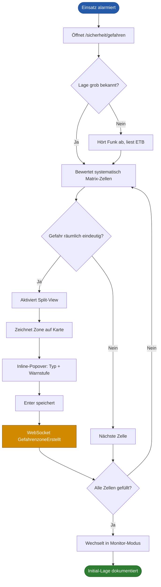
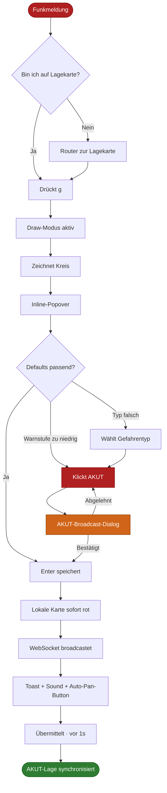
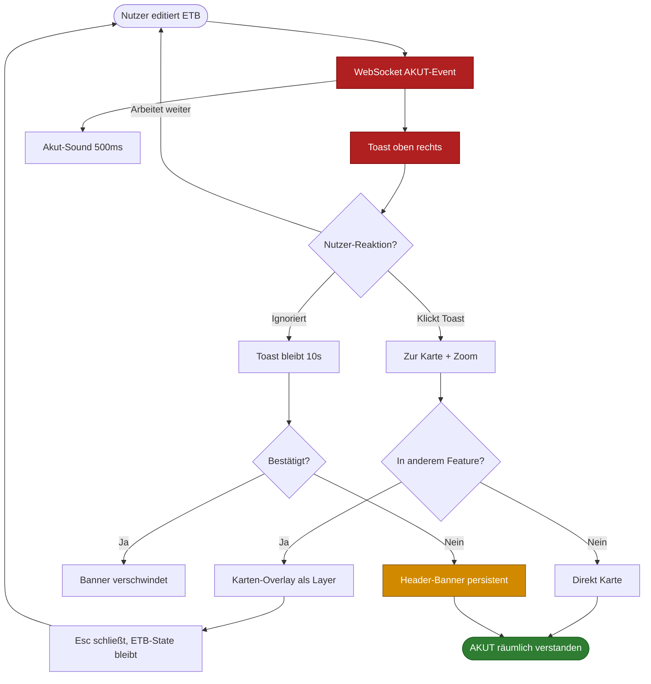

# UX Design Specification – Lagekarte × Gefahrenmatrix-Integration

**Author:** Rubeen
**Date:** 2026-04-17
**GitHub Issue:** [#627](https://github.com/rubenvitt/bluelight-hub/issues/627)

---

<!-- UX design content will be appended sequentially through collaborative workflow steps -->

## Executive Summary

### Project Vision

Die Gefahrenmatrix (13 Gefahrentypen × 5 Schutzobjekte) wird aus einer rein tabellarischen Bewertungsansicht zu einer **räumlich-semantischen Lageerfassung** weiterentwickelt. Einsatzleiter zeichnen Gefahrenzonen direkt auf der MapGL-basierten Lagekarte, verknüpfen sie mit einer Gefahrentyp-Zelle der Matrix, und die Warnstufe färbt die Zone auf der Karte ein. Matrix und Karte bleiben bidirektional live synchronisiert über den bestehenden einsatz-scoped WebSocket-Bus (ADR-006). Ziel ist eine Lagekarte, die „auf einen Blick" die Gefahrenlage zeigt, und eine Matrix, die als systematisches Raster nahtlos in die Karte springt.

### Target Users

- **Primär — Einsatzleiter / Zugführer:** muss die Gefahrenlage im räumlichen Kontext schnell erfassen, um Einsatzkräfte gezielt einzusetzen. Arbeitet in der ELW / Einsatzzentrale, hohe kognitive Last, häufige Unterbrechungen durch Funk.
- **Sekundär — Sicherheitsbeauftragter (S-Funktion):** erfasst und bewertet Gefahren, pflegt die Matrix, markiert Bereiche auf der Karte. Agiert systematischer, eher „matrix-first".
- **Lesend — übrige Einsatzkräfte im Einsatz-Room:** sehen Warnstufen-Farbcodierung und Akut-Zonen passiv beim Blick auf die Lagekarte; keine Edit-Rechte, aber Echtzeit-Aktualität nötig.

**Einsatzkontext:** Desktop / Tauri auf Einsatzleitwagen, kein Field-First-Szenario. Interaktionen müssen wenig-Klick, eindeutig und unter Stress fehlertolerant sein.

### Key Design Challenges

1. **Zwei mentale Modelle verschmelzen** — Matrix als systematisches Bewertungsraster vs. Karte als räumliches Lagebild. Navigation in beiden Richtungen ohne Bruch („Zone → Zelle", „Zelle → Zone(n)") ist das Kernproblem.
2. **Visuelle Hierarchie auf überladener Karte** — Warnstufen-Farbcodierung muss mit DWD-Warnungen, NINA, taktischen Zeichen und POIs koexistieren, ohne überlagert zu werden oder den Rest zu übertönen.
3. **Bidirektionale Live-Sync mit Konfliktauflösung** — gleichzeitige Edits auf Matrix-Seite (Warnstufe) und Karten-Seite (Geometrie) brauchen ein klares Merge-/Last-Writer-Modell.
4. **Zonen-zu-Bewertung-Kardinalität** — prägt das gesamte Datenmodell und die UX (eine Zone = ein Gefahrentyp, vs. Mehrfach-Tagging).
5. **Zeichen-UX unter Stress** — Polygon-/Kreis-Zeichnen muss in <5 s abgeschlossen sein, sonst wird das Feature bei Funkbelastung nicht genutzt.

### Design Opportunities

- **Farbcodierung als stille Statusanzeige** — Sättigungsabstufung (AKUT = satt-rot mit Pulse, NIEDRIG = ausgegraut) liefert ohne Interaktion eine sofortige Gefahrenübersicht.
- **Matrix-Zelle als Klick-Sprungbrett** — Klick auf Matrix-Zelle mit Zonen fokussiert die Karte + zoomt auf die zugehörige(n) Zone(n); starker Orientierungs-Anker.
- **Akut-Alert-Mechanik** — bei neuer AKUT-Zone Broadcast analog zu `funk:notfall-alert` an alle Einsatz-Sessions, inkl. Auto-Panning der Lagekarte auf die Zone.
- **Provider-Pattern bereits vorhanden** — `LayerDetailProvider` (DWD, NINA) wird für Gefahrenzonen wiederverwendet; Panel- und Popup-UX etabliert.

### Architektur-Leitentscheidungen (Stakeholder-Entscheidungen aus Discovery)

Diese Entscheidungen prägen ab hier das UX-Design; die technische Detaillierung folgt in Step 11 (Component-Strategy):

- **Eigener Layer „Gefahrenzonen"** (nicht POI-Erweiterung): fügt sich ins bestehende Layer-Toggle- und `LayerDetailProvider`-System ein; Polygon-/Kreis-Geometrie, Warnstufen-Farblogik und Matrix-Verknüpfung rechtfertigen eine eigene Ebene.
- **Zone ↔ Matrixzelle-Verknüpfung im Backend:** Eine `Gefahrenzone` referenziert eine Matrixzelle (`einsatzId + gefahrentyp + schutzobjekt`). Die Warnstufe bleibt in der Matrix (Source of Truth), die Zone rendert die Farbe abgeleitet. Das verhindert Inkonsistenzen.
- **Live-Sync via bestehendem WebSocket-Bus** (`/ws/einsatz-events`, ADR-006): neue Events `GefahrenzoneErstellt`, `GefahrenzoneGeometryGeändert`, `GefahrenmatrixAktualisiert` als reine Notifications; Clients invalidieren TanStack-Query-Caches und refetchen.

## Core User Experience

### Defining Experience

Der eine Flow, der das Feature trägt, ist **„Akute Gefahr in <5 Sekunden räumlich markieren und allen sichtbar machen"**: Zone einzeichnen → Gefahrentyp wählen → Warnstufe setzen → fertig, broadcastet. Alles andere (Detail-Editing, Matrix-Fein-Bewertung, Evakuierungszonen, Absperrungen) ist sekundär und bekommt nicht dasselbe UX-Budget. Wenn dieser Flow perfekt sitzt, folgt der Rest.

### Platform Strategy

Primär **Desktop/Tauri in Einsatzleitwagen / Einsatzzentrale**, sekundär **Web-Browser an Stabsarbeitsplätzen**. Maus/Touchpad/Tastatur-First, kein Touch-First. Mobile/Field-UX und Offline-Fähigkeit sind explizit aus dem Scope von #627 — Lagekarte setzt MapGL-Tiles + WebSocket voraus. Ein späteres „Quick-Pin vom Smartphone im Feld" wäre ein eigener Use Case und gehört nicht hierher.

### Effortless Interactions

- Dedizierter **„Gefahrenzone zeichnen"**-Modus in der Karten-Toolbar mit Ein-Klick-Start und Tastatur-Shortcut `g`; nach Fertigzeichnen sofort **Inline-Popover** für Gefahrentyp + Warnstufe (kein Dialog, kein Formular-Sprung)
- **Warnstufen-Änderung per Klick auf Zone** → Popover mit 5-Stufen-Button-Row (KEINE → AKUT); ein Klick ändert Matrix + Broadcast
- **Matrix-zu-Karte-Sprung:** Klick auf Matrix-Zelle fokussiert die Karte + lässt zugehörige Zonen kurz aufblinken; Panel zeigt Liste (kein Modal)
- **Zurückkommen nach Unterbrechung:** AKUT-Zonen pulsieren weiter, neu hinzugekommene/eskalierte Zonen sind sofort visuell erkennbar

### Critical Success Moments

- **First Success (Sicherheitsbeauftragter):** Zone gezeichnet + Bewertung gesetzt → sieht gleichzeitig die Farbe auf der Karte und die Matrix-Zelle sich füllen → „Das ist wirklich verknüpft." Aha-Moment.
- **Live-Sync-Moment:** Zweiter Nutzer an anderem Rechner sieht die Zone in <1 s, AKUT-Toast poppt auf → Vertrauen in das System entsteht.
- **Failure zu vermeiden — Orphan-Zonen:** Zone gezeichnet, aber Matrix-Bewertung nie gesetzt; Zone bleibt grau ohne klaren Status. Entweder explizit als „unbewertet" gelabelt erlauben oder Zeichnen ohne Bewertung blockieren.
- **Failure zu vermeiden — Navigations-Sackgasse:** AKUT-Zone anklicken, Panel zeigt Rohdaten ohne Rückweg zur Matrix-Zelle. Panel muss immer „Zur Matrix-Zelle springen" anbieten.
- **Failure zu vermeiden — unsichtbare AKUT-Zone:** von DWD-Polygonen oder POIs verdeckt. AKUT muss visuell oberhalb aller anderen Layer liegen.

### Experience Principles

1. **Geschwindigkeit vor Genauigkeit beim Initial-Erfassen** — Quick-Draw mit sinnvollen Defaults (zuletzt verwendeter Gefahrentyp, Warnstufe HOCH als Default) schlägt Perfektions-Formular. Fein-Bewertung kommt später.
2. **Ein Datenmodell, zwei Blickwinkel** — Matrix und Karte sind zwei Fenster auf dieselbe Wahrheit; jede Änderung in einem Blick ist im anderen sofort sichtbar, ohne Navigation.
3. **Farbcodierung ist Kommunikation, nicht Dekoration** — stabile Warnstufen-Semantik (🔴 AKUT, 🟠 HOCH, 🟡 MITTEL, 🟢 NIEDRIG, ⚪ KEINE). Opacity-Abstufung im Ruhezustand, Pulse + Outline-Verstärkung bei AKUT.
4. **Live-Updates still, AKUT-Eskalationen laut** — Routine-Änderungen erscheinen ohne Toast; Neu-AKUT-Zonen lösen Banner + Sound aus (analog `funk:notfall-alert`).
5. **Matrix autoritativ für Bewertung, Karte für Geometrie** — keine doppelte Bewertungs-UI. Geometrie-Edits nur auf der Karte; Warnstufen-Edits primär in der Matrix, Komfort-Edit via Karten-Popover bleibt erlaubt.

## Desired Emotional Response

### Primary Emotional Goals

**Ruhige, felsenfeste Kontrolle.** Einsatzleiter und Sicherheitsbeauftragter sollen fühlen: „Ich habe die Lage im Griff, das Tool macht mir keine zusätzliche Arbeit, und ich kann mich darauf verlassen." Das Tool tritt emotional zurück und lässt den Nutzer die Hauptfigur sein. Explizit **keine** Delight-Momente, keine verspielten Animationen, keine Überraschungs-Elemente — Emergency-Tools, die sich nett anfühlen wollen, verlieren das Vertrauen in der ersten ernsten Lage.

**Sekundäre Gefühle:**

- **Vertrauen in Datenkonsistenz** — „Was ich auf der Karte sehe, stimmt mit der Matrix überein."
- **Sicherheit im Broadcast** — „Wenn ich AKUT setze, sehen es die anderen."
- **Orientierung beim Zurückkommen** — nach Unterbrechung sofort erkennen, was eskaliert oder neu ist.
- **Kompetenz-Gefühl** — die UI lässt den S-Funk-Offizier professioneller aussehen, nicht wie einen Anfänger.

### Emotional Journey Mapping

| Phase                                  | Gefühl                                           | UX-Umsetzung                                                                          |
| -------------------------------------- | ------------------------------------------------ | ------------------------------------------------------------------------------------- |
| Erster Blick auf Lagekarte             | „Überblick ist sofort da"                        | Farbcodierung lesbar in <500 ms, keine Ladespinner im Sichtfeld                       |
| Während Zeichnen einer Zone            | „Das geht schnell, ich verliere keine Zeit"      | Toolbar-Highlight, klare Snap-Indicators, eindeutige Cursor-Shape                     |
| Nach Drücken AKUT-Button               | „Die anderen wissen es jetzt"                    | Sofortige Farbänderung, kurze visuelle Bestätigung, Broadcast-Indikator               |
| Incoming-Update eines anderen Nutzers  | „Ich werde informiert, nicht erschreckt"         | Subtile Slide-in-Zone auf Karte; nur bei Neu-AKUT ein Toast mit Absender              |
| Zurückkommen nach 10 min Unterbrechung | „Ich sehe, was sich verändert hat"               | AKUT-Zonen pulsieren, neue Zonen mit 30 s-„Neu"-Badge, Matrix-Diff visuell            |
| Verbindungsverlust                     | „Ich weiß, was los ist und was jetzt zu tun ist" | Klares Offline-Banner oben, Queue-Anzeige „3 Änderungen werden synced" nach Reconnect |

### Micro-Emotions

Priorisiertes Spektrum (Zielwert → Vermeidung):

| Spektrum                     | Zielwert                                                              |
| ---------------------------- | --------------------------------------------------------------------- |
| Confidence ↔ Confusion       | **Confidence** — niemals unklar, wer darf, was zählt                  |
| Trust ↔ Skepticism           | **Trust** — absolute Priorität; Sync-Status immer sichtbar            |
| Calm ↔ Anxiety               | **Calm** — UI-Ton ruhig; AKUT-Signalisierung dezent, aber eindeutig   |
| Accomplishment ↔ Frustration | **Accomplishment** — jede Zeichenaktion in <5 s abgeschlossen         |
| Focus ↔ Distraction          | **Focus** — keine Animation-Overkills, keine konkurrierenden Elemente |
| Competence ↔ Overwhelm       | **Competence** — der Nutzer sieht klüger aus, nicht das Tool          |

### Design Implications

Emotionen, die wir aktiv verhindern, mit konkreten UX-Gegenmaßnahmen:

| Vermeiden                            | Wie?                                                                                                |
| ------------------------------------ | --------------------------------------------------------------------------------------------------- |
| Panik-Eskalation durch UI            | AKUT-Pulse dezent (kein Blaulicht-Blink), Sound optional abschaltbar, kein Full-Screen-Takeover     |
| Zweifel an Datenrichtigkeit          | Sichtbarer Sync-Status (Online/Offline-Indikator), klare Zeitstempel „Zuletzt aktualisiert vor 3 s" |
| Informations-Überflutung             | Opacity-Abstufung zwischen Layern; AKUT bekommt Raum — NIEDRIG tritt zurück                         |
| Unsicherheit nach Aktion             | Nach jeder Änderung subtile Bestätigung („Übermittelt · vor 1 s"); niemals stilles Versenden        |
| Ablenkung vom Funkbetrieb            | Keine blockierenden Modals, keine Zwangs-Dialoge; Popover dismiss-bar mit `Esc`                     |
| „Wer hat das gezeichnet?"-Verwirrung | Jede Zone zeigt den erfassenden Nutzer im Panel + letztes Edit-Datum                                |

### Emotional Design Principles

1. **Das Tool ist Stützkraft, nicht Protagonist** — UI verschwindet beim Arbeiten, tritt nur hervor, wenn sie Information trägt.
2. **Jede Aktion hat Quittung** — nichts passiert stumm; dezente, aber klare Bestätigung nach jeder Änderung.
3. **Dezent bei Routine, laut nur bei echter Gefahr** — visuelle und akustische Signale rationieren; AKUT wird abgewertet, wenn MITTEL/HOCH gleich aufdringlich sind.
4. **Wahrheit sichtbar machen** — Zeitstempel, Nutzer-Attribution, Sync-Status sind keine Nerd-Details, sondern Vertrauens-Anker.
5. **Vorhersagbarkeit vor Innovation** — jede Interaktion ist beim dritten Mal dieselbe wie beim ersten; keine versteckten Tricks, keine Mode-abhängigen Shortcuts.

## UX Pattern Analysis & Inspiration

### Inspiring Products Analysis

**1. Figma / FigJam — Live-Multiplayer-Sync & Presence**
Zone-Edit eines Users erscheint bei anderen mit Nutzer-Cursor + Namens-Label in <500 ms, ohne Modal-Blockade. Optimistic Updates auf Sender-Seite, subtile „Xs Zone wurde aktualisiert"-Hints bei Empfängern — kein Toast pro Edit. Für uns: Presence-Indikator am Zone-Outline, Conflict-Resolution via Last-Writer-Wins ohne Popup-Streit.

**2. Felt / Kepler.gl / Google MyMaps — Layer-basiertes Zeichnen mit Attribut-Assoziation**
Draw-Tool → Form zeichnen → Inline-Side-Panel fragt nach Type/Category → fertig. Ein kontinuierlicher Flow statt „erst zeichnen, dann irgendwo anders kategorisieren". Für uns: Quick-Draw-Flow mit Inline-Popover direkt am Ende der Polygon-Kreation, keine Dialog-Öffnung.

**3. NINA-Warnapp (Bund) / DWD WarnWetterApp — Gefahrenstufen-Farbcodierung**
Die Zielnutzer kennen diese Farblogik auswendig (Rot = Unwetter, Orange = ernste Warnung, Gelb = markantes Wetter, Grün = kein Risiko). Für uns: Warnstufen-Farbpalette an DWD/NINA orientieren — Konvention vor Innovation, spart Cognitive Load.

**4. Linear / Notion — Keyboard-First & Command Palette**
`cmd-k` öffnet die Command Palette für alles; Shortcuts sind konsequent. Für uns: `g` für Draw-Modus, `1–5` für Warnstufen im Popover, `Esc` dismiss, Command Palette bekommt „Gefahrenzone erstellen"-Aktion (Palette existiert bereits, Commit `967e41801`).

### Transferable UX Patterns

| Pattern                                    | Quelle              | Anwendung bei uns                                                                                              |
| ------------------------------------------ | ------------------- | -------------------------------------------------------------------------------------------------------------- |
| Inline-Popover nach Draw-Abschluss         | Felt, Google MyMaps | Nach Polygon/Kreis-Fertig → Popover direkt am Geometrie-Schwerpunkt mit Gefahrentyp-Picker + Warnstufe-Buttons |
| Presence-Indikator am Objekt               | Figma               | Kleiner Avatar am Zone-Outline, wenn jemand gerade editiert                                                    |
| Optimistic Updates + Silent Reconciliation | Figma, Linear       | Lokale Änderung sofort sichtbar; WebSocket-Rebroadcast vergleicht, korrigiert still bei Divergenz              |
| DWD/NINA-Farbpalette                       | DWD, NINA           | Direkt übernehmen; spart Cognitive Load                                                                        |
| Command Palette als zweiter Weg            | Linear, Notion      | „Gefahrenzone für akute Lage"-Command im bestehenden Command-Palette-Modal                                     |
| Tastatur-Shortcuts als Power-User-Weg      | Linear              | `g` Draw-Modus, `1–5` Warnstufen, `Esc` Dismiss, `/` Filter-Fokus                                              |
| Layer-Toggle-Bar mit Opacity-Slider        | Kepler.gl, Felt     | Gefahrenzonen-Layer hat Opacity-Slider, Default 85%                                                            |
| Side-Panel statt Modal                     | Figma, Felt         | Details einer Zone im Side-Panel; Karte bleibt sichtbar                                                        |

### Anti-Patterns to Avoid

| Anti-Pattern                               | Wo man es sieht             | Warum bei uns falsch                                                     |
| ------------------------------------------ | --------------------------- | ------------------------------------------------------------------------ |
| Modal-Formular nach Geometrie              | Alte GIS-Tools, SAP         | Bricht den Draw-Flow; Karte verschwindet; Stress-Situation unbrauchbar   |
| Blinkende AKUT-Full-Screen-Overlays        | Manche Alarm-Systeme        | Schreckt statt zu informieren; blockiert Parallel-Arbeit                 |
| Layer-Icons ohne Label                     | Google Earth Pro            | Nutzer muss raten, unter Stress fatal                                    |
| Undifferenzierte Toasts bei jeder Änderung | Slack-Mentality             | Desensibilisiert; AKUT wird übersehen                                    |
| Zwei konkurrierende Warnstufen-Editoren    | Legacy-GIS                  | Datenkonsistenz verloren; emotionaler Todesstoß                          |
| Draw-Tool versteckt in Menü                | Mapbox GL Draw Default      | Jeder Klick zählt; Toolbar muss permanent präsent sein                   |
| Routine-Bestätigungsdialoge                | Enterprise-Patterns         | Verlangsamt; nur AKUT-Broadcast braucht Dialog                           |
| Reine Farbcodierung ohne Symbol            | Viele Infografik-Dashboards | Farbblindheit + Kontrast auf Map-Tiles; immer Symbol + Kürzel zusätzlich |

### Design Inspiration Strategy

**Übernehmen (1:1):**

- DWD/NINA-Warnstufen-Farbpalette — keine Neuerfindung
- Felt-artiger Draw → Inline-Popover-Flow
- Figma-Presence-Indikator am Editier-Objekt
- Linear-Shortcuts-First-Philosophie

**Adaptieren:**

- Layer-Toggle mit Opacity — auf einen Slider reduzieren, keine Sub-Einstellungen im ersten Release
- Command Palette — erweitern um Gefahrenzone-Commands (Palette existiert bereits)
- Side-Panel für Details — vorhandenen `LayerDetailProvider`-Mechanismus (DWD/NINA) wiederverwenden

**Bewusst nicht übernehmen:**

- Kein Cursor-Chasing à la Figma (Overkill + Distraktion)
- Keine GIS-typischen Feature-Attributtabellen (UX bleibt schlank)
- Keine Bestätigungsdialoge außer bei AKUT-Broadcast
- Keine eigene, kreative Farbpalette — auch wenn sie schöner wäre

## Design System Foundation

### Design System Choice

**Bluelight-Hub Ring-1 Design-Tokens** (Tailwind 4 `@theme inline` + Headless UI) — unveränderte Pflicht gemäß CLAUDE.md. Das Design-System ist bereits etabliert (`docs/frontend/ring-1-design-tokens.md`, verankert in `packages/frontend/src/index.tailwind.css`). Für die Gefahrenmatrix-Integration **erweitern** wir das System gezielt um einen Warnstufen-Token-Namespace — kein Austausch, kein Parallelsystem.

### Rationale for Selection

- Ring-1 ist etabliert, Dark-Mode-fähig, an Tailwind 4 angebunden und in der bestehenden Lagekarte und Gefahrenmatrix bereits verankert.
- Ein Wechsel oder eine Parallel-Library (AntD, MUI, shadcn) würde gegen CLAUDE.md verstoßen und Wartungslast schaffen.
- Der Status-Slot im Ring-1-Token-System deckt nur 4 Stufen (Info/Success/Warning/Danger) ab — wir brauchen **5** Warnstufen (KEINE → AKUT), daher ein eigener Namespace `warnstufe-*` mit 3–4 Varianten pro Stufe.
- Farb-Logik an **DWD/NINA** orientiert: Konvention vor Innovation, Einsatzleiter kennen diese Palette aus dem eigenen Arbeitsalltag.

### Implementation Approach

1. **Ring-1-Erweiterung** in `packages/frontend/src/index.tailwind.css` — neuer `warnstufe-*`-Namespace:

   | Token-Gruppe                                     | Zweck   | Licht-Modus                                               |
   | ------------------------------------------------ | ------- | --------------------------------------------------------- |
   | `warnstufe-none-fill / -stroke / -text`          | KEINE   | Grau `#e3e8ef` / `#90a0b8` / `#54667d`                    |
   | `warnstufe-low-fill / -stroke / -text`           | NIEDRIG | Hellblau `rgba(82,135,220,0.22)` / `#3e74cc` / `#1f4d92`  |
   | `warnstufe-medium-fill / -stroke / -text`        | MITTEL  | Gelb `rgba(232,185,35,0.35)` / `#d18a00` / `#7a4a00`      |
   | `warnstufe-high-fill / -stroke / -text`          | HOCH    | Orange `rgba(232,120,35,0.45)` / `#d06418` / `#8a3a00`    |
   | `warnstufe-acute-fill / -stroke / -text / -glow` | AKUT    | Rot `rgba(210,45,45,0.55)` / `#b02020` / `#7a0000` + Glow |

   Dark-Mode: jede Stufe ton-angehoben; AKUT-Glow bleibt prominent sichtbar.

2. **MapGL-Token-Brücke** `packages/frontend/src/features/lagekarte/utils/warnstufe-style.ts` — liest CSS-Custom-Properties zur Laufzeit und generiert MapGL-Paint-Objekte. Vorbild: bestehende `detail-providers/severity-styles.ts` für DWD.

3. **Headless-UI-Komponenten-Inventar:**

   | Komponente                 | Headless-UI-Primitive           | Einsatz                                 |
   | -------------------------- | ------------------------------- | --------------------------------------- |
   | Warnstufen-Picker          | `<RadioGroup>`                  | 5-Button-Row im Popover + Matrix-Editor |
   | Gefahrentyp-Dropdown       | `<Combobox>`                    | Suchbar über 13 Gefahrentypen           |
   | Zone-Popover               | `<Popover>` mit `anchor`        | Karten-Position, `Esc`-dismissbar       |
   | Zone-Details-Panel         | `<TransitionRoot>` + Side-Panel | via `LayerDetailProvider`               |
   | AKUT-Broadcast-Bestätigung | `<Dialog>`                      | **Nur hier** Modal — bewusste Ausnahme  |
   | Layer-Toggle-Menü          | `<Disclosure>` + Checkbox-Row   | Karten-Toolbar                          |
   | Command-Palette-Entries    | bestehendes Workspace-Pattern   | `cmd-k` → „Gefahrenzone erstellen"      |

4. **Feature-Struktur** — bestehende erweitern, nicht neu:
   - `features/lagekarte/ui/molecules|organisms` für Popover/Toolbar/Layer-Toggle
   - `features/gefahrenmatrix/ui/organisms/GefahrenmatrixGrid.tsx` erweitern um Zone-Badges pro Zelle
   - Gemeinsame Tokens/Types in `features/lagekarte/detail-providers/` (neuer `gefahrenzonen`-Provider analog `dwd`, `nina`)

5. **Storybook-/Visual-Test** der Warnstufen-Varianten bevor die Karten-Integration live geht.

### Customization Strategy

**Übernommen aus Ring-1 unverändert:**

- Alle Surface-, Text-, Border-, Action-, Spacing-, Density-, Radius-, Focus-Tokens
- Typografie-Skalen (`text-title-sm`, `text-body-md`, `text-body-xs`)
- Dark-/Light-Mode-Logik

**Ergänzt:**

- Warnstufen-Namespace (5 × 3–4 Tokens)
- Token-Brücke für MapGL-Paint-Objekte
- Redundante Signale pro Warnstufe: Symbol-Shape + Kürzel-Label, gemäß Ring-1-Regel „Status aus mindestens zwei Signalen"

**Explizit nicht gemacht:**

- Keine neue UI-Library-Abhängigkeit
- Keine Custom-CSS-Datei für Map-Styles
- Keine Abweichung von Ring-1-Font/Spacing
- Keine eigenen Icon-Sets (Heroicons + `features/taktische-zeichen`)
- Keine eigene „schönere" Farbpalette — DWD-/NINA-Konvention dominiert

## 2. Core User Experience (Deep Dive)

### 2.1 Defining Experience

Das Kern-Feature ist **„Gefahrenlage räumlich-semantisch erfassen"**: Zonen auf der Karte sind untrennbar mit der Gefahrenmatrix verknüpft, bidirektional und live-synchronisiert. Der qualitative Unterschied zu jedem bekannten Einsatztool ist die **Simultanität** — Matrix und Karte sind zwei Fenster auf dasselbe Datum, nicht zwei getrennte Features.

### 2.2 User Mental Model

Der Einsatzleiter arbeitet in zwei parallel laufenden Modellen:

- **„Die Lage auf der Karte"** — räumlich: Zonen sind Bereiche, Farbe ist Gefahrenniveau, „hier rot — dort orange"
- **„Die Gefahrenmatrix als Checklist"** — systematisch: jede Zelle beantwortet „existiert Gefahr X für Schutzobjekt Y?"; Warnstufe ist der Antwort-Wert

Das Feature trägt nur, wenn Nutzer nicht bewusst zwischen beiden Modellen wechseln müssen. Design-Konsequenzen:

- **Gleiche Warnstufen-Farben und -Symbole in Karte und Matrix** — keine zwei Farb-Systeme
- **Zähler-Anzeige pro Matrix-Zelle:** z. B. „🗺 2 Zonen" — Zelle weiß, wie oft sie räumlich verortet ist
- **Abwesenheit ist aussagekräftig:** HOCH ohne Zone → dezenter „⚠ Ohne räumliche Verortung"-Hinweis in der Matrix-Zelle

### 2.3 Success Criteria

Messbare, nutzer-verifizierbare Ereignisse:

| Kriterium                           | Messung                                                  | Schwellwert                              |
| ----------------------------------- | -------------------------------------------------------- | ---------------------------------------- |
| Quick-Draw „fast-genug"             | Zeit `g` → „Übermittelt"                                 | **<5 s Median** bei Kreis + Defaults     |
| Lage-auf-Blick lesbar               | Nach 1 s Kartenblick: AKUT/HOCH/übrige korrekt einordnen | **>90 % Trefferquote** im Usability-Test |
| Matrix-zu-Karte-Sprung funktioniert | Zell-Klick → Karte zeigt zugehörige Zone(n)              | **100 %** — deterministisch              |
| Live-Sync kommt an                  | Änderung Gerät A → sichtbar Gerät B                      | **<2 s p95**, Offline-Banner bei Abriss  |
| AKUT-Wahrnehmung nicht überhörbar   | Toast + Sound + Banner                                   | abschaltbar, laut-by-default             |
| Orphan-Zonen sichtbar               | Zone ohne Bewertung → visuell „offen"                    | in jeder Kartenansicht + Panel           |
| Undo funktioniert                   | Rücknahme <30 s nach Erstellung via `cmd-z`              | erfolgreich, mit Wiederherstellen-Toast  |

### 2.4 Novel UX Patterns

**Nicht neu (kombiniert aus bewährten Mustern):** Draw → Inline-Popover (Felt), Layer-Toggle mit Opacity (Kepler.gl), WebSocket-Sync via ADR-006, DWD-Farbpalette.

**Genuinely neu für diese Domäne:**

1. **Matrix ↔ Karte bidirektional verknüpfte Zellen** — keine bekannte Einsatz-Software tut das so. Visuelle Verknüpfung via Zone-Zähler in Matrix-Zellen + Matrix-Referenz in Zone-Panel — braucht Erklärung beim ersten Mal.
2. **DWD/NINA-Warnstufen-Farbkonvention in Einsatz-interne Tools übertragen** — mental bekannt aus Bürger-Apps, neu im Einsatzkontext; starker Transfer-Effekt.
3. **„Stille Routinen, lauter AKUT"-Signalhierarchie** — bewusste Asymmetrie: Alltagsänderungen geräuschlos, AKUT mit Banner+Sound; in Enterprise-Software selten explizit designed.

**Onboarding-Konsequenz:** Beim **ersten Einsatz** des Features erscheint ein einmaliger Coach-Mark-Tour: „So springst du zwischen Matrix und Karte." Danach nie wieder (gespeichert im Client-State).

### 2.5 Experience Mechanics

**Mechanik A — Quick-Draw auf Karte:**

1. `g` oder Toolbar-Button → Toolbar highlightet, Cursor = Fadenkreuz
2. Zeichnen (Kreis-Drag oder Polygon-Klick-Doppelklick); Snap auf taktische Zeichen + POI-Kanten aktiv
3. Inline-Popover am Geometrie-Schwerpunkt: Gefahrentyp-Combobox (Default: zuletzt gewählter Typ) + Warnstufe-Button-Row (Default: **HOCH** — sichere Annahme)
4. Enter = Speichern; optimistic local update; `GefahrenzoneErstellt`-Event broadcastet
5. „Übermittelt · vor 1 s"-Bestätigung; Popover schließt nach 2 s oder `Esc`

**Mechanik B — Warnstufen-Änderung:**

1. Klick auf Zone → Popover mit aktueller Bewertung
2. Button-Row zeigt 5 Stufen; Klick auf neue Stufe → sofortige Farbänderung, Matrix-Zelle parallel
3. **Ausnahme** bei Rauf-auf-AKUT: zusätzlich Confirm-Dialog „AKUT-Broadcast senden?" — einzige Modal-Stelle im Feature

**Mechanik C — Matrix → Karte Sprung:**

1. Matrix-Zelle zeigt Zone-Zähler-Badge „🗺 2"
2. Klick → Split-View öffnet (Matrix links, Karte rechts); Karte zoomt auf Bounding-Box aller zugehörigen Zonen
3. Zonen blinken 1,5 s auf; Side-Panel zeigt Zonen-Liste mit Edit-Buttons
4. `Esc` schließt Split-View

**Mechanik D — AKUT-Eskalation extern:**

1. Anderer Nutzer setzt AKUT-Zone → `GefahrenmatrixAktualisiert`-Event
2. Auf allen Clients im Einsatz-Room: Toast „🔴 AKUT: Chemische Stoffe · Bahnhofstr. · Max Mustermann · vor 3 s" + Sound (500 ms dezent)
3. Karte sichtbar: dismissbarer „Zur Zone springen?"-Button — **kein** Auto-Pan (zu invasiv bei paralleler Arbeit)
4. Verpasste AKUTs (z. B. Offline) werden nach Reconnect einmal nachgeholt

**Mechanik E — Undo:**

1. `cmd-z` innerhalb 30 s nach Erstellung/Änderung → Rückgängig
2. Aktions-Queue in Client-State (react-store); serverseitig separater Undo-Command
3. Nach Undo: Toast „Aktion zurückgenommen · Wiederherstellen" (30 s gültig)

## Visual Design Foundation

### Color System

Ring-1 als Basis + Warnstufen-Namespace + MapGL-Token-Brücke — keine parallele Farbwelt.

**Warnstufen-Palette (Light Mode, DWD/NINA-orientiert):**

| Stufe   | Fill (Map)                          | Stroke (Map) | Text (UI)    | Icon-Shape          | Kürzel |
| ------- | ----------------------------------- | ------------ | ------------ | ------------------- | ------ |
| KEINE   | `rgba(144,160,184,0.15)`            | `#90a0b8`    | `text-muted` | ⬜ (leeres Quadrat) | —      |
| NIEDRIG | `rgba(62,116,204,0.22)`             | `#3e74cc`    | `#1f4d92`    | 🔷 (Raute)          | N      |
| MITTEL  | `rgba(209,138,0,0.35)`              | `#d18a00`    | `#7a4a00`    | 🔶 (gefüllte Raute) | M      |
| HOCH    | `rgba(208,100,24,0.45)`             | `#d06418`    | `#8a3a00`    | ⬤ (gefüllter Kreis) | H      |
| AKUT    | `rgba(176,32,32,0.55)` + Pulse-Glow | `#b02020`    | `#7a0000`    | ⬤ + Ring-Animation  | **A**  |

**Dark Mode:** jede Stufe ton-angehoben (~+10 % Lightness, -5 % Saturation); AKUT-Glow bleibt voll sichtbar, Outline heller (`#e04040`).

**Karten-Layer-Opacity-Hierarchie:**

- AKUT: fill 55 %, stroke 100 %, Pulse 3 s bei Neu-Erstellung
- HOCH: fill 45 %, stroke 90 %
- MITTEL: fill 35 %, stroke 85 %
- NIEDRIG: fill 22 %, stroke 75 %
- KEINE: fill 15 %, stroke 60 %, dashed — signalisiert „unbewertet / archiv"

**WCAG 2.1 AA:** Text-auf-Fill ≥4,5:1, auf Map-Tiles via Text-Shadow abgesichert. Redundanzregel (aus Ring-1): Farbe + Symbol + Kürzel — nie Farbe allein.

### Typography System

Ring-1-Skalen unverändert. Feature-spezifisch:

- **Karten-Labels:** `text-body-sm` (14 px) mit Text-Shadow für Kontrast auf wechselnden Tiles; max. 24 Zeichen, danach Ellipsis; nur ab Zoom-Level ≥12.
- **Warnstufen-Kürzel in Badges:** `text-body-xs` + `font-mono` + fett; feste Breite `w-6` in Matrix-Zellen für gleichmäßige Optik.
- **Zone-Panel-Überschrift:** `text-title-sm`; Metadaten (Ersteller, Zeitstempel): `text-body-xs` mit `text-muted`.

### Spacing & Layout Foundation

- **Popover:** `radius-panel` (1,25 rem) außen, `spacing-panel` (1,5 rem) innen, max. Breite 320 px, 12 px Abstand zum Geometrie-Anker.
- **Side-Panel (Zone-Details):** 380 px Breite (fix, collapsible), `spacing-panel` padding, `spacing-density-3` Stack-Abstand.
- **Matrix-Zelle:** Zone-Zähler-Badge rechts oben, `spacing-density-0` (0,25 rem) zum Rand; Hover: 2 px `border-strong`, keine Scale-Animation.
- **Karten-Toolbar:** Gefahrenzone-Button in bestehender Draw-Toolbar (nach taktischen Zeichen, vor POI-Marker); 40 × 40 px Touch-Target; Tooltip „Gefahrenzone (G)".

### Accessibility Considerations

WCAG 2.1 AA als Grundlage (nicht AAA, um Scope realistisch zu halten).

| Anforderung                             | Umsetzung                                                                                                                              |
| --------------------------------------- | -------------------------------------------------------------------------------------------------------------------------------------- |
| Farbe nicht einziger Informationsträger | Jede Warnstufe = Farbe + Symbol + Kürzel; Matrix-Zellen zusätzlich mit Textlabel                                                       |
| Kontrast ≥4,5:1 für Text                | Token-Paare gegen Standard-Surfaces geprüft; Text-Shadow auf Kartenhintergrund                                                         |
| Tastatur-Navigation vollständig         | Tab auf alle Controls; Warnstufen-RadioGroup via Pfeiltasten; `Esc` schließt Popover; Side-Panel fokussiert erstes Control beim Öffnen |
| Fokus-Sichtbarkeit                      | Ring-1 `focus-ring` + `shadow-focus`; auch im Draw-Modus sichtbar                                                                      |
| Screen-Reader-Semantik                  | Popover `role="dialog"` + `aria-labelledby`; Zone-Änderungen `aria-live="polite"`; AKUT-Broadcast `aria-live="assertive"`              |
| Reduced Motion                          | `prefers-reduced-motion`: AKUT-Pulse → statischer Doppel-Ring; Split-View-Transition → instant; Zone-Blink → einmaliger Border-Flash   |
| Farbblindheit                           | Rot/Grün nie allein; HOCH (Orange) vs. AKUT (Rot) unterscheidbar via Icon-Shape + Glow + Kürzel                                        |
| Zoom 200 %                              | Popover max-width limitiert, Karten-Controls in `em`                                                                                   |

**Audio-Zugänglichkeit:** AKUT-Sound optional (Settings-Toggle); visuelle Benachrichtigung (Banner + Toast) immer vorhanden. Keine rein akustische Kommunikation.

## Design Direction Decision

### Design Directions Explored

| Richtung                                                         | Primärnutzen                           | Warum (nicht) gewählt                                                                              |
| ---------------------------------------------------------------- | -------------------------------------- | -------------------------------------------------------------------------------------------------- |
| **A — Matrix dominant, Karte eingebettet**                       | S-Funktion-first                       | Abgelehnt: Kartenfläche zu klein, verletzt „Karte-first für Einsatzleiter"-Core-Experience         |
| **B — Karte dominant, Matrix als Overlay-Drawer**                | Einsatzleiter-first                    | Abgelehnt: S-Funktion muss Drawer dauerhaft offen halten, kein natürlicher Matrix-Heimatbildschirm |
| **C — Gleichberechtigtes Split-View, kontextuell aktivierbar** ★ | Beide Personas, reaktive Verschmelzung | **Gewählt** — siehe Rationale                                                                      |

### Chosen Direction

**C — Gleichberechtigtes Split-View mit kontextueller Aktivierung:** Beide bestehenden Routen (`/einsatz/:id/lagekarte` und `/einsatz/:id/sicherheit/gefahren`) bleiben als vollwertige Hauptansichten erhalten. Ein Toggle-Button „🔗 Verknüpfte Ansicht" aktiviert temporäre Side-by-Side-Darstellung (Matrix links, Karte rechts, 50:50). Toggle-State ist session-persistent. Matrix-Zell-Klick und Karten-Zone-Klick aktivieren Split-View automatisch und fokussieren auf das jeweilige Gegenstück.

### Design Rationale

1. **Respektiert bestehende Informationsarchitektur** — Routen unverändert, keine Migration für Muscle-Memory vorhandener Nutzer.
2. **Deckt beide Primär-Personas ab** — Einsatzleiter landet standardmäßig auf Lagekarte, Sicherheitsbeauftragter auf Matrix.
3. **Split-View reaktiv, nicht proaktiv** — Nutzer steuert selbst; reduziert visuelle Überladung im Alltag.
4. **Matrix-Zelle-zu-Zone-Brücke** als Aha-Moment funktioniert nur in dieser Richtung sauber.
5. **Minimal invasiv** — bestehende `LagekarteView` braucht einen Layer + Provider, Matrix eine Zähler-Badge pro Zelle. Kein Routing-Rewrite.

### Implementation Approach

- **Neue Komponente:** `LagekarteGefahrenmatrixSplitView` (Verortung in Step 11 festgelegt)
- **Toggle-Button** oben rechts in beiden Route-Views, Icon-Label „🔗 Verknüpfte Ansicht"
- **Shared State** via `react-store` für Split-Mode + Fokus-Koordination (letzte aktive Zelle/Zone)
- **Routing:** TanStack Router Search-Params `?split=true&focus=zone:{id}` oder `?split=true&focus=cell:{typ}:{schutz}` — tiefverlinkbar, bookmark-fähig
- **Responsive Fallback:** unter 1280 px Breite kein Split-View (Toggle deaktiviert mit Erklärung); stattdessen Sprung zwischen Vollansichten mit Fokus-Preservation

## User Journey Flows

### Journey 1 — Sicherheitsbeauftragter: Systematische Erstbewertung zu Einsatzbeginn

**Auslöser:** Einsatz alarmiert, S-Funktion am Arbeitsplatz.
**Ziel:** Relevante Gefahrentypen in die Matrix bringen, räumlich eindeutige zusätzlich auf Karte markieren.

**Kritische UX-Punkte:** Split-View-Aktivierung darf Matrix-Scroll-State nicht verlieren; nach Zone-Erstellung Rückfokus zur zuletzt editierten Matrix-Zelle; `Esc` im Inline-Popover = Abbruch ohne Geometrie-Löschung (Zone bleibt als „unbewertet" — Datenverlust = Vertrauensbruch).

### Journey 2 — Einsatzleiter: AKUT-Eskalation unter Zeitdruck

**Auslöser:** Funkmeldung „Gasaustritt, Leib-und-Leben-Gefahr".
**Ziel:** In <5 s räumlich markiert + allen broadcastet.

**Kritische UX-Punkte:** AKUT-Confirm-Dialog ist die **einzige** Modal-Stelle im Feature (gerechtfertigt durch Broadcast-Reichweite); Enter bestätigt, `Esc` bricht ab; bei Server-Fehler markiert sich Zone gelb mit „Wiederholen"-Toast; Empfänger-Sound abschaltbar aber laut-by-default.

### Journey 3 — Einsatzleiter (Empfänger): Incoming AKUT verstehen ohne Kontextverlust

**Auslöser:** Nutzer editiert ETB-Eintrag, anderer Nutzer setzt AKUT-Zone.
**Ziel:** Verstehen ohne aus dem aktuellen Workflow herausgerissen zu werden.

**Kritische UX-Punkte:** Kein Auto-Redirect — AKUT darf aber auch nicht übersehen werden; Lösung: dreistufige Eskalation (Toast → persistenter Toast → Header-Banner); Overlay-Option statt Vollbildwechsel erhält ETB-Edit-State; Bestätigt-State ist client-seitig, nicht geteilt.

### Journey Patterns

1. **„Modus ohne Kontextverlust"** — jede Ansichtsumschaltung bewahrt Scroll-/Edit-State; Rückkehr via `Esc` ist deterministisch.
2. **„Drei-Stufen-Eskalation bei AKUT"** — Sofort-Toast → persistenter Toast → permanenter Header-Banner; System verhindert Übersehen, Nutzer bestimmt Zeitpunkt der Reaktion.
3. **„Defaults schlagen Wahl"** — Gefahrentyp = zuletzt verwendeter Wert im Einsatz; Warnstufe = HOCH; Nutzer bestätigt oder korrigiert, erfasst nicht von Null.

### Flow Optimization Principles

- **Kritischer Pfad ist tastatur-fähig** — `g` → zeichnen → `1–5` → Enter → fertig
- **Jeder Flow hat eine Abbruchtaste** — `Esc` schließt Popover/Dialog ohne Datenverlust; bei unvollendeter Bewertung Safety-Confirm
- **Flows enden mit sichtbarer Bestätigung** — „Übermittelt · vor 1 s" ist nicht optional
- **Keine Sackgassen** — jedes Panel hat Navigation zur Gegenseite (Zone → Matrix-Zelle, Zelle → Zone-Liste)

## Component Strategy

### Bestehende Komponenten — wiederverwenden

| Komponente            | Pfad                                                          | Wiederverwendung                                                                    |
| --------------------- | ------------------------------------------------------------- | ----------------------------------------------------------------------------------- |
| `LagekarteView`       | `features/lagekarte/ui/organisms/LagekarteView`               | Unverändert; erhält neuen Gefahrenzonen-Layer                                       |
| `GefahrenmatrixGrid`  | `features/gefahrenmatrix/ui/organisms/GefahrenmatrixGrid.tsx` | Erweitert um Zone-Zähler-Badges + Deep-Link-Target                                  |
| `LayerDetailProvider` | `features/lagekarte/detail-providers/types.ts`                | Neuer `GefahrenzonenDetailProvider` implementiert das Interface (wie `dwd`, `nina`) |
| `severity-styles.ts`  | `features/lagekarte/detail-providers/`                        | Vorbild für neue `warnstufe-style.ts`-Token-Brücke                                  |
| Drawing-System        | `features/lagekarte/drawing/*`                                | Custom-Modes, Snap, Hatch-Patterns direkt nutzbar                                   |
| `draw.store.ts`       | `features/lagekarte/stores/`                                  | Erhält neuen `gefahrenzone`-Mode-Eintrag                                            |
| Command Palette       | `features/workspace/` (Commit `967e41801`)                    | Neuer Command „Gefahrenzone erstellen"                                              |
| Ring-1 Tokens         | `packages/frontend/src/index.tailwind.css`                    | `warnstufe-*`-Namespace-Erweiterung                                                 |

### Neue Komponenten — Spezifikation

**Lagekarten-Seite (`features/lagekarte/ui/`):**

| Komponente                  | Ebene     | Verantwortung                                                                                |
| --------------------------- | --------- | -------------------------------------------------------------------------------------------- |
| `GefahrenzoneLayer`         | organisms | MapGL-Renderer aller Zonen des Einsatzes; liest TanStack-Query-Cache                         |
| `GefahrenzoneDrawControls`  | molecules | Toolbar-Button + `g`-Shortcut + Modus-Aktivierung                                            |
| `GefahrenzoneInlinePopover` | molecules | Popover nach Draw-Abschluss / bei Zone-Klick — Combobox + RadioGroup                         |
| `GefahrenzoneDetailPanel`   | organisms | Side-Panel-Inhalt via `LayerDetailProvider`; Metadaten + „Zur Matrix springen" + Edit/Delete |
| `WarnstufeChip`             | atoms     | Badge (Farbe + Symbol + Kürzel); wiederverwendet in Popover, Panel, Matrix                   |
| `AkutBroadcastDialog`       | molecules | Confirm-Dialog bei Rauf-auf-AKUT; einzige Modal-Stelle im Feature                            |

**Gefahrenmatrix-Seite (`features/gefahrenmatrix/ui/`):**

| Komponente                       | Ebene     | Verantwortung                                                     |
| -------------------------------- | --------- | ----------------------------------------------------------------- |
| `ZoneCountBadge`                 | atoms     | „🗺 2"-Zähler in Matrix-Zelle; klickbar zum Split-View-Sprung     |
| `OrphanWarningIndicator`         | atoms     | „⚠ Ohne räumliche Verortung" in Zelle mit Warnstufe ohne Zone     |
| `GefahrenmatrixGrid` (erweitert) | organisms | Integriert Badge + Indicator; akzeptiert Fokus-Prop für Deep-Link |

**Gemeinsame Komponente (feature-übergreifend):**

| Komponente                         | Pfad                               | Verantwortung                                                                   |
| ---------------------------------- | ---------------------------------- | ------------------------------------------------------------------------------- |
| `LagekarteGefahrenmatrixSplitView` | `features/einsatz/ui/layouts/`     | Side-by-side 50:50; reagiert auf URL-Search-Params `?split=true&focus=...`      |
| `splitViewStore`                   | `features/einsatz/stores/`         | `react-store`-basiert; hält Split-Mode + Fokus-Koordinaten                      |
| `GefahrenzonenSync`                | `features/einsatz/infrastructure/` | WebSocket-Subscriber für Zone-/Matrix-Events; invalidiert TanStack-Query-Caches |
| `AkutBroadcastToast`               | `features/einsatz/ui/molecules/`   | Dreistufige Eskalation (Toast → persistent → Header-Banner)                     |

### Component Implementation Strategy

**Schichten-Alignment (CLAUDE.md-konform):**

- **Domain:** `Gefahrenzone`-Aggregate; Plan `docs/superpowers/plans/2026-04-06-gefahrenmatrix.md` liefert bereits Basis für Matrix-Entities
- **Application:** Commands `CreateGefahrenzoneCommand`, `UpdateGefahrenzoneGeometryCommand`, `DeleteGefahrenzoneCommand`; Query `GetGefahrenzonenByEinsatzQuery`
- **Infrastructure:** Prisma-Model mit PostGIS-Geometrie oder GeoJSON-Feld (separater ADR); `EinsatzEventPublisher` + Event-Registry-Registrierung in 4 Stellen (Memory-Note)
- **Module:** `GefahrenzonenController` mit `@ApiWrappedResponse` (AC7); Route `/einsatz/:einsatzId/gefahrenzonen/*` (AC Memory-Note)

**Frontend-Integration:** bestehende `generate-api`-Pipeline → automatische TanStack-Query-Hooks; keine manuellen `fetch()`; keine Hand-Types.

### Implementation Roadmap

Vertikal geschnitten, früh Demo-fähig:

**Phase 1 — Fundament (1–2 Sprints):**

- Backend: `Gefahrenzone`-Domain + Prisma-Model + Commands/Queries + Controller
- Frontend: `warnstufe-*`-Tokens + `warnstufe-style.ts` + `WarnstufeChip` (Storybook)
- WebSocket-Events im Publisher + 4-Stellen-Registry

**Phase 2 — Karten-Erstellung (1–2 Sprints):**

- `GefahrenzoneLayer` (MapGL-Renderer), `GefahrenzoneDrawControls`, `GefahrenzoneInlinePopover`
- Happy-Path Quick-Draw vollständig testbar
- **Demo-fähig:** Zone zeichnen + bewerten + broadcasten

**Phase 3 — Matrix-Integration (1 Sprint):**

- `ZoneCountBadge` + `OrphanWarningIndicator` im Grid
- `GefahrenzonenDetailProvider` + Panel-Rendering + „Zur Matrix springen"-Button
- **Demo-fähig:** bidirektionale Sichtbarkeit (ohne Split-View)

**Phase 4 — Split-View & Sync (1 Sprint):**

- `LagekarteGefahrenmatrixSplitView` + `splitViewStore` + URL-Search-Params
- Toggle-Buttons beide Routen
- `AkutBroadcastToast` + `AkutBroadcastDialog`
- **Demo-fähig:** vollständige #627-Auslieferung

**Phase 5 — Polish (parallel zu 4):**

- Onboarding-Coach-Mark (einmalig)
- Undo (`cmd-z`, serverseitig)
- Reduced-Motion-Varianten
- Accessibility-Audit
- Visual-Regression-Tests

## UX Consistency Patterns

### Button Hierarchy

| Rolle          | Styling                                         | Einsatz                     | Beispiele                                                 |
| -------------- | ----------------------------------------------- | --------------------------- | --------------------------------------------------------- |
| **Primär**     | `action-primary` + `shadow-button-primary`      | Eine pro Sichtbereich       | „Speichern", „AKUT-Broadcast senden", „Zeichnen starten"  |
| **Sekundär**   | `action-secondary` + `border-subtle`            | Gleichwertige Nebenaktionen | „Bearbeiten", „Verknüpfte Ansicht", „Zur Matrix springen" |
| **Destruktiv** | `status-danger-*` + Confirm-Dialog              | Löschen, Entwarnung         | „Zone löschen", „Entwarnung setzen"                       |
| **Icon-Only**  | `action-secondary` ohne Text, Tooltip pflichtig | Toolbar, Panel-Header       | Draw-Mode-Toggle, Panel-Close                             |

**Regel:** Pro Popover/Panel maximal **ein** Primär-Button.

### Feedback Patterns

| Feedback-Typ            | Wann                                 | UI-Umsetzung                                                                      |
| ----------------------- | ------------------------------------ | --------------------------------------------------------------------------------- |
| **Silent Confirmation** | Routine-Aktion                       | „Übermittelt · vor 1 s" als 2 s-Einblendung am Popover-/Panel-Rand                |
| **Toast Notification**  | Async-Ereignisse außer AKUT          | Toast oben rechts, 4 s, `status-info-*`                                           |
| **AKUT Eskalation**     | Neue AKUT-Zone                       | Dreistufig: Toast + Sound → persistenter Toast 10 s → Header-Banner bis bestätigt |
| **Error Toast**         | Server-Fehler                        | Toast persistent, `status-danger-*`, „Wiederholen"-Button                         |
| **Loading**             | Queries >500 ms                      | Skeleton-States; keine Spinner im Hauptsichtfeld                                  |
| **Optimistic Updates**  | Zone-Erstellung, Warnstufen-Änderung | Lokaler State sofort; Fallback + Error-Toast bei Server-Fehler                    |

### Form Patterns

**Inline-Popover (Quick-Draw & Zone-Edit):**

- Combobox + RadioGroup, Submit via Enter
- Keine Label-Oben; Placeholders mit Icon-Prefix
- Defaults garantieren Validität (Gefahrentyp = zuletzt gewählt, Warnstufe = HOCH)
- Error-Darstellung: Input-Border `status-danger-border` + Message-Zeile unter Input

**Matrix-Zellen-Editor:**

- Inline; Klick → Warnstufen-Button-Row ersetzt Zell-Inhalt temporär
- Kein Speichern-Button; Auswahl = Commit
- Rauf-auf-AKUT: Confirm-Dialog zwischengeschaltet

**Gemeinsam:** `@tanstack/react-form` + `Zod` (CLAUDE.md-Pflicht); Enter submittet, Esc cancelt; Submit disabled bei Unchanged/Invalid; `aria-invalid` + `aria-describedby`.

### Navigation Patterns

| Pattern              | Umsetzung                                         | Beispiel                                           |
| -------------------- | ------------------------------------------------- | -------------------------------------------------- |
| Route ↔ Route        | TanStack Router + Search-Params                   | `/lagekarte` ↔ `/sicherheit/gefahren`              |
| View ↔ View in Route | Split-View-Toggle + `?split=true&focus=...`       | Matrix ↔ Karte                                     |
| Inner Navigation     | `<TabGroup>` / `<Disclosure>`                     | Zone-Panel: Details / Historie / Verknüpfte Zelle  |
| Back Navigation      | `Esc` in Modals/Popovers; Browser-Back für Routen | konsistent in allen Modalen                        |
| Deep Link            | jede View URL-adressierbar                        | `/einsatz/123/lagekarte?split=true&focus=zone:abc` |

**Never-Pattern:** keine Breadcrumbs für Zonen/Zellen — IA ist flach.

### Additional Patterns

**Leere States:**

- Lagekarte ohne Zonen: normale Karte + dezenter Hint „Gefahrenzone zeichnen (G)" am Toolbar-Button
- Matrix ohne Bewertungen: bestehendes Leer-State der Matrix bleibt

**Presence / Live-Indikatoren:**

- Zone, gerade editiert: kleiner Nutzer-Avatar am Outline-Zentrum
- Matrix-Zelle, gerade editiert: dünne Linie oberhalb der Zelle
- Sync-Status: grünes Icon im Header bei aktiver WebSocket; rot-gelb bei Verbindungs-Problemen

**Undo:**

- `cmd-z` global im Feature; 30 s post-Aktion gültig
- Undo-Toast mit „Wiederherstellen"-Button
- Destruktive Aktionen (Löschen) zusätzlich Confirm-Dialog

**Tooltips:**

- Icon-Only-Buttons immer; Warnstufen-Chips zeigen vollen Namen
- Delay 400 ms (Ring-1-Konsistenz); Dismissal bei Mouse-Leave oder Esc

### Keyboard Shortcut Map

| Shortcut      | Aktion                                   | Kontext                     |
| ------------- | ---------------------------------------- | --------------------------- |
| `g`           | Gefahrenzone zeichnen                    | Lagekarte aktiv             |
| `1`–`5`       | Warnstufe KEINE/NIEDRIG/MITTEL/HOCH/AKUT | Popover/Matrix-Editor aktiv |
| `Esc`         | Popover/Dialog schließen                 | überall                     |
| `Enter`       | Submit                                   | Popover/Dialog              |
| `cmd+z`       | Undo                                     | 30 s nach Aktion            |
| `cmd+k`       | Command Palette                          | global (bestehend)          |
| `cmd+shift+g` | Split-View-Toggle                        | Lagekarte oder Matrix       |

## Responsive Design & Accessibility

### Responsive Strategy

**Desktop-First, nicht Desktop-Only.** Primär: Tauri auf ELW-Monitoren (≥1920 × 1080). Sekundär: Web an Stabsarbeitsplätzen (1440 × 900 bis 1920 × 1080). Kein Mobile-Field-Use-Case in #627-Scope.

| Modus              | Bildschirmbreite | Layout                                                                                                              |
| ------------------ | ---------------- | ------------------------------------------------------------------------------------------------------------------- |
| **Full Split**     | ≥1680 px         | Matrix 50 % + Karte 50 %, Side-Panel zusätzlich einblendbar                                                         |
| **Compact Split**  | 1280–1679 px     | Matrix 40 % + Karte 60 %, Side-Panel als Overlay                                                                    |
| **Stack-Fallback** | <1280 px         | Split-View deaktiviert (Toggle mit erklärender Tooltip); Nutzer sprng zwischen Vollansichten mit Fokus-Preservation |

**Zone-Details-Panel responsiv:**

- ≥1920 px: fest neben Karte (380 px)
- 1440–1919 px: halbtransparentes Overlay über Karte
- <1440 px: Drawer von rechts (Full-Height, via Transition)

**Zeichen-Interaktion:** Maus/Touchpad primär; Pen-Input funktioniert; Touch-Fallback (Stab-Tablets) mit Hit-Targets ≥44 × 44 px.

### Breakpoint Strategy

Tailwind-Standard-Breakpoints, keine Custom-Breakpoints:

| Tailwind-BP            | Pixel   | Relevanz                           |
| ---------------------- | ------- | ---------------------------------- |
| `sm`                   | 640 px  | Split-View aus, Vollansicht-Sprung |
| `md`                   | 768 px  | Matrix-Grid scrollbar              |
| `lg`                   | 1024 px | Side-Panel als Drawer              |
| `xl`                   | 1280 px | Compact-Split-Modus möglich        |
| `2xl`                  | 1536 px | Full-Split-Modus                   |
| `3xl` (custom) 1920 px | 1920 px | Panel fest neben Karte             |

### Accessibility Strategy

**Zielkonformität:** WCAG 2.1 AA (nicht AAA — bewusste Scope-Entscheidung).

**Tastatur-Bedienbarkeit:**

- Draw-Modus via `g` oder Toolbar-Button (beide Tab-fokussierbar)
- Warnstufen-RadioGroup via Pfeiltasten; `Space`/`Enter` selektiert
- Zone-Detail-Panel öffnet mit initialem Fokus auf erstes Control
- Confirm-Dialoge trapen Fokus (Headless-UI-Standard); Enter bestätigt, Esc cancelt
- Tab-Reihenfolge in Split-View: Matrix-Header → Zellen → Karten-Toolbar → Karte → Zone-Panel

**Screen Reader:**

| Element                     | ARIA                                                                   | Live-Region                 |
| --------------------------- | ---------------------------------------------------------------------- | --------------------------- |
| Zone auf Karte              | `role="img"` + detailliertes `aria-label`                              | —                           |
| Zone-Erstellt-Toast         | `role="status"`                                                        | `aria-live="polite"`        |
| Eingehende Routine-Änderung | —                                                                      | `aria-live="polite"`        |
| AKUT-Broadcast eingehend    | —                                                                      | `aria-live="assertive"`     |
| Zone-Popover                | `role="dialog"` + `aria-labelledby`                                    | —                           |
| Matrix-Zelle mit Badge      | `aria-label` inkl. Warnstufe + Zone-Anzahl                             | —                           |
| Orphan-Warning              | `aria-label="Warnstufe HOCH ohne räumliche Verortung — offener Punkt"` | —                           |
| Draw-Modus aktiv            | —                                                                      | `aria-live="polite"` Ansage |

**Farbe & Kontrast:** Alle Text-/Icon-Kombinationen ≥4,5:1. Warnstufen auf Kartentiles via satten Stroke + Outline-Shadow; Tests gegen Hell- und Dunkel-Basemaps. Farbblindheit: HOCH vs. AKUT durch Icon-Shape + Pulse + Kürzel unterscheidbar.

**Motion & Animation:**

- `prefers-reduced-motion: reduce` respektiert: AKUT-Pulse → statischer Doppel-Ring; Split-Transition → instant; Zone-Blink → einmaliger Border-Flash
- Alle Animationen ≤500 ms
- Essential-Motion: AKUT-Pulse funktional notwendig, unter Reduced-Motion als abgeschwächte Version (3 × Border-Flash statt Loop)

**Audio:** AKUT-Sound abschaltbar, Default laut; nie allein (visuelle Komponente immer gleichzeitig); System-Volume, kein „lauter als OS".

### Testing Strategy

| Schicht           | Tool                                           | Zweck                                                                                          |
| ----------------- | ---------------------------------------------- | ---------------------------------------------------------------------------------------------- |
| Unit              | Vitest                                         | `WarnstufeChip`-Farblogik, Zone-to-Cell-Mapping, Token-Brücke                                  |
| Integration       | Vitest + Testing-Library                       | Draw-Flow End-to-End im jsdom; WebSocket-Event-Handling mit Mock; Undo-Semantik                |
| Visual Regression | Storybook + Chromatic/Percy                    | Alle 5 Warnstufen × Light/Dark × Reduced-Motion; Matrix mit/ohne Badges; SplitView-Breakpoints |
| E2E               | Playwright                                     | Quick-Draw mit echtem Backend; AKUT-Broadcast zwischen zwei Sessions; Deep-Link-Szenarien      |
| a11y              | axe-core via Playwright + Storybook-a11y-Addon | Automated WCAG pro Route                                                                       |
| Manual a11y       | VoiceOver/NVDA                                 | Pro Phase einmal; Screen-Reader-Narration bei AKUT                                             |
| Performance       | Chrome DevTools (MCP `chrome-devtools`)        | MapGL mit 50+ Zonen; Paint-Zeit nach WebSocket-Update                                          |

### Implementation Guidelines

**Do:**

- Ring-1-Tokens + Headless-UI-Primitives; keine Custom-CSS
- Tastatur-Shortcuts vor Maus-Interaktion designen
- Pro Warnstufe drei Signale (Farbe + Symbol + Kürzel)
- Optimistic Updates + Silent Reconciliation
- WebSocket-Events als Notifications, TanStack-Query als Quelle (ADR-006)

**Don't:**

- Kein eigener State für Server-Data — immer TanStack-Query
- Kein `useEffect` für Data-Fetching
- Keine inline-Styles für Warnstufen-Farben — immer via Token
- Keine Animation >500 ms ohne Reduced-Motion-Fallback
- Keine Breadcrumbs, keine zweite Farbpalette, keine Tooltips ohne Timer

## Workflow Complete

UX-Design-Spezifikation für **Lagekarte × Gefahrenmatrix-Integration (#627)** vollständig. Alle 14 Workflow-Schritte durchlaufen, alle Entscheidungen dokumentiert.
