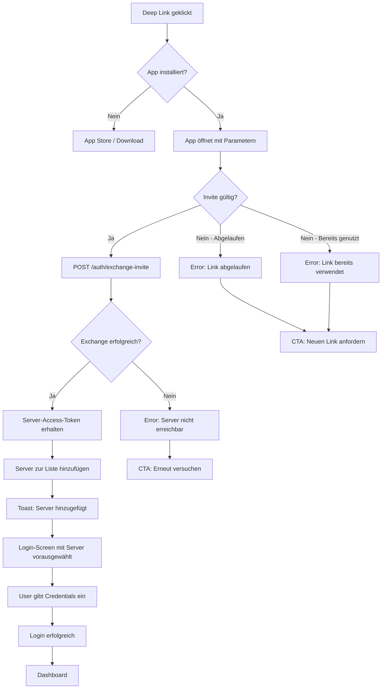
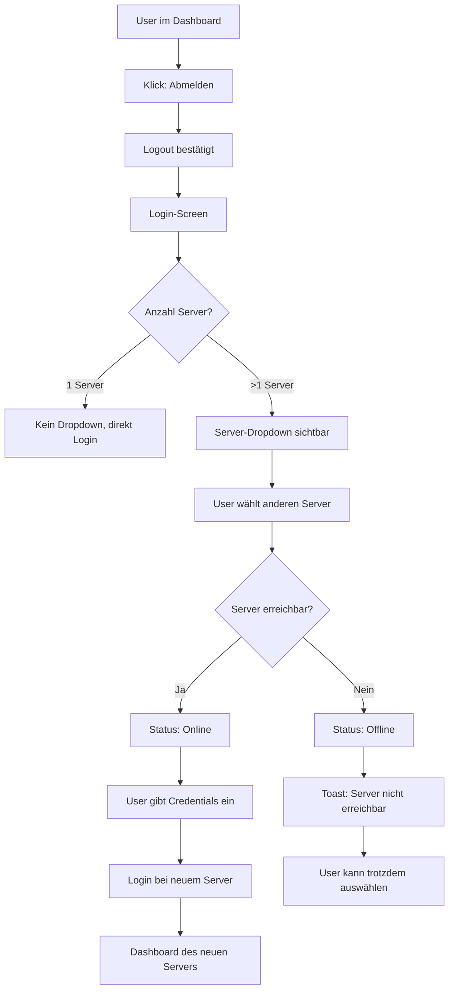
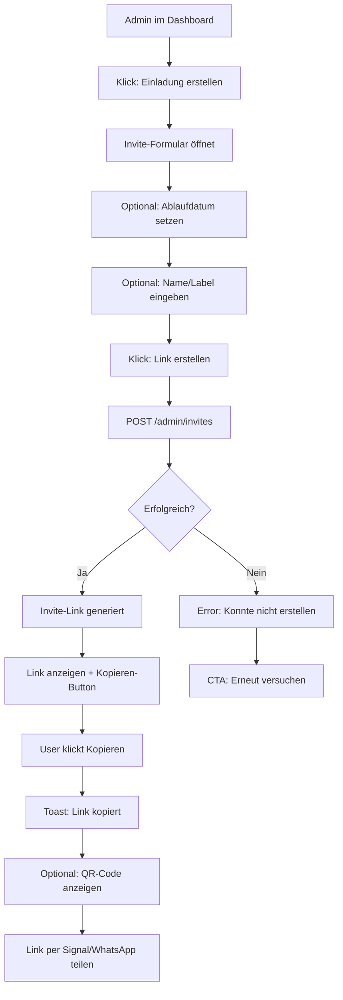
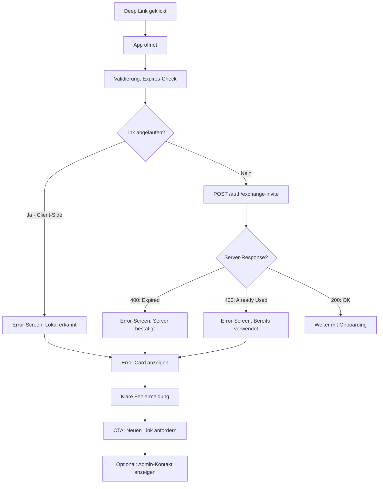
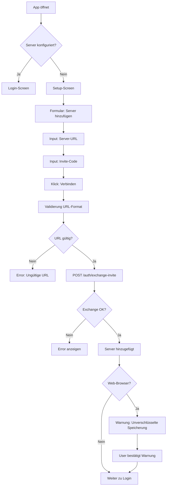

# UX Design Specification - bluelight-hub

**Author:** Rubeen
**Date:** 2026-01-06

---

## Executive Summary

### Project Vision

Bluelight Hub ermöglicht Einsatzkräften die nahtlose Verbindung mit verschiedenen Organisations-Servern über einen universellen Client. Das Multi-Server-Feature ist ein Production-Enabler – ohne dieses Feature kein produktiver Einsatz in echten Hilfsorganisationen.

**UX-Leitprinzip:** Der Client ist der "Multi-Tenant", nicht das Backend. Nutzer wechseln zwischen Servern, nicht zwischen Apps.

> **⚠️ Scope-Hinweis (Phase 1 vs. Phase 2):**
> - **Phase 1 (aktueller Scope):** Desktop (Tauri) + Web
> - **Phase 2 (spätere Erweiterung):** iOS/Android Mobile Apps
>
> Dieses UX-Dokument beschreibt das vollständige Zielbild. Features, die explizit Mobile, QR-Code-Sharing oder App-Store-Fallbacks erfordern, sind für Phase 2 vorgesehen und in Phase 1 **nicht** zu implementieren. Siehe "Platform Strategy" für Details.

### Target Users

#### Primäre Nutzergruppen

| Persona | Rolle | Tech-Affinität | Primärer Flow |
|---------|-------|----------------|---------------|
| **FüKw-Personal** | Führungskräfte im Einsatzfahrzeug | Hoch | Invite erstellen, Admin-Tasks |
| **Einsatzkräfte** | Helfer, Sanitäter | Niedrig-Mittel | Deep Link → Login → Arbeiten |
| **IT-Admins** | Server-Betreiber | Sehr hoch | Server-Setup, Token-Management |

#### Nutzungskontext

- **Primär:** Während Einsätzen (Zeitdruck, Stress-Kontext)
- **Server-Wechsel:** Selten, aber muss zuverlässig funktionieren
- **Invite-Versand:** Häufiger, oft zeitlich begrenzt (tagesaktuell)
- **Onboarding:** Mit Helfer-Unterstützung, nicht rein Self-Service

#### Plattform-Präferenzen

- Desktop (Tauri): Primär für stationäre Nutzung
- Mobile (iOS/Android): Primär für Einsatzkräfte unterwegs
- Web: Fallback und spontane Nutzung

### Key Design Challenges

1. **Bifurkation der Zielgruppe:** IT-affine Admins und "Email-Drucker" nutzen dieselbe App – Flows müssen für beide funktionieren ohne den anderen zu überfordern/unterfordern

2. **Stress-resistente UX:** Server-Wechsel im Einsatz muss blind funktionieren – keine Lernkurve, keine Überraschungen, klares Feedback

3. **Zeitlich begrenzte Invites:** Tagesgültige Invite-Codes erfordern klares Ablauf-Feedback und einfache Re-Invite-Möglichkeit

4. **Multi-Plattform-Konsistenz:** Desktop + Mobile + Web müssen identische mentale Modelle verwenden – gleiche Flows, gleiche Begriffe

5. **Zwei Onboarding-Pfade:** Deep Link UND Client-Settings als Alternativen – müssen sich ergänzen, nicht verwirren

### Design Opportunities

1. **"Helfer-gerechtes" Onboarding:** Deep Link → 1 Tap → Server hinzugefügt → Login. Kein Formular, kein Tippen für die "Email-Drucker"

2. **FüKw Power-Features:** Schnelles Invite-Erstellen mit QR-Code zum direkten Zeigen/Scannen im Einsatzfahrzeug

3. **Vertrauens-UX:** Klare visuelle Identifikation des verbundenen Servers – "Du arbeitest mit DRK Musterstadt"

4. **Graceful Fallback:** Wenn Deep Link nicht funktioniert → sanfter Übergang zu Settings-basiertem Setup ohne Frustration

## Core User Experience

### Defining Experience

Die Multi-Server-Konfiguration definiert sich durch zwei unterschiedliche Core Loops:

**Helfer-Loop (Onboarding):**
Deep Link erhalten → Link klicken → App öffnet → Server automatisch hinzugefügt → Login-Screen → Arbeiten

**FüKw-Loop (Admin):**
Einsatz vorbereiten → Invite erstellen → Link/QR teilen → Helfer sind onboarded

Die kritische Interaktion ist das **Deep Link Onboarding** – hier entscheidet sich in 2 Sekunden, ob ein Helfer erfolgreich startet oder frustriert aufgibt.

### Platform Strategy

| Plattform | Primärer Nutzen | Besonderheiten | Phase |
|-----------|-----------------|----------------|-------|
| **Desktop (Tauri)** | FüKw-Arbeitsplatz, Admin-Tasks | Keyboard-optimiert | **Phase 1** |
| **Web** | Spontaner Zugriff, Fallback | localStorage mit Sicherheitswarnung | **Phase 1** |
| **iOS/Android** | Einsatzkräfte unterwegs | Deep Link via Share-Sheet | Phase 2 |

> **Phase 1 Scope (aktuell):**
> - Desktop (Tauri) und Web
> - Deep Links (`bluelight://connect`) auf Desktop
> - URL-Parameter (`?server=...&invite=...`) auf Web
>
> **Phase 2 Scope (später):**
> - iOS/Android Native Apps
> - QR-Code-Sharing für Mobile
> - App-Store-Fallback bei nicht installierter App
> - Share-Sheet-Integration

**Plattform-Parität (Phase 2 Ziel):** Alle Features auf allen Plattformen, keine künstlichen Einschränkungen.

**QR-Code-Strategie (Phase 2):** Native Geräte-Scanner öffnet Deep Link – keine eigene Kamera-Integration nötig.

### Effortless Interactions

| Interaktion | Soll-Zustand | Anti-Pattern |
|-------------|--------------|--------------|
| **Deep Link öffnen** | 1 Tap → Server da → Login | Bestätigungs-Dialog, manuelle Eingabe |
| **Server wechseln** | Dropdown → Auswählen → Login | Logout-Button suchen, Settings öffnen |
| **Invite erstellen** | Shortcut/Button → Formular → Kopieren | Tief in Settings versteckt |
| **Ablauf-Feedback** | "Link abgelaufen" + "Neuen anfordern" | Kryptische Fehlermeldung |

### Critical Success Moments

1. **First Server Added:** Der Moment, wenn ein Helfer zum ersten Mal "Server 'DRK Musterstadt' hinzugefügt" sieht – hier entsteht Vertrauen

2. **Successful Server Switch:** Markus wechselt von Kreisverband zu Ortsverein in <5 Sekunden – "Das funktioniert einfach"

3. **Instant Invite Share:** FüKw erstellt Invite, kopiert Link, schickt per Signal – unter 30 Sekunden

4. **Graceful Expiry:** Helfer klickt abgelaufenen Link, sieht klare Nachricht, weiß was zu tun ist – kein Support-Anruf nötig

### Experience Principles

1. **Zero-Friction First:** Jede Bestätigung, jeder Extra-Tap ist ein potenzieller Abbruch. Deep Link Onboarding = keine Rückfragen.

2. **Keyboard-First für Power-User:** FüKw-Personal arbeitet am Laptop – Invite-Flow muss ohne Maus funktionieren.

3. **Trust Through Clarity:** Immer klar zeigen, mit welchem Server man verbunden ist. Kein Raten, kein Zweifel.

4. **Offline-Ready by Default:** Server-Liste ist clientseitig – funktioniert immer, auch ohne Netz.

5. **Platform-Native Integration:** Nutze was das Gerät bietet (Share-Sheet, QR-Scanner) statt es nachzubauen.

## Desired Emotional Response

### Primary Emotional Goals

| Emotion | Bedeutung | Warum kritisch |
|---------|-----------|----------------|
| **Vertrauen** | "Die App macht was sie soll" | Keine Zweifel im Stress-Kontext |
| **Kontrolle** | "Ich weiß wo ich bin und was passiert" | Server-Identität immer klar |
| **Erleichterung** | "Das hat einfach funktioniert" | Nach erfolgreichem Onboarding |
| **Effizienz** | "Ich verschwende keine Zeit" | FüKw braucht schnelle Flows |

**Emotionale Kern-Differenzierung:**
> "Bluelight Hub stört nie."

Keine Überraschungen, keine Entscheidungen unter Stress, keine "Möchtest du...?"-Dialoge. Es funktioniert einfach – und wenn nicht, sagt es dir klar was zu tun ist.

### Emotional Journey Mapping

| Phase | Soll-Emotion | Design-Implikation |
|-------|--------------|-------------------|
| **Deep Link erhalten** | Neugier + Vertrauen | Absender sichtbar im Link-Preview |
| **App öffnet** | Instant-Erkennung | Bekanntes Branding, schneller Start |
| **Server hinzugefügt** | Erleichterung | Klares Erfolgsfeedback, kein Modal |
| **Login-Screen** | Orientierung | Server-Name prominent sichtbar |
| **Server-Wechsel** | Ruhe, Sicherheit | Klare visuelle Unterscheidung |
| **Invite erstellen** | Effizienz, Kontrolle | Schnell, keine Überraschungen |
| **Fehler (z.B. Link abgelaufen)** | Kein Stress | Klare Handlungsanweisung |

### Micro-Emotions

**Zu fördern:**
- Confidence: "Ich bin am richtigen Ort"
- Trust: "Diese App weiß was sie tut"
- Accomplishment: "Mein Team ist onboarded"
- Calm: "Alles unter Kontrolle"

**Zu vermeiden:**
- Confusion: "Welcher Server ist das?"
- Panic: "Der Link geht nicht, was jetzt?!"
- Uncertainty: "Hab ich das richtig gemacht?"
- Frustration: "Warum fragt die App schon wieder?"

### Design Implications

| Emotion | UX-Entscheidung |
|---------|-----------------|
| Vertrauen → | Server-Identität immer sichtbar (Header, Login, überall) |
| Kontrolle → | Keine automatischen Aktionen ohne klares Feedback |
| Erleichterung → | Erfolgs-Feedback sofort, nicht modal, nicht blockierend |
| Effizienz → | Keyboard-Shortcuts, minimale Klicks, kein Wizard |
| Kein Stress → | Fehlermeldungen mit Lösung, nicht nur Problem |

### Emotional Design Principles

1. **Never Interrupt:** Keine modalen Dialoge für Routine-Aktionen. Toast-Notifications statt Popups.

2. **Always Orientate:** Server-Identität ist immer sichtbar – im Header, im Login, überall. Kein Raten.

3. **Fail Gracefully:** Fehlermeldungen sind Handlungsanweisungen, nicht Sackgassen. "Link abgelaufen? Fordere einen neuen an."

4. **Respect the Context:** Die App weiß, dass Nutzer unter Druck stehen. Jede Interaktion ist auf Stress-Resistenz optimiert.

5. **Celebrate Quietly:** Erfolge werden bestätigt, aber nicht gefeiert. Ein kurzes "Server hinzugefügt" reicht – keine Konfetti-Animation.

## UX Pattern Analysis & Inspiration

### Inspiring Products Analysis

#### Tailscale (Primary Inspiration)

**Was sie gut machen:**
- Minimale, fokussierte UI ohne Überladung
- Klare Device-/Network-Liste mit Status-Indikatoren
- Einfaches Invite-Sharing mit kopierbaren Links
- Onboarding ohne Friction – "es funktioniert einfach"

**Übertragbar auf Bluelight Hub:**
- Server-Liste mit klarem Status (erreichbar/offline)
- "Link kopieren" als prominente Aktion beim Invite
- Keine überflüssigen Optionen oder Settings

#### Anti-Inspiration: Slack/Discord Workspace-Switching

**Warum NICHT nachahmen:**
- Permanente Workspace-Sidebar ist für häufigen Wechsel optimiert
- Bei seltenen Server-Wechseln (Bluelight Hub) ist das Overkill
- Erhöht visuelle Komplexität ohne Nutzen

**Stattdessen:**
- Server-Auswahl nur auf Login-Screen
- Einmal eingeloggt = keine Server-Switcher-UI nötig
- Server-Identität im Header zur Orientierung, nicht zum Wechseln

### Transferable UX Patterns

#### Navigation Patterns

| Pattern | Quelle | Anwendung in Bluelight Hub |
|---------|--------|---------------------------|
| **Pre-Auth Server Selection** | Custom | Dropdown nur auf Login-Screen |
| **Inline Status Indicators** | Tailscale | Server-Status (online/offline) in Liste |
| **Contextual Header** | Common | Server-Name im Header nach Login |

#### Interaction Patterns

| Pattern | Quelle | Anwendung in Bluelight Hub |
|---------|--------|---------------------------|
| **One-Click Copy** | Tailscale, Figma | Invite-Link mit einem Klick kopieren |
| **Toast Feedback** | Modern Apps | "Server hinzugefügt" als Toast, nicht Modal |
| **Keyboard Shortcuts** | Linear-Philosophie | Cmd+K für Power-User (später) |

#### Onboarding Patterns

| Pattern | Quelle | Anwendung in Bluelight Hub |
|---------|--------|---------------------------|
| **Zero-Config Start** | Tailscale | Deep Link → Server da → fertig |
| **Graceful Fallback** | Good Practice | Deep Link failed → Settings-Form |
| **Progressive Disclosure** | Common | Erweiterte Optionen versteckt |

### Anti-Patterns to Avoid

| Anti-Pattern | Warum vermeiden | Alternative |
|--------------|-----------------|-------------|
| **Persistent Workspace Switcher** | Overkill für seltenen Wechsel | Nur auf Login-Screen |
| **Multi-Step Wizards** | Friction für "Email-Drucker" | One-Shot Deep Link |
| **Confirmation Dialogs für Routine** | Unterbricht Flow | Toast Notifications |
| **Versteckte Server-Identität** | Erzeugt Unsicherheit | Immer sichtbar im Header |
| **Kryptische Fehlermeldungen** | Panik bei Helfern | Actionable Messages |

### Design Inspiration Strategy

**Adopt (1:1 übernehmen):**
- Tailscale's minimale Liste mit Status-Indikatoren
- One-Click-Copy für Invite-Links
- Toast-Feedback statt Modals

**Adapt (anpassen):**
- Linear's Keyboard-First als optionales Power-Feature (nicht primär)
- Tailscale's Device-Onboarding → Server-Onboarding via Deep Link

**Avoid (bewusst nicht):**
- Slack/Discord's permanente Workspace-Sidebar
- Multi-Step-Wizards für Onboarding
- Confirmation-Dialoge für Standard-Aktionen

## Design System Foundation

### Design System Choice

**Gewählt:** Tailwind CSS 4.x + Headless UI (Existing Stack)

Bluelight Hub nutzt bereits ein Themeable Design System basierend auf Tailwind CSS und Headless UI. Diese Entscheidung steht fest und wird für das Multi-Server-Feature beibehalten.

### Rationale for Selection

| Faktor | Bewertung |
|--------|-----------|
| **Existing Codebase** | Bereits implementiert, kein Wechsel nötig |
| **Accessibility** | Headless UI liefert ARIA-konforme Komponenten |
| **Performance** | Tailwind purges unused CSS, minimal Bundle |
| **Customization** | Design Tokens in tailwind.config.ts |
| **Multi-Platform** | Responsive utilities für Desktop/Mobile/Web |
| **Team Knowledge** | TanStack + Tailwind Stack bereits etabliert |

### Implementation Approach

**Für das Multi-Server-Feature:**

1. **Bestehende Komponenten nutzen:**
   - `<Button>` für Aktionen (Link kopieren, Server hinzufügen)
   - `<Dropdown>` (Headless UI Listbox) für Server-Auswahl
   - `<Toast>` für Feedback ("Server hinzugefügt")
   - `<Input>` für manuelle Server-URL-Eingabe

2. **Neue Komponenten erstellen:**
   - `<ServerSelector>` – Login-Screen Dropdown
   - `<InviteCreator>` – Formular für FüKw
   - `<ServerStatusBadge>` – Online/Offline Indikator

3. **Atomic Design Hierarchie:**
   - Atoms: Badge, Icon, Toast
   - Molecules: ServerCard, InviteLink
   - Organisms: ServerSelector, InviteCreator
   - Pages: Login (mit Server-Auswahl), Settings/Servers

### Customization Strategy

**Design Tokens für Server-Identität:**

```typescript
// tailwind.config.ts - Server-spezifische Farben (optional P2)
colors: {
  server: {
    primary: 'var(--server-primary)', // Dynamisch pro Server
    accent: 'var(--server-accent)',
  }
}
```

**Komponenten-Varianten:**

| Komponente | Varianten |
|------------|-----------|
| `ServerStatusBadge` | `online`, `offline`, `unknown` |
| `InviteLink` | `active`, `expired`, `pending` |
| `ServerCard` | `selected`, `default` |

**TailwindUI-Nutzung:**
- Nur für komplexere Patterns (z.B. Dropdown-Menüs)
- Muss beim User angefragt werden vor Verwendung

## Defining Core Experience

### The Defining Experience

**Für Bluelight Hub Multi-Server gilt:**

> "Ich klicke einen Link und bin drin."

Das definierende Erlebnis ist das **Zero-Friction Deep Link Onboarding**. Wenn ein Helfer einen Invite-Link erhält und klickt, muss der Server in unter 3 Sekunden hinzugefügt sein – ohne eine einzige Frage, ohne ein einziges Formular.

| Persona | Defining Experience |
|---------|---------------------|
| **Helfer (primär)** | Deep Link → Server automatisch hinzugefügt → Login-Screen |
| **FüKw (sekundär)** | Invite erstellen → Link kopieren → Team onboarded |

**Kritischste Interaktion:** Das Helfer-Erlebnis. "Email-Drucker" haben keine Geduld für Formulare oder Bestätigungen.

### User Mental Model

#### Helfer (Lisa)

| Aspekt | Erwartung |
|--------|-----------|
| **Referenz** | "Wie WhatsApp-Gruppen-Einladung" |
| **Mitgebracht** | Erfahrung mit Share-Links, App-Downloads |
| **Erwartet** | Link klicken = fertig |
| **Frustration** | Formulare, Codes eingeben, Bestätigungsdialoge |

#### FüKw (Thomas)

| Aspekt | Erwartung |
|--------|-----------|
| **Referenz** | "Wie Zoom-Meeting-Einladung" |
| **Mitgebracht** | Admin-Erfahrung, URL-Verständnis |
| **Erwartet** | Schnelles Link-Generieren, One-Click-Copy |
| **Frustration** | Versteckte Features, zu viele Klicks |

### Success Criteria

| Kriterium | Metrik | Validierung |
|-----------|--------|-------------|
| **Geschwindigkeit** | < 3 Sekunden Link-Klick → Login-Screen | Timer-Test |
| **Interaktionen** | Exakt 1 Tap (der Link-Klick) | Click-Tracking |
| **Feedback** | Toast "Server hinzugefügt" sofort sichtbar | UI-Review |
| **Fehlerfall** | Klare Nachricht + Handlungsanweisung | Error-State-Test |
| **Mental Load** | Zero Entscheidungen während Onboarding | User-Test |
| **Offline-Robustheit** | Server-Liste offline verfügbar nach Onboarding | Offline-Test |

### Novel UX Patterns

| Pattern | Typ | Begründung |
|---------|-----|------------|
| **Deep Link Onboarding** | Etabliert | Wie Slack, Discord, Zoom Invites |
| **Pre-Auth Server Selection** | Semi-Novel | Dropdown nur auf Login-Screen, nicht In-App |
| **Background Token Exchange** | Etabliert | OAuth-ähnlicher Silent Flow |
| **Zero-Confirmation Server Add** | **Novel** | Kein "Möchtest du hinzufügen?" Dialog |

**Der bewusst novel Aspekt:**
Wir verzichten auf die Bestätigungsabfrage beim Server-Hinzufügen. Das ist unüblich, aber für unsere Zielgruppe (wenig tech-affine Helfer unter Zeitdruck) essentiell. Jede Frage ist ein potenzieller Abbruch.

### Experience Mechanics

#### Deep Link Onboarding (Helfer-Flow)

```
┌─────────────────────────────────────────────────────────────┐
│ 1. INITIATION                                               │
│    └─ Helfer erhält Link per Signal/WhatsApp/Email          │
│    └─ Link-Preview zeigt: "Bluelight Hub – DRK Musterstadt" │
├─────────────────────────────────────────────────────────────┤
│ 2. INTERACTION                                              │
│    └─ Tap auf Link                                          │
│    └─ App öffnet (oder App Store wenn nicht installiert)    │
│    └─ System: Validiert Invite → Tauscht gegen Access-Token │
├─────────────────────────────────────────────────────────────┤
│ 3. FEEDBACK                                                 │
│    └─ Toast: "Server 'DRK Musterstadt' hinzugefügt" (2s)    │
│    └─ Kein Modal, kein Blocker                              │
├─────────────────────────────────────────────────────────────┤
│ 4. COMPLETION                                               │
│    └─ Login-Screen mit vorausgewähltem Server               │
│    └─ Server-Name prominent sichtbar                        │
│    └─ Nächster Schritt offensichtlich: Credentials eingeben │
└─────────────────────────────────────────────────────────────┘
```

#### Invite Creation (FüKw-Flow)

```
┌─────────────────────────────────────────────────────────────┐
│ 1. INITIATION                                               │
│    └─ FüKw öffnet Admin-Bereich oder Schnell-Aktion         │
│    └─ "Einladung erstellen" prominent sichtbar              │
├─────────────────────────────────────────────────────────────┤
│ 2. INTERACTION                                              │
│    └─ Optional: Ablaufdatum setzen (Default: Heute 23:59)   │
│    └─ Optional: Name/Label für Audit                        │
│    └─ Klick: "Link erstellen"                               │
├─────────────────────────────────────────────────────────────┤
│ 3. FEEDBACK                                                 │
│    └─ Link erscheint sofort                                 │
│    └─ "Kopieren" Button prominent                           │
│    └─ QR-Code optional anzeigen                             │
├─────────────────────────────────────────────────────────────┤
│ 4. COMPLETION                                               │
│    └─ Link in Zwischenablage                                │
│    └─ Toast: "Link kopiert"                                 │
│    └─ Kann direkt in Signal/WhatsApp einfügen               │
└─────────────────────────────────────────────────────────────┘
```

## Visual Design Foundation

### Color System

**Primary Palette (Sky/Blue):**

| Token | Hex-Wert | Verwendung |
|-------|----------|------------|
| `primary-50` | Sky-50 | Subtle Backgrounds |
| `primary-100` | Sky-100 | Hover States |
| `primary-200` | Sky-200 | Active Backgrounds |
| `primary-500` | Sky-500 | Primary Actions, Links |
| `primary-600` | Sky-600 | Buttons (Default) |
| `primary-700` | Sky-700 | Buttons (Hover) |
| `primary-900` | Sky-900 | Text auf hellen Backgrounds |

**Semantische Farben (Multi-Server-Feature):**

| Zustand | Farbe | Verwendung |
|---------|-------|------------|
| **Online** | `green-500` | Server erreichbar |
| **Offline** | `gray-400` | Server nicht erreichbar |
| **Error/Expired** | `red-500` | Abgelaufene Invites, Fehler |
| **Warning** | `amber-500` | Invite läuft bald ab |
| **Success** | `green-500` | Server hinzugefügt (Toast) |

**Dark Mode:**
- Hintergrund: `rgb(17 24 39)` (Gray-900)
- Vollständig unterstützt via Tailwind `dark:` Prefix

### Typography System

**Font Stack:**
```css
font-family: "Nunito Variable", "Inter Variable", sans-serif;
```

| Element | Stil | Verwendung |
|---------|------|------------|
| **Server-Name (Header)** | `text-lg font-semibold` | Aktiver Server-Identität |
| **Server-Liste Item** | `text-base font-medium` | Server-Auswahl Dropdown |
| **Status Badge** | `text-xs font-medium uppercase` | Online/Offline Label |
| **Toast Message** | `text-sm font-normal` | Feedback-Nachrichten |
| **Invite Link** | `text-sm font-mono` | URL-Darstellung |

### Spacing & Layout Foundation

**Spacing Scale (Tailwind Default):**
- `gap-2` (8px): Inline-Elemente (Icon + Text)
- `gap-4` (16px): Liste-Items (Server-Karten)
- `p-4` (16px): Container-Padding
- `p-6` (24px): Modal/Card-Padding

**Layout Patterns:**

| Pattern | Verwendung |
|---------|------------|
| **Full-Width Login** | Server-Dropdown spannt gesamte Breite |
| **Card-Based Lists** | Server-Liste als Karten mit Status |
| **Fixed Header** | Server-Identität immer sichtbar |
| **Toast Position** | Bottom-Right (Desktop), Bottom-Center (Mobile) |

### Accessibility Considerations

**Motion Preferences:**
```css
@media (prefers-reduced-motion: reduce) {
  /* Animationen deaktiviert */
}
```

**Bereits implementierte Accessibility-Features:**
- Headless UI liefert ARIA-konforme Komponenten
- Fokus-Ringe für Keyboard-Navigation
- Ausreichend Farbkontrast (WCAG AA)

**Multi-Server-spezifische Accessibility:**

| Element | Anforderung |
|---------|-------------|
| **Server-Dropdown** | `aria-label="Server auswählen"` |
| **Status Badge** | Screen-Reader-Text zusätzlich zu Farbe |
| **Toast Notifications** | `role="status"`, `aria-live="polite"` |
| **Invite-Link** | Kopieren-Aktion mit Keyboard zugänglich |

**Animations (bestehend, für Multi-Server nutzbar):**
- `card-entry`: Sanftes Einblenden neuer Server-Karten
- `pulse-shadow`: Status-Indikatoren
- Alle Animationen respektieren `prefers-reduced-motion`

## Design Direction Decision

### Design Directions Explored

Im Rahmen der UX-Exploration wurden 6 Design-Richtungen evaluiert:

1. **Minimal Clean** - Viel Whitespace, reduzierte Elemente, fokussiert
2. **Professional Dense** - Kompakt, tabellenartig, tool-like
3. **Friendly Rounded** - Weiche Formen, einladend, große Touch-Targets
4. **Dark-First Bold** - Dark Mode primär, kräftige Kontraste
5. **Card-Heavy Modular** - Grid-basiert, alles in Karten
6. **List-Focused Efficient** - Vertikale Listen, schneller Scan

### Chosen Direction

**Minimal Clean**, angepasst an die bestehende UI-Architektur.

Die Wahl fällt auf Minimal Clean, weil:
- Passt zum Prinzip "Bluelight Hub stört nie" - keine visuelle Überladung
- Entspannte Optik reduziert Stress-Wahrnehmung im Einsatz
- Großzügiger Whitespace erlaubt schnelles visuelles Erfassen
- Alignment mit bestehendem Clean-Design (AuthCard, Button, Input)

### Design Rationale

| Kriterium | Begründung |
|-----------|-------------|
| **Zero-Friction** | Weniger visuelle Elemente = schnellere Entscheidung |
| **Stress-Kontext** | Ruhige, aufgeräumte UI wirkt beruhigend |
| **Bestehende Basis** | Nahtlose Integration in existierende Komponenten |
| **Dark Mode Ready** | Bestehendes System unterstützt beide Modi |
| **Accessibility** | Weniger Clutter = bessere Fokus-Navigation |

### Implementation Approach

**1. Bestehende Komponenten 1:1 nutzen:**
- `Button` (intent: primary/secondary, appearance: filled/outline)
- `Input` / `Select` mit `selectSize="lg"` für Touch-Freundlichkeit
- `Badge` mit `dot` für animierten Status-Indikator
- `AuthCard` als Basis für Login-Screen mit Server-Auswahl

**2. Neue Multi-Server Komponenten (Atomic Design):**

| Level | Komponente | Beschreibung |
|-------|------------|--------------|
| Atom | `ServerStatusDot` | Animierter Status-Punkt (online/offline) |
| Molecule | `ServerListItem` | Server-Name + Status + Last-Used |
| Molecule | `InviteLinkDisplay` | Link + Copy-Button |
| Organism | `ServerSelector` | Dropdown für Login-Screen |
| Organism | `InviteCreator` | Formular: Ablaufdatum + Link generieren |
| Organism | `ServerManager` | Settings-Page Server-Liste |

**3. Toast-Integration:**
- Position: `fixed bottom-4 right-4` (Desktop), `bottom-4 inset-x-4` (Mobile)
- Duration: 3 Sekunden, auto-dismiss
- Keine Aktion erforderlich (außer bei Fehler: "Erneut versuchen")

**4. Spacing-Konsistenz:**
- Container: `p-6` (lg padding, wie AuthCard)
- Formular-Elemente: `space-y-4`
- Listen-Items: `gap-2` oder `divide-y`

## User Journey Flows

### Journey 1: Deep Link Onboarding (Lisa)

**Trigger:** Helfer klickt Deep Link (`bluelight://connect?url=...&invite=...`)



**Flow-Details:**

| Schritt | UI-Element | Feedback |
|---------|------------|----------|
| App öffnet | Splash → Validierung | Spinner während Exchange |
| Exchange OK | - | Toast "Server hinzugefügt" (2s) |
| Exchange Fail | Error Card | Klare Handlungsanweisung |
| Login-Screen | Server im Dropdown vorausgewählt | Server-Name prominent |

### Journey 2: Server-Wechsel (Markus)

**Trigger:** User will zu anderem Server wechseln



**Flow-Details:**

| Schritt | UI-Element | Feedback |
|---------|------------|----------|
| Logout | Button oben rechts | Instant, keine Bestätigung |
| Server-Dropdown | Select mit Status-Dots | Online/Offline sichtbar |
| Server-Wechsel | Dropdown-Auswahl | Instant, keine Seiten-Navigation |

### Journey 3: Invite erstellen (Thomas/FüKw)

**Trigger:** Admin/FüKw will Helfer onboarden



**Flow-Details:**

| Schritt | UI-Element | Feedback |
|---------|------------|----------|
| Formular | Minimal: Datum + Label (optional) | Default: Heute 23:59 |
| Link generiert | Code-Block mit Link | Prominent, nicht modal |
| Kopieren | Button neben Link | Toast "Kopiert" (1s) |
| QR-Code | Optional anzeigen | Für direktes Scannen |

### Journey 4: Error - Link abgelaufen

**Trigger:** User klickt abgelaufenen Deep Link



**Error-Messages:**

| Error | Message | CTA |
|-------|---------|-----|
| Abgelaufen | "Dieser Einladungslink ist abgelaufen." | "Fordere einen neuen Link bei deinem Administrator an." |
| Bereits verwendet | "Dieser Link wurde bereits verwendet." | "Falls du Probleme hast, kontaktiere deinen Administrator." |
| Server offline | "Server nicht erreichbar." | "Erneut versuchen" Button |

### Journey 5: Web-Form Setup (Fallback)

**Trigger:** User hat keinen Deep Link, nur URL + Invite-Code



### Journey Patterns

**Navigation Patterns:**

| Pattern | Verwendung |
|---------|------------|
| **Pre-Auth Server Selection** | Server-Wechsel nur auf Login-Screen |
| **Single-Page Transitions** | Keine Full-Page-Reloads innerhalb Flows |
| **Progressive Disclosure** | Optionale Felder (Label, Datum) eingeklappt |

**Feedback Patterns:**

| Pattern | Verwendung |
|---------|------------|
| **Toast for Success** | "Server hinzugefügt", "Link kopiert" |
| **Inline Error** | Formular-Fehler direkt am Feld |
| **Error Card for Blockers** | Abgelaufener Link, Server offline |

**Recovery Patterns:**

| Pattern | Verwendung |
|---------|------------|
| **Retry Button** | Bei temporären Fehlern (Netzwerk) |
| **Clear Next Step** | Bei permanenten Fehlern (Ablauf) |
| **Graceful Fallback** | Deep Link fail → Manual Form |

### Flow Optimization Principles

| Prinzip | Anwendung |
|---------|-----------|
| **Minimize Steps to Value** | Deep Link: 1 Klick → Server da |
| **Reduce Cognitive Load** | Keine Bestätigungs-Dialoge bei Routine |
| **Clear Progress Indication** | Spinner während Exchange, Toast bei Erfolg |
| **Moments of Delight** | Subtile Animation bei "Server hinzugefügt" |
| **Graceful Error Recovery** | Jeder Error hat klare Handlungsanweisung |

## Component Strategy

### Design System Components (Verfügbar)

Basierend auf der Analyse der bestehenden Codebase:

| Komponente | Pfad | Multi-Server Verwendung |
|------------|------|------------------------|
| **Button** | `atoms/button.atom.tsx` | Kopieren, Erstellen, Anmelden |
| **Input** | `atoms/input.atom.tsx` | Server-URL, Invite-Code |
| **Select** | `atoms/select.atom.tsx` | Basis für Server-Dropdown |
| **Badge** | `atoms/badge.atom.tsx` | Server-Status (mit `dot` prop) |
| **Card** | `atoms/card.atom.tsx` | Container für Formulare |
| **AuthCard** | `molecules/auth-card.molecule.tsx` | Login mit Server-Auswahl |
| **Alert** | `atoms/alert.atom.tsx` | Error-States |
| **Dialog** | `molecules/dialog.molecule.tsx` | Optional für Invite-Modal |
| **Toast** | Sonner (`<Toaster />`) | Success/Error Feedback |
| **Spinner** | `atoms/spinner.atom.tsx` | Loading States |
| **Label** | `atoms/label.atom.tsx` | Form Labels |

### Custom Components

#### ServerSelector (Organism)

**Purpose:** Dropdown zur Server-Auswahl auf dem Login-Screen mit Status-Indikatoren

**Anatomy:**
```
┌─────────────────────────────────────┐
│  ● DRK Musterstadt              ▼  │
└─────────────────────────────────────┘
         │
         ▼ (Dropdown offen)
┌─────────────────────────────────────┐
│  ● DRK Musterstadt         (aktiv) │
│  ● THW OV Beispiel                 │
│  ○ FF Altdorf              offline │
├─────────────────────────────────────┤
│  + Server hinzufügen               │
└─────────────────────────────────────┘
```

**Props:**
```typescript
interface ServerSelectorProps {
  servers: ServerConfig[];
  selectedId: string | null;
  onSelect: (serverId: string) => void;
  onAddServer: () => void;
  disabled?: boolean;
}
```

**States:** Default (collapsed), Open (dropdown), Disabled (während Login)

**Accessibility:** `aria-label="Server auswählen"`, Keyboard Navigation

#### ServerListItem (Molecule)

**Purpose:** Einzelne Zeile in der Server-Liste (Settings-Page)

**Anatomy:**
```
┌─────────────────────────────────────────────────────┐
│  ●  DRK Musterstadt                    Vor 2 Min   │
│      api.drk-musterstadt.de                  ···   │
└─────────────────────────────────────────────────────┘
```

**Props:**
```typescript
interface ServerListItemProps {
  server: ServerConfig;
  isActive?: boolean;
  onEdit?: () => void;
  onDelete?: () => void;
}
```

#### InviteCreator (Organism)

**Purpose:** Formular zum Erstellen von Einladungs-Links

**Props:**
```typescript
interface InviteCreatorProps {
  onInviteCreated: (invite: InviteLink) => void;
  defaultExpiresAt?: Date;
}
```

**States:** Default, Loading, Success (zeigt InviteLinkDisplay), Error

#### InviteLinkDisplay (Molecule)

**Purpose:** Zeigt generierten Invite-Link mit Copy-Funktion

**Anatomy:**
```
┌─────────────────────────────────────────────────────┐
│  bluelight://connect?url=api.drk...&invite=abc123  │
│  ┌──────────────┐  ┌──────────────┐                │
│  │   Kopieren   │  │  QR-Code     │                │
│  └──────────────┘  └──────────────┘                │
│  Gültig bis: 06.01.2026 23:59                      │
└─────────────────────────────────────────────────────┘
```

#### ServerSetupForm (Organism)

**Purpose:** Manuelles Hinzufügen eines Servers (Fallback für Web)

**Props:**
```typescript
interface ServerSetupFormProps {
  onServerAdded: (server: ServerConfig) => void;
  initialUrl?: string;
  initialInviteCode?: string;
}
```

### Component Implementation Strategy

**Folder-Struktur:**
```
features/
└── server/
    ├── api/
    │   ├── queries.ts       # useServers, useServerStatus
    │   └── mutations.ts     # useAddServer, useCreateInvite
    ├── stores/
    │   └── server.store.ts  # Aktiver Server, Server-Liste
    ├── schemas/
    │   └── server.schema.ts # Zod Validierung
    └── ui/
        ├── atoms/
        │   └── ServerStatusDot.tsx
        ├── molecules/
        │   ├── ServerListItem.tsx
        │   └── InviteLinkDisplay.tsx
        └── organisms/
            ├── ServerSelector.tsx
            ├── InviteCreator.tsx
            └── ServerSetupForm.tsx
```

### Implementation Roadmap

**Phase 1 - Core (MVP P0):**

| Komponente | Kritisch für |
|------------|--------------|
| `ServerSelector` | Login-Screen |
| `ServerSetupForm` | Erstes Onboarding |
| Server Store | State Management |

**Phase 2 - Admin (P1):**

| Komponente | Kritisch für |
|------------|--------------|
| `InviteCreator` | Admin Invite Flow |
| `InviteLinkDisplay` | Link teilen |
| `ServerListItem` | Settings Page |

**Phase 3 - Enhancement (P2):**

| Komponente | Kritisch für |
|------------|--------------|
| QR-Code Display | QR-Sharing |
| Server-Icon/Farbe | Visuelle Unterscheidung |

## UX Consistency Patterns

### Feedback Patterns

**Toast Notifications (Sonner):**

| Typ | Verwendung | Duration | Position |
|-----|------------|----------|----------|
| **Success** | Server hinzugefügt, Link kopiert | 2-3s | Bottom-Right |
| **Error** | Netzwerkfehler, Validation | 5s + Manual Dismiss | Bottom-Right |
| **Info** | Hinweise (z.B. Browser-Warnung) | 5s | Bottom-Right |

**Pattern-Regeln:**
- Toast für **nicht-blockierende** Rückmeldungen
- Kein Toast für kritische Fehler (nutze Error Card)
- Maximal 1 Toast gleichzeitig
- Toast enthält **keine Aktionen** (außer Dismiss)

**Error Card Pattern:**

| Situation | Komponente | Aktion |
|-----------|------------|--------|
| **Link abgelaufen** | Error Card (full-screen) | CTA: "Neuen Link anfordern" |
| **Server offline** | Inline Alert | CTA: "Erneut versuchen" |
| **Validation-Fehler** | Inline unter Feld | Keine CTA (Korrektur reicht) |

**Pattern-Regel:** Fehler mit **klarer Handlungsanweisung**, nie nur Problem beschreiben.

### Button Hierarchy

**Intent-Verwendung:**

| Intent | Verwendung Multi-Server | Beispiel |
|--------|------------------------|----------|
| **Primary** | Haupt-Aktion pro Screen | "Anmelden", "Link erstellen" |
| **Secondary** | Alternative Aktionen | "QR-Code anzeigen", "Abbrechen" |
| **Danger** | Destruktive Aktionen | "Server entfernen" |
| **Ghost** | Subtle Actions | "Server hinzufügen" im Dropdown |

**Pattern-Regeln:**
- **1 Primary Button pro View** - nie zwei primäre Buttons nebeneinander
- Primary immer **rechts** bei Button-Paaren
- Destructive Actions benötigen **Bestätigung** (Dialog)

### Form Patterns

**Validation-Timing:**

| Feldtyp | Wann validieren | Feedback |
|---------|-----------------|----------|
| **Server-URL** | onBlur + onChange nach erstem Blur | Inline unter Feld |
| **Invite-Code** | onSubmit (API-Validierung) | Inline nach Submit |
| **Datum** | onChange | Sofort rot/grün |

**Pattern-Regeln:**
- **Keine Validation während Tippen** (zu frustrierend)
- Fehler-Text in **Rot** unter dem Feld
- Spacing: `space-y-4` zwischen Feldgruppen, `space-y-1` zwischen Label und Input

### Navigation Patterns

**Pre-Auth Server Selection:**

| Situation | Verhalten |
|-----------|-----------|
| **0 Server** | Redirect zu Server-Setup |
| **1 Server** | Kein Dropdown, direkt Login |
| **>1 Server** | Dropdown sichtbar, letzter Server vorausgewählt |

**Pattern-Regeln:**
- Server-Wechsel **nur vor Login** möglich (nicht in-app)
- Server-Identität **immer sichtbar** nach Login (Header)
- Logout → Login-Screen mit Server-Dropdown

### Loading States

**Spinner-Verwendung:**

| Situation | Spinner-Typ | Platzierung |
|-----------|-------------|-------------|
| **Button-Action** | Inline im Button | Button disabled |
| **Full-Page Load** | Centered Spinner | Overlay |
| **Token Exchange** | Centered + Text | "Verbinde mit Server..." |

**Pattern-Regeln:**
- Loading-State nach **200ms** anzeigen (vermeidet Flackern)
- Bei >3s: Zusätzlicher Text ("Dies kann einen Moment dauern...")
- Button während Loading **disabled**, aber Größe bleibt gleich

### Empty States

**Pattern-Regeln:**
- Freundlicher Ton, keine technischen Begriffe
- **Immer eine Aktion** anbieten
- Icon/Illustration optional, aber hilfreich

### Copy-to-Clipboard Pattern

**Ablauf:**
1. User klickt "Kopieren"
2. Text wird in Clipboard kopiert
3. Button zeigt kurz "Kopiert!" (1s)
4. Toast erscheint: "Link kopiert"
5. Button kehrt zu "Kopieren" zurück

### Mobile-Spezifische Patterns

| Pattern | Desktop | Mobile |
|---------|---------|--------|
| **Toast Position** | Bottom-Right | Bottom-Center |
| **Button Size** | `size="md"` | `size="lg"` (größere Touch-Targets) |
| **Dropdown** | Inline Dropdown | Full-Width Bottom Sheet |
| **Form Layout** | Horizontal Labels möglich | Immer Vertical Stack |

**Pattern-Regel:** Touch-Targets mindestens **44x44px** (iOS HIG).

## Responsive Design & Accessibility

### Responsive Strategy

**Plattform-Übersicht:**

| Plattform | Primärer Kontext | Besonderheiten |
|-----------|------------------|----------------|
| **Desktop (Tauri)** | FüKw-Arbeitsplatz, stationär | Keyboard-First, Multi-Window möglich |
| **Mobile (iOS/Android)** | Einsatzkräfte unterwegs | Touch-First, Deep Link via Share-Sheet |
| **Web (PWA-fähig)** | Spontaner Zugriff, Fallback | localStorage mit Sicherheitswarnung |

**Design-Philosophie:**
- **Mobile-First Approach** für alle neuen Komponenten
- **Progressive Enhancement** für Desktop-Features (z.B. Keyboard Shortcuts)
- **Plattform-Parität:** Alle Features auf allen Plattformen verfügbar

### Breakpoint Strategy

**Tailwind Default Breakpoints:**

| Breakpoint | Min-Width | Verwendung Multi-Server |
|------------|-----------|------------------------|
| `sm` | 640px | Kleine Tablets, große Phones |
| `md` | 768px | Tablets Portrait |
| `lg` | 1024px | Tablets Landscape, kleine Laptops |
| `xl` | 1280px | Desktop, Laptops |
| `2xl` | 1536px | Große Monitore |

**Responsive Komponenten-Verhalten:**

| Komponente | Mobile (<768px) | Desktop (≥768px) |
|------------|-----------------|------------------|
| **ServerSelector** | Full-Width, Bottom Sheet Style | Inline Dropdown |
| **InviteCreator** | Stack Layout, Full-Width Buttons | Side-by-Side Optionen |
| **ServerListItem** | Tap für Actions, Swipe für Delete | Hover für Actions |
| **Toast** | Bottom-Center, Full-Width | Bottom-Right, Fixed Width |

### Accessibility Strategy

**WCAG Level:** AA (Target)

**Accessibility-Prinzipien:**

| Prinzip | Umsetzung |
|---------|-----------|
| **Perceivable** | Ausreichend Kontrast, Status nicht nur durch Farbe |
| **Operable** | Keyboard-Navigation, keine Zeitlimits |
| **Understandable** | Klare Fehlermeldungen, konsistente Navigation |
| **Robust** | Headless UI für ARIA-konforme Komponenten |

### Accessibility Checklist

**Farbe & Kontrast:**
- [ ] Farbkontrast mindestens 4.5:1 für normalen Text
- [ ] Farbkontrast mindestens 3:1 für große Texte und UI-Elemente
- [ ] Status-Informationen nicht nur durch Farbe kommuniziert
- [ ] Focus-States deutlich sichtbar (nicht nur Farbe)

**Keyboard-Navigation:**
- [ ] Alle interaktiven Elemente fokussierbar
- [ ] Tab-Reihenfolge logisch und konsistent
- [ ] Focus-Trap in Modals/Dialogen
- [ ] Escape schließt Dialoge/Dropdowns

**Screen Reader:**
- [ ] Alle Bilder mit Alt-Text
- [ ] ARIA-Labels für Icon-Buttons
- [ ] Live-Regions für dynamische Inhalte (`aria-live`)
- [ ] Überschriften-Hierarchie korrekt (h1 → h2 → h3)

**Motion & Animation:**
- [ ] Animationen respektieren `prefers-reduced-motion`
- [ ] Keine automatisch startenden Animationen >5s
- [ ] Keine blinkenden Elemente >3 Blitze/Sekunde

### ARIA Labels (Multi-Server-spezifisch)

| Element | ARIA Label |
|---------|------------|
| **Server-Dropdown** | `aria-label="Server auswählen"` |
| **Server-Status Dot** | `aria-label="Server online"` / `aria-label="Server offline"` |
| **Kopieren-Button** | `aria-label="Link in Zwischenablage kopieren"` |
| **Server entfernen** | `aria-label="Server entfernen"` |
| **Toast Container** | `role="status" aria-live="polite"` |
| **Error Alert** | `role="alert" aria-live="assertive"` |

### Testing Strategy

**Manuelle Tests:**
- [ ] Keyboard-Only Navigation durchspielen
- [ ] Screen Reader Test (VoiceOver macOS, TalkBack Android)
- [ ] Zoom 200% Test (Text sollte lesbar bleiben)
- [ ] Reduced Motion Test (System-Einstellung)

**Automatisierte Tests:**
- [ ] Axe DevTools für Accessibility-Audits
- [ ] Lighthouse Accessibility Score ≥90
- [ ] Pa11y CI für kontinuierliche Validierung

**Geräte-Tests:**
- [ ] iPhone SE (kleinster Screen)
- [ ] iPad (Touch + Keyboard)
- [ ] Desktop mit externer Tastatur
- [ ] High-Contrast Mode

### Implementation Guidelines

**Responsive Utilities (Tailwind):**
```typescript
// Beispiel: Responsive Button-Größe
<Button
  size="lg"           // Default: Large für Touch
  className="md:size-md"  // Ab md: Medium-Size
>
  Anmelden
</Button>

// Beispiel: Responsive Layout
<div className="flex flex-col md:flex-row gap-4">
  {/* Stack auf Mobile, Row auf Desktop */}
</div>
```

**Accessibility-Helper:**
```typescript
// Screen-Reader-Only Text
<span className="sr-only">Server online</span>

// Fokus-Management
import { FocusTrap } from '@headlessui/react';
```

**Motion-Respektierung (bereits im Design System):**
```css
@media (prefers-reduced-motion: reduce) {
  * {
    animation-duration: 0.01ms !important;
    transition-duration: 0.01ms !important;
  }
}
```

**Testing-Integration:**
- Axe-Core in Vitest integriert
- Accessibility-Tests in CI/CD Pipeline
- Regelmäßige Screen-Reader-Reviews

---

## Appendix: Workflow Completion

**Erstellungsdatum:** 2026-01-06
**Workflow:** BMAD UX Design Workflow v1.0
**Autor:** Rubeen (in Kollaboration mit UX Designer Agent)

**Abgeschlossene Schritte:**
1. Project Understanding
2. User Insights
3. Emotional Response
4. UX Pattern Analysis
5. Design System Choice
6. Core Interaction Definition
7. Experience Mechanics
8. Visual Foundation
9. Design Direction
10. User Journey Flows
11. Component Strategy
12. UX Consistency Patterns
13. Responsive Design & Accessibility
14. Workflow Completion

**Deliverables:**
- `_bmad-output/planning-artifacts/ux-design-specification.md` (dieses Dokument)
- `_bmad-output/planning-artifacts/ux-design-directions.html` (Design-Richtungen Showcase)
