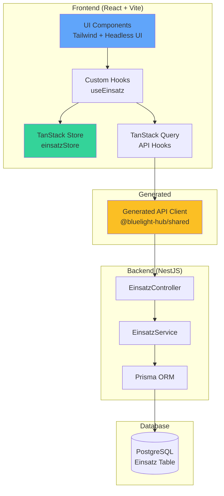
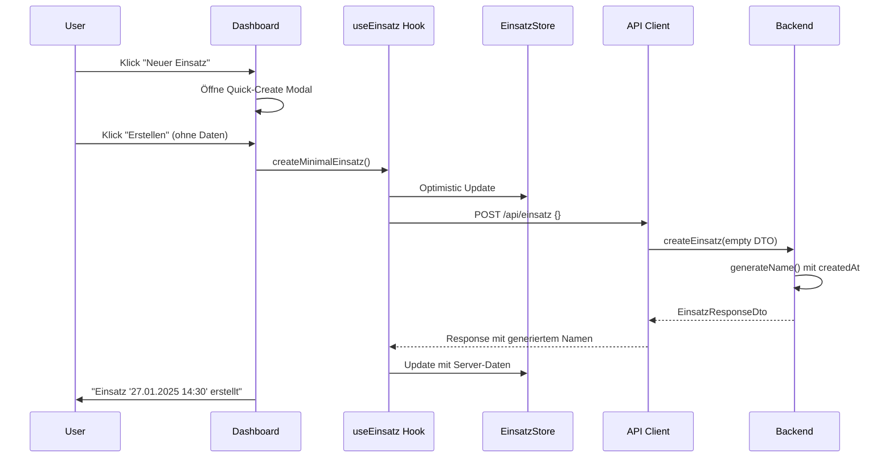

# Einsatz-Management System - Fullstack-Architektur Dokument

**Epic:** #143 - Einsatz ohne Pflichtparameter  
**Version:** 1.0  
**Datum:** 2025-01-27  
**Autor:** Winston (System Architect)

## 1. Einführung

Dieses Dokument beschreibt die vollständige Fullstack-Architektur für das Einsatz-Management System, einschließlich
Backend-Systemen, Frontend-Implementierung und deren Integration. Es dient als einzige Quelle der Wahrheit für die
KI-gesteuerte Entwicklung und gewährleistet Konsistenz über den gesamten Technologie-Stack.

### Status: Brownfield-Erweiterung - BlueLight Hub Anwendung

Das Einsatz-Management System wird als neues Feature-Modul zur bestehenden BlueLight Hub Anwendung hinzugefügt, welche
bereits folgendes umfasst:

- **Frontend:** React + Vite + TanStack (Query/Store/Form) + Tailwind CSS + Headless UI
- **Backend:** NestJS + Prisma + PostgreSQL
- **Architektur:** Atomic Design Pattern, Monorepo mit pnpm workspaces
- **Bestehende Module:** Auth, User Management, Health Monitoring

### Änderungsprotokoll

| Datum      | Version | Beschreibung                      | Autor               |
|------------|---------|-----------------------------------|---------------------|
| 2025-01-27 | 1.0     | Initiale Architektur für Epic-143 | Winston (Architekt) |

## 2. High-Level-Architektur

### Technische Zusammenfassung

Das Einsatz-Management System wird als modulare Erweiterung in die bestehende BlueLight Hub Monorepo-Architektur
integriert. Die Lösung nutzt React mit TanStack Store für reaktives State Management im Frontend und NestJS mit Prisma
für typsichere Backend-Services. Die Integration erfolgt über automatisch generierte API-Clients, die eine nahtlose
Type-Safety zwischen Frontend und Backend gewährleisten. Das System wird auf der bestehenden Infrastruktur deployed und
nutzt PostgreSQL für persistente Datenhaltung mit optimistischen Updates für maximale Performance.

### Plattform und Infrastruktur

**Plattform:** Lokale Entwicklung + Cloud-Ready (Docker)  
**Kern-Services:** PostgreSQL, Node.js Runtime  
**Deployment-Host und Regionen:** Docker Container, primär EU-Central

### Repository-Struktur

**Struktur:** Monorepo (bereits etabliert)  
**Monorepo-Tool:** pnpm workspaces  
**Package-Organisation:**

- `packages/backend/src/einsatz/` - Einsatz-Backend-Modul
- `packages/frontend/src/components/{atoms,molecules,organisms}/einsatz/` - UI-Komponenten
- `packages/frontend/src/stores/einsatzStore.ts` - State Management
- `packages/shared/client/apis/EinsatzApi.ts` - Generierte API-Clients

### Architektur-Diagramm



### Architektonische Patterns

- **Atomic Design Pattern:** Komponenten-Hierarchie (Atoms → Molecules → Organisms) - _Begründung:_ Bereits etabliert im
  Projekt, fördert Wiederverwendbarkeit
- **Repository Pattern:** Prisma als Data Access Layer - _Begründung:_ Abstraktion der Datenbankzugriffe, erleichtert
  Testing
- **Optimistic UI Updates:** State wird vor Server-Response aktualisiert - _Begründung:_ Verbesserte User Experience bei
  Einsatz-Erstellung
- **API-First Development:** OpenAPI → Generated Clients - _Begründung:_ Type-Safety über Stack-Grenzen hinweg
- **Feature-Modul-Architektur:** Eigenständiges Einsatz-Modul - _Begründung:_ Klare Separation of Concerns, erleichtert
  Wartung

## 3. Tech Stack

### Technologie-Stack Tabelle

| Kategorie            | Technologie            | Version     | Zweck                | Begründung            |
|----------------------|------------------------|-------------|----------------------|-----------------------|
| Frontend Language    | TypeScript             | 5.x         | Type-Safe Frontend   | Bereits im Projekt    |
| Frontend Framework   | React                  | 18.x        | UI Components        | Etabliert             |
| UI Component Library | Headless UI + Tailwind | Latest      | Styling & Components | Projekt-Standard      |
| State Management     | TanStack Store         | Latest      | Global State         | Modern & Lightweight  |
| Backend Language     | TypeScript             | 5.x         | Type-Safe Backend    | Konsistenz            |
| Backend Framework    | NestJS                 | 11.x        | API Server           | Bereits vorhanden     |
| API Style            | REST                   | OpenAPI 3.0 | API Design           | Swagger-Support       |
| Database             | PostgreSQL             | 15.x        | Persistenz           | Bereits im Einsatz    |
| ORM                  | Prisma                 | Latest      | Database Access      | Type-Safety           |
| Authentication       | JWT                    | -           | Auth                 | Bereits implementiert |
| Frontend Testing     | Vitest                 | Latest      | Unit Tests           | Projekt-Standard      |
| Backend Testing      | Jest                   | Latest      | Unit Tests           | NestJS Default        |
| Build Tool           | Vite                   | 5.x         | Frontend Build       | Schnell               |
| Bundler              | Vite                   | 5.x         | Module Bundling      | Integriert            |
| CI/CD                | GitHub Actions         | -           | Automation           | Repository-integriert |

## 4. Datenmodelle

### Einsatz (Hauptentität)

**Zweck:** Zentrale Entität für die Verwaltung von Einsätzen mit automatischer Namengenerierung aus verfügbaren
Eigenschaften

**Schlüssel-Attribute:**

- `id`: string (cuid) - Eindeutige Kennung
- `alarmstichwort`: string? - Einsatzstichwort (optional)
- `alarmierungszeit`: DateTime? - Zeitpunkt der Alarmierung (optional)
- `status`: EinsatzStatus - Aktueller Einsatz-Status
- `metadata`: Json? - Zusätzliche flexible Daten
- `createdAt`: DateTime - Erstellungszeitpunkt
- `updatedAt`: DateTime - Letzte Aktualisierung
- `createdBy`: string - User-ID des Erstellers

**TypeScript Interface:**

```typescript
interface Einsatz {
    id: string;
    alarmstichwort?: string;
    alarmierungszeit?: Date;
    status: EinsatzStatus;
    metadata?: Record<string, unknown>;
    createdAt: Date;
    updatedAt: Date;
    createdBy: string;
    updatedBy?: string;
}

enum EinsatzStatus {
    ANGELEGT = 'ANGELEGT',
    IN_BEARBEITUNG = 'IN_BEARBEITUNG',
    ABGESCHLOSSEN = 'ABGESCHLOSSEN',
    ARCHIVIERT = 'ARCHIVIERT'
}

// Computed Fields (zur Laufzeit berechnet)
interface EinsatzComputed {
    name: string; // Generiert aus verfügbaren Feldern
    completeness: EinsatzCompleteness; // Berechnet on-the-fly
}

interface EinsatzCompleteness {
    score: number; // 0-100
    isComplete: boolean;
    missingFields: MissingField[];
}

interface MissingField {
    field: string;
    fieldPath: string;
    priority: 'critical' | 'important' | 'optional';
    message: string;
    suggestedAction?: string;
}
```

### Shared DTOs

```typescript
// Create DTO - Name wird NICHT übergeben
interface CreateEinsatzDto {
    alarmstichwort?: string;
    alarmierungszeit?: string;
}

// Update DTO - Name wird bei Änderung automatisch neu generiert
interface UpdateEinsatzDto {
    alarmstichwort?: string;
    alarmierungszeit?: string;
    status?: EinsatzStatus;
    metadata?: Record<string, unknown>;
}

// Response DTO
interface EinsatzResponseDto extends Einsatz {
    name: string; // Computed field
    completeness?: EinsatzCompleteness; // Computed field
    nameComponents?: {
        alarmstichwort?: string;
        zeit?: string;
        datum: string;
    };
    _links?: {
        self: string;
        update: string;
        completeness: string;
    };
}
```

## 5. API-Spezifikation

### REST API Endpoints

```yaml
openapi: 3.0.0
info:
  title: Einsatz Management API
  version: 1.0.0
  description: API für die Verwaltung von Einsätzen mit automatischer Namengenerierung

paths:
  /api/einsatz:
    post:
      summary: Neuen Einsatz erstellen (minimal)
      requestBody:
        required: false
        content:
          application/json:
            schema:
              $ref: '#/components/schemas/CreateEinsatzDto'
      responses:
        201:
          description: Einsatz erfolgreich erstellt

    get:
      summary: Alle Einsätze abrufen
      parameters:
        - name: status
          in: query
          schema:
            type: string
        - name: includeCompleteness
          in: query
          schema:
            type: boolean
      responses:
        200:
          description: Liste aller Einsätze

  /api/einsatz/{id}:
    get:
      summary: Einzelnen Einsatz abrufen
    patch:
      summary: Einsatz aktualisieren
    delete:
      summary: Einsatz löschen

  /api/einsatz/{id}/completeness:
    get:
      summary: Vollständigkeits-Check für Einsatz
      parameters:
        - name: refresh
          in: query
          description: Cache umgehen und neu berechnen
          schema:
            type: boolean
```

## 6. Komponenten

### Frontend-Komponenten (React + Atomic Design)

```text
Atoms (Generisch):
- Badge.tsx - Universeller Status-Badge
- ProgressBar.tsx - Fortschrittsanzeige
- InlineEdit.tsx - Inline-Bearbeitung

Molecules (Einsatz-spezifisch):
- EinsatzStatusBadge.tsx - Badge mit Einsatz-Status
- EinsatzCompletenessBar.tsx - Vollständigkeits-Fortschritt
- EinsatzIncompleteAlert.tsx - Hinweis-Komponente
- QuickCreateModal.tsx - Schnell-Erstellungs-Dialog

Organisms:
- EinsatzDashboard.tsx - Hauptkomponente
- EinsatzDetailView.tsx - Detail-Ansicht
- EinsatzList.tsx - Listen-Ansicht
```

### Backend-Komponenten (NestJS)

- **EinsatzModule:** NestJS-Modul mit allen Dependencies
- **EinsatzController:** REST-Endpoints mit OpenAPI-Dokumentation
- **EinsatzService:** Business-Logik und Name-Generierung
- **Utilities:**
    - `name-generator.util.ts` - Deterministischer Name-Generator
    - `completeness.util.ts` - Vollständigkeits-Berechnung

## 7. Core Workflows

### Minimale Einsatz-Erstellung



## 8. Datenbank-Schema

### Prisma Schema

```prisma
model Einsatz {
  id               String        @id @default(cuid())
  alarmstichwort   String?       @db.VarChar(255)
  alarmierungszeit DateTime?     
  status           EinsatzStatus @default(ANGELEGT)
  metadata         Json?         @db.JsonB

  createdAt DateTime @default(now())
  updatedAt DateTime @updatedAt
  createdBy String   @db.VarChar(100)
  updatedBy String?  @db.VarChar(100)

  creator User  @relation("EinsatzCreator", fields: [createdBy], references: [id])
  updater User? @relation("EinsatzUpdater", fields: [updatedBy], references: [id])

  @@index([status, createdAt])
  @@index([createdBy])
  @@map("einsaetze")
}

enum EinsatzStatus {
  ANGELEGT
  IN_BEARBEITUNG
  ABGESCHLOSSEN
  ARCHIVIERT
}
```

## 9. Performance-Optimierungen (Ohne Redis!)

### Frontend-Caching

- **TanStack Query:** 60 Sekunden staleTime für API-Calls
- **Lokale Vollständigkeits-Berechnung:** Sofortiges Feedback ohne Server-Roundtrip
- **Optimistic Updates:** UI wird sofort aktualisiert

### Backend-Optimierungen

- **In-Memory Cache:** Simple Map mit 60s TTL für Vollständigkeits-Berechnung
- **Computed Fields:** Name und Vollständigkeit werden zur Laufzeit berechnet
- **Keine externe Dependencies:** Kein Redis, kein Memcached - nur Node.js Memory

```typescript
// Simple In-Memory Cache
private
completenessCache = new Map<string, {
    data: EinsatzCompleteness;
    expires: number;
}>();

// Bei 100 Einträgen automatisches Cleanup
if (this.completenessCache.size > 100) {
    this.cleanupExpiredEntries();
}
```

## 10. Testing-Strategie

### Test-Pyramide

```
     E2E Tests (10%)
    /              \
   Integration (30%) \
  /                   \
 Unit Tests (60%)      
```

### Test-Coverage-Ziele

- **Backend:** > 90% für Services und Utils
- **Frontend:** > 80% für Hooks und Komponenten
- **E2E:** Kritische User-Journeys (Erstellung, Bearbeitung)

## 11. Security & Error Handling

### Security

- **JWT-Authentication:** Bereits implementiert
- **Input Validation:** DTOs mit class-validator
- **SQL Injection Prevention:** Prisma's prepared statements

### Error Handling

```typescript
interface ApiError {
    error: {
        code: string;
        message: string;
        details?: Record<string, any>;
        timestamp: string;
        requestId: string;
    };
}
```

## 12. Coding Standards für AI-Agents

### Kritische Regeln

- **NIEMALS manuelle API-Clients:** Immer `pnpm run generate-api` nutzen
- **IMMER Computed Fields:** Name und Vollständigkeit nie in DB speichern
- **Type-Sharing:** Alle Types in `packages/shared` definieren
- **Atomic Design:** Generische Atoms, spezifische Molecules
- **Optimistic Updates:** Für alle User-Aktionen

### Naming Conventions

| Element         | Frontend            | Backend    | Beispiel          |
|-----------------|---------------------|------------|-------------------|
| Components      | PascalCase          | -          | `EinsatzCard.tsx` |
| Hooks           | camelCase mit 'use' | -          | `useEinsatz.ts`   |
| API Routes      | -                   | kebab-case | `/api/einsatz`    |
| Database Tables | -                   | snake_case | `einsaetze`       |

## 13. Erfolgsmetriken

### Performance KPIs

- **API Response Time (P95):** < 100ms
- **Einsatz-Erstellung:** < 50ms
- **Vollständigkeits-Berechnung:** < 10ms
- **Cache Hit Rate:** > 80%

### Business Metriken

- **Minimale Erstellungen:** > 50% ohne initiale Daten
- **Vervollständigungsrate:** > 70% innerhalb 24h
- **Durchschnittliche Vollständigkeit:** > 60%
- **Time to First Update:** < 5 Minuten

### Success Criteria für Go-Live

- [ ] 95% der Requests < 100ms
- [ ] 99.9% Uptime über 7 Tage
- [ ] 10+ Einsätze in erster Woche
- [ ] Keine kritischen Bug-Reports

## 14. Migration & Deployment

### Migration-Strategie

```bash
# Prisma Migration
npx prisma migrate dev --name add_einsatz_module

# API-Client generieren
pnpm run generate-api

# Tests ausführen
pnpm test
```

### Deployment

- **Development:** Lokal mit Docker Compose
- **Staging:** Docker Container auf Staging-Server
- **Production:** Blue-Green Deployment

## 15. Risiken & Mitigationen

| Risiko                  | Wahrscheinlichkeit | Impact  | Mitigation             |
|-------------------------|--------------------|---------|------------------------|
| Performance ohne Cache  | Niedrig            | Mittel  | In-Memory Cache reicht |
| Unvollständige Einsätze | Mittel             | Hoch    | Visuelle Indikatoren   |
| Skalierung              | Niedrig            | Niedrig | Horizontal skalierbar  |

## Anhang: Architektur-Entscheidungen

### ADR-001: Kein Redis für Caching

**Status:** Akzeptiert  
**Kontext:** Vollständigkeits-Berechnung benötigt Caching  
**Entscheidung:** In-Memory Cache statt Redis  
**Begründung:** Berechnung < 1ms, zusätzliche Infrastruktur nicht gerechtfertigt

### ADR-002: Computed Fields statt DB-Speicherung

**Status:** Akzeptiert  
**Kontext:** Name und Vollständigkeit müssen konsistent sein  
**Entscheidung:** Zur Laufzeit berechnen  
**Begründung:** Garantiert Konsistenz, vermeidet Sync-Probleme

### ADR-003: Optimistic Updates überall

**Status:** Akzeptiert  
**Kontext:** User erwartet sofortiges Feedback  
**Entscheidung:** UI-Updates vor Server-Response  
**Begründung:** Bessere gefühlte Performance, Rollback bei Fehler

---

_Dokument erstellt für Epic-143_  
_Architekt: Winston_  
_Review: Pending_