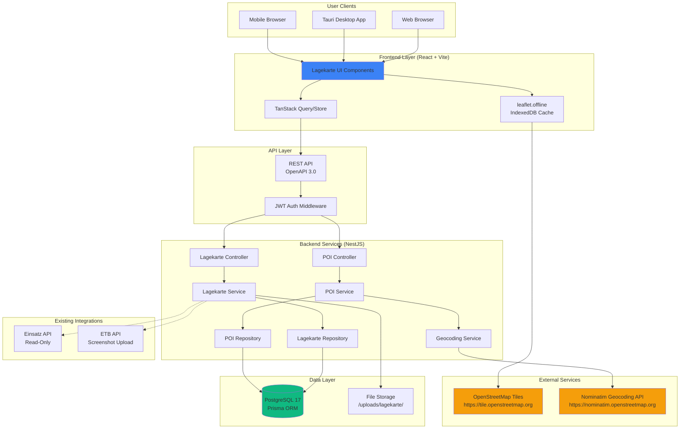

# 2. High Level Architecture

## 2.1 Technical Summary

Das Lagekarte-Feature erweitert Bluelight Hub um eine **interaktive, offline-fähige Kartenlösung** für Einsatzkoordination. Die Architektur folgt einem **Brownfield-Ansatz** mit minimaler Disruption der bestehenden Monorepo-Struktur.

**Architektonischer Stil:**
- **Frontend:** Component-Based Architecture (Atomic Design) mit React 18 + Leaflet
- **Backend:** Modular Monolith (NestJS) mit Repository Pattern
- **API-Stil:** REST API (OpenAPI 3.0) mit generiertem TypeScript-Client
- **Deployment:** Containerized Monolith (Docker Compose, Self-Hosted)

**Kritische Integrationspunkte:**
1. **Einsatz-API (Read-Only):** Lagekarte liest Einsatzorte aus bestehender `EinsatzService` ohne Breaking Changes
2. **ETB-Integration:** Screenshot-Export als neuer `EtbEintrag` (Kategorie: LAGE) mit File-Upload
3. **Offline-Tile-Caching:** Browser-seitige IndexedDB-Persistierung via `leaflet.offline`

**Wie diese Architektur PRD-Goals erreicht:**
- **G1 (Visualisierung):** Leaflet + OpenStreetMap-Tiles + POI-Marker-Layer
- **G2 (POI-Management):** Neue Backend-Entities (`Lagekarte`, `LagekartePoi`) mit CRUD-API
- **G3 (Offline):** `leaflet.offline` für Tile-Caching (IndexedDB, 30-Tage-TTL)
- **G4 (Drawing):** `leaflet-draw` für Polygone, Linien, Rechtecke
- **G5 (Multi-Layer):** Layer-Control-Component für POI-Filter und Drawing-Toggle
- **G6 (ETB-Export):** Screenshot-Service mit File-Upload zu Backend (`/uploads/lagekarte/`)

---

## 2.2 Platform and Infrastructure Choice

**Platform:** Docker Compose (Self-Hosted)

**Key Services:**
- **Backend:** NestJS-Container (Node.js 22 LTS)
- **Database:** PostgreSQL 17-Container
- **File Storage:** Docker Volume (`/uploads`)
- **Frontend:** Nginx-Container (statische React-Build)
- **Optional:** Redis-Container (für Rate-Limiting, falls nötig)

**Deployment Host and Regions:**
- **Host:** On-Premise (Bereitschafts-LAN)
- **Regions:** N/A (Lokaler Betrieb)

**Rationale:** Self-hosted Docker Compose ermöglicht volle Datenkontrolle (DSGVO-konform), LAN-Verfügbarkeit ohne Internet (Critical für Zivilschutz), und nutzt bereits vorhandene Infrastruktur ohne zusätzliche Kosten.

---

## 2.3 Repository Structure

**Structure:** Monorepo (pnpm Workspaces)

**Monorepo Tool:** pnpm 10.x

**Package Organization:**
```
bluelight-hub/
├── packages/
│   ├── frontend/              # React 18 + Vite (Atomic Design)
│   │   └── src/
│   │       └── components/
│   │           └── organisms/
│   │               └── lagekarte/  # 🆕 Neues Modul
│   ├── backend/               # NestJS 11 + Prisma 6
│   │   └── src/
│   │       └── modules/
│   │           └── lagekarte/      # 🆕 Neues Modul
│   └── shared/                # Shared Types + API-Client
│       └── client/
│           └── apis/
│               └── LagekarteApi.ts # 🆕 Generierter Client
```

**Shared Code Strategy:**
- **Types:** `packages/shared/src/types/lagekarte.types.ts`
- **Constants:** `packages/shared/src/constants/poi-types.ts`
- **API-Client:** Auto-generiert aus NestJS Swagger (`pnpm run generate-api`)

---

## 2.4 High Level Architecture Diagram



---

## 2.5 Architectural Patterns

- **Brownfield Integration Pattern:** Minimale Disruption durch isolierte Module (`lagekarte/`) mit klaren API-Boundaries - _Rationale:_ Bestehende Einsatz- und ETB-Funktionen bleiben unberührt, Zero-Risk-Deployment

- **Atomic Design Pattern (Frontend):** Hierarchische Komponenten-Struktur (Atoms → Molecules → Organisms → Templates → Pages) - _Rationale:_ Bereits etabliert im Projekt, ermöglicht Wiederverwendung und konsistente UI

- **Repository Pattern (Backend):** Abstraktion der Datenzugriffslogik (Service → Repository → Prisma) - _Rationale:_ Testbarkeit, Entkopplung von Prisma ORM, ermöglicht zukünftige DB-Migration

- **Offline-First Architecture:** Browser-seitige IndexedDB als Tile-Cache, Backend-State-Sync beim Reconnect - _Rationale:_ Critical Requirement für Funkloch-/Zivilschutz-Szenarien, kein Always-Online-Zwang

- **API Gateway Pattern:** NestJS als Single Entry Point mit zentralisierter Auth, Rate-Limiting und Logging - _Rationale:_ Bereits vorhanden, konsistente Security-Layer, vereinfacht Frontend-Integration

- **Layer-Based UI Pattern (Map):** Separierte Rendering-Layers (Tiles, POIs, Drawings, Controls) mit individueller Sichtbarkeits-Steuerung - _Rationale:_ Performance-Optimierung (nur sichtbare Layer rendern), User-Kontrolle über Informationsdichte

- **Lazy-Loading Pattern (Frontend):** Map-Bundle wird nur geladen wenn Lagekarte-Route aktiviert wird - _Rationale:_ 220KB Bundle-Size soll Einsatz-Übersicht nicht verlangsamen, NFR1 (<2s Load-Time)

- **Debounced State-Sync Pattern:** Frontend-Änderungen werden 2 Sekunden gebounced bevor Backend-Save - _Rationale:_ Reduziert API-Calls bei schnellen Drawing-Operationen, bessere UX

- **Last-Write-Wins Conflict Resolution:** Kein CRDT, einfache Timestamp-basierte Konfliktlösung - _Rationale:_ MVP-Scope, Multi-User-Editing nicht gleichzeitig (Einsatzleiter koordiniert), Komplexität vermeiden. **Note:** CRDT-Integration für Real-Time-Collaboration ist als Follow-up geplant (siehe GitHub Issue für v2)

---
