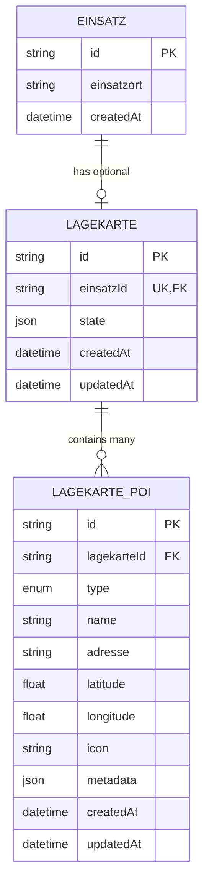

# 4. Data Models

## 4.1 Lagekarte Entity

**Purpose:** Container-Entity für alle Lagekarten-Daten eines Einsatzes. Eine Lagekarte gehört zu genau einem Einsatz (1:1-Beziehung) und enthält den GeoJSON-State für Zeichnungen (Polygone, Linien, Rechtecke).

**Key Attributes:**
- `id`: String (CUID) - Primärschlüssel
- `einsatzId`: String (CUID) - Foreign Key zu `Einsatz`, unique (1:1-Beziehung)
- `state`: Json (JSONB) - GeoJSON FeatureCollection für Zeichnungen
- `createdAt`: DateTime - Auto-Timestamp
- `updatedAt`: DateTime - Auto-Timestamp

**Relationships:**
- 1:1 mit Einsatz (via `einsatzId`)
- 1:n mit LagekartePoi (via `pois`)

### TypeScript Interface

```typescript
// packages/shared/src/types/lagekarte.types.ts
import { GeoJSON } from 'geojson';

export interface Lagekarte {
  id: string;
  einsatzId: string;
  state: GeoJSON.FeatureCollection;
  createdAt: Date;
  updatedAt: Date;
}

export interface LagekarteWithPois extends Lagekarte {
  pois: LagekartePoi[];
}
```

### Prisma Schema

```prisma
model Lagekarte {
  id        String   @id @default(cuid())
  einsatzId String   @unique
  state     Json     @db.JsonB
  createdAt DateTime @default(now())
  updatedAt DateTime @updatedAt

  einsatz   Einsatz         @relation(fields: [einsatzId], references: [id], onDelete: Cascade)
  pois      LagekartePoi[]

  @@index([einsatzId])
  @@map("lagekarte")
}
```

---

## 4.2 LagekartePoi Entity

**Purpose:** Point of Interest auf der Lagekarte. Repräsentiert einen einzelnen POI mit geografischen Koordinaten und Typ-Klassifizierung.

**Key Attributes:**
- `id`: String (CUID) - Primärschlüssel
- `lagekarteId`: String (CUID) - Foreign Key zu Lagekarte
- `type`: PoiType (Enum) - POI-Kategorisierung (13 Typen)
- `name`: String? - Optionaler Name
- `adresse`: String? - Optionale Adresse
- `latitude`: Float - GPS-Breitengrad (WGS84)
- `longitude`: Float - GPS-Längengrad (WGS84)
- `icon`: String? - Icon-Identifier
- `metadata`: Json? (JSONB) - Zusätzliche Daten

**Relationships:**
- n:1 mit Lagekarte (via `lagekarteId`)

### TypeScript Interface

```typescript
export enum PoiType {
  EINSATZORT = 'EINSATZORT',
  EINSATZABSCHNITT = 'EINSATZABSCHNITT',
  EINSATZLEITUNG = 'EINSATZLEITUNG',
  FAHRZEUG = 'FAHRZEUG',
  EINHEIT = 'EINHEIT',
  GEFAHRENQUELLE = 'GEFAHRENQUELLE',
  SPERRBEREICH = 'SPERRBEREICH',
  VERSORGUNGSPUNKT = 'VERSORGUNGSPUNKT',
  BEREITSTELLUNGSRAUM = 'BEREITSTELLUNGSRAUM',
  BEHANDLUNGSPLATZ = 'BEHANDLUNGSPLATZ',
  SAMMELSTELLE = 'SAMMELSTELLE',
  UNTERKUNFT = 'UNTERKUNFT',
  SONSTIGES = 'SONSTIGES',
}

export interface LagekartePoi {
  id: string;
  lagekarteId: string;
  type: PoiType;
  name: string | null;
  adresse: string | null;
  latitude: number;
  longitude: number;
  icon: string | null;
  metadata: Record<string, any> | null;
  createdAt: Date;
  updatedAt: Date;
}

export interface CreatePoiDto {
  type: PoiType;
  name?: string;
  adresse?: string;
  latitude?: number;
  longitude?: number;
  icon?: string;
  metadata?: Record<string, any>;
}
```

### Prisma Schema

```prisma
model LagekartePoi {
  id           String   @id @default(cuid())
  lagekarteId  String
  type         PoiType
  name         String?  @db.VarChar(255)
  adresse      String?  @db.VarChar(500)
  latitude     Float
  longitude    Float
  icon         String?  @db.VarChar(50)
  metadata     Json?    @db.JsonB

  createdAt    DateTime @default(now())
  updatedAt    DateTime @updatedAt

  lagekarte    Lagekarte @relation(fields: [lagekarteId], references: [id], onDelete: Cascade)

  @@index([lagekarteId])
  @@index([type])
  @@map("lagekarte_poi")
}

enum PoiType {
  EINSATZORT
  EINSATZABSCHNITT
  EINSATZLEITUNG
  FAHRZEUG
  EINHEIT
  GEFAHRENQUELLE
  SPERRBEREICH
  VERSORGUNGSPUNKT
  BEREITSTELLUNGSRAUM
  BEHANDLUNGSPLATZ
  SAMMELSTELLE
  UNTERKUNFT
  SONSTIGES
}
```

---

## 4.3 Entity Relationship Diagram



---
