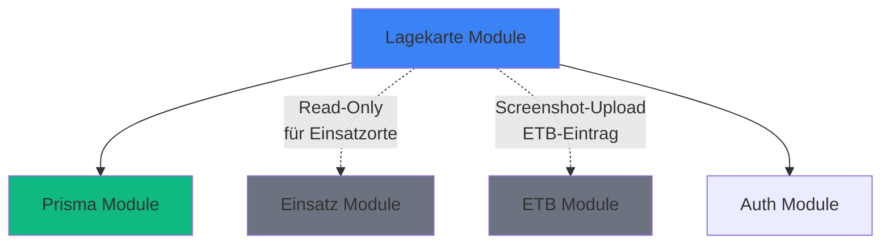
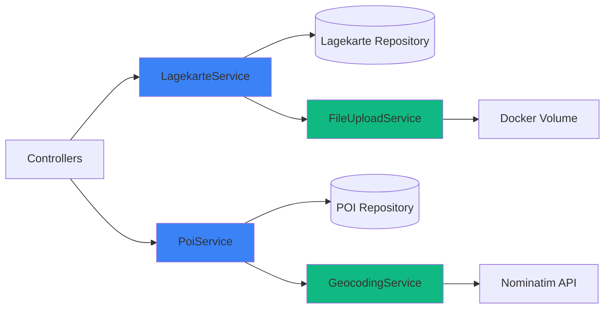
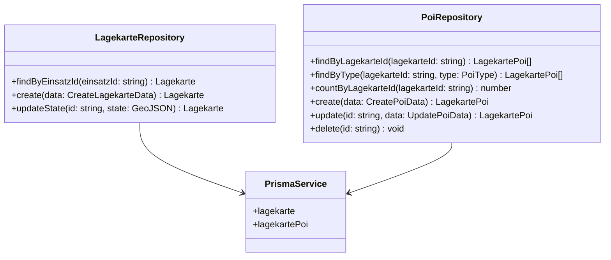
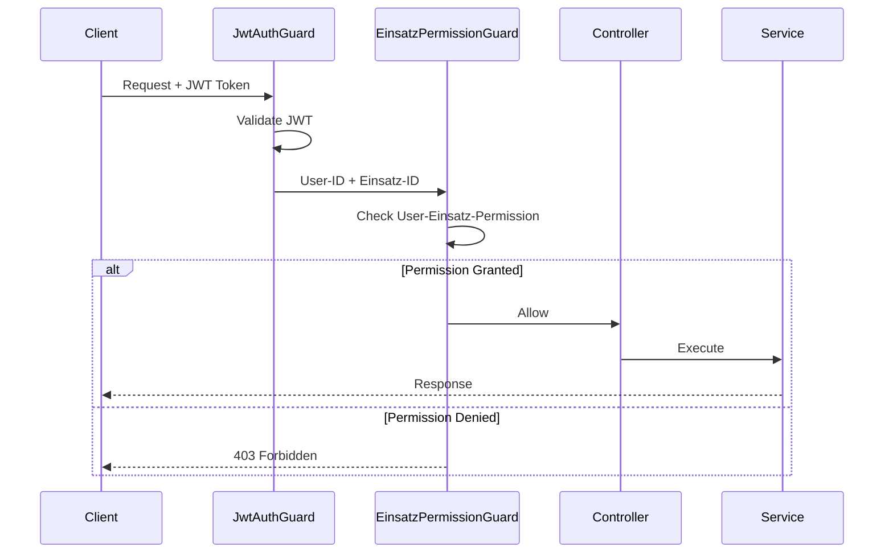
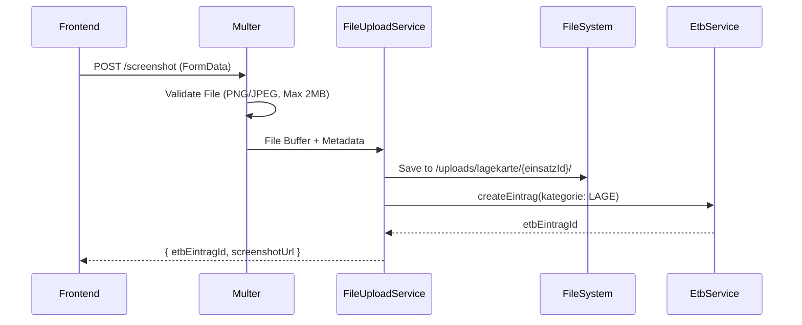

# 7. Backend Architecture

## 7.1 NestJS Module Structure

Das Lagekarte-Feature wird als **eigenständiges NestJS-Modul** implementiert, analog zu `EtbModule` und `EinsatzModule`.

### Module Organization

```
packages/backend/src/
├── lagekarte/                    # 🆕 Neues Modul
│   ├── dto/
│   │   ├── create-poi.dto.ts
│   │   ├── update-poi.dto.ts
│   │   ├── save-lagekarte-state.dto.ts
│   │   ├── geocode.dto.ts
│   │   └── lagekarte-response.dto.ts
│   ├── exceptions/               # 🆕 Custom Exceptions
│   │   ├── poi-not-found.exception.ts
│   │   └── geocoding-rate-limit.exception.ts
│   ├── lagekarte.controller.ts
│   ├── lagekarte.service.ts
│   ├── lagekarte.repository.ts
│   ├── poi.controller.ts
│   ├── poi.service.ts
│   ├── poi.repository.ts
│   ├── geocoding.service.ts      # 🆕 Nominatim-Wrapper
│   ├── file-upload.service.ts    # 🆕 Screenshot-Upload
│   └── lagekarte.module.ts
```

---

### Module Dependency Graph



**Dependency Rationale:**
- **Prisma Module:** Required (Data Access)
- **Einsatz Module:** Optional Read-Only (für Einsatzorte-Geocoding bei POI-Erstellung)
- **ETB Module:** Optional Write (für Screenshot-Export zu ETB)
- **Auth Module:** Required (JWT Guards)

**Zyklische Abhängigkeiten vermeiden:**
- Lagekarte importiert **nicht** Einsatz/ETB-Services direkt
- Integration via **Event-Emitter** oder API-Calls (Loose Coupling)

---

### Lagekarte Module Definition

```typescript
// packages/backend/src/lagekarte/lagekarte.module.ts
@Module({
  imports: [
    PrismaModule,
    HttpModule, // Für Nominatim API-Calls
    MulterModule.register({
      dest: './uploads/lagekarte',
      limits: { fileSize: 2 * 1024 * 1024 }, // 2MB Max
    }),
  ],
  controllers: [LagekarteController, PoiController],
  providers: [
    LagekarteService,
    LagekarteRepository,
    PoiService,
    PoiRepository,
    GeocodingService,
    FileUploadService,
  ],
  exports: [LagekarteService, PoiService], // Für ETB-Integration
})
export class LagekarteModule {}
```

---

## 7.2 Service Layer Architecture

Das Lagekarte-Feature benötigt **4 Services** für klare Verantwortungstrennung.

### Service Responsibility Map



---

### 7.2.1 LagekarteService

**Purpose:** Verwaltet Lagekarte-State (GeoJSON FeatureCollection) und Screenshot-Exporte.

**Key Responsibilities:**
- Lagekarte-CRUD (Lazy Creation bei erstem GET)
- GeoJSON-State-Validierung
- Screenshot-Upload zu ETB-Integration
- Event-Emitting bei Lagekarte-Änderungen (optional für Real-Time v2)

**Public Methods:**
```typescript
export class LagekarteService {
  async getLagekarteByEinsatzId(einsatzId: string): Promise<Lagekarte>;
  async saveLagekarteState(einsatzId: string, state: GeoJSON.FeatureCollection): Promise<Lagekarte>;
  async uploadScreenshot(einsatzId: string, file: Express.Multer.File): Promise<{ etbEintragId: string; screenshotUrl: string }>;
}
```

**Business Logic:**
- **Lazy Creation:** Wenn Lagekarte nicht existiert, automatisch leere Lagekarte erstellen
- **GeoJSON Validation:** Features müssen valid GeoJSON sein (Polygon, LineString, etc.)
- **Payload-Size-Limit:** GeoJSON-State max. 5MB (verhindert DoS)

---

### 7.2.2 PoiService

**Purpose:** POI-CRUD-Operationen mit Auto-Geocoding-Integration.

**Key Responsibilities:**
- POI-CRUD (Create, Update, Delete)
- Auto-Geocoding wenn Adresse angegeben aber keine Koordinaten
- POI-Typ-Validierung (13 PoiType Enum-Werte)
- POI-Count-Limits (Max. 1000 POIs pro Lagekarte)

**Public Methods:**
```typescript
export class PoiService {
  async getPoisByEinsatzId(einsatzId: string, type?: PoiType): Promise<LagekartePoi[]>;
  async createPoi(einsatzId: string, dto: CreatePoiDto): Promise<LagekartePoi>;
  async updatePoi(poiId: string, dto: UpdatePoiDto): Promise<LagekartePoi>;
  async deletePoi(poiId: string): Promise<void>;
}
```

**Auto-Geocoding Logic:**
```typescript
async createPoi(einsatzId: string, dto: CreatePoiDto): Promise<LagekartePoi> {
  // Wenn Adresse vorhanden aber keine Koordinaten: Auto-Geocode
  if (dto.adresse && (!dto.latitude || !dto.longitude)) {
    const geocoded = await this.geocodingService.geocodeAddress(dto.adresse);
    dto.latitude = geocoded.latitude;
    dto.longitude = geocoded.longitude;
  }

  // Validiere POI-Count-Limit
  const existingCount = await this.poiRepository.countByLagekarteId(lagekarteId);
  if (existingCount >= 1000) {
    throw new BadRequestException('Max. 1000 POIs pro Lagekarte erreicht');
  }

  return this.poiRepository.create({ ...dto, lagekarteId });
}
```

---

### 7.2.3 GeocodingService

**Purpose:** Wrapper für Nominatim API mit Rate-Limiting (1 req/s).

**Key Responsibilities:**
- Adresse → Koordinaten (Geocoding)
- In-Memory Rate-Limiting (1 Request/Sekunde)
- LRU-Cache für häufige Adressen (1000 Einträge, 7 Tage TTL)
- Error-Handling für Nominatim-Ausfälle

**Public Methods:**
```typescript
export class GeocodingService {
  async geocodeAddress(address: string): Promise<{ latitude: number; longitude: number; displayName: string }>;
}
```

**Rate-Limiting-Strategie (In-Memory):**
```typescript
private lastRequestTime: number = 0;
private readonly MIN_REQUEST_INTERVAL = 1000; // 1 Sekunde

async geocodeAddress(address: string): Promise<GeocodeResult> {
  // LRU-Cache-Check
  const cached = this.cache.get(address);
  if (cached) return cached;

  // Rate-Limiting: Warte falls nötig
  const now = Date.now();
  const timeSinceLastRequest = now - this.lastRequestTime;
  if (timeSinceLastRequest < this.MIN_REQUEST_INTERVAL) {
    await this.sleep(this.MIN_REQUEST_INTERVAL - timeSinceLastRequest);
  }

  // Nominatim API-Call
  const result = await this.httpService.get('https://nominatim.openstreetmap.org/search', {
    params: { q: address, format: 'json', limit: 1 },
  });

  this.lastRequestTime = Date.now();
  this.cache.set(address, result); // LRU-Cache speichern
  return result;
}
```

**LRU-Cache-Implementation:**
- Library: `lru-cache` (npm)
- Max Size: 1000 Einträge
- TTL: 7 Tage
- Speichert: `{ address: string → { lat, lon, displayName } }`

---

### 7.2.4 FileUploadService

**Purpose:** Screenshot-Upload zu Docker-Volume + ETB-Integration.

**Key Responsibilities:**
- File-Validation (PNG/JPEG, Max 2MB)
- File-Storage zu `/uploads/lagekarte/{einsatzId}/{filename}`
- ETB-Eintrag-Erstellung (Kategorie: LAGE, Attachment: Screenshot-URL)

**Public Methods:**
```typescript
export class FileUploadService {
  async uploadScreenshot(einsatzId: string, file: Express.Multer.File): Promise<{ filePath: string; etbEintragId: string }>;
}
```

**Screenshot-Upload-Flow:**
1. **File-Validation** (Multer FileInterceptor)
2. **Storage** zu `/uploads/lagekarte/{einsatzId}/{timestamp}-{cuid}.png`
3. **ETB-Integration** via `EtbService.createEintrag()`:
   ```typescript
   await this.etbService.createEintrag(etbId, {
     kategorie: EtbKategorie.LAGE,
     text: 'Lagekarte-Screenshot exportiert',
     metadata: {
       screenshotUrl: `/uploads/lagekarte/${einsatzId}/${filename}`,
       exportedAt: new Date().toISOString(),
     },
   });
   ```

---

## 7.3 Repository Pattern

**Rationale:** Prisma-Abstraktion für Testbarkeit und mögliche DB-Migration.

### Repository Architecture



---

### 7.3.1 LagekarteRepository

**Purpose:** Data Access Layer für Lagekarte-Entity.

**Key Methods:**
```typescript
@Injectable()
export class LagekarteRepository {
  constructor(private readonly prisma: PrismaService) {}

  async findByEinsatzId(einsatzId: string): Promise<Lagekarte | null> {
    return this.prisma.lagekarte.findUnique({
      where: { einsatzId },
      include: { pois: true },
    });
  }

  async create(data: { einsatzId: string; state: GeoJSON.FeatureCollection }): Promise<Lagekarte> {
    return this.prisma.lagekarte.create({
      data: {
        einsatzId: data.einsatzId,
        state: data.state as Prisma.InputJsonValue,
      },
    });
  }

  async updateState(id: string, state: GeoJSON.FeatureCollection): Promise<Lagekarte> {
    return this.prisma.lagekarte.update({
      where: { id },
      data: {
        state: state as Prisma.InputJsonValue,
        updatedAt: new Date(),
      },
    });
  }
}
```

---

### 7.3.2 PoiRepository

**Purpose:** Data Access Layer für POI-Entity mit Batch-Operations.

**Key Methods:**
```typescript
@Injectable()
export class PoiRepository {
  constructor(private readonly prisma: PrismaService) {}

  async findByLagekarteId(lagekarteId: string, type?: PoiType): Promise<LagekartePoi[]> {
    return this.prisma.lagekartePoi.findMany({
      where: {
        lagekarteId,
        ...(type && { type }),
      },
      orderBy: { createdAt: 'desc' },
    });
  }

  async countByLagekarteId(lagekarteId: string): Promise<number> {
    return this.prisma.lagekartePoi.count({
      where: { lagekarteId },
    });
  }

  async create(data: CreatePoiData): Promise<LagekartePoi> {
    return this.prisma.lagekartePoi.create({ data });
  }

  async update(id: string, data: UpdatePoiData): Promise<LagekartePoi> {
    return this.prisma.lagekartePoi.update({
      where: { id },
      data: {
        ...data,
        updatedAt: new Date(),
      },
    });
  }

  async delete(id: string): Promise<void> {
    await this.prisma.lagekartePoi.delete({ where: { id } });
  }
}
```

---

## 7.4 Controller Layer (REST Endpoints)

### 7.4.1 LagekarteController

**Purpose:** REST-Endpoints für Lagekarte-State und Screenshot-Upload.

```typescript
@Controller('einsatz/:einsatzId/lagekarte')
@UseGuards(JwtAuthGuard)
@ApiTags('Lagekarte')
export class LagekarteController {
  constructor(
    private readonly lagekarteService: LagekarteService,
    private readonly fileUploadService: FileUploadService,
  ) {}

  @Get()
  @ApiOperation({ summary: 'Get Lagekarte by Einsatz ID' })
  async getLagekarte(@Param('einsatzId') einsatzId: string) {
    return this.lagekarteService.getLagekarteByEinsatzId(einsatzId);
  }

  @Post()
  @ApiOperation({ summary: 'Save Lagekarte State' })
  async saveLagekarteState(
    @Param('einsatzId') einsatzId: string,
    @Body() dto: SaveLagekarteStateDto,
  ) {
    return this.lagekarteService.saveLagekarteState(einsatzId, dto.state);
  }

  @Post('screenshot')
  @UseInterceptors(FileInterceptor('file'))
  @ApiOperation({ summary: 'Upload Screenshot for ETB Export' })
  async uploadScreenshot(
    @Param('einsatzId') einsatzId: string,
    @UploadedFile() file: Express.Multer.File,
  ) {
    return this.fileUploadService.uploadScreenshot(einsatzId, file);
  }
}
```

---

### 7.4.2 PoiController

**Purpose:** REST-Endpoints für POI-CRUD-Operationen.

```typescript
@Controller('einsatz/:einsatzId/lagekarte/pois')
@UseGuards(JwtAuthGuard)
@ApiTags('POI')
export class PoiController {
  constructor(private readonly poiService: PoiService) {}

  @Get()
  @ApiOperation({ summary: 'Get all POIs' })
  async getPois(
    @Param('einsatzId') einsatzId: string,
    @Query('type') type?: PoiType,
  ) {
    return this.poiService.getPoisByEinsatzId(einsatzId, type);
  }

  @Post()
  @ApiOperation({ summary: 'Create new POI' })
  async createPoi(
    @Param('einsatzId') einsatzId: string,
    @Body() dto: CreatePoiDto,
  ) {
    return this.poiService.createPoi(einsatzId, dto);
  }

  @Put(':poiId')
  @ApiOperation({ summary: 'Update POI' })
  async updatePoi(
    @Param('poiId') poiId: string,
    @Body() dto: UpdatePoiDto,
  ) {
    return this.poiService.updatePoi(poiId, dto);
  }

  @Delete(':poiId')
  @ApiOperation({ summary: 'Delete POI' })
  @HttpCode(204)
  async deletePoi(@Param('poiId') poiId: string) {
    return this.poiService.deletePoi(poiId);
  }
}
```

---

## 7.5 DTOs & Validation

**Validation-Library:** Zod (Alternative zu class-validator, bereits im Projekt verwendet).

### Key DTOs

```typescript
// CreatePoiDto
export const CreatePoiDtoSchema = z.object({
  type: z.nativeEnum(PoiType),
  name: z.string().max(255).optional(),
  adresse: z.string().max(500).optional(),
  latitude: z.number().min(-90).max(90).optional(),
  longitude: z.number().min(-180).max(180).optional(),
  icon: z.string().max(50).optional(),
  metadata: z.record(z.unknown()).optional(),
});

export type CreatePoiDto = z.infer<typeof CreatePoiDtoSchema>;

// SaveLagekarteStateDto
export const SaveLagekarteStateDtoSchema = z.object({
  state: z.object({
    type: z.literal('FeatureCollection'),
    features: z.array(z.unknown()), // GeoJSON-Validation
  }),
});

export type SaveLagekarteStateDto = z.infer<typeof SaveLagekarteStateDtoSchema>;
```

**Zod Validation Pipe:**
```typescript
@Post()
async saveLagekarteState(
  @Param('einsatzId') einsatzId: string,
  @Body(new ZodValidationPipe(SaveLagekarteStateDtoSchema)) dto: SaveLagekarteStateDto,
) {
  return this.lagekarteService.saveLagekarteState(einsatzId, dto.state);
}
```

---

## 7.6 Auth Integration

**Strategy:** Wiederverwendung der bestehenden JWT-Guards aus `AuthModule`.

### Permission-Check-Flow



**Guard-Implementation:**
```typescript
@Controller('einsatz/:einsatzId/lagekarte')
@UseGuards(JwtAuthGuard, EinsatzPermissionGuard)
export class LagekarteController {
  // Controller nutzt bestehende Guards
  // EinsatzPermissionGuard prüft: User hat Zugriff auf Einsatz?
}
```

**Keine neuen Permissions erforderlich:**
- Lagekarte nutzt bestehende Einsatz-Permissions
- Wenn User Zugriff auf Einsatz hat → Zugriff auf Lagekarte
- Rollenbasiert: Einsatzleiter kann POIs löschen, Helfer nur erstellen

---

## 7.7 File Upload (Screenshot)

**Implementation:** Multer Middleware + Docker-Volume-Storage.

### Screenshot-Upload-Flow



**Multer Configuration:**
```typescript
MulterModule.register({
  dest: './uploads/lagekarte',
  limits: {
    fileSize: 2 * 1024 * 1024, // 2MB
    files: 1, // Nur 1 File pro Request
  },
  fileFilter: (req, file, cb) => {
    // Nur PNG/JPEG erlaubt
    if (!['image/png', 'image/jpeg'].includes(file.mimetype)) {
      return cb(new BadRequestException('Nur PNG/JPEG erlaubt'), false);
    }
    cb(null, true);
  },
})
```

**File-Storage-Path:**
- Development: `./uploads/lagekarte/{einsatzId}/{timestamp}-{cuid}.png`
- Production: Docker Volume Mount `/uploads/lagekarte/`

---

## 7.8 Error Handling (Backend)

**Strategy:** Custom Exceptions + NestJS Exception Filters.

### Custom Exceptions

```typescript
// packages/backend/src/lagekarte/exceptions/poi-not-found.exception.ts
export class PoiNotFoundException extends NotFoundException {
  constructor(poiId: string) {
    super(`POI mit ID ${poiId} nicht gefunden`, 'POI_NOT_FOUND');
  }
}

// packages/backend/src/lagekarte/exceptions/geocoding-rate-limit.exception.ts
export class GeocodingRateLimitException extends HttpException {
  constructor() {
    super('Geocoding-Rate-Limit erreicht (1 req/s)', HttpStatus.TOO_MANY_REQUESTS);
  }
}
```

### Error Response Format

```typescript
// Standardisiertes Error-Response-Format
{
  "statusCode": 404,
  "message": "POI mit ID abc123 nicht gefunden",
  "error": "POI_NOT_FOUND",
  "timestamp": "2025-10-09T12:00:00.000Z",
  "path": "/api/v1/einsatz/xyz/lagekarte/pois/abc123"
}
```

**Logging:**
```typescript
export class PoiService {
  private readonly logger = new Logger(PoiService.name);

  async deletePoi(poiId: string): Promise<void> {
    try {
      await this.poiRepository.delete(poiId);
      this.logger.log(`POI ${poiId} gelöscht`);
    } catch (error) {
      this.logger.error(`POI-Löschung fehlgeschlagen: ${poiId}`, error.stack);
      throw new PoiNotFoundException(poiId);
    }
  }
}
```

---
