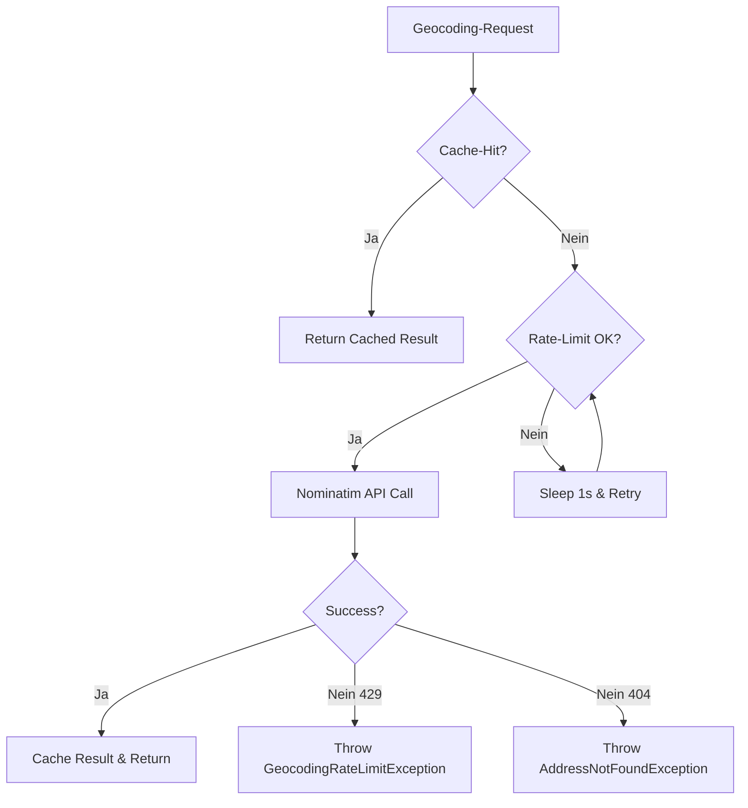

# 8. External APIs

## 8.1 Nominatim Geocoding API

**Service:** Nominatim (OpenStreetMap Geocoding-Service)

**Base URL:** `https://nominatim.openstreetmap.org`

**Purpose:** Konvertiert Adressen zu GPS-Koordinaten (Geocoding) für POI-Erstellung.

---

### 8.1.1 API Specification

**Endpoint:** `GET /search`

**Query Parameters:**
```typescript
{
  q: string;           // Adresse (z.B. "Musterstraße 1, 12345 Berlin")
  format: 'json';      // Response-Format (json/xml)
  limit: number;       // Max. Anzahl Ergebnisse (Standard: 1)
  addressdetails: 0|1; // Strukturierte Adress-Details (optional)
}
```

**Response-Format:**
```typescript
[
  {
    lat: "52.520008",
    lon: "13.404954",
    display_name: "Musterstraße 1, 12345 Berlin, Deutschland",
    type: "house",
    importance: 0.8,
    boundingbox: ["52.519", "52.521", "13.404", "13.406"]
  }
]
```

---

### 8.1.2 Rate-Limiting & Usage Policy

**Nominatim Usage Policy (https://operations.osmfoundation.org/policies/nominatim/):**
- **Rate-Limit:** Max. 1 Request/Sekunde
- **User-Agent:** Pflichtfeld (z.B. "Bluelight-Hub/1.0")
- **Bulk-Geocoding:** Verboten (keine automatisierten Batch-Requests)
- **Caching:** Empfohlen (24 Stunden+)

**Implementation in GeocodingService:**
- In-Memory Rate-Limiter (siehe Section 7.2.3)
- LRU-Cache (1000 Einträge, 7 Tage TTL)
- User-Agent-Header: `Bluelight-Hub/1.0 (contact@bluelight-hub.de)`

**Fallback-Strategy bei Rate-Limit-Exceed:**


---

### 8.1.3 Error Handling

**HTTP Status Codes:**
- `200 OK` - Geocoding erfolgreich
- `404 Not Found` - Adresse nicht gefunden
- `429 Too Many Requests` - Rate-Limit überschritten
- `500 Internal Server Error` - Nominatim-Ausfall

**Frontend-Fallback:**
```typescript
// Wenn Geocoding fehlschlägt: User kann manuelle Koordinaten-Eingabe nutzen
if (geocodingError) {
  toast.error('Adresse nicht gefunden. Bitte manuell Koordinaten eingeben.');
}
```

---

### 8.1.4 Alternative Geocoding-Services (v2)

Für zukünftige Skalierung oder Nominatim-Ausfälle:

| **Service** | **Rate-Limit** | **Kosten** | **Vorteile** |
|------------|---------------|-----------|-------------|
| **Nominatim** | 1 req/s | Kostenlos | Open-Source, DSGVO-konform |
| **Photon (Komoot)** | Keine | Kostenlos | Self-hosted möglich, schneller |
| **Pelias** | Keine | Kostenlos | Self-hosted, Multi-Provider |
| **Google Maps Geocoding** | 50 req/s | €5/1000 req | Hohe Genauigkeit, global |

**Empfehlung für Produktionsumgebung:**
- **Self-Hosted Photon** (Docker-Container) für volle Kontrolle und kein Rate-Limiting
- Nominatim als Public-Fallback

---

## 8.2 OpenStreetMap Tiles

**Service:** OpenStreetMap Tile-Server

**Base URL:** `https://tile.openstreetmap.org/{z}/{x}/{y}.png`

**Purpose:** Raster-Tiles für Leaflet-Map-Rendering.

---

### 8.2.1 Tile URL Schema

**URL-Pattern:**
```
https://tile.openstreetmap.org/{z}/{x}/{y}.png
```

**Parameters:**
- `{z}`: Zoom-Level (0-19, wobei 19 = maximale Detail-Stufe)
- `{x}`: Tile-X-Koordinate (0 bis 2^z - 1)
- `{y}`: Tile-Y-Koordinate (0 bis 2^z - 1)

**Beispiel:**
```
https://tile.openstreetmap.org/13/4400/2686.png
```
- Zoom: 13 (Stadt-Niveau)
- X: 4400
- Y: 2686
- → Tile für Berlin-Zentrum

---

### 8.2.2 Tile Usage Policy

**OSM Tile Usage Policy (https://operations.osmfoundation.org/policies/tiles/):**
- **Rate-Limit:** Max. 2 Downloads/Sekunde (pro Client-IP)
- **Bulk-Download:** Verboten (kein automatischer Tile-Scraper)
- **Caching:** Empfohlen (HTTP-Cache-Headers beachten)
- **User-Agent:** Optional, aber empfohlen
- **Commercial Usage:** Erlaubt (Open Data License)

**leaflet.offline Tile-Caching:**
- Speichert Tiles in IndexedDB (Browser-seitig)
- TTL: 30 Tage (konfigurierbar)
- Max. Storage: 50MB (Browser-Limit)

---

### 8.2.3 Alternative Tile-Providers

**Option A: Self-Hosted Tile-Server (für LAN-Offline-Betrieb)**

**Technologie:** OpenMapTiles + Tileserver GL (Docker)

**Setup:**
```bash
# Docker Compose
docker run -d \
  -v $(pwd)/data:/data \
  -p 8080:80 \
  maptiler/tileserver-gl
```

**Vorteile:**
- ✅ Volle Offline-Fähigkeit (kein Internet nötig)
- ✅ Kein Rate-Limiting
- ✅ DSGVO-konform (keine Drittanbieter-Anfragen)
- ✅ Custom Styling möglich

**Nachteile:**
- ❌ Initiale Tile-Daten: ~50GB für Deutschland
- ❌ Wartungsaufwand (Updates)

---

**Option B: CDN Tile-Providers (für Online-Betrieb)**

| **Provider** | **URL-Pattern** | **Rate-Limit** | **Kosten** |
|-------------|----------------|---------------|-----------|
| **OSM** | `tile.openstreetmap.org` | 2 req/s | Kostenlos |
| **MapTiler** | `api.maptiler.com` | 100k req/Monat | €0-€49/Monat |
| **Thunderforest** | `tile.thunderforest.com` | 150k req/Monat | €0-€20/Monat |
| **Stamen** | `tiles.stadiamaps.com` | 200k req/Monat | Kostenlos |

**Empfehlung:**
- **MVP:** OSM Public Tiles + leaflet.offline Caching
- **Production:** Self-Hosted Tile-Server (Docker Compose Extension)

---

### 8.2.4 Tile-Caching-Strategie

**Frontend (leaflet.offline):**
```typescript
import { TileLayerOffline } from 'react-leaflet-offline';

<TileLayerOffline
  url="https://tile.openstreetmap.org/{z}/{x}/{y}.png"
  attribution='&copy; OpenStreetMap contributors'
  maxZoom={19}
  // Offline-Caching via IndexedDB
  onAdd={(layer) => {
    layer.on('tileerror', (e) => {
      // Fallback zu cached Tile
      if (offlineMode) {
        e.tile.src = await offlineTileStorage.getItem(e.tile.src);
      }
    });
  }}
/>
```

**Tile-Download für Offline-Nutzung:**
```typescript
// User kann Gebiet für Offline-Download markieren
async function downloadTilesForArea(bounds: L.LatLngBounds, zoomLevels: number[]) {
  const tileUrls = calculateTileUrlsForBounds(bounds, zoomLevels);

  // Download mit Rate-Limiting (2 req/s)
  for (const url of tileUrls) {
    await downloadTile(url);
    await sleep(500); // 2 req/s = 500ms Pause
  }

  toast.success(`${tileUrls.length} Kacheln heruntergeladen`);
}
```

**Estimated Tile-Counts:**
| **Gebiet** | **Zoom-Levels** | **Tile-Count** | **Download-Zeit (2 req/s)** |
|-----------|----------------|---------------|----------------------------|
| Stadt (10km²) | 13-16 | ~200 Tiles | ~100 Sekunden |
| Landkreis (500km²) | 11-15 | ~1500 Tiles | ~12 Minuten |
| Bundesland | 8-13 | ~10000 Tiles | ~83 Minuten |

---
