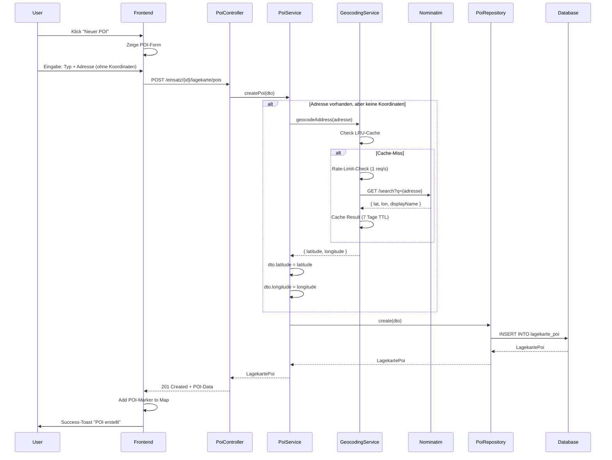
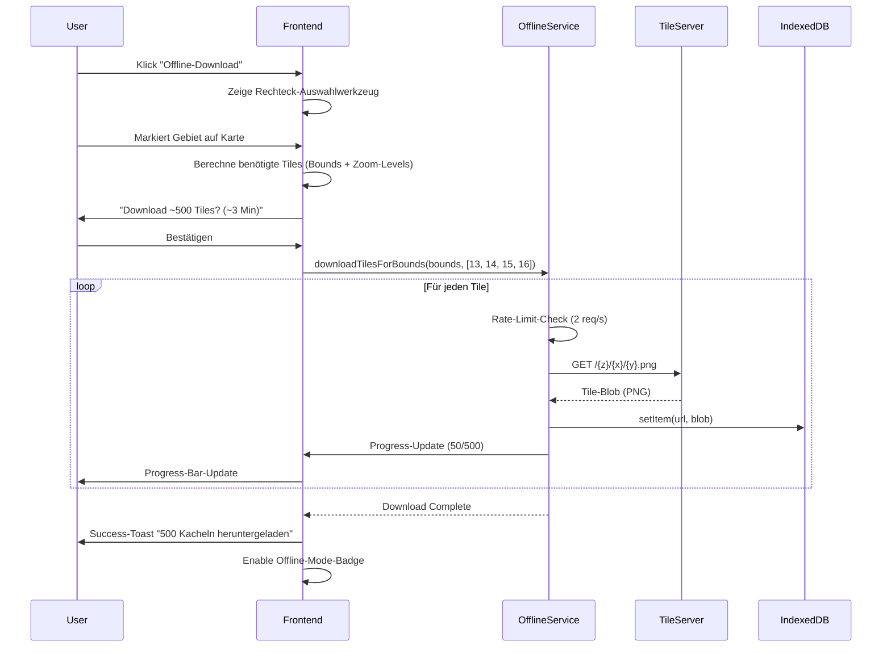
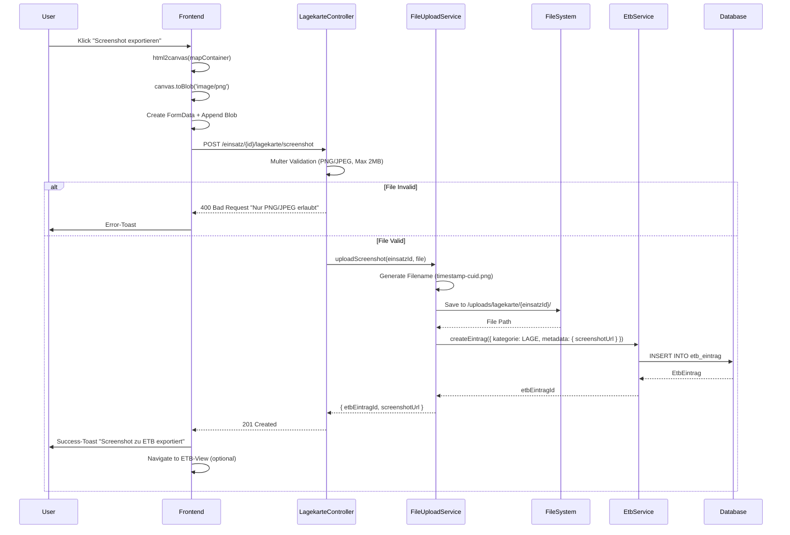
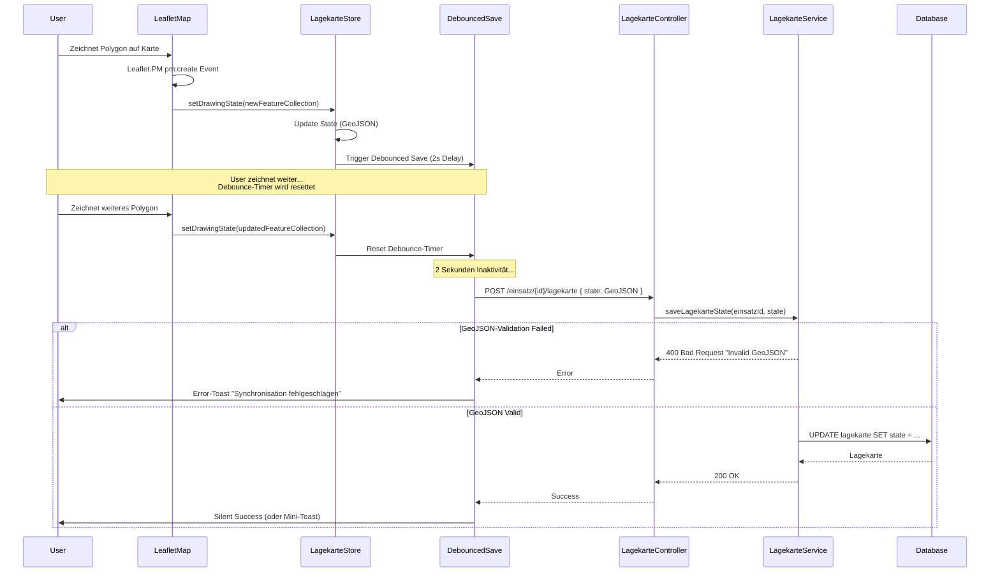

# 9. Core Workflows (Sequence Diagrams)

## 9.1 POI-Creation mit Auto-Geocoding

**Workflow:** User erstellt POI mit Adresse → Backend geocoded automatisch → POI wird mit Koordinaten gespeichert.

**Fehlerszenarien:**
- **Adresse nicht gefunden (404):** Frontend zeigt Error-Toast → User kann manuelle Koordinaten eingeben
- **Rate-Limit (429):** Backend wartet automatisch 1s und retried → User sieht Loading-State

---

## 9.2 Offline-Tile-Download-Flow

**Workflow:** User markiert Gebiet für Offline-Download → Frontend lädt Tiles herunter → Tiles werden in IndexedDB gecacht.

**Performance:**
- **Rate-Limiting:** 2 Tiles/Sekunde = 120 Tiles/Minute
- **Geschätzte Download-Zeit:** 500 Tiles ≈ 4 Minuten
- **Speicher:** ~20KB pro Tile → 500 Tiles = ~10MB

---

## 9.3 Screenshot-Export zu ETB

**Workflow:** User exportiert Lagekarte als Screenshot → Frontend nimmt Screenshot → Backend speichert File → ETB-Eintrag wird erstellt.

**Technische Details:**
- **html2canvas:** Konvertiert DOM-Element (Map) zu Canvas
- **Canvas.toBlob():** Generiert PNG-Blob (ca. 500KB-1MB)
- **FormData:** Multipart-Upload zu Backend
- **ETB-Kategorie:** `LAGE` (für Lagekarte-Screenshots reserviert)

---

## 9.4 Drawing-State-Sync (Frontend ↔ Backend)

**Workflow:** User zeichnet auf Karte → Frontend debounced Backend-Sync (2s) → Backend speichert GeoJSON-State.

**Debouncing-Rationale:**
- **Performance:** Verhindert API-Flood bei schnellem Zeichnen
- **User Experience:** User muss nicht auf Backend-Save warten
- **Conflict Resolution:** Last-Write-Wins (für MVP ausreichend)

**Optimierungen für v2:**
- **WebSocket-basierte Real-Time-Sync** für Multi-User-Editing
- **CRDT (Conflict-Free Replicated Data Types)** für automatische Merge-Konflikte

---
