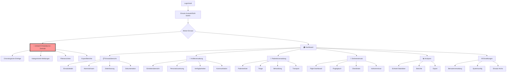
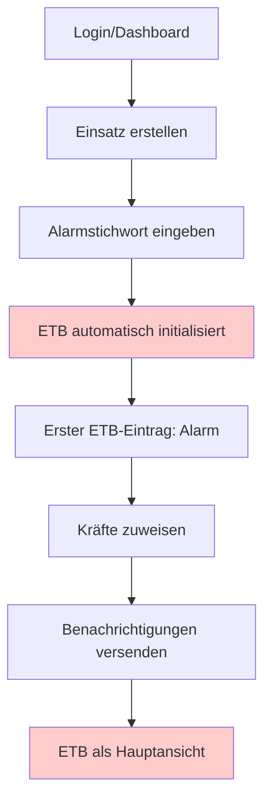
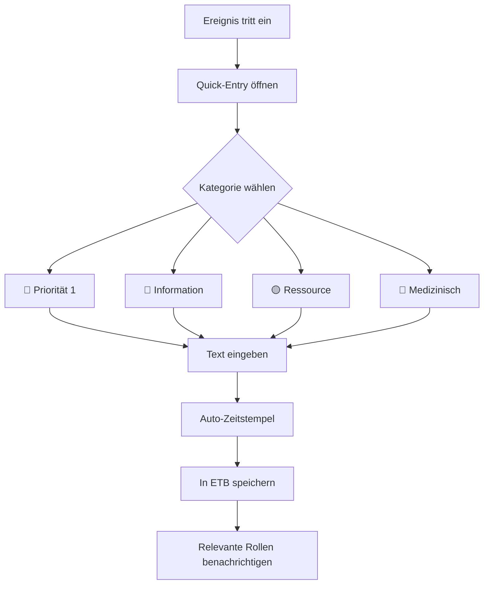
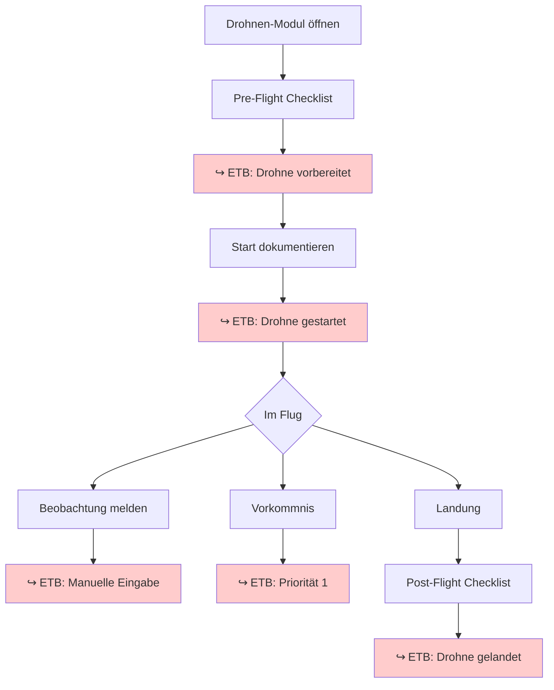

# Bluelight Hub UI/UX Specification

This document defines the user experience goals, information architecture, user flows, and visual design specifications
for Bluelight Hub's user interface. It serves as the foundation for visual design and frontend development, ensuring a
cohesive and user-centered experience.

## Overall UX Goals & Principles

### Target User Personas

#### 🎖️ Einsatzleiter

- **Rolle:** Gesamtverantwortung für den Einsatz
- **Bedürfnisse:** Vollständiger Überblick über alle Aspekte des Einsatzes, Entscheidungsgrundlagen, Ressourcenübersicht
- **Kontext:** Stationär am Führungsfahrzeug oder mobil vor Ort
- **Kritische Features:** Dashboard mit Gesamtlage, Ressourcenmanagement, Kommunikationsübersicht

#### 👥 Gruppenführer

- **Rolle:** Führung einzelner Einsatzgruppen/Abschnitte
- **Bedürfnisse:** Überblick über zugewiesenen Bereich, Kommunikation mit Einsatzleitung und eigener Gruppe
- **Kontext:** Mobil im Einsatzgebiet unterwegs
- **Kritische Features:** Gruppenspezifische Ansichten, Aufgabenverwaltung, Status-Updates

#### 📋 FüKw-Personal (Führungskraftwagen)

- **Rolle:** Hauptnutzer des Systems - Datenerfassung, Analyse, Dokumentation
- **Bedürfnisse:** Effiziente Dateneingabe, Analysewerkzeuge, Berichtserstellung
- **Kontext:** Stationär im Führungsfahrzeug, mehrere Monitore verfügbar
- **Kritische Features:** Vollzugriff auf alle Module, erweiterte Eingabemasken, Analysefunktionen

#### 🏥 Helfer/Bearbeiter (z.B. Behandlungszelt)

- **Rolle:** Spezialisierte Dateneingabe in begrenztem Bereich
- **Bedürfnisse:** Einfache, fokussierte Eingabemasken ohne Ablenkung
- **Kontext:** Stressige Umgebung, wenig Zeit, möglicherweise medizinische Handschuhe
- **Kritische Features:** Vereinfachte Patientenverwaltung, große Touch-Targets, minimale Navigation

#### 🚁 Flight Operator (Drohnenpilot)

- **Rolle:** Steuerung und Dokumentation von Drohneneinsätzen
- **Bedürfnisse:** Flugdokumentation, Checklisten-Abarbeitung, Incident-Reporting, Echtzeit-Telemetrie
- **Kontext:** Konzentrierte Arbeit während Flugoperationen, oft außerhalb mit Tablet/Laptop
- **Kritische Features:** Fluglogbuch, Pre/Post-Flight Checklisten, Vorkommnis-Dokumentation, Drohnenstatus-Tracking

#### 📺 Drohnen-Dashboard Viewer

- **Rolle:** Passive Beobachter des Drohneneinsatzes
- **Bedürfnisse:** Live-Überblick über Drohnenoperationen ohne Eingriffsmöglichkeit
- **Kontext:** Großbildschirm im FüKw oder mobile Geräte im Feld
- **Kritische Features:** Live-Video-Feed, Flugstatus, Einsatzdauer, Read-only Ansicht

#### ⚙️ Administratoren

- **Rolle:** Systemverwaltung zwischen Einsätzen
- **Bedürfnisse:** Benutzerverwaltung, Systemkonfiguration, Nachbereitung
- **Kontext:** Büroumgebung, außerhalb aktiver Einsätze
- **Kritische Features:** Admin-Panel, Rechteverwaltung, Archivierung, Auswertungen

### Usability Goals

- **Rollenbasierte Interfaces:** Jede Nutzergruppe sieht nur relevante Funktionen
- **Ein-Einsatz-Fokus:** System optimiert für EINEN aktiven Einsatz (keine Multi-Einsatz-Verwaltung)
- **Stress-resistente Bedienung:** Große Buttons für Handschuh-Bedienung, klare Farbcodierung
- **Offline-Fähigkeit:** Kritische Funktionen müssen auch bei Verbindungsproblemen funktionieren
- **Schnelle Kontextwechsel:** Zwischen verschiedenen Ansichten ohne Datenverlust wechseln
- **Geschwindigkeit:** Kritische Aktionen in unter 3 Sekunden ausführbar
- **Fehlerprävention:** Klare Bestätigungen für kritische Statusänderungen

### Design Principles

1. **Progressive Disclosure nach Rolle** - FüKw sieht alles, Helfer nur das Nötige
2. **Ein-Einsatz-Paradigma** - Keine Ablenkung durch andere Einsätze
3. **Kontext-sensitive Vereinfachung** - Interface passt sich an Nutzerrolle an
4. **Robuste Dateneingabe** - Automatisches Speichern, Fehlertoleranz
5. **Klare Hierarchie** - Befehlskette muss in UI erkennbar sein
6. **Klarheit in Krisensituationen** - Jede Information muss sofort verständlich sein
7. **Mobile-First** - Optimiert für Nutzung im Feld auf mobilen Geräten

### Change Log

| Date       | Version | Description                 | Author            |
|------------|---------|-----------------------------|-------------------|
| 2025-09-01 | 1.0     | Initial UI/UX Specification | Sally (UX Expert) |

## Information Architecture (IA)

### Site Map / Screen Inventory



### Navigation Structure

**Primary Navigation:** Rollenbasierte Hauptnavigation mit Zugriff auf Module basierend auf Nutzerrechten

**Secondary Navigation:** Kontext-Sidebar mit Schnellzugriff auf häufige Aktionen, Status-Bar mit permanenter Anzeige
von Einsatz-Status

**Breadcrumb Strategy:** Immer sichtbar als `[Einsatz-Name] > [Modul] > [Unterseite]`, klickbar für schnelle Navigation

## User Flows

### Flow: Einsatz-Start und ETB-Initialisierung

**User Goal:** Neuen Einsatz starten und Einsatztagebuch initialisieren

**Entry Points:** Login → "Neuer Einsatz" Button, Dashboard → Quick-Action

**Success Criteria:** Einsatz angelegt, ETB initialisiert, alle Kräfte informiert

#### Flow Diagram



#### Edge Cases & Error Handling:

- Doppelte Einsatz-Erstellung wird verhindert
- Offline-Start möglich mit späterer Synchronisation
- Fehlende Pflichtfelder werden validiert

**Notes:** Soft-Switch zwischen Einsätzen wird unterstützt, Trainingsmodus in Entwicklung (Issue #207)

### Flow: ETB-Eintrag durch FüKw-Personal

**User Goal:** Wichtiges Ereignis im Einsatztagebuch dokumentieren

**Entry Points:** ETB-Hauptansicht, Quick-Entry Widget, Keyboard-Shortcut (Strg+E)

**Success Criteria:** Eintrag mit Zeitstempel gespeichert und kategorisiert

#### Flow Diagram



#### Edge Cases & Error Handling:

- Offline-Einträge werden lokal gespeichert
- Gleichzeitige Einträge durch Zeitstempel-Priorisierung aufgelöst
- 5-Minuten-Editier-Fenster mit Audit-Trail

### Flow: Drohnen-Flug mit ETB-Integration

**User Goal:** Drohnenflug durchführen und automatisch im ETB dokumentieren

**Entry Points:** Drohnen-Modul → "Neuer Flug", Dashboard → Drohnen-Widget

**Success Criteria:** Flugdaten automatisch im ETB, Checklisten abgearbeitet

#### Flow Diagram



#### Edge Cases & Error Handling:

- Verbindungsabbruch: Lokale Speicherung
- Drohnenverlust: Automatischer ETB-Eintrag mit letzter Position
- Akku-Warnung: Prioritäts-ETB-Eintrag

**Notes:** Integration mit Wetterdaten geplant, Telemetrie-Anbindung in Entwicklung

## Wireframes & Mockups

**Primary Design Files:** [Figma/Sketch Link - TBD]

### Key Screen Layouts

#### Einsatztagebuch (ETB) Hauptansicht

**Purpose:** Zentrale Dokumentationsstelle für alle Ereignisse während des Einsatzes - rechtlich bindend und lückenlos

**Layout Structure:**

```
┌─────────────────────────────────────────────────────────────┐
│ [Einsatz: Wohnungsbrand Hauptstr.] │ 🔴 LIVE │ 14:32:15    │
├─────────────────────────────────────────────────────────────┤
│ ┌─Quick-Entry-Bar────────────────────────────────────────┐ │
│ │ [+] Neuer Eintrag (Strg+E) │ 🔴 P1 │ 🟡 P2 │ 🔵 Info │ │
│ └─────────────────────────────────────────────────────────┘ │
├───────┬─────────────────────────────────────────────────────┤
│Filter │ Timeline                                            │
│       │ ┌─────────────────────────────────────────────────┐│
│[📅]   │ │14:28 🔴 ALARM: Wohnungsbrand, 3 Personen       ││
│heute  │ │      vermisst, Rauchentwicklung stark          ││
│       │ │      [System] #alarm #initial                  ││
│[🔍]   │ ├─────────────────────────────────────────────────┤│
│Suche  │ │14:29 🟡 KRÄFTE: HLF 1, DLK, ELW vor Ort       ││
│       │ │      [FüKw-Schmidt] #kräfte #ankunft           ││
│[📑]   │ ├─────────────────────────────────────────────────┤│
│Kateg. │ │14:31 🔴 MELDUNG: Person am Fenster 3.OG        ││
│├─P1   │ │      sichtbar, Rettung über DLK eingeleitet    ││
│├─P2   │ │      [GF-Müller] #rettung #priorität1          ││
│├─Info │ ├─────────────────────────────────────────────────┤│
│├─Med  │ │14:32 🏥 PATIENT: 1 Person gerettet, Rauch-     ││
│└─Sys  │ │      gasvergiftung, Transport KH               ││
│       │ │      [San-Weber] #medizinisch #transport       ││
│[👥]   │ └─────────────────────────────────────────────────┘│
│Rolle  │ [Mehr laden...] [Export] [Zur letzten Meldung ↓]    │
└───────┴─────────────────────────────────────────────────────┘
```

**Key Elements:**

1. **Header-Bereich:**
    - Einsatz-Bezeichnung (prominent)
    - Live-Status-Indikator (pulsierend bei aktiven Einsätzen)
    - Echtzeit-Uhr (synchronisiert)
    - Verbindungsstatus-Icon

2. **Quick-Entry-Bar:**
    - Großer "Neuer Eintrag" Button (min. 44px Höhe)
    - Schnellauswahl-Buttons für Prioritäten
    - Tastenkombination prominent angezeigt
    - Voice-Input-Option (Mikrofon-Icon) für Freisprecheinrichtung

3. **Filter-Sidebar (kollabierbar):**
    - Zeitfilter (Heute/Letzte Stunde/Zeitraum)
    - Volltextsuche mit Highlighting
    - Kategoriefilter mit Countern
    - Rollenfilter (zeige nur Einträge von...)
    - Gespeicherte Filter-Sets

4. **Timeline (Hauptbereich):**
    - Chronologisch absteigend (neueste oben)
    - Farbcodierung links als vertikaler Streifen
    - Zeitstempel (relativ + absolut bei Hover)
    - Autor und Rolle
    - Hashtags für schnelle Filterung
    - Anhänge-Indikator (Fotos/Dokumente)
    - Edit-History bei geänderten Einträgen

5. **Interaktive Elemente:**
    - Auto-Scroll Toggle (An/Aus)
    - "Zur letzten Meldung" Jump-Button
    - Infinite Scroll oder Pagination
    - Export-Funktionen (PDF, Excel, JSON)
    - Druckansicht-Modus

**Interaction Notes:**

- Neue Einträge erscheinen mit Slide-In Animation
- Ungelesene Einträge sind leicht hervorgehoben
- Doppelklick auf Eintrag öffnet Detail-Ansicht
- Drag & Drop für Datei-Anhänge
- Rechtsklick-Menü für erweiterte Aktionen

**Mobile Adaptations:**

- Filter-Sidebar wird zu Bottom-Sheet
- Quick-Entry als Floating Action Button
- Swipe-Gesten für Kategorie-Wechsel
- Vereinfachte Timeline ohne Metadaten (auf Tap expandierbar)

**Design File Reference:** [ETB-Main-Screen - TBD]

#### ETB Quick-Entry Dialog

**Purpose:** Schnelle Erfassung von Ereignissen mit minimaler Ablenkung

**Layout Structure:**

```
┌──────────────────────────────────────────────┐
│ Neuer ETB-Eintrag              [ESC] Abbruch │
├──────────────────────────────────────────────┤
│ Priorität:                                   │
│ ┌────────┬────────┬────────┬────────┐       │
│ │🔴 P1   │🟡 P2   │🔵 Info │🏥 Med  │       │
│ └────────┴────────┴────────┴────────┘       │
│                                              │
│ Kategorie: [Dropdown▼]                       │
│                                              │
│ ┌──────────────────────────────────────────┐│
│ │                                          ││
│ │  Nachricht eingeben...                   ││
│ │                                          ││
│ │                                          ││
│ └──────────────────────────────────────────┘│
│                                              │
│ Tags: #_____________  (optional)             │
│                                              │
│ 📎 Datei anhängen  📷 Foto  🎤 Sprache      │
│                                              │
│ [Abbrechen]           [💾 Speichern (Enter)] │
└──────────────────────────────────────────────┘
```

**Kategorien-System:**

| Priorität     | Kategorie   | Verwendung                | Farbe   | Notification  |
|---------------|-------------|---------------------------|---------|---------------|
| P1 - Kritisch | ALARM       | Initiale Alarmierung      | 🔴 Rot  | Alle + Ton    |
| P1 - Kritisch | GEFAHR      | Akute Gefahrensituation   | 🔴 Rot  | Alle + Ton    |
| P1 - Kritisch | RETTUNG     | Menschenrettung aktiv     | 🔴 Rot  | Führung + Med |
| P2 - Wichtig  | KRÄFTE      | An-/Abmeldung Einheiten   | 🟡 Gelb | Führung       |
| P2 - Wichtig  | LAGE        | Lageänderung              | 🟡 Gelb | Alle          |
| P2 - Wichtig  | ANFORDERUNG | Nachforderungen           | 🟡 Gelb | Führung       |
| Info          | ERKUNDUNG   | Erkundungsergebnisse      | 🔵 Blau | Optional      |
| Info          | MASSNAHME   | Durchgeführte Maßnahmen   | 🔵 Blau | Optional      |
| Info          | ABSCHLUSS   | Teilabschnitte beendet    | 🔵 Blau | Optional      |
| Medizinisch   | PATIENT     | Patienteninfo             | 🏥 Grün | Med-Personal  |
| Medizinisch   | TRANSPORT   | Krankenhaus-Transport     | 🏥 Grün | Med + Führung |
| Medizinisch   | TRIAGE      | Sichtungsergebnis         | 🏥 Grün | Med-Personal  |
| System        | AUTO        | Automatische Einträge     | ⚙️ Grau | Keine         |
| System        | ADMIN       | Administrative Änderungen | ⚙️ Grau | Keine         |

**Quick-Entry Features:**

- **Smart Defaults:** Kategorie wird basierend auf Rolle vorausgewählt
- **Templating:** Häufige Meldungen als Templates speicherbar
- **Auto-Complete:** Für Tags und häufige Phrasen
- **Voice-to-Text:** Freisprecheinrichtung für Hands-free
- **Markdown Support:** Für formatierte Einträge (Listen, Bold)
- **@-Mentions:** Direktes Adressieren anderer Einheiten

**Validation & Feedback:**

- Pflichtfeld: Nachricht (min. 10 Zeichen)
- Automatische Rechtschreibprüfung
- Duplikat-Warnung bei ähnlichen Einträgen < 1 Min
- Erfolgs-Toast mit "Rückgängig" Option (5 Sek)

#### ETB Export & Berichte

**Purpose:** Rechtssichere Dokumentation und Nachbereitung

**Export-Formate:**

1. **PDF-Export (Rechtssicher)**
    - Vollständiges Einsatzprotokoll
    - Digitale Signatur möglich
    - Wasserzeichen "ORIGINAL"
    - QR-Code mit Verifikations-Hash
    - Anhänge als Appendix

2. **Excel-Export (Analyse)**
    - Tabellarische Darstellung
    - Filterbare Spalten
    - Zeitstempel in ISO-8601
    - Pivot-Table-ready
    - Statistik-Sheet inkludiert

3. **JSON-Export (Integration)**
    - Strukturierte Daten
    - RESTful API Format
    - Includes Metadata
    - Base64 encoded Attachments
    - Schema-validiert

**Berichts-Templates:**

- Einsatzbericht (Behörde)
- Chronologie (Gericht)
- Statistik-Report (Intern)
- Patienten-Protokoll (Krankenhaus)
- Kosten-Aufstellung (Verwaltung)

#### Drohnen Flight Dashboard

**Purpose:** Übersicht und Steuerung von Drohneneinsätzen

**Key Elements:**

- Live-Karte mit Drohnenposition (Hauptbereich)
- Telemetrie-Widgets (Akku, Höhe, Geschwindigkeit)
- Checklisten-Overlay
- Quick-Action Bar (Start/Land/Notfall)

**Interaction Notes:** Splitscreen-Modus für gleichzeitige Video-Ansicht möglich

**Design File Reference:** [Drone-Dashboard - TBD]

## Component Library / Design System

**Design System Approach:** Atomic Design mit Tailwind CSS als Basis, Headless UI für komplexe Komponenten

### Core Components

#### Button Component

**Purpose:** Primäre Interaktionselemente für Aktionen

**Variants:** primary, secondary, danger, success, ghost

**States:** default, hover, active, disabled, loading

**Usage Guidelines:**

- Minimum Touch-Target: 44x44px für Mobile
- Loading-State bei async Aktionen pflicht
- Danger-Variant nur für destruktive Aktionen

#### StatusBadge Component

**Purpose:** Visuelle Darstellung von Einsatz-Status

**Variants:** active, pending, completed, cancelled, emergency

**States:** default, pulsing (für aktive Status)

**Usage Guidelines:** Immer mit Text-Label für Accessibility, Farben müssen WCAG AA erfüllen

#### ETB-Entry Component

**Purpose:** Einzelner Eintrag im Einsatztagebuch mit allen Metadaten

**Structure:**

```tsx
interface ETBEntry {
    id: string;
    timestamp: Date;
    priority: 'P1' | 'P2' | 'INFO' | 'MED' | 'SYSTEM';
    category: ETBCategory;
    message: string;
    author: {
        id: string;
        name: string;
        role: UserRole;
    };
    tags: string[];
    attachments?: Attachment[];
    editHistory?: EditRecord[];
    isUnread?: boolean;
}
```

**Visual States:**

- `unread`: Leichter Schatten und bolder Timestamp
- `edited`: Kleines "bearbeitet" Label mit Tooltip
- `highlighted`: Gelber Hintergrund bei Suchergebnissen
- `collapsed`: Nur erste 2 Zeilen sichtbar (Mobile)
- `expanded`: Volle Ansicht mit allen Details

**Interaction Patterns:**

- Single-Click: Markiert als gelesen
- Double-Click: Öffnet Detail-Modal
- Long-Press (Mobile): Kontextmenü
- Swipe-Right: Als wichtig markieren
- Swipe-Left: Archivieren (nach Einsatzende)

### ETB-Spezifische Komponenten

#### ETB-Filter Component

**Purpose:** Komplexe Filterlogik für große Datenmengen

**Features:**

- Multi-Select für Kategorien
- Zeitraum-Picker mit Presets
- Volltext-Suche mit Operatoren (AND, OR, NOT)
- Gespeicherte Filter-Sets
- Quick-Filters (Letzte Stunde, Meine Einträge, Priorität 1)

**Performance:**

- Client-side Filtering bis 1000 Einträge
- Server-side ab 1000+ mit Pagination
- Debounced Search (300ms)
- Virtual Scrolling für lange Listen

#### ETB-Timeline Component

**Purpose:** Performante Darstellung der chronologischen Ereignisse

**Technical Specs:**

- Virtual DOM für > 100 Einträge
- Lazy Loading für Attachments
- WebSocket für Live-Updates
- Optimistic UI für eigene Einträge
- Offline Queue mit IndexedDB

**Real-time Features:**

- SSE/WebSocket Connection
- Heartbeat alle 30 Sekunden
- Auto-Reconnect mit Exponential Backoff
- Conflict Resolution via Timestamps
- Delta-Sync nach Reconnect

## Accessibility Requirements

### ETB-Spezifische Accessibility

**Keyboard Navigation:**

- Tab-Order: Quick-Entry → Filter → Timeline → Export
- Strg+E: Quick-Entry öffnen
- Strg+F: Filter-Fokus
- Strg+Shift+E: Export-Dialog
- Arrow Keys: Durch Timeline navigieren
- Enter: Eintrag expandieren
- Escape: Dialoge schließen

**Screen Reader Support:**

- ARIA-Live Regions für neue Einträge
- Semantic HTML5 (article, time, nav)
- Descriptive Labels für alle Buttons
- Announce Priority Changes
- Role="log" für Timeline

**High-Stress Adaptations:**

- Erhöhter Kontrast im Alarm-Modus
- Größere Touch-Targets (min. 60px)
- Vereinfachte Sprache in Tooltips
- Visuelle + Audio Feedback
- Reduktion von Animationen

## Performance Considerations

### ETB Performance Goals

- **Initial Load:** < 1s für erste 50 Einträge
- **New Entry:** < 100ms bis sichtbar
- **Search:** < 300ms Reaktionszeit
- **Export:** < 5s für 1000 Einträge
- **Offline-Sync:** < 10s nach Reconnect

### Optimization Strategies

- **Code-Splitting:** ETB als lazy-loaded Module
- **Image Optimization:** Thumbnails on-demand
- **Caching:** IndexedDB für Offline-Support
- **Compression:** gzip für API-Responses
- **CDN:** Static Assets über CloudFront

## Branding & Style Guide

### Visual Identity

**Brand Values:** Vertrauen, Zuverlässigkeit, Schnelligkeit, Präzision

### Color Palette

| Color Type  | Hex Code | Usage                      | WCAG Contrast |
|-------------|----------|----------------------------|---------------|
| Primary     | #1E40AF  | Hauptaktionen, Navigation  | AAA           |
| Secondary   | #7C3AED  | Sekundäre Aktionen         | AA            |
| Accent      | #F59E0B  | Highlights, Badges         | AA            |
| Success     | #10B981  | Positive Rückmeldungen     | AA            |
| Warning     | #F59E0B  | Warnungen, Achtung         | AA            |
| Error       | #EF4444  | Fehler, Kritische Zustände | AA            |
| Neutral-900 | #111827  | Haupttext                  | AAA           |
| Neutral-100 | #F3F4F6  | Hintergründe               | -             |

### Typography

#### Font Families

- **Primary:** Inter (System fallback: -apple-system, BlinkMacSystemFont)
- **Secondary:** Inter (für UI-Elemente)
- **Monospace:** JetBrains Mono (für Codes, IDs)

#### Type Scale

| Element | Size | Weight | Line Height | Usage                 |
|---------|------|--------|-------------|-----------------------|
| H1      | 32px | 700    | 1.2         | Seitentitel           |
| H2      | 24px | 600    | 1.3         | Sektionsüberschriften |
| H3      | 20px | 600    | 1.4         | Subsektionen          |
| Body    | 16px | 400    | 1.5         | Fließtext             |
| Small   | 14px | 400    | 1.4         | Metadaten             |
| Tiny    | 12px | 400    | 1.3         | Timestamps            |

### Iconography

**Icon Library:** React-Icons (PI)

**Usage Guidelines:**

- 20x20px für normale Icons
- 24x24px für primäre Aktionen
- 16x16px für inline Icons
- Immer mit aria-label für Accessibility

### Spacing & Layout

**Grid System:** 12-Column Grid mit 24px Gutter

**Spacing Scale (Tailwind):**

- xs: 4px (space-1)
- sm: 8px (space-2)
- md: 16px (space-4)
- lg: 24px (space-6)
- xl: 32px (space-8)
- 2xl: 48px (space-12)

## Responsiveness Strategy

### Breakpoints

| Breakpoint | Min Width | Max Width | Target Devices         | Key Adaptations                       |
|------------|-----------|-----------|------------------------|---------------------------------------|
| Mobile     | 320px     | 639px     | Smartphones            | Single column, Bottom navigation      |
| Tablet     | 640px     | 1023px    | Tablets, Small Laptops | 2-column layout, Collapsible sidebar  |
| Desktop    | 1024px    | 1279px    | Laptops, Desktop       | Full layout, Persistent sidebar       |
| Wide       | 1280px    | -         | Large Monitors         | Multi-panel views, Extended dashboard |

### Adaptation Patterns

**Layout Changes:**

- Mobile: Stack vertically, Bottom sheets für Filter
- Tablet: 2-Column mit kollabierter Sidebar
- Desktop: 3-Column mit persistenter Navigation
- Wide: Split-Screen Modus für Multitasking

**Navigation Changes:**

- Mobile: Bottom Tab Bar + Hamburger Menu
- Tablet: Collapsible Sidebar
- Desktop: Persistent Sidebar + Top Bar
- Wide: Dual Navigation (Side + Top)

**Content Priority:**

- Mobile: Nur essenzielle Informationen, Details on-demand
- Tablet: Moderate Informationsdichte
- Desktop: Volle Informationen sichtbar
- Wide: Zusätzliche Kontext-Panels

**Interaction Changes:**

- Mobile: Touch-optimiert, Swipe-Gesten
- Tablet: Touch + Keyboard hybrid
- Desktop: Hover-States, Rechtsklick-Menüs
- Wide: Drag & Drop, Multi-Select

## Animation & Micro-interactions

### Motion Principles

1. **Zweckmäßig:** Jede Animation hat einen funktionalen Grund
2. **Schnell:** Max. 300ms für UI-Animationen
3. **Natürlich:** Ease-out für Erscheinen, Ease-in für Verschwinden
4. **Konsistent:** Gleiche Aktionen = gleiche Animationen
5. **Reduzierbar:** Respektiere prefers-reduced-motion

### Key Animations

- **Page Transitions:** Slide-in von rechts (200ms, ease-out)
- **Modal Open:** Fade + Scale (250ms, ease-out)
- **Toast Notifications:** Slide-up + Fade (300ms, ease-out)
- **Loading States:** Pulse oder Skeleton (infinite, ease-in-out)
- **ETB New Entry:** Slide-down + Highlight (400ms, ease-out)
- **Status Changes:** Color transition (200ms, ease)
- **Button Press:** Scale(0.95) (100ms, ease)
- **Hover States:** Opacity/Color change (150ms, ease)

### Micro-interactions

**Success Feedback:**

- Checkmark animation
- Subtle bounce effect
- Green flash

**Error Feedback:**

- Shake animation (100ms x3)
- Red border pulse
- Error message slide-in

**Progress Indicators:**

- Linear progress bar
- Circular spinner
- Step indicators mit Animation

## Performance Considerations

### Performance Goals

- **Page Load:** < 2s (3G), < 1s (4G)
- **Time to Interactive:** < 3s
- **First Contentful Paint:** < 1.5s
- **Interaction Response:** < 100ms
- **Animation FPS:** 60fps minimum
- **Bundle Size:** < 200KB initial

### Design Strategies

- **Progressive Enhancement:** Core features first, Enhancements optional
- **Lazy Loading:** Bilder, Videos, Heavy Components
- **Skeleton Screens:** Während Daten laden
- **Optimistic UI:** Sofortiges Feedback, dann Validation
- **Resource Hints:** Preload, Prefetch, Preconnect
- **Image Optimization:** WebP mit Fallback, Responsive Images

## Next Steps

### Immediate Actions

1. ✅ Review personas and IA with stakeholders
2. ✅ Create wireframes for ETB and Dashboard
3. ✅ Define complete ETB category system
4. 🔄 Prototype keyboard navigation system
5. 🔄 Test touch-targets with glove simulation
6. 📝 Create Figma component library
7. 📝 Develop interaction prototypes
8. 📝 Conduct usability testing with target users

### Design Handoff Checklist

- [x] All user flows documented
- [x] Component inventory complete
- [x] Accessibility requirements defined
- [x] Responsive strategy clear
- [x] Brand guidelines incorporated
- [x] Performance goals established
- [x] ETB fully specified
- [x] Animation guidelines defined
- [ ] Figma designs created
- [ ] Developer handoff meeting scheduled

### Implementation Priority

1. **Phase 1 - MVP (Sprint 1-2):**
    - Einsatz-Auswahl/Creation
    - ETB Grundfunktionen
    - Basic Dashboard
    - User Authentication

2. **Phase 2 - Core Features (Sprint 3-4):**
    - Kräfteverwaltung
    - ETB Filter & Export
    - Real-time Updates
    - Offline Support

3. **Phase 3 - Advanced (Sprint 5-6):**
    - Drohnen-Integration
    - Patientenverwaltung
    - Analytics & Reports
    - Admin Panel

## Document Metadata

**Version:** 1.0  
**Status:** Review Ready  
**Last Updated:** 2024-01-09  
**Author:** Sally (UX Expert)  
**Next Review:** Nach Stakeholder Feedback

---

_This UI/UX specification serves as the single source of truth for the Bluelight Hub frontend development. All design
decisions should reference this document._