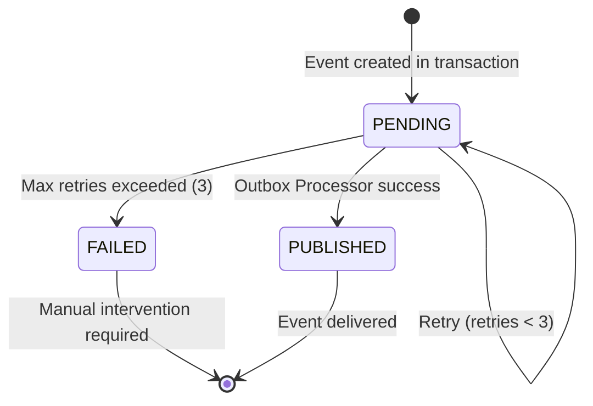
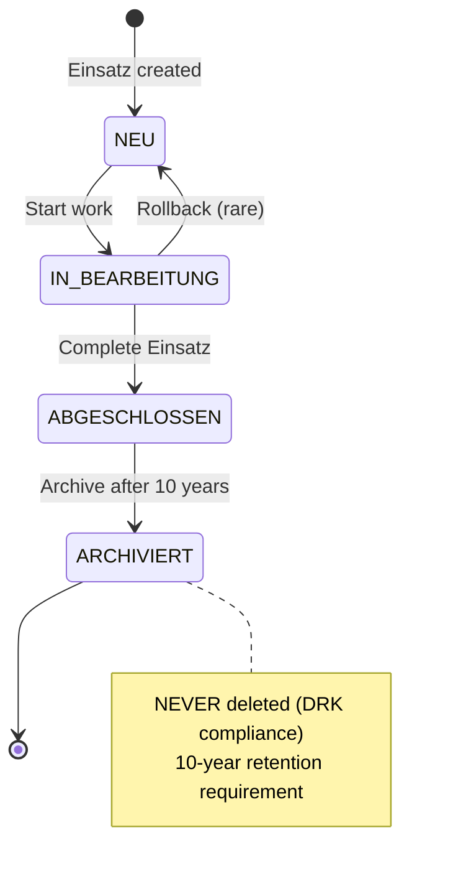

# Hexagonal Architecture Migration

**Status:** In Solutioning (Architecture Phase)
**Created:** 2025-01-11
**Author:** Ruben + BMAD Architecture Workflow
**PRD:** [276-hexagonale-architektur.md](./prds/276-hexagonale-architektur.md)
**Epics:** [276-hexagonale-architektur/index.md](./epics/276-hexagonale-architektur/index.md)

---

## Executive Summary

**Bluelight Hub** migriert von einer 3-Tier-Architektur zu **Hexagonal Architecture + Domain-Driven Design (DDD)**
mittels Strangler Fig Pattern. Die neue Architektur eliminiert Framework-Kopplung (37+ Prisma-Imports → 5),
zentralisiert Business-Logic in Domain Objects, und ermöglicht ORM-Wechsel ohne Ripple-Effekte. Die Migration erfolgt
schrittweise über 5 Epics (Lagekarte → ETB → Einsatz → Auth → Cleanup) mit paralleler Frontend-Anpassung nach jedem
Epic.

---

## 📊 Architektur-Entscheidungen (Final)

Alle Entscheidungen wurden am **2025-01-11** mit Ruben finalisiert:

### ✅ Bereits entschieden (aus bestehendem System)

| **Kategorie**                 | **Entscheidung** | **Version**                   | **Rationale**                                    |
|-------------------------------|------------------|-------------------------------|--------------------------------------------------|
| **Backend Framework**         | NestJS           | 11.1.8+ (verified 2025-01-11) | Enterprise-Grade, TypeScript-First, DI Container |
| **Database**                  | PostgreSQL       | 17                            | ACID, Compliance-Ready, Relational               |
| **ORM**                       | Prisma           | 6.2.0+ (verified 2025-01-11)  | Type-Safe, Schema-First, Migration Tools         |
| **Frontend Framework**        | React            | 19                            | Component-Based, Mature Ecosystem                |
| **Build Tool**                | Vite             | 6.x                           | Fast HMR, Modern ES Modules                      |
| **Desktop Wrapper**           | Tauri            | 2.x                           | Rust-Backed, Lightweight, Native APIs            |
| **API Style**                 | REST + OpenAPI   | -                             | Generierter Client, Swagger UI, Standardized     |
| **State Management (Server)** | TanStack Query   | 5.90.7+ (verified 2025-01-11) | Caching, Optimistic Updates, Refetching          |
| **State Management (Client)** | TanStack Store   | 0.5.5+ (verified 2025-01-12)   | Reactive, Lightweight, Type-Safe                 |
| **Forms**                     | TanStack Form    | 0.33.0+ (verified 2025-01-12)  | Type-Safe, Zod Integration, Performance          |
| **Routing**                   | TanStack Router  | 1.91.4+ (verified 2025-01-12)  | File-Based, Type-Safe Routes, Suspense           |
| **Styling**                   | Tailwind CSS     | 4.0+ (verified 2025-01-11)     | Utility-First, P3 Colors, Modern CSS             |
| **Component Library**         | Headless UI      | 2.2.0+ (verified 2025-01-12)   | Accessible, Unstyled, Tailwind-Ready             |
| **Linting/Formatting**        | Biome            | 1.7+ (v2.0 upcoming)           | Fast, ESLint+Prettier Replacement                |
| **Package Manager**           | pnpm             | 10.x+ (verified 2025-01-11)    | Efficient, Monorepo-Ready, Security-Enhanced     |
| **Runtime**                   | Node.js          | 20.11.0 LTS (verified 2025-01-12) | LTS Support until 2026-04-30                  |
| **Language**                  | TypeScript       | 5.6.3+ (verified 2025-01-12)      | Type Safety, Latest Features                   |

### 🆕 Neu entschieden (für Hexagonal Architecture)

| **Kategorie**           | **Entscheidung**                                         | **Rationale**                                                      |
|-------------------------|----------------------------------------------------------|--------------------------------------------------------------------|
| **Domain Organisation** | **Hybrid: Feature-Slice + Layer-Ordner**                 | Bounded Contexts klar (Top-Level), Types getrennt (Inner Folders)  |
| **CQRS Struktur**       | **Feature-Slice + commands/queries Unterordner**         | Co-Location von Handler + Command + Tests                          |
| **Event Outbox**        | **CronJob-Polling (5s, Exponential Backoff)**            | Robust, Transactional Guarantee, Retry-Logic                       |
| **Mapper Location**     | **infrastructure/persistence/prisma/mappers/**           | Co-Located mit Repository, einfacher Import                        |
| **Testing Strategy**    | **TDD - Tests parallel mit Code**                        | Alle Tests gelöscht, TDD-Rebuild, Qualitätssicherung von Anfang an |
| **Test Co-Location**    | **.spec.ts neben Implementation**                        | Schnellerer Context-Switch, bessere Kohäsion                       |
| **Starter Template**    | **KEINES (Pattern-Übernahme von domain-driven-hexagon)** | Bestehendes Prisma/NestJS bleibt, nur Struktur-Pattern übernehmen  |

---

## 🏗️ Neue Projektstruktur (Hexagonal Architecture)

### Domain Layer (Framework-Agnostic)

```
domain/
├── einsatz/                    # Bounded Context
│   ├── aggregates/
│   │   ├── einsatz.aggregate.ts
│   │   └── einsatz.aggregate.spec.ts
│   ├── value-objects/
│   │   ├── einsatz-id.vo.ts
│   │   ├── einsatz-status.vo.ts
│   │   └── *.spec.ts
│   ├── events/
│   │   ├── einsatz-created.event.ts
│   │   ├── einsatz-completed.event.ts
│   │   └── einsatz-archived.event.ts
│   └── repositories/
│       └── ieinsatz.repository.ts (Port)
├── etb/
│   ├── aggregates/
│   ├── entities/
│   │   └── etb-eintrag.entity.ts
│   ├── value-objects/
│   ├── events/
│   └── repositories/
├── lagekarte/
│   ├── aggregates/
│   ├── entities/
│   ├── value-objects/
│   ├── events/
│   └── repositories/
├── user/
│   ├── aggregates/
│   ├── value-objects/
│   ├── events/
│   └── repositories/
└── shared/                     # Shared Kernel
    ├── base/
    │   ├── aggregate-root.ts
    │   ├── entity.ts
    │   ├── value-object.ts
    │   └── domain-event.ts
    ├── result/
    │   └── result.ts           # Railway Oriented Programming
    └── types/
```

### Base Class Implementations

#### AggregateRoot

**Purpose:** Base class for all Aggregates, provides domain event collection mechanism.

**Implementation:**
```typescript
// domain/shared/base/aggregate-root.ts
import { DomainEvent } from './domain-event';

export abstract class AggregateRoot {
  private _domainEvents: DomainEvent[] = [];

  /**
   * Fügt ein Domain Event zur Aggregate Event-Liste hinzu.
   * Events werden nach Repository.save() publiziert.
   */
  protected addDomainEvent(event: DomainEvent): void {
    this._domainEvents.push(event);
  }

  /**
   * Gibt alle uncommitted Events zurück für Publishing.
   */
  public getUncommittedEvents(): DomainEvent[] {
    return [...this._domainEvents];
  }

  /**
   * Leert die Event-Liste nach erfolgreichem Publishing.
   * Wird von Event Publisher nach Outbox-Write aufgerufen.
   */
  public clearEvents(): void {
    this._domainEvents = [];
  }
}
```

**Test Strategy:**
```typescript
// aggregate-root.spec.ts
describe('AggregateRoot', () => {
  it('should collect domain events', () => {
    const aggregate = new TestAggregate();
    aggregate.doSomething();

    const events = aggregate.getUncommittedEvents();
    expect(events).toHaveLength(1);
    expect(events[0]).toBeInstanceOf(SomethingHappenedEvent);
  });

  it('should clear events after publishing', () => {
    const aggregate = new TestAggregate();
    aggregate.doSomething();
    aggregate.clearEvents();

    expect(aggregate.getUncommittedEvents()).toHaveLength(0);
  });
});
```

#### ValueObject

**Purpose:** Base class for immutable value objects with value equality.

**Implementation:**
```typescript
// domain/shared/base/value-object.ts
export abstract class ValueObject<T> {
  protected readonly _value: T;

  constructor(value: T) {
    this._value = Object.freeze(value);
  }

  /**
   * Value Objects sind gleich wenn ihre Werte gleich sind (nicht Referenz).
   */
  public equals(vo: ValueObject<T>): boolean {
    if (vo === null || vo === undefined) {
      return false;
    }

    return JSON.stringify(this._value) === JSON.stringify(vo._value);
  }

  /**
   * Gibt den inneren Wert zurück (readonly).
   */
  get value(): T {
    return this._value;
  }
}
```

**Example Usage:**
```typescript
// domain/einsatz/value-objects/einsatz-id.vo.ts
export class EinsatzId extends ValueObject<string> {
  private constructor(value: string) {
    super(value);
  }

  static create(value: string): Result<EinsatzId> {
    if (!value || value.length === 0) {
      return Result.fail('EinsatzId cannot be empty');
    }
    return Result.ok(new EinsatzId(value));
  }
}
```

#### Result<T> Monad

**Purpose:** Type-safe error handling without exceptions in Domain Layer.

**Implementation:**
```typescript
// domain/shared/result/result.ts
export class Result<T> {
  public isSuccess: boolean;
  public isFailure: boolean;
  private _value?: T;
  private _error?: string;

  private constructor(isSuccess: boolean, value?: T, error?: string) {
    this.isSuccess = isSuccess;
    this.isFailure = !isSuccess;
    this._value = value;
    this._error = error;

    Object.freeze(this);
  }

  /**
   * Erstellt erfolgreichen Result mit Wert.
   */
  public static ok<U>(value?: U): Result<U> {
    return new Result<U>(true, value);
  }

  /**
   * Erstellt fehlgeschlagenen Result mit Fehlermeldung.
   */
  public static fail<U>(error: string): Result<U> {
    return new Result<U>(false, undefined, error);
  }

  /**
   * Gibt Wert zurück (nur wenn isSuccess === true).
   * @throws Error wenn Result fehlgeschlagen ist
   */
  public getValue(): T {
    if (!this.isSuccess) {
      throw new Error('Cannot get value from failed result');
    }
    return this._value!;
  }

  /**
   * Gibt Fehlermeldung zurück (nur wenn isFailure === true).
   */
  public getError(): string {
    return this._error || '';
  }

  /**
   * Kombiniert mehrere Results. Gibt ersten Fehler zurück.
   */
  public static combine<U>(results: Result<U>[]): Result<U> {
    for (const result of results) {
      if (result.isFailure) return result;
    }
    return Result.ok();
  }
}
```

**Example Usage:**
```typescript
// In Aggregate
complete(completedBy: UserId): Result<void> {
  if (!this._status.canTransitionTo(EinsatzStatus.ABGESCHLOSSEN)) {
    return Result.fail('Cannot complete Einsatz in current state');
  }

  this._status = EinsatzStatus.ABGESCHLOSSEN;
  this.addDomainEvent(new EinsatzCompletedEvent(this.id, completedBy));
  return Result.ok();
}
```

#### DomainEvent

**Purpose:** Base class for all domain events with metadata.

**Implementation:**
```typescript
// domain/shared/base/domain-event.ts
import { v4 as uuidv4 } from 'uuid';

export abstract class DomainEvent {
  public readonly eventId: string;
  public readonly occurredOn: Date;
  public readonly aggregateId: string;

  constructor(aggregateId: string) {
    this.eventId = uuidv4();
    this.occurredOn = new Date();
    this.aggregateId = aggregateId;
  }

  /**
   * Event Type für Serialization/Deserialization.
   */
  abstract getEventType(): string;
}
```

**Example Usage:**
```typescript
// domain/einsatz/events/einsatz-created.event.ts
export class EinsatzCreatedEvent extends DomainEvent {
  constructor(
    aggregateId: string,
    public readonly createdBy: UserId,
    public readonly alarmstichwort: string,
  ) {
    super(aggregateId);
  }

  getEventType(): string {
    return 'EinsatzCreatedEvent';
  }
}
```

### Application Layer (Use Cases - CQRS)

```
application/
├── einsatz/
│   ├── commands/
│   │   ├── create-einsatz/
│   │   │   ├── create-einsatz.command.ts
│   │   │   ├── create-einsatz.handler.ts
│   │   │   └── create-einsatz.handler.spec.ts
│   │   ├── complete-einsatz/
│   │   └── archive-einsatz/
│   └── queries/
│       ├── get-active-einsaetze/
│       └── get-einsatz-by-id/
├── etb/
│   ├── commands/
│   │   ├── add-etb-eintrag/
│   │   └── lock-etb/
│   └── queries/
├── lagekarte/
│   ├── commands/
│   │   ├── create-lagekarte/
│   │   ├── add-poi/
│   │   └── remove-poi/
│   └── queries/
└── user/
    ├── commands/
    │   ├── login/
    │   └── lock-user/
    └── queries/
```

### Infrastructure Layer (Adapters)

```
infrastructure/
├── persistence/
│   └── prisma/
│       ├── repositories/       # Adapters
│       │   ├── prisma-einsatz.repository.ts
│       │   ├── prisma-einsatz.repository.integration.spec.ts
│       │   ├── prisma-etb.repository.ts
│       │   ├── prisma-lagekarte.repository.ts
│       │   └── prisma-user.repository.ts
│       ├── mappers/            # Domain ↔ Prisma
│       │   ├── prisma-einsatz.mapper.ts
│       │   ├── prisma-einsatz.mapper.spec.ts
│       │   └── ...
│       └── schema.prisma       # EXISTING

**Outbox Table Schema (for Transactional Outbox Pattern):**

**Location:** `packages/backend/prisma/schema.prisma`

**Schema Addition:**
```prisma
// Transactional Outbox Pattern (Epic 3)
model Outbox {
  id          String       @id @default(uuid())
  eventId     String       @unique
  aggregateId String
  eventType   String
  payload     Json
  status      OutboxStatus @default(PENDING)
  retries     Int          @default(0)
  error       String?
  createdAt   DateTime     @default(now())
  publishedAt DateTime?

  @@index([status, createdAt], name: "outbox_status_created_idx")
  @@map("outbox")
}

enum OutboxStatus {
  PENDING
  PUBLISHED
  FAILED
}
```

**Migration Command:**
```bash
pnpm --filter @bluelight-hub/backend prisma migrate dev --name add-outbox-table
```

**Indexes Rationale:**
- `(status, createdAt)`: Outbox Processor queries `WHERE status = PENDING ORDER BY createdAt`
- `eventId` unique: Prevents duplicate event processing

├── http/
│   └── controllers/            # Thin Adapters
│       ├── einsatz.controller.ts
│       ├── etb.controller.ts
│       └── ...
├── events/
│   ├── outbox/
│   │   ├── outbox.repository.ts
│   │   └── outbox-processor.service.ts  # CronJob @Cron('*/5 * * * * *')
│   └── publishers/
│       └── domain-event.publisher.ts
└── external/
    ├── nominatim/
    │   └── nominatim-geocoding.adapter.ts
    └── jwt/
        └── jwt-token.adapter.ts
```

---

## 📐 Novel Pattern Designs

### 1. Transactional Outbox Pattern (Epic 4)

**Problem:** Domain Events können verloren gehen bei Crash zwischen DB-Commit und Event-Publishing.

**Solution:** Events in Outbox-Table schreiben (Teil der DB-Transaktion), dann asynchron publishen.

**Implementation:**

```typescript
// Domain Event Publishing (innerhalb Transaktion)
@Injectable()
export class DomainEventPublisher {
    async publishAll(events: DomainEvent[], tx: PrismaTransaction) {
        for (const event of events) {
            await tx.outbox.create({
                data: {
                    eventId: event.eventId,
                    aggregateId: event.aggregateId,
                    eventType: event.constructor.name,
                    payload: JSON.stringify(event),
                    status: 'PENDING',
                },
            });
        }
    }
}

// Outbox Processor (CronJob)
@Injectable()
export class OutboxProcessor {
    @Cron('*/5 * * * * *') // Alle 5 Sekunden
    async processOutbox() {
        const events = await this.outboxRepo.findPending({limit: 100});

        for (const event of events) {
            try {
                const domainEvent = this.deserialize(event.payload);
                await this.eventBus.publish(domainEvent);
                await this.outboxRepo.markPublished(event.id);
            } catch (error) {
                await this.outboxRepo.incrementRetries(event.id);
                if (event.retries >= 3) {
                    await this.outboxRepo.markFailed(event.id, error.message);
                }
            }
        }
    }
}
```

**Benefits:**

- ✅ **Transactional Guarantee:** Events gehen nicht verloren
- ✅ **Retry-Logic:** Exponential Backoff bei Fehlern
- ✅ **Audit Trail:** Alle Events in DB nachvollziehbar
- ✅ **Compliance:** DRK-Anforderung (Event-Verlust unakzeptabel)

**Outbox Event State Machine:**



**Transition Rules:**
- `PENDING → PUBLISHED`: Event successfully published to Event Bus, `publishedAt` timestamp set
- `PENDING → PENDING`: Retry with exponential backoff (1s, 2s, 4s), increment `retries` counter
- `PENDING → FAILED`: After 3 failed attempts, mark as FAILED with error message
- `FAILED → (manual)`: Failed events require manual investigation/reprocessing
- `PUBLISHED → (cleanup)`: Published events older than 30 days can be soft-deleted

---

### 2. Strangler Fig Migration Pattern

**Problem:** Big Bang Migration = hohes Risiko, Merge-Konflikte, kein Rollback.

**Solution:** Neue Architektur parallel aufbauen, Controller schrittweise umstellen.

**Implementation Phases:**

```typescript
// Phase 1: Domain Layer aufbauen (PARALLEL, kein Breaking Change)
domain /
einsatz /
aggregates / einsatz.aggregate.ts  // NEU
modules /
einsatz /
einsatz.service.ts               // EXISTING (bleibt)

// Phase 2: Lagekarte Controller umstellen (STRANGLING)
@Controller('lagekarte')
export class LagekarteController {
    constructor(
        private commandBus: CommandBus,      // NEU
        private queryBus: QueryBus,          // NEU
        // private lagekarteService: LagekarteService,  // ALT (auskommentiert)
    ) {
    }

    @Post()
    async create(@Body() dto: CreateLagekarteDto) {
        // return await this.lagekarteService.create(dto);  // ALT
        return await this.commandBus.execute(
            new CreateLagekarteCommand(dto.einsatzId, dto.name)
        ); // NEU
    }
}

// Phase 5: Cleanup (ALTER CODE LÖSCHEN)
// modules/lagekarte/lagekarte.service.ts  → DELETED
```

**Benefits:**

- ✅ **Inkrementell:** Jede Phase einzeln testbar
- ✅ **Rollback:** Controller kann auf alten Service zurück
- ✅ **Parallel:** Team kann weiterarbeiten
- ✅ **Low Risk:** Kein Big Bang

---

### 3. Rich Domain Model + DDD Aggregates

**Problem:** Business-Logic verstreut (Services, Utils, Repository), schwer zu finden.

**Solution:** Business-Logic in Aggregates, Self-Validating Value Objects.

**Implementation:**

```typescript
// ❌ VORHER: Anemic Domain Model
class Einsatz {
    id: string;
    status: string;
    nummer: string;
}

// Service hat die Business-Logic
class EinsatzService {
    async complete(id: string) {
        const einsatz = await this.repo.findById(id);
        if (einsatz.status !== 'IN_BEARBEITUNG') {
            throw new Error('Cannot complete');
        }
        einsatz.status = 'ABGESCHLOSSEN';
        await this.repo.save(einsatz);
        this.eventEmitter.emit('einsatz.completed', {id});  // String-Event!
    }
}

// ✅ NACHHER: Rich Domain Model
class EinsatzAggregate extends AggregateRoot {
    private _status: EinsatzStatus;  // Value Object

    complete(completedBy: UserId): Result<void> {
        if (!this._status.canTransitionTo(EinsatzStatus.ABGESCHLOSSEN)) {
            return Result.fail('Cannot complete Einsatz in current state');
        }

        this._status = EinsatzStatus.ABGESCHLOSSEN;
        this.addDomainEvent(new EinsatzCompletedEvent(this.id, completedBy));
        return Result.ok();
    }
}

// Handler ist dünn (nur Orchestrierung + Transaction Management)
@Injectable()
export class CompleteEinsatzHandler {
  constructor(
    private readonly prisma: PrismaService,
    private readonly repo: IEinsatzRepository,
    private readonly eventPublisher: DomainEventPublisher
  ) {}

  async execute(command: CompleteEinsatzCommand): Promise<void> {
    // Handler creates transaction (see Transaction Management Pattern)
    return await this.prisma.$transaction(async (tx) => {
      // 1. Load aggregate
      const aggregate = await this.repo.findById(command.einsatzId, tx);

      // 2. Execute domain logic (returns Result<T>)
      const result = aggregate.complete(command.completedBy);

      // 3. Convert Result to Exception (see Error Handling Pattern)
      if (result.isFailure) {
        throw new BadRequestException(result.getError());
      }

      // 4. Save aggregate (within transaction)
      await this.repo.save(aggregate, tx);

      // 5. Publish events to Outbox (within same transaction)
      await this.eventPublisher.publishAll(
        aggregate.getUncommittedEvents(),
        tx  // <-- Transaction passed here (unified signature)
      );

      // 6. Clear events from aggregate
      aggregate.clearEvents();
    });
  }
}
```

**Benefits:**

- ✅ **Single Source of Truth:** Business-Logic zentral in Aggregate
- ✅ **Self-Validating:** Aggregate kann nur in validen Zustand sein
- ✅ **Type-Safe Events:** Compile-Zeit Sicherheit
- ✅ **Testbar:** Pure TypeScript Tests (kein Framework)

**Einsatz Status State Machine:**



**Transition Rules:**
- `NEU → IN_BEARBEITUNG`: User starts working on Einsatz
- `IN_BEARBEITUNG → ABGESCHLOSSEN`: All acceptance criteria met, Einsatz completed
- `IN_BEARBEITUNG → NEU`: Rollback only in exceptional cases (accidental start)
- `ABGESCHLOSSEN → ARCHIVIERT`: Automated after 10 years (DRK compliance)
- **NO DELETE**: `canBeDeleted()` ALWAYS returns false (PRD requirement)

**Validation in Domain:**
```typescript
canTransitionTo(newStatus: EinsatzStatus): boolean {
  const transitions: Record<EinsatzStatus, EinsatzStatus[]> = {
    NEU: [EinsatzStatus.IN_BEARBEITUNG],
    IN_BEARBEITUNG: [EinsatzStatus.ABGESCHLOSSEN, EinsatzStatus.NEU],
    ABGESCHLOSSEN: [EinsatzStatus.ARCHIVIERT],
    ARCHIVIERT: [], // Terminal state
  };

  return transitions[this._status].includes(newStatus);
}
```

---

## 🎯 Implementation Patterns für AI-Agent-Konsistenz

### Naming Conventions

**REST Endpoints:**

- Format: Plural nouns `/einsaetze`, `/lagekarten`, `/users`
- Parameters: `/:id` (not `/{id}`)
- Query: `?status=ACTIVE` (camelCase)

**Database (Prisma):**

- Tables: Singular PascalCase `Einsatz`, `Lagekarte`, `User`
- Columns: camelCase `einsatzId`, `createdAt`, `isActive`
- Foreign Keys: `{entity}Id` (e.g., `einsatzId`, `userId`)

**TypeScript (Domain):**

- Aggregates: `EinsatzAggregate`, `EtbAggregate`
- Value Objects: `EinsatzStatus`, `EinsatzId` (keine .vo Suffix im Dateinamen)
- Events: `EinsatzCreatedEvent`, `EinsatzCompletedEvent` (Past Tense)
- Repositories: `IEinsatzRepository` (Interface Prefix)

**TypeScript (Application):**

- Commands: `CreateEinsatzCommand`, `CompleteEinsatzCommand` (Verb + Noun)
- Queries: `GetActiveEinsaetzeQuery`, `GetEinsatzByIdQuery`
- Handlers: `CreateEinsatzHandler`, `GetActiveEinsaetzeHandler`

**TypeScript (Infrastructure):**

- Repositories: `PrismaEinsatzRepository` (Prefix = Technology)
- Mappers: `PrismaEinsatzMapper`
- Adapters: `NominatimGeocodingAdapter`, `JwtTokenAdapter`

**Files:**

- Domain: `einsatz.aggregate.ts`, `einsatz-status.vo.ts`
- Application: `create-einsatz.command.ts`, `create-einsatz.handler.ts`
- Tests: `*.spec.ts` (co-located)

### Structure Patterns

**Command/Query Folder Structure:**

```
commands/
  create-einsatz/
    create-einsatz.command.ts
    create-einsatz.handler.ts
    create-einsatz.handler.spec.ts
```

**Domain Folder Structure:**

```
domain/
  einsatz/
    aggregates/
    value-objects/
    events/
    repositories/
```

**Test Location:**

- Co-Located: `*.spec.ts` next to implementation
- Integration Tests: `*.integration.spec.ts`

### Format Patterns

**API Response (Direct, kein Wrapper):**

```typescript
// ✅ Direct Response
{
    "id"
:
    "123",
        "status"
:
    "ACTIVE",
        "nummer"
:
    "E-2024-001"
}

// ❌ NICHT: Nested Wrapper
{
    "data"
:
    { ...
    }
,
    "error"
:
    null
}
```

**Error Format:**

```typescript
{
    "statusCode"
:
    400,
        "message"
:
    "Cannot complete Einsatz in current state",
        "error"
:
    "Bad Request"
}
```

**Date Format:**

- API: ISO 8601 Strings `"2024-01-15T10:30:00.000Z"`
- Database: `DateTime` (Prisma Type)
- Domain: `Date` (Native JS)

**Event Payload:**

```typescript
class EinsatzCreatedEvent extends DomainEvent {
    constructor(
        public readonly einsatzId: EinsatzId,
        public readonly createdBy: UserId,
        public readonly alarmstichwort: string,
    ) {
        super();
    }
}
```

### Communication Patterns

**Command Bus:**

```typescript
await this.commandBus.execute(
    new CreateEinsatzCommand(dto.alarmstichwort, dto.ort)
);
```

**Query Bus:**

```typescript
const result = await this.queryBus.execute(
    new GetActiveEinsaetzeQuery()
);
```

**Event Publishing:**

```typescript
// In Handler (nach Repository save)
await this.eventPublisher.publishAll(aggregate.getUncommittedEvents());
```

**Event Handler:**

```typescript
@OnEvent(EinsatzCreatedEvent)
async
handle(event
:
EinsatzCreatedEvent
)
{
    // Auto-Create ETB
    await this.commandBus.execute(
        new CreateEtbCommand(event.einsatzId)
    );
}
```

### Error Handling Patterns

**Strategy:** Railway Oriented Programming with Result<T> in Domain, Exceptions in Application/Infrastructure.

#### Domain Layer Error Handling

**Rule:** Domain layer ALWAYS returns `Result<T>`, NEVER throws exceptions.

**Rationale:**
- Domain is framework-agnostic (no NestJS exceptions)
- Type-safe error handling (compiler checks isFailure)
- Testable without mocking framework

**Pattern:**
```typescript
// ✅ CORRECT: Domain returns Result<T>
class EinsatzAggregate extends AggregateRoot {
  complete(completedBy: UserId): Result<void> {
    if (!this._status.canTransitionTo(EinsatzStatus.ABGESCHLOSSEN)) {
      return Result.fail('Cannot complete Einsatz in current state');
    }

    this._status = EinsatzStatus.ABGESCHLOSSEN;
    this.addDomainEvent(new EinsatzCompletedEvent(this.id, completedBy));
    return Result.ok();
  }
}

// ❌ WRONG: Domain throws exception
class EinsatzAggregate extends AggregateRoot {
  complete(completedBy: UserId): void {
    if (!this._status.canTransitionTo(EinsatzStatus.ABGESCHLOSSEN)) {
      throw new Error('Cannot complete');  // NEVER in Domain!
    }
  }
}
```

#### Application Layer Error Handling

**Rule:** Application layer checks `Result<T>` from Domain, converts to NestJS exceptions.

**Pattern:**
```typescript
// ✅ CORRECT: Handler converts Result to Exception
@Injectable()
export class CompleteEinsatzHandler {
  async execute(command: CompleteEinsatzCommand): Promise<void> {
    return await this.prisma.$transaction(async (tx) => {
      const aggregate = await this.repo.findById(command.einsatzId, tx);

      // Domain returns Result<T>
      const result = aggregate.complete(command.completedBy);

      // Application converts to Exception
      if (result.isFailure) {
        throw new BadRequestException(result.getError());
      }

      await this.repo.save(aggregate, tx);
      await this.eventPublisher.publishAll(aggregate.getUncommittedEvents(), tx);
    });
  }
}

// ❌ WRONG: Handler ignores Result errors
async execute(command: CompleteEinsatzCommand): Promise<void> {
  const aggregate = await this.repo.findById(command.einsatzId);
  aggregate.complete(command.completedBy);  // Ignores Result!
  await this.repo.save(aggregate);
}
```

#### Infrastructure Layer Error Handling

**Rule:** Infrastructure throws exceptions (database errors, external API failures).

**Pattern:**
```typescript
// ✅ CORRECT: Repository throws on database errors
async save(aggregate: EinsatzAggregate, tx: PrismaTransaction): Promise<void> {
  try {
    await tx.einsatz.update({
      where: { id: aggregate.id.value },
      data: this.mapper.toPrisma(aggregate),
    });
  } catch (error) {
    // Let Prisma exceptions bubble up (NestJS catches them)
    throw error;
  }
}

// ✅ CORRECT: External adapter throws on API errors
async geocode(address: string): Promise<Coordinates> {
  try {
    const response = await this.httpService.get(url);
    return this.parseCoordinates(response.data);
  } catch (error) {
    throw new ServiceUnavailableException('Geocoding service unavailable');
  }
}
```

#### Validation Errors (DTO vs Domain)

**Rule:** Two-step validation - DTO validates format, Domain validates business rules.

**DTO Validation (Application Layer):**
```typescript
// class-validator decorators
export class CreateEinsatzDto {
  @ApiProperty()
  @IsString()
  @MinLength(3)
  @MaxLength(100)
  alarmstichwort: string;

  @ApiProperty()
  @IsOptional()
  @IsString()
  ort?: string;
}
```

**Domain Validation (Domain Layer):**
```typescript
// Business rule validation returns Result<T>
class EinsatzAggregate extends AggregateRoot {
  static create(alarmstichwort: string, ort?: string): Result<EinsatzAggregate> {
    // Business rule: Alarmstichwort muss auf Liste erlaubter Stichworte sein
    if (!AllowedAlarmstichwortList.contains(alarmstichwort)) {
      return Result.fail('Alarmstichwort not in approved list');
    }

    const aggregate = new EinsatzAggregate(/* ... */);
    return Result.ok(aggregate);
  }
}
```

#### Error Response Format

**Consistent NestJS Error Format:**
```typescript
// NestJS automatically formats to:
{
  "statusCode": 400,
  "message": "Cannot complete Einsatz in current state",
  "error": "Bad Request"
}
```

**Validation Error Format:**
```typescript
// class-validator automatically formats to:
{
  "statusCode": 400,
  "message": [
    "alarmstichwort must be longer than 3 characters",
    "ort must be a string"
  ],
  "error": "Bad Request"
}
```

### Transaction Management Pattern

**Strategy:** Handler-Level Transactions with Prisma.$transaction()

#### Rule: Handlers Create and Manage Transactions

**Rationale:**
- Handlers orchestrate multiple operations (save Aggregate + publish Events)
- Both operations must be atomic (all-or-nothing)
- Transactional Outbox Pattern requires Outbox write in same transaction as Aggregate save

**Pattern:**
```typescript
@Injectable()
export class CreateEinsatzHandler {
  constructor(
    private readonly prisma: PrismaService,
    private readonly repo: IEinsatzRepository,
    private readonly eventPublisher: DomainEventPublisher
  ) {}

  async execute(command: CreateEinsatzCommand): Promise<string> {
    // Handler creates transaction
    return await this.prisma.$transaction(async (tx) => {
      // All operations within transaction receive 'tx' parameter

      // 1. Create aggregate (Domain logic)
      const result = EinsatzAggregate.create(
        command.alarmstichwort,
        command.ort
      );

      if (result.isFailure) {
        throw new BadRequestException(result.getError());
      }

      const aggregate = result.getValue();

      // 2. Save to database (tx passed to Repository)
      await this.repo.save(aggregate, tx);

      // 3. Write events to Outbox (tx passed to Event Publisher)
      await this.eventPublisher.publishAll(
        aggregate.getUncommittedEvents(),
        tx
      );

      // 4. Clear events
      aggregate.clearEvents();

      return aggregate.id.value;
    });

    // Transaction commits automatically if no exception thrown
    // Transaction rolls back automatically if exception thrown
  }
}
```

#### Repository Integration

**Repositories receive transaction as parameter:**
```typescript
export interface IEinsatzRepository {
  findById(id: EinsatzId, tx: PrismaTransaction): Promise<EinsatzAggregate | null>;
  save(aggregate: EinsatzAggregate, tx: PrismaTransaction): Promise<void>;
  findActive(tx?: PrismaTransaction): Promise<EinsatzAggregate[]>;
}

// Implementation
@Injectable()
export class PrismaEinsatzRepository implements IEinsatzRepository {
  async save(aggregate: EinsatzAggregate, tx: PrismaTransaction): Promise<void> {
    const data = this.mapper.toPrisma(aggregate);

    await tx.einsatz.upsert({
      where: { id: aggregate.id.value },
      update: data,
      create: data,
    });
  }
}
```

#### Event Publisher Integration

**Event Publisher writes to Outbox within transaction:**
```typescript
@Injectable()
export class DomainEventPublisher {
  async publishAll(events: DomainEvent[], tx: PrismaTransaction): Promise<void> {
    for (const event of events) {
      await tx.outbox.create({
        data: {
          eventId: event.eventId,
          aggregateId: event.aggregateId,
          eventType: event.constructor.name,
          payload: JSON.stringify(event),
          status: 'PENDING',
        },
      });
    }
  }
}
```

#### Query Handlers (Read-Only)

**Query handlers MAY use transactions for consistency, but not required:**
```typescript
@Injectable()
export class GetActiveEinsaetzeHandler {
  constructor(private readonly prisma: PrismaService) {}

  async execute(query: GetActiveEinsaetzeQuery): Promise<EinsatzDto[]> {
    // Queries bypass Repository, direct Prisma access (CQRS read-side)
    const einsaetze = await this.prisma.einsatz.findMany({
      where: { status: 'ACTIVE' },
      include: { lagekarte: true, etb: true },
    });

    return einsaetze.map(this.toDto);
  }
}
```

#### Transaction Boundaries Summary

**ALWAYS use transactions for:**
- Command Handlers (writes + events)
- Operations that modify multiple aggregates
- Operations that write to Outbox

**OPTIONAL transactions for:**
- Query Handlers (consistency vs performance trade-off)
- Read-only operations

**NEVER use transactions for:**
- Event Handlers (each handles one event, separate transaction)
- Outbox Processor (processes events in batches, separate transactions per event)

---

## 🎨 Frontend Implementation Patterns

### Frontend Communication Patterns (TanStack Query)

**Base URL Configuration:**
```typescript
// src/lib/api-client.ts
import { api } from '@bluelight-hub/shared/client';

// Configure generated API client
api.setBaseUrl(import.meta.env.VITE_API_BASE_URL || 'http://localhost:3000');
```

**Query Hook Pattern:**
```typescript
// src/hooks/einsatz/useEinsaetze.ts
import { useQuery } from '@tanstack/react-query';
import { api } from '@bluelight-hub/shared/client';
import { QUERY_KEYS } from '@/constants/query-keys';

export const useEinsaetze = () => {
  return useQuery({
    queryKey: QUERY_KEYS.einsatz.all,
    queryFn: () => api.einsatz.findAll(),
    staleTime: 5 * 60 * 1000, // 5 minutes
    gcTime: 10 * 60 * 1000,   // 10 minutes
  });
};

export const useActiveEinsaetze = () => {
  return useQuery({
    queryKey: QUERY_KEYS.einsatz.active,
    queryFn: () => api.einsatz.findActive(),
    staleTime: 30 * 1000, // 30 seconds (more frequent for active data)
  });
};

export const useEinsatz = (id: string) => {
  return useQuery({
    queryKey: QUERY_KEYS.einsatz.detail(id),
    queryFn: () => api.einsatz.findOne(id),
    enabled: !!id, // Only run if id exists
  });
};
```

**Mutation Hook Pattern:**
```typescript
// src/hooks/einsatz/useCreateEinsatz.ts
import { useMutation, useQueryClient } from '@tanstack/react-query';
import { api } from '@bluelight-hub/shared/client';
import { QUERY_KEYS } from '@/constants/query-keys';
import { toast } from '@/components/ui/toast';

export const useCreateEinsatz = () => {
  const queryClient = useQueryClient();

  return useMutation({
    mutationFn: (dto: CreateEinsatzDto) => api.einsatz.create(dto),
    onSuccess: (newEinsatz) => {
      // Invalidate all einsatz queries
      queryClient.invalidateQueries({ queryKey: QUERY_KEYS.einsatz.all });

      // Optimistically add to cache
      queryClient.setQueryData(
        QUERY_KEYS.einsatz.detail(newEinsatz.id),
        newEinsatz
      );

      toast.success('Einsatz erfolgreich erstellt');
    },
    onError: (error) => {
      toast.error(`Fehler: ${error.message}`);
    },
  });
};
```

**Query Keys Convention:**
```typescript
// src/constants/query-keys.ts
export const QUERY_KEYS = {
  einsatz: {
    all: ['einsatz'] as const,
    active: ['einsatz', 'active'] as const,
    detail: (id: string) => ['einsatz', 'detail', id] as const,
  },
  etb: {
    all: ['etb'] as const,
    byEinsatz: (einsatzId: string) => ['etb', 'einsatz', einsatzId] as const,
  },
  lagekarte: {
    all: ['lagekarte'] as const,
    byEinsatz: (einsatzId: string) => ['lagekarte', 'einsatz', einsatzId] as const,
  },
} as const;
```

### Frontend Naming Conventions

**React Components:**
- **Files:** PascalCase with `.tsx` extension
  - `Button.tsx`, `EinsatzCard.tsx`, `NewEinsatzModal.tsx`
- **Components:** PascalCase matching filename
  - `export const Button = () => { ... }`

**Hooks:**
- **Files:** camelCase with `use` prefix, `.ts` extension
  - `useEinsaetze.ts`, `useCreateEinsatz.ts`, `useAuth.ts`
- **Hook functions:** camelCase with `use` prefix
  - `export const useEinsaetze = () => { ... }`

**Atomic Design Structure:**
```
src/components/
  atoms/          # Basic building blocks (Button, Input, Icon)
    Button.tsx
    Input.tsx
  molecules/      # Simple combinations (FormField, Card, Modal)
    FormField.tsx
    EinsatzCard.tsx
  organisms/      # Complex components (Forms, Tables, Sidebars)
    EinsatzForm.tsx
    EinsatzTable.tsx
  templates/      # Page layouts
    DashboardLayout.tsx
  pages/          # Route-level components (co-located with routes/)
```

**Routes (TanStack Router):**
```
src/routes/
  __root.tsx              # Root layout
  index.tsx               # / route
  einsaetze/
    index.tsx             # /einsaetze route
    $id.tsx               # /einsaetze/:id route
    $id.edit.tsx          # /einsaetze/:id/edit route
```

### Lifecycle Patterns

**Loading States:**
```typescript
const EinsaetzeList = () => {
  const { data, isLoading, isError, error } = useActiveEinsaetze();

  if (isLoading) {
    return <EinsaetzeSkeleton />;  // Skeleton screen pattern
  }

  if (isError) {
    return <ErrorBoundary error={error} />;
  }

  return <EinsaetzeTable data={data} />;
};
```

**Error Recovery:**
```typescript
// Error Boundary for React 19
import { ErrorBoundary } from 'react-error-boundary';

const App = () => (
  <ErrorBoundary
    fallback={<ErrorFallback />}
    onReset={() => window.location.reload()}
  >
    <AppRoutes />
  </ErrorBoundary>
);

const ErrorFallback = ({ error, resetErrorBoundary }) => (
  <div className="error-container">
    <h2>Etwas ist schiefgelaufen</h2>
    <pre>{error.message}</pre>
    <button onClick={resetErrorBoundary}>Erneut versuchen</button>
  </div>
);
```

**Retry Logic (Automatic via TanStack Query):**
```typescript
const useEinsaetze = () => {
  return useQuery({
    queryKey: QUERY_KEYS.einsatz.all,
    queryFn: () => api.einsatz.findAll(),
    retry: 3,              // Retry 3 times on failure
    retryDelay: (attempt) => Math.min(1000 * 2 ** attempt, 30000), // Exponential backoff
  });
};
```

### Location Patterns

**Assets:**
```
src/assets/
  images/        # Static images (logo, backgrounds)
  icons/         # SVG icons (if not using icon library)
  fonts/         # Custom fonts (if any)
```

**Public Files (Tauri):**
```
public/
  favicon.ico
  manifest.json
```

**Configuration Files:**
```
Root level:
  vite.config.ts
  tailwind.config.ts
  tsconfig.json
  package.json
```

### Consistency Patterns

**Date Display:**
```typescript
// German locale date formatting
const formatDate = (date: string | Date): string => {
  return new Intl.DateTimeFormat('de-DE', {
    day: '2-digit',
    month: '2-digit',
    year: 'numeric',
    hour: '2-digit',
    minute: '2-digit',
  }).format(new Date(date));
};

// Example: "15.01.2025, 10:30"
```

**Number Display:**
```typescript
// German locale number formatting
const formatNumber = (value: number): string => {
  return new Intl.NumberFormat('de-DE').format(value);
};

// Example: "1.234,56"
```

**Currency Display:**
```typescript
const formatCurrency = (value: number): string => {
  return new Intl.NumberFormat('de-DE', {
    style: 'currency',
    currency: 'EUR',
  }).format(value);
};

// Example: "1.234,56 €"
```

**User-Facing Error Messages:**
```typescript
// German error messages for UI
const ERROR_MESSAGES = {
  network: 'Netzwerkfehler. Bitte überprüfen Sie Ihre Verbindung.',
  notFound: 'Die angeforderte Ressource wurde nicht gefunden.',
  unauthorized: 'Sie sind nicht berechtigt, diese Aktion auszuführen.',
  serverError: 'Ein Serverfehler ist aufgetreten. Bitte versuchen Sie es später erneut.',
} as const;
```

**Logging Format (Console):**
```typescript
// English for logs (developer-facing)
console.log('[EinsatzService] Fetching active Einsätze...');
console.error('[API] Request failed:', error);
```

---

## 🔗 Epic to Architecture Mapping

**Selected Strategy: Option A (Einsatz Domain Events in Epic 3)**

| Epic                           | Domain Objects                                | Application Layer                                                         | Infrastructure                                                               | Frontend Impact                                   |
|--------------------------------|-----------------------------------------------|---------------------------------------------------------------------------|------------------------------------------------------------------------------|---------------------------------------------------|
| **Epic 1: Foundation**         | All Aggregates, VOs, Events, Repository Ports | -                                                                         | -                                                                            | None (Backend-only)                               |
| **Epic 2: Lagekarte**          | (Uses Epic 1 objects)                         | Lagekarte Commands/Queries                                                | PrismaLagekarteRepository, Nominatim Adapter, Controllers                    | API Client Regeneration, Component Updates        |
| **Epic 3: Einsatz Domain Events** | (Uses Epic 1 objects)                      | Event Publisher integration in existing Service                           | Outbox Table, Outbox Processor (CronJob), Event Bus setup                   | None (Backend-only, prepares for Epic 4)          |
| **Epic 4: ETB**                | (Uses Epic 1 objects)                         | ETB Commands/Queries, Event Handler (EinsatzCreated → Auto-Create ETB)    | PrismaEtbRepository, Mapper, Controllers                                     | API Client Regeneration, ETB Component Updates    |
| **Epic 5: Einsatz CQRS + Auth**| (Uses Epic 1 objects)                         | Einsatz Commands/Queries (replace Service), User Commands/Queries         | PrismaEinsatzRepository, PrismaUserRepository, JWT Adapter                   | Complete API Migration (Einsatz + Auth Endpoints) |
| **Epic 6: Cleanup**            | -                                             | -                                                                         | Delete old Services, Performance Optimization                                | E2E Tests, Final Validation                       |

**Rationale for Epic 3 Change:**
- ETB's auto-create functionality depends on `EinsatzCreatedEvent`
- Adding Domain Events to existing Service is low-risk (Service emits events alongside current logic)
- Outbox Pattern infrastructure can be tested before full CQRS migration
- Epic 4 (ETB) receives events immediately, business value delivered earlier

---

## 📋 Architecture Decision Records (ADRs)

### ADR-001: Hexagonal Architecture + DDD

**Status:** Accepted | **Date:** 2025-01-11

**Context:**
Bestehendes System leidet unter Framework-Kopplung (37+ Prisma-Imports), God Services, und verstreuter Business-Logic.

**Decision:**
Migration zu Hexagonal Architecture mit DDD Patterns (Aggregates, Value Objects, Domain Events, Ports & Adapters).

**Consequences:**

- ✅ ORM-Wechsel = nur 5 Adapter-Dateien ändern
- ✅ Domain-Tests ohne Framework (schnell, isoliert)
- ✅ Business-Logic zentral in Aggregates
- ⚠️ Migration-Aufwand: 138-186h

**Alternatives Considered:**

- Keep 3-Tier Architecture → Technical Debt bleibt
- Big Bang Migration → Zu hohes Risiko

---

### ADR-002: Strangler Fig Pattern

**Status:** Accepted | **Date:** 2025-01-11

**Context:**
Big Bang Migration = hohes Risiko, Merge-Konflikte, kein Rollback.

**Decision:**
Strangler Fig Pattern - neue Architektur parallel aufbauen, Controller schrittweise umstellen.

**Consequences:**

- ✅ Jede Phase einzeln rollbar
- ✅ Integration-Tests bleiben grün
- ✅ Paralleles Arbeiten möglich
- ⚠️ Übergangsphase: Alter + Neuer Code koexistiert

**Alternatives Considered:**

- Big Bang Migration → Verworfen (zu riskant)

---

### ADR-003: CQRS Pattern

**Status:** Accepted | **Date:** 2025-01-11

**Context:**
God Services mit 5+ Responsibilities verletzen Single Responsibility Principle.

**Decision:**
Commands (Write) und Queries (Read) trennen, 1 Handler = 1 Responsibility.

**Consequences:**

- ✅ Single Responsibility erfüllt
- ✅ Commands nutzen Aggregates (Business-Logic)
- ✅ Queries direkt Prisma (Performance)
- ⚠️ Mehr Dateien (aber besser organisiert)

**Alternatives Considered:**

- Traditional Services → SRP-Verletzung bleibt

---

### ADR-004: Typed Domain Events

**Status:** Accepted | **Date:** 2025-01-11

**Context:**
String-basierte Events (`'einsatz.created'`) sind typo-anfällig, keine Compile-Zeit Sicherheit.

**Decision:**
Domain Events als Klassen, Type-Safe Event-Handler.

**Consequences:**

- ✅ TypeScript Compiler erkennt Typos
- ✅ Event-Payload typisiert
- ✅ Autocomplete für Event-Handler
- ⚠️ Mehr Boilerplate (aber type-safe)

**Alternatives Considered:**

- String Events beibehalten → Runtime-Fehler bleiben

---

### ADR-005: Transactional Outbox Pattern

**Status:** Accepted | **Date:** 2025-01-11

**Context:**
Event-Verlust bei Crash zwischen DB-Commit und Event-Publishing ist für DRK-Compliance inakzeptabel.

**Decision:**
Events in Outbox-Table schreiben (Teil der DB-Transaktion), dann asynchron publishen via CronJob.

**Consequences:**

- ✅ Events gehen nicht verloren (Transactional Guarantee)
- ✅ Retry-Logic bei Fehlern
- ✅ Audit Trail (Events in DB)
- ⚠️ Leichte Latenz (max. 5s bis Publishing)

**Alternatives Considered:**

- Direkt Event-Bus → Event-Verlust bei Crash

---

### ADR-006: Feature-Slice + Layer-Ordner (Hybrid)

**Status:** Accepted | **Date:** 2025-01-11

**Context:**
Layer-First (alles nach Typ gruppiert) vs Feature-Slice (alles nach Feature) diskutiert.

**Decision:**
Hybrid: Feature-Slice auf Top-Level (Bounded Contexts), Layer-Ordner innerhalb Features.

**Consequences:**

- ✅ Bounded Contexts klar getrennt
- ✅ Types sauber getrennt (aggregates/, value-objects/)
- ✅ Best of Both Worlds
- ⚠️ Tiefere Ordner-Hierarchie

**Alternatives Considered:**

- Pure Layer-First → Feature-Zugehörigkeit unklar
- Pure Feature-Slice → Types vermischt

---

### ADR-007: TDD von Anfang an

**Status:** Accepted | **Date:** 2025-01-11

**Context:**
Alle Tests wurden gelöscht, neue Architektur braucht neue Tests.

**Decision:**
Tests parallel mit Implementation (TDD), co-located (.spec.ts neben Code).

**Consequences:**

- ✅ Qualitätssicherung von Anfang an
- ✅ Domain-Tests ohne Framework (schnell)
- ✅ Refactoring-Sicherheit
- ⚠️ Aufwanderhöhung +15-20%

**Alternatives Considered:**

- Tests in Phase 5 nachholen → Verworfen (zu spät)

---

## 🚀 Next Steps

### 1. Solutioning Gate Check (Nach diesem Dokument)

- [ ] PRD, Architecture, und Epics kohärent prüfen
- [ ] Keine Widersprüche zwischen Dokumenten
- [ ] Alle Epics haben architektonische Unterstützung

### 2. Sprint Planning (Phase 3)

- [ ] Workflow `sprint-planning` ausführen
- [ ] Stories aus Epics in Sprint-Status übertragen
- [ ] Story 1.1 als Erste planen (Domain Layer Foundation)

### 3. Implementation Start (Epic 1)

- [ ] Story 1.1: Domain Layer Package-Struktur
- [ ] Story 1.2: Base Classes (AggregateRoot, ValueObject, DomainEvent, Result)
- [ ] Story 1.3-1.7: Aggregates + Tests (TDD)

---

_Erstellt durch BMAD Decision Architecture Workflow v1.3.2_
_Datum: 2025-01-11_
_Für: Ruben_
