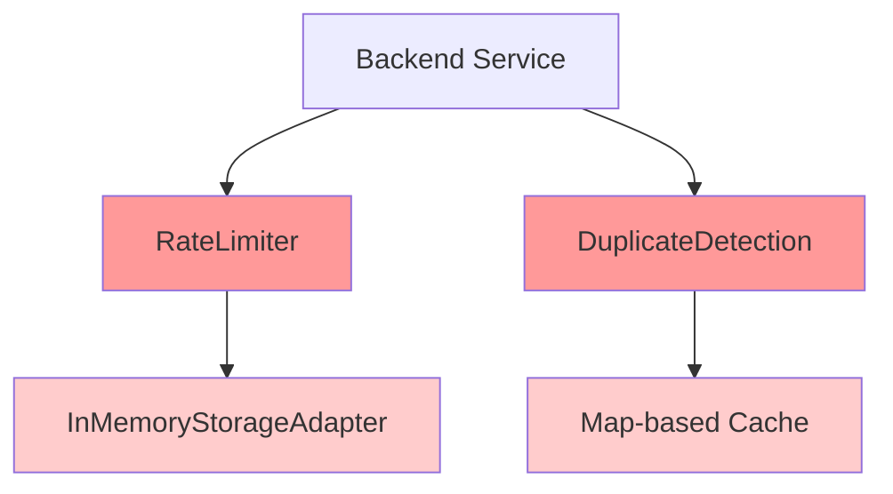
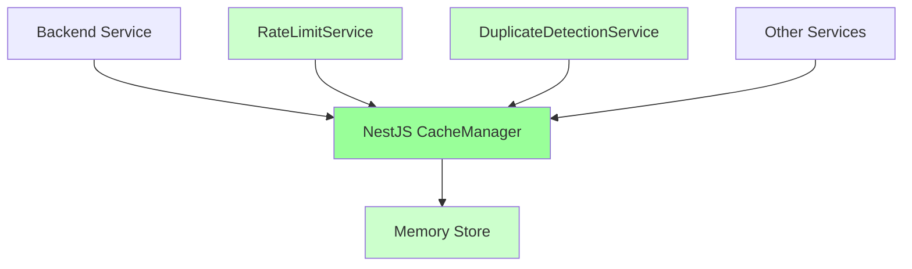

# 🔄 Cache Manager Refactoring Plan

**BlueLight Hub Backend - Migration zu NestJS Cache Manager**

---

## 📋 Executive Summary

Migration von zwei separaten In-Memory Cache-Implementierungen zu einer zentralen NestJS Cache Manager Lösung für
bessere Wartbarkeit, Code-Vereinheitlichung und Developer Experience.

**Zeitrahmen**: 1-2 Sprints (6-12 Tage)  
**Risiko**: Sehr niedrig (vereinfachte Migration)  
**Impact**: Mittel (Code-Qualität, Wartbarkeit)

---

## 🎯 Ziele

1. **Vereinheitlichung**: Ein zentrales Cache-System statt zwei separate Implementierungen
2. **Wartbarkeit**: Reduktion von Custom-Code, Nutzung bewährter NestJS Patterns
3. **Konsistenz**: Einheitliche Cache-API für alle Use Cases
4. **Performance**: Optimierte In-Memory Cache-Strategie
5. **Developer Experience**: Einfachere Konfiguration und Testing mit NestJS Decorators

---

## 🏗️ Architektur-Übersicht

### Current State (IST)



### Target State (SOLL)



---

## 📦 Phase 1: Foundation Setup (Sprint 1, Tag 1-2)

### 1.1 Dependencies Verification

```bash
# Bereits installierte Dependencies prüfen
pnpm list @nestjs/cache-manager cache-manager
# Diese sind bereits vorhanden und müssen nur konfiguriert werden
```

### 1.2 CacheModule Configuration

```typescript
// src/common/cache/cache.config.ts
import {CacheModuleOptions, CacheOptionsFactory} from '@nestjs/cache-manager';
import {Injectable} from '@nestjs/common';
import {ConfigService} from '@nestjs/config';

@Injectable()
export class CacheConfigService implements CacheOptionsFactory {
    constructor(private configService: ConfigService) {
    }

    createCacheOptions(): CacheModuleOptions {
        return {
            isGlobal: true,
            store: 'memory',
            ttl: this.configService.get('CACHE_TTL_DEFAULT', 60), // default TTL in seconds
            max: this.configService.get('CACHE_MAX_ITEMS', 1000), // max items in cache
        };
    }
}
```

### 1.3 Environment Variables

```env
# .env.example additions
CACHE_TTL_DEFAULT=60        # Default TTL in seconds
CACHE_TTL_RATE_LIMIT=60     # Rate limit window in seconds
CACHE_TTL_DUPLICATE=300     # Duplicate detection TTL in seconds
CACHE_MAX_ITEMS=1000        # Maximum items in memory cache
```

### 1.4 Module Registration

```typescript
// src/common/common.module.ts
import {Module} from '@nestjs/common';
import {CacheModule} from '@nestjs/cache-manager';
import {CacheConfigService} from './cache/cache.config';

@Module({
    imports: [
        CacheModule.registerAsync({
            useClass: CacheConfigService,
            isGlobal: true,
        }),
    ],
    // ... existing providers
})
export class CommonModule {}
```

---

## 🔄 Phase 2: Rate Limiter Migration (Sprint 1, Tag 3-4)

### 2.1 New Cache-based Rate Limiter

```typescript
// src/common/services/cache-rate-limiter.service.ts
import {Injectable, Inject} from '@nestjs/common';
import {CACHE_MANAGER} from '@nestjs/cache-manager';
import {Cache} from 'cache-manager';

@Injectable()
export class CacheRateLimiterService {
    constructor(
        @Inject(CACHE_MANAGER) private cacheManager: Cache,
    ) {}

    async isAllowed(
        key: string,
        maxRequests: number,
        windowMs: number
    ): Promise<boolean> {
        const fullKey = `rate_limit:${key}`;
        const count = await this.cacheManager.get<number>(fullKey) || 0;

        if (count >= maxRequests) {
            return false;
        }

        await this.cacheManager.set(
            fullKey,
            count + 1,
            windowMs
        );

        return true;
    }

    async getStatus(key: string): Promise<{
        remaining: number;
        reset: number;
        total: number;
    }> {
        // Implementation details...
    }
}
```

### 2.2 Updated Rate Limit Guard

```typescript
// src/common/guards/cache-rate-limit.guard.ts
@Injectable()
export class CacheRateLimitGuard implements CanActivate {
    constructor(
        private readonly rateLimiter: CacheRateLimiterService,
        private readonly reflector: Reflector,
    ) {}

    async canActivate(context: ExecutionContext): Promise<boolean> {
        // Use new CacheRateLimiterService
    }
}
```

### 2.3 Migration Strategy

- [ ] Implement CacheRateLimiterService parallel zu existing RateLimiter
- [ ] Add Feature Flag für gradual rollout
- [ ] A/B Test both implementations
- [ ] Monitor performance metrics

---

## 🔁 Phase 3: Duplicate Detection Migration (Sprint 1, Tag 5-6)

### 3.1 Cache-based Duplicate Detection

```typescript
// src/common/services/cache-duplicate-detection.service.ts
@Injectable()
export class CacheDuplicateDetectionService {
    constructor(
        @Inject(CACHE_MANAGER) private cacheManager: Cache,
    ) {}

    async executeIdempotent<T>(
        operationId: string,
        operation: () => Promise<T>,
        data: unknown,
    ): Promise<T> {
        const hash = this.generateHash(operationId, data);
        const cacheKey = `duplicate:${hash}`;

        // Check cache
        const cached = await this.cacheManager.get<T>(cacheKey);
        if (cached) {
            return cached;
        }

        // Execute and cache
        const result = await operation();
        await this.cacheManager.set(
            cacheKey,
            result,
            this.configService.get('CACHE_TTL_DUPLICATE')
        );

        return result;
    }
}
```

### 3.2 Service Integration Points

- [ ] Einsatz Controller operations
- [ ] Auth service operations
- [ ] File upload operations
- [ ] Batch operations

---

## 🧪 Phase 4: Testing & Validation (Sprint 2, Tag 1-2)

### 4.1 Unit Tests

```typescript
// src/common/services/__tests__/cache-rate-limiter.service.spec.ts
describe('CacheRateLimiterService', () => {
    let service: CacheRateLimiterService;
    let cacheManager: Cache;

    beforeEach(async () => {
        const module = await Test.createTestingModule({
            providers: [
                CacheRateLimiterService,
                {
                    provide: CACHE_MANAGER,
                    useValue: {
                        get: jest.fn(),
                        set: jest.fn(),
                        del: jest.fn(),
                    },
                },
            ],
        }).compile();
    });

    // Test cases...
});
```

### 4.2 Integration Tests

- [ ] Cache consistency tests
- [ ] Memory limit enforcement
- [ ] TTL expiration tests
- [ ] Load testing

### 4.3 Performance Metrics

| Metric           | Current | Target | Actual |
|------------------|---------|--------|--------|
| Rate Limit Check | <5ms    | <2ms   | TBD    |
| Duplicate Check  | <10ms   | <3ms   | TBD    |
| Memory Usage     | 100MB   | 50MB   | TBD    |
| Cache Hit Ratio  | N/A     | >80%   | TBD    |

---

## 🚀 Phase 5: Rollout & Monitoring (Sprint 2, Tag 3)

### 5.1 Feature Flags

```typescript
// src/common/config/feature-flags.ts
export enum FeatureFlags {
    USE_CACHE_MANAGER_RATE_LIMIT = 'USE_CACHE_MANAGER_RATE_LIMIT',
    USE_CACHE_MANAGER_DUPLICATE = 'USE_CACHE_MANAGER_DUPLICATE',
}

// Gradual rollout percentages
const ROLLOUT_SCHEDULE = {
    day1: 10,  // 10% traffic
    day2: 25,  // 25% traffic
    day3: 50,  // 50% traffic
    day4: 100, // 100% traffic
};
```

### 5.2 Monitoring Dashboard

- [ ] Cache hit/miss ratio
- [ ] Memory usage monitoring
- [ ] Response time percentiles
- [ ] Cache eviction rates
- [ ] TTL effectiveness

### 5.3 Rollback Plan

```bash
# Quick rollback script
#!/bin/bash
export USE_CACHE_MANAGER_RATE_LIMIT=false
export USE_CACHE_MANAGER_DUPLICATE=false
pm2 restart backend --update-env
```

---

## 🧹 Phase 6: Cleanup (Sprint 2, Tag 4-5)

### 6.1 Code Removal Checklist

- [ ] Remove `DuplicateDetectionUtil` class
- [ ] Remove `RateLimiter` class
- [ ] Remove `InMemoryStorageAdapter`
- [ ] Remove old test files
- [ ] Update imports across codebase

### 6.2 Documentation Updates

- [ ] Update API documentation
- [ ] Update deployment guides
- [ ] Update environment variable docs
- [ ] Add cache configuration guide
- [ ] Update troubleshooting guide

---

## ⚠️ Risk Assessment & Mitigation

| Risk                    | Probability | Impact | Mitigation                    |
|-------------------------|-------------|--------|-------------------------------|
| Memory overflow         | Low         | Medium | Max items limit & TTL config  |
| Performance degradation | Very Low    | Low    | Load testing & benchmarks     |
| Cache invalidation      | Low         | Low    | Clear TTL strategy            |
| Breaking changes        | Very Low    | Medium | Feature flags & rollback plan |

---

## 📊 Success Criteria

- ✅ All tests passing (unit, integration, e2e)
- ✅ No performance degradation (p99 < 50ms)
- ✅ Zero downtime migration
- ✅ Memory usage optimized (< 50MB for cache)
- ✅ Cache hit ratio > 80%
- ✅ Clean code architecture
- ✅ Documentation complete

---

## 🎯 Decision Points

### Sprint 1 Review

- [ ] Go/No-Go for Phase 2
- [ ] Performance acceptable?
- [ ] Any blocking issues?

### Sprint 2 Review

- [ ] Ready for production?
- [ ] Rollout strategy confirmed?
- [ ] Monitoring in place?

### Sprint 3 Review

- [ ] Legacy code removed?
- [ ] Documentation complete?
- [ ] Post-mortem needed?

---

## 📚 References

- [NestJS Caching Documentation](https://docs.nestjs.com/techniques/caching)
- [Cache Manager Documentation](https://github.com/node-cache-manager/node-cache-manager)
- [Memory Cache Best Practices](https://docs.nestjs.com/techniques/caching#in-memory-cache)
- [Rate Limiting Strategies](https://cloud.google.com/architecture/rate-limiting-strategies-techniques)

---

## 👥 Team Responsibilities

| Phase               | Owner        | Reviewer     | Stakeholders |
|---------------------|--------------|--------------|--------------|
| Foundation          | Backend Lead | Architect    | DevOps       |
| Rate Limiter        | Senior Dev   | Backend Lead | Security     |
| Duplicate Detection | Senior Dev   | Backend Lead | QA           |
| Testing             | QA Lead      | Backend Lead | All          |
| Rollout             | DevOps       | Backend Lead | Product      |
| Cleanup             | Backend Team | Architect    | All          |

---

## 📝 Notes

- Consider LRU (Least Recently Used) eviction policy for memory management
- Implement cache key namespacing for better organization
- Monitor memory usage patterns during peak loads
- Plan for cache invalidation patterns
- Document cache key naming conventions
- Consider implementing cache statistics endpoint for monitoring

---

**Document Version**: 2.0.0  
**Created**: 2025-01-29  
**Updated**: 2025-01-29  
**Author**: Winston (System Architect)  
**Status**: FINAL - In-Memory Cache Strategy