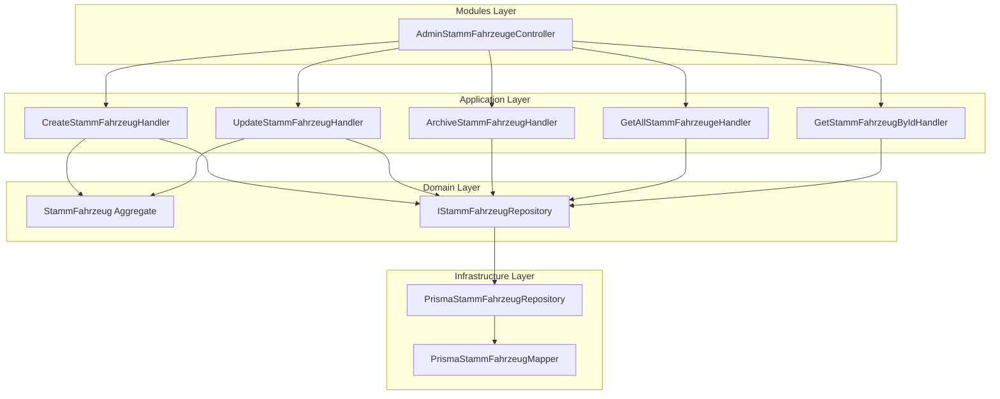

# Story 2.1: Stamm-Fahrzeuge verwalten

**Epic:** 2 - Stammdaten-Administration
**Story Key:** 2-1-stamm-fahrzeuge-verwalten
**Status:** ready-for-dev
**Created:** 2025-12-16
**FRs covered:** FR32 (Stamm-Fahrzeuge)

---

## Pre-Requisites

- [x] Epic 1 Stories sind DONE (Admin-Grundkonfiguration)
- [x] Story 2.0 (Prisma Schema Stammdaten) ist DONE
  - ✅ `StammFahrzeug` Model mit allen Feldern vorhanden
  - ✅ Archive-Pattern (`archivedAt`, `archivedBy`) implementiert
  - ✅ Audit-Trail (`createdAt`, `updatedAt`, `createdBy`, `updatedBy`) vorhanden
  - ✅ FK zu `Fahrzeugtyp` (aus Epic 1) existiert
  - ✅ Seed-Daten mit 4 Beispiel-Fahrzeugen vorhanden
- [x] `Fahrzeugtyp` CRUD aus Story 1.2 funktioniert (Dropdown-Daten)

---

## User Story

**Als** Admin (Maria),
**möchte ich** Fahrzeug-Stammdaten vollständig verwalten (anlegen, bearbeiten, anzeigen, archivieren),
**damit** die Flotte korrekt abgebildet und für Einsätze verfügbar ist.

---

## Acceptance Criteria

### AC1: Fahrzeug-Liste anzeigen

**Given** ich bin als Admin eingeloggt
**When** ich `GET /api/v-alpha/admin/stammdaten/fahrzeuge` aufrufe
**Then** erhalte ich eine Liste aller **aktiven** Fahrzeuge (Rufname, Funkrufname, Fahrzeugtyp, Kennzeichen)
**And** archivierte Fahrzeuge werden standardmäßig ausgeblendet
**And** Tabelle lädt innerhalb 200ms

**Technical Validation:**
- Endpoint: `GET /api/v-alpha/admin/stammdaten/fahrzeuge?includeArchived=false` (default)
- Query-Param: `includeArchived=true` zeigt auch archivierte
- Response: `StammFahrzeugDto[]` mit Fahrzeugtyp-Relation (eager loaded)
- Performance: Index auf `archivedAt` nutzen

### AC2: Neues Fahrzeug anlegen

**Given** ich bin auf der Fahrzeugverwaltungsseite
**When** ich `POST /api/v-alpha/admin/stammdaten/fahrzeuge` mit gültigen Daten aufrufe
**Then** wird Fahrzeug gespeichert mit Audit-Trail (`createdAt`, `createdBy`)
**And** Response enthält das erstellte Fahrzeug mit generierter ID
**And** Antwort erfolgt innerhalb 200ms

**Technical Validation:**
- Endpoint: `POST /api/v-alpha/admin/stammdaten/fahrzeuge`
- Body: `CreateStammFahrzeugDto` (rufname, funkrufname, fahrzeugtypId, kennzeichen?, baujahr?, funkkenungBOS?)
- Validierung:
  - `rufname`: Required, 2-100 Zeichen
  - `funkrufname`: Required, UNIQUE, 2-50 Zeichen
  - `fahrzeugtypId`: Required, muss existieren (FK-Validierung)
  - `kennzeichen`: Optional, 2-20 Zeichen
  - `baujahr`: Optional, Integer > 1900
  - `funkkenungBOS`: Optional, 2-50 Zeichen
- Response: `StammFahrzeugDto` (HTTP 201)
- Error: HTTP 409 wenn `funkrufname` bereits existiert

### AC3: Fahrzeug bearbeiten

**Given** ein Fahrzeug existiert (nicht archiviert)
**When** ich `PATCH /api/v-alpha/admin/stammdaten/fahrzeuge/:id` aufrufe
**Then** werden Änderungen gespeichert
**And** `updatedAt` und `updatedBy` werden aktualisiert

**Technical Validation:**
- Endpoint: `PATCH /api/v-alpha/admin/stammdaten/fahrzeuge/:id`
- Body: `UpdateStammFahrzeugDto` (partial, alle Felder optional außer `fahrzeugtypId`)
- **IMMUTABLE**: `fahrzeugtypId` kann NICHT geändert werden (Archivieren → Neues Fahrzeug)
- Error: HTTP 404 wenn ID nicht existiert
- Error: HTTP 409 wenn neuer `funkrufname` bereits vergeben

### AC4: Fahrzeug archivieren

**Given** ein Fahrzeug ist aktiv (nicht archiviert)
**When** ich `PATCH /api/v-alpha/admin/stammdaten/fahrzeuge/:id/archive` aufrufe
**Then** wird `archivedAt` (jetzt) und `archivedBy` (aktueller User) gesetzt
**And** Fahrzeug verschwindet aus Standard-Liste

**Technical Validation:**
- Endpoint: `PATCH /api/v-alpha/admin/stammdaten/fahrzeuge/:id/archive`
- Idempotenz: Bereits archiviert → spezifischer Fehler `ALREADY_ARCHIVED`
- Response: `StammFahrzeugDto` mit gesetzten Archive-Feldern
- **KEIN DELETE!** Stammdaten werden nur archiviert, nie gelöscht

### AC5: Validierung

**Given** ich fülle das Formular aus
**When** Pflichtfelder fehlen (Rufname, Funkrufname, Fahrzeugtyp)
**Then** erhalte ich HTTP 400 mit strukturierten Validierungsfehlern

**Technical Validation:**
- class-validator Decorators auf DTOs
- `@IsNotEmpty()`, `@IsString()`, `@MinLength()`, `@MaxLength()`
- Nested Validation für `fahrzeugtypId` FK-Existenz
- Error Response: `{ statusCode: 400, message: [...], error: 'Bad Request' }`

### AC6: Authorization

**Given** ich bin nicht als Admin eingeloggt
**When** ich auf Fahrzeugverwaltung zugreife
**Then** erhalte ich HTTP 403 Forbidden

**Technical Validation:**
- Guard: `AdminJwtAuthGuard` auf Controller-Klasse
- Rate Limiting: `@Throttle({ default: { limit: 20, ttl: 60000 } })`
- GET-Endpoints: Limit 30 Requests/Minute
- Mutations: Limit 10 Requests/Minute

---

## Developer Context

### Warum diese Story existiert

**Foundation für Epic 3-8:** StammFahrzeuge werden referenziert von:
- Epic 3: Fahrzeug-Einsatz (→ `einsatzFahrzeugeId` FK zu `StammFahrzeug`)
- Epic 6: Taktische Übersicht (→ Fahrzeug-Status-Liste)
- Epic 8: Lagekarte-Integration (→ Fahrzeuge als POIs)

### Kritische Semantiken

| Pattern | Verwendung | Regel |
|---------|------------|-------|
| `archivedAt/By` | Stammdaten | **KEIN `isDeleted`!** Archiviert = ausgeblendet, historisch verfügbar |
| `fahrzeugtypId` | StammFahrzeug | **IMMUTABLE!** Bei Umrüstung: neues Fahrzeug anlegen, altes archivieren |
| `funkrufname` | StammFahrzeug | **UNIQUE!** Funkrufzeichen muss eindeutig sein |

### Architektur-Übersicht



### Quick Reference

| Aktion | Endpoint | Handler | Error Codes |
|--------|----------|---------|-------------|
| Liste | `GET /` | GetAllStammFahrzeugeHandler | - |
| Detail | `GET /:id` | GetStammFahrzeugByIdHandler | NOT_FOUND |
| Create | `POST /` | CreateStammFahrzeugHandler | FUNKRUFNAME_DUPLICATE, INVALID_FAHRZEUGTYP |
| Update | `PATCH /:id` | UpdateStammFahrzeugHandler | NOT_FOUND, FUNKRUFNAME_DUPLICATE, FAHRZEUGTYP_IMMUTABLE |
| Archive | `PATCH /:id/archive` | ArchiveStammFahrzeugHandler | NOT_FOUND, ALREADY_ARCHIVED |

### Quick Start

```bash
# 1. Backend starten (Port 3090)
pnpm --filter @bluelight-hub/backend dev

# 2. Nach Implementierung: API-Client generieren
pnpm run generate-api

# 3. Swagger UI für Tests
open http://localhost:3090/api
```

---

## Technical Requirements

### Backend Implementation

#### 1. DI Token hinzufügen

**Datei:** `packages/backend/src/infrastructure/di-tokens.ts`

```typescript
export const KRAEFTE_REPOSITORIES = {
  // ... existing tokens ...
  STAMM_FAHRZEUG: Symbol('IStammFahrzeugRepository'),
} as const;
```

#### 2. Domain Layer

**StammFahrzeugId Value Object:**
```typescript
// packages/backend/src/domain/kraefte/value-objects/stamm-fahrzeug-id.ts
import { Result } from '@domain/common/result';
import { isCuid } from '@paralleldrive/cuid2';

export class StammFahrzeugId {
  private constructor(private readonly _value: string) {}

  get value(): string {
    return this._value;
  }

  static create(id: string): Result<StammFahrzeugId> {
    if (!id || !isCuid(id)) {
      return Result.fail('Ungültige StammFahrzeug-ID');
    }
    return Result.ok(new StammFahrzeugId(id));
  }

  static generate(): StammFahrzeugId {
    return new StammFahrzeugId(createId());
  }
}
```

**StammFahrzeug Aggregate:**
```typescript
// packages/backend/src/domain/kraefte/aggregates/stamm-fahrzeug.aggregate.ts
export interface StammFahrzeugProps {
  id: StammFahrzeugId;
  rufname: string;
  funkrufname: string;
  fahrzeugtypId: string;
  kennzeichen?: string;
  baujahr?: number;
  funkkenungBOS?: string;
  archivedAt?: Date;
  archivedBy?: string;
  createdAt: Date;
  updatedAt: Date;
  createdBy: string;
  updatedBy?: string;
}

export class StammFahrzeug extends AggregateRoot<StammFahrzeugProps> {
  static create(props: CreateStammFahrzeugProps): Result<StammFahrzeug>;
  static reconstitute(props: StammFahrzeugProps): Result<StammFahrzeug>;

  update(props: UpdateStammFahrzeugProps): Result<void>;
  archive(archivedBy: string): Result<void>;

  get isArchived(): boolean { return !!this._props.archivedAt; }
}
```

**Repository Interface:**
```typescript
// packages/backend/src/domain/kraefte/repositories/i-stamm-fahrzeug.repository.ts
export interface IStammFahrzeugRepository {
  save(fahrzeug: StammFahrzeug, tx?: TransactionContext): Promise<Result<void>>;
  findById(id: StammFahrzeugId): Promise<Result<StammFahrzeug | null>>;
  findByFunkrufname(funkrufname: string): Promise<Result<StammFahrzeug | null>>;
  findAll(includeArchived?: boolean): Promise<Result<StammFahrzeug[]>>;
  exists(funkrufname: string): Promise<Result<boolean>>;
}
```

**Error Codes:**
```typescript
// packages/backend/src/domain/kraefte/common/stamm-fahrzeug-error-codes.ts
export const STAMM_FAHRZEUG_ERROR_CODES = {
  NOT_FOUND: 'STAMM_FAHRZEUG_NOT_FOUND',
  FUNKRUFNAME_DUPLICATE: 'STAMM_FAHRZEUG_FUNKRUFNAME_DUPLICATE',
  ALREADY_ARCHIVED: 'STAMM_FAHRZEUG_ALREADY_ARCHIVED',
  INVALID_FAHRZEUGTYP: 'STAMM_FAHRZEUG_INVALID_FAHRZEUGTYP',
  FAHRZEUGTYP_IMMUTABLE: 'STAMM_FAHRZEUG_FAHRZEUGTYP_IMMUTABLE',
  VALIDATION_ERROR: 'STAMM_FAHRZEUG_VALIDATION_ERROR',
} as const;
```

**Validation Constants:**
```typescript
// packages/backend/src/domain/kraefte/constants/stamm-fahrzeug-validation.constants.ts
export const STAMM_FAHRZEUG_RUFNAME_MIN_LENGTH = 2;
export const STAMM_FAHRZEUG_RUFNAME_MAX_LENGTH = 100;
export const STAMM_FAHRZEUG_FUNKRUFNAME_MIN_LENGTH = 2;
export const STAMM_FAHRZEUG_FUNKRUFNAME_MAX_LENGTH = 50;
export const STAMM_FAHRZEUG_KENNZEICHEN_MAX_LENGTH = 20;
export const STAMM_FAHRZEUG_FUNKKENNUNG_MAX_LENGTH = 50;
export const STAMM_FAHRZEUG_BAUJAHR_MIN = 1900;
```

#### 3. Application Layer

**Commands + Handlers Pattern:**

```typescript
// packages/backend/src/application/kraefte/stamm-fahrzeuge/commands/create-stamm-fahrzeug/create-stamm-fahrzeug.command.ts
export class CreateStammFahrzeugCommand {
  private constructor(
    public readonly rufname: string,
    public readonly funkrufname: string,
    public readonly fahrzeugtypId: string,
    public readonly kennzeichen: string | undefined,
    public readonly baujahr: number | undefined,
    public readonly funkkenungBOS: string | undefined,
    public readonly createdBy: string,
  ) {}

  static create(dto: CreateStammFahrzeugDto, userId: string): Result<CreateStammFahrzeugCommand> {
    // Validierung mit Zod oder inline
    return Result.ok(new CreateStammFahrzeugCommand(...));
  }
}
```

```typescript
// packages/backend/src/application/kraefte/stamm-fahrzeuge/commands/create-stamm-fahrzeug/create-stamm-fahrzeug.handler.ts
@Injectable()
export class CreateStammFahrzeugHandler extends TransactionalCommandHandler<
  CreateStammFahrzeugCommand,
  StammFahrzeugDto
> {
  constructor(
    @Inject(KRAEFTE_REPOSITORIES.STAMM_FAHRZEUG)
    private readonly repository: IStammFahrzeugRepository,
    @Inject(KRAEFTE_REPOSITORIES.FAHRZEUGTYP)
    private readonly fahrzeugtypRepository: IFahrzeugtypRepository,
    @Inject(OUTBOX_REPOSITORY)
    outboxRepository: IOutboxRepository,
    prisma: PrismaService,
  ) {
    super(outboxRepository, prisma);
  }

  protected async executeInTransaction(
    command: CreateStammFahrzeugCommand,
    tx: TransactionContext,
  ): Promise<Result<{ result: StammFahrzeugDto; events: DomainEvent[] }>> {
    // 1. Fahrzeugtyp existiert?
    const fahrzeugtypExists = await this.fahrzeugtypRepository.findById(command.fahrzeugtypId);
    if (!fahrzeugtypExists) {
      return Result.fail(STAMM_FAHRZEUG_ERROR_CODES.INVALID_FAHRZEUGTYP);
    }

    // 2. Funkrufname unique?
    const exists = await this.repository.exists(command.funkrufname);
    if (exists.value) {
      return Result.fail(STAMM_FAHRZEUG_ERROR_CODES.FUNKRUFNAME_DUPLICATE);
    }

    // 3. Aggregate erstellen
    const fahrzeugResult = StammFahrzeug.create({
      rufname: command.rufname,
      funkrufname: command.funkrufname,
      fahrzeugtypId: command.fahrzeugtypId,
      kennzeichen: command.kennzeichen,
      baujahr: command.baujahr,
      funkkenungBOS: command.funkkenungBOS,
      createdBy: command.createdBy,
    });
    if (fahrzeugResult.isFailure) {
      return Result.fail(fahrzeugResult.error);
    }

    // 4. Speichern
    await this.repository.save(fahrzeugResult.value, tx);

    // 5. Events sammeln
    const events = fahrzeugResult.value.getDomainEvents();
    fahrzeugResult.value.clearDomainEvents();

    return Result.ok({
      result: StammFahrzeugMapper.toDto(fahrzeugResult.value),
      events,
    });
  }
}
```

**DTOs:**
```typescript
// packages/backend/src/application/kraefte/stamm-fahrzeuge/dto/create-stamm-fahrzeug.dto.ts
export class CreateStammFahrzeugDto {
  @ApiProperty({ description: 'Fahrzeugbezeichnung', example: 'RTW 1' })
  @IsString()
  @MinLength(STAMM_FAHRZEUG_RUFNAME_MIN_LENGTH)
  @MaxLength(STAMM_FAHRZEUG_RUFNAME_MAX_LENGTH)
  rufname: string;

  @ApiProperty({ description: 'Funkrufzeichen (UNIQUE)', example: 'Rotkreuz 83/1' })
  @IsString()
  @MinLength(STAMM_FAHRZEUG_FUNKRUFNAME_MIN_LENGTH)
  @MaxLength(STAMM_FAHRZEUG_FUNKRUFNAME_MAX_LENGTH)
  funkrufname: string;

  @ApiProperty({ description: 'Fahrzeugtyp-ID (FK zu Fahrzeugtyp aus Epic 1)' })
  @IsString()
  @IsNotEmpty()
  fahrzeugtypId: string;

  @ApiPropertyOptional({ description: 'Kennzeichen', example: 'DA-RK 101' })
  @IsOptional()
  @IsString()
  @MaxLength(STAMM_FAHRZEUG_KENNZEICHEN_MAX_LENGTH)
  kennzeichen?: string;

  @ApiPropertyOptional({ description: 'Baujahr', example: 2022 })
  @IsOptional()
  @IsInt()
  @Min(STAMM_FAHRZEUG_BAUJAHR_MIN)
  baujahr?: number;

  @ApiPropertyOptional({ description: 'BOS-Funkkennung' })
  @IsOptional()
  @IsString()
  @MaxLength(STAMM_FAHRZEUG_FUNKKENNUNG_MAX_LENGTH)
  funkkenungBOS?: string;
}
```

```typescript
// packages/backend/src/application/kraefte/stamm-fahrzeuge/dto/stamm-fahrzeug.dto.ts
export class StammFahrzeugDto {
  @ApiProperty() id: string;
  @ApiProperty() rufname: string;
  @ApiProperty() funkrufname: string;
  @ApiProperty() fahrzeugtypId: string;
  @ApiProperty({ type: FahrzeugtypDto }) fahrzeugtyp: FahrzeugtypDto;
  @ApiPropertyOptional() kennzeichen?: string;
  @ApiPropertyOptional() baujahr?: number;
  @ApiPropertyOptional() funkkenungBOS?: string;
  @ApiPropertyOptional() archivedAt?: Date;
  @ApiPropertyOptional() archivedBy?: string;
  @ApiProperty() createdAt: Date;
  @ApiProperty() updatedAt: Date;
  @ApiProperty() createdBy: string;
  @ApiPropertyOptional() updatedBy?: string;
}
```

#### 4. Infrastructure Layer

**Prisma Repository:**
```typescript
// packages/backend/src/infrastructure/kraefte/repositories/prisma-stamm-fahrzeug.repository.ts
@Injectable()
export class PrismaStammFahrzeugRepository implements IStammFahrzeugRepository {
  constructor(private readonly prisma: PrismaService) {}

  async save(fahrzeug: StammFahrzeug, tx?: TransactionContext): Promise<Result<void>> {
    const client = tx?.prisma ?? this.prisma;
    const data = PrismaStammFahrzeugMapper.toPersistence(fahrzeug);

    try {
      await client.stammFahrzeug.upsert({
        where: { id: fahrzeug.id.value },
        create: data,
        update: data,
      });
      return Result.ok(undefined);
    } catch (error) {
      if (isPrismaUniqueConstraintError(error, 'funkrufname')) {
        return Result.fail(STAMM_FAHRZEUG_ERROR_CODES.FUNKRUFNAME_DUPLICATE);
      }
      throw error;
    }
  }

  async findAll(includeArchived = false): Promise<Result<StammFahrzeug[]>> {
    const where = includeArchived ? {} : { archivedAt: null };
    const entities = await this.prisma.stammFahrzeug.findMany({
      where,
      include: { fahrzeugtyp: true },
      orderBy: { rufname: 'asc' },
    });
    return Result.ok(entities.map(PrismaStammFahrzeugMapper.toDomain));
  }

  // ... weitere Methoden
}
```

**Mapper (KRITISCH: NULL → undefined!):**

> ⚠️ **HÄUFIGSTER BUG aus Epic 1!** Prisma gibt `null` für optionale Felder zurück, Domain verwendet `undefined`.
> **ALLE optionalen Felder müssen konvertiert werden:**

| Prisma Typ | Domain Typ | Konvertierung |
|------------|------------|---------------|
| `string \| null` | `string \| undefined` | `(entity.field as string \| null) ?? undefined` |
| `number \| null` | `number \| undefined` | `(entity.field as number \| null) ?? undefined` |
| `Date \| null` | `Date \| undefined` | `(entity.field as Date \| null) ?? undefined` |

```typescript
// packages/backend/src/infrastructure/kraefte/mappers/prisma-stamm-fahrzeug.mapper.ts
export class PrismaStammFahrzeugMapper {
  static toDomain(entity: PrismaStammFahrzeugWithRelations): StammFahrzeug {
    return StammFahrzeug.reconstitute({
      id: StammFahrzeugId.create(entity.id).value!,
      rufname: entity.rufname,
      funkrufname: entity.funkrufname,
      fahrzeugtypId: entity.fahrzeugtypId,
      // KRITISCH: NULL → undefined für ALLE optionalen Felder!
      kennzeichen: (entity.kennzeichen as string | null) ?? undefined,
      baujahr: (entity.baujahr as number | null) ?? undefined,
      funkkenungBOS: (entity.funkkenungBOS as string | null) ?? undefined,
      archivedAt: (entity.archivedAt as Date | null) ?? undefined,
      archivedBy: (entity.archivedBy as string | null) ?? undefined,
      createdAt: entity.createdAt,
      updatedAt: entity.updatedAt,
      createdBy: entity.createdBy,
      updatedBy: (entity.updatedBy as string | null) ?? undefined,
    }).value!;
  }

  static toPersistence(aggregate: StammFahrzeug): Prisma.StammFahrzeugCreateInput {
    return {
      id: aggregate.id.value,
      rufname: aggregate.rufname,
      funkrufname: aggregate.funkrufname,
      fahrzeugtyp: { connect: { id: aggregate.fahrzeugtypId } },
      kennzeichen: aggregate.kennzeichen ?? null,
      baujahr: aggregate.baujahr ?? null,
      funkkenungBOS: aggregate.funkkenungBOS ?? null,
      archivedAt: aggregate.archivedAt ?? null,
      archivedBy: aggregate.archivedBy ?? null,
      creator: { connect: { id: aggregate.createdBy } },
      updater: aggregate.updatedBy ? { connect: { id: aggregate.updatedBy } } : undefined,
    };
  }
}
```

#### 5. Modules Layer (Controller)

```typescript
// packages/backend/src/modules/kraefte/controllers/admin-stamm-fahrzeuge.controller.ts
@Controller('admin/stammdaten/fahrzeuge')
@ApiTags('admin-stammdaten-fahrzeuge')
@UseGuards(AdminJwtAuthGuard)
@ApiBearerAuth()
@ApiForbiddenResponse({ description: 'Forbidden - Admin-Rechte erforderlich' })
@ApiInternalServerErrorResponse({ description: 'Interner Serverfehler' })
export class AdminStammFahrzeugeController {
  constructor(
    private readonly createHandler: CreateStammFahrzeugHandler,
    private readonly updateHandler: UpdateStammFahrzeugHandler,
    private readonly archiveHandler: ArchiveStammFahrzeugHandler,
    private readonly getAllHandler: GetAllStammFahrzeugeHandler,
    private readonly getByIdHandler: GetStammFahrzeugByIdHandler,
  ) {}

  @Get()
  @Throttle({ default: { limit: 30, ttl: 60000 } })
  @ApiOperation({ summary: 'Alle Stamm-Fahrzeuge auflisten' })
  @ApiOkResponse({ type: [StammFahrzeugDto] })
  @ApiQuery({ name: 'includeArchived', required: false, type: Boolean })
  async findAll(
    @Query('includeArchived', new ParseBoolPipe({ optional: true })) includeArchived?: boolean,
  ): Promise<StammFahrzeugDto[]> {
    const result = await this.getAllHandler.execute({ includeArchived });
    if (result.isFailure) {
      throw new InternalServerErrorException(result.error);
    }
    return result.value;
  }

  @Get(':id')
  @Throttle({ default: { limit: 30, ttl: 60000 } })
  @ApiOperation({ summary: 'Stamm-Fahrzeug nach ID laden' })
  @ApiOkResponse({ type: StammFahrzeugDto })
  @ApiNotFoundResponse({ description: 'Fahrzeug nicht gefunden' })
  async findById(@Param('id') id: string): Promise<StammFahrzeugDto> {
    const result = await this.getByIdHandler.execute({ id });
    if (result.isFailure) {
      if (result.error === STAMM_FAHRZEUG_ERROR_CODES.NOT_FOUND) {
        throw new NotFoundException('Fahrzeug nicht gefunden');
      }
      throw new InternalServerErrorException(result.error);
    }
    return result.value;
  }

  @Post()
  @Throttle({ default: { limit: 10, ttl: 60000 } })
  @ApiOperation({ summary: 'Neues Stamm-Fahrzeug anlegen' })
  @ApiCreatedResponse({ type: StammFahrzeugDto })
  @ApiBadRequestResponse({ description: 'Validierungsfehler' })
  @ApiConflictResponse({ description: 'Funkrufname bereits vergeben' })
  async create(
    @Body() dto: CreateStammFahrzeugDto,
    @CurrentUser() user: UserPayload,
  ): Promise<StammFahrzeugDto> {
    const commandResult = CreateStammFahrzeugCommand.create(dto, user.sub);
    if (commandResult.isFailure) {
      throw new BadRequestException(commandResult.error);
    }

    const result = await this.createHandler.execute(commandResult.value);
    if (result.isFailure) {
      if (result.error === STAMM_FAHRZEUG_ERROR_CODES.FUNKRUFNAME_DUPLICATE) {
        throw new ConflictException(`Funkrufname '${dto.funkrufname}' ist bereits vergeben`);
      }
      if (result.error === STAMM_FAHRZEUG_ERROR_CODES.INVALID_FAHRZEUGTYP) {
        throw new BadRequestException('Fahrzeugtyp existiert nicht');
      }
      throw new InternalServerErrorException(result.error);
    }
    return result.value;
  }

  @Patch(':id')
  @Throttle({ default: { limit: 10, ttl: 60000 } })
  @ApiOperation({ summary: 'Stamm-Fahrzeug bearbeiten' })
  @ApiOkResponse({ type: StammFahrzeugDto })
  @ApiBadRequestResponse({ description: 'Validierungsfehler' })
  @ApiNotFoundResponse({ description: 'Fahrzeug nicht gefunden' })
  @ApiConflictResponse({ description: 'Funkrufname bereits vergeben oder Fahrzeugtyp-Änderung versucht' })
  async update(
    @Param('id') id: string,
    @Body() dto: UpdateStammFahrzeugDto,
    @CurrentUser() user: UserPayload,
  ): Promise<StammFahrzeugDto> {
    const commandResult = UpdateStammFahrzeugCommand.create(dto, id, user.sub);
    if (commandResult.isFailure) {
      throw new BadRequestException(commandResult.error);
    }

    const result = await this.updateHandler.execute(commandResult.value);
    if (result.isFailure) {
      if (result.error === STAMM_FAHRZEUG_ERROR_CODES.NOT_FOUND) {
        throw new NotFoundException('Fahrzeug nicht gefunden');
      }
      if (result.error === STAMM_FAHRZEUG_ERROR_CODES.FUNKRUFNAME_DUPLICATE) {
        throw new ConflictException(`Funkrufname '${dto.funkrufname}' ist bereits vergeben`);
      }
      if (result.error === STAMM_FAHRZEUG_ERROR_CODES.FAHRZEUGTYP_IMMUTABLE) {
        throw new ConflictException('Fahrzeugtyp kann nicht geändert werden - archivieren und neu anlegen');
      }
      throw new InternalServerErrorException(result.error);
    }
    return result.value;
  }

  @Patch(':id/archive')
  @Throttle({ default: { limit: 10, ttl: 60000 } })
  @ApiOperation({ summary: 'Stamm-Fahrzeug archivieren' })
  @ApiOkResponse({ type: StammFahrzeugDto })
  async archive(
    @Param('id') id: string,
    @CurrentUser() user: UserPayload,
  ): Promise<StammFahrzeugDto> {
    const result = await this.archiveHandler.execute({ id, archivedBy: user.sub });
    if (result.isFailure) {
      if (result.error === STAMM_FAHRZEUG_ERROR_CODES.NOT_FOUND) {
        throw new NotFoundException('Fahrzeug nicht gefunden');
      }
      if (result.error === STAMM_FAHRZEUG_ERROR_CODES.ALREADY_ARCHIVED) {
        throw new ConflictException('Fahrzeug ist bereits archiviert');
      }
      throw new InternalServerErrorException(result.error);
    }
    return result.value;
  }
}
```

---

## Files to Create/Modify

### Backend Files

**Domain Layer (7 Dateien):**
```
packages/backend/src/domain/kraefte/
├── aggregates/
│   ├── stamm-fahrzeug.aggregate.ts                    [CREATE]
│   └── __tests__/stamm-fahrzeug.aggregate.spec.ts     [CREATE]
├── value-objects/
│   └── stamm-fahrzeug-id.ts                           [CREATE]
├── repositories/
│   └── i-stamm-fahrzeug.repository.ts                 [CREATE]
├── constants/
│   └── stamm-fahrzeug-validation.constants.ts         [CREATE]
├── common/
│   └── stamm-fahrzeug-error-codes.ts                  [CREATE]
└── events/
    ├── stamm-fahrzeug-created.event.ts                [CREATE]
    └── stamm-fahrzeug-updated.event.ts                [CREATE]
```

**Application Layer - Commands (6 Dateien):**
```
packages/backend/src/application/kraefte/stamm-fahrzeuge/
├── commands/
│   ├── create-stamm-fahrzeug/
│   │   ├── create-stamm-fahrzeug.command.ts           [CREATE]
│   │   └── create-stamm-fahrzeug.handler.ts           [CREATE]
│   ├── update-stamm-fahrzeug/
│   │   ├── update-stamm-fahrzeug.command.ts           [CREATE]
│   │   └── update-stamm-fahrzeug.handler.ts           [CREATE]
│   └── archive-stamm-fahrzeug/
│       ├── archive-stamm-fahrzeug.command.ts          [CREATE]
│       └── archive-stamm-fahrzeug.handler.ts          [CREATE]
```

**Application Layer - Queries (5 Dateien):**
```
├── queries/
│   ├── stamm-fahrzeug-query.mapper.ts                 [CREATE] ← Analog zu fahrzeugtyp-query.mapper.ts
│   ├── get-all-stamm-fahrzeuge/
│   │   ├── get-all-stamm-fahrzeuge.query.ts           [CREATE]
│   │   └── get-all-stamm-fahrzeuge.handler.ts         [CREATE]
│   └── get-stamm-fahrzeug-by-id/
│       ├── get-stamm-fahrzeug-by-id.query.ts          [CREATE]
│       └── get-stamm-fahrzeug-by-id.handler.ts        [CREATE]
```

**Application Layer - DTOs + Module (7 Dateien):**
```
├── dto/
│   ├── index.ts                                       [CREATE] ← Barrel Export
│   ├── create-stamm-fahrzeug.dto.ts                   [CREATE]
│   ├── update-stamm-fahrzeug.dto.ts                   [CREATE]
│   └── stamm-fahrzeug.dto.ts                          [CREATE]
├── commands/
│   └── index.ts                                       [CREATE] ← Barrel Export
├── queries/
│   └── index.ts                                       [CREATE] ← Barrel Export
├── stamm-fahrzeuge-application.module.ts              [CREATE]
└── index.ts                                           [CREATE] ← Module Barrel Export
```

**Application Module Struktur:**
```typescript
// packages/backend/src/application/kraefte/stamm-fahrzeuge/stamm-fahrzeuge-application.module.ts
@Module({
  providers: [
    // Commands
    CreateStammFahrzeugHandler,
    UpdateStammFahrzeugHandler,
    ArchiveStammFahrzeugHandler,
    // Queries
    GetAllStammFahrzeugeHandler,
    GetStammFahrzeugByIdHandler,
    StammFahrzeugQueryMapper,
  ],
  exports: [
    CreateStammFahrzeugHandler,
    UpdateStammFahrzeugHandler,
    ArchiveStammFahrzeugHandler,
    GetAllStammFahrzeugeHandler,
    GetStammFahrzeugByIdHandler,
  ],
})
export class StammFahrzeugeApplicationModule {}
```

> 📝 **Pattern-Referenz:** Für TransactionalCommandHandler, Result<T>, und weitere Patterns siehe `packages/backend/src/application/kraefte/fahrzeugtypen/` als 1:1 Blueprint.

**Infrastructure Layer (2 Dateien):**
```
packages/backend/src/infrastructure/kraefte/
├── repositories/
│   └── prisma-stamm-fahrzeug.repository.ts            [CREATE]
└── mappers/
    └── prisma-stamm-fahrzeug.mapper.ts                [CREATE]
```

**Modules Layer (1 Datei):**
```
packages/backend/src/modules/kraefte/controllers/
└── admin-stamm-fahrzeuge.controller.ts                [CREATE]
```

**Dateien modifizieren (3 Dateien):**
```
packages/backend/src/infrastructure/di-tokens.ts       [MODIFY] - STAMM_FAHRZEUG Token
packages/backend/src/infrastructure/kraefte/kraefte-infrastructure.module.ts [MODIFY] - Repository
packages/backend/src/modules/kraefte/kraefte.module.ts [MODIFY] - Controller + Handlers
```

**Total: 32 neue Dateien + 3 Modifikationen**

---

## Testing Strategy

### Unit Tests Required

**Domain Layer:**
- `stamm-fahrzeug.aggregate.spec.ts`
  - ✅ create() success
  - ✅ create() validation fail (missing rufname)
  - ✅ update() success
  - ✅ update() immutable fahrzeugtypId rejected
  - ✅ archive() success
  - ✅ archive() already archived rejected
  - ✅ reconstitute() success
  - ✅ reconstitute() invalid ID rejected

**Handler Unit Tests (AC6 Pattern):**
- `create-stamm-fahrzeug.handler.spec.ts`
  - ✅ execute() success mit validen Daten
  - ✅ execute() fail bei nicht-existentem Fahrzeugtyp (INVALID_FAHRZEUGTYP)
  - ✅ execute() fail bei doppeltem Funkrufname (FUNKRUFNAME_DUPLICATE)
- `update-stamm-fahrzeug.handler.spec.ts`
  - ✅ execute() success mit validen Änderungen
  - ✅ execute() reject fahrzeugtypId Änderung (FAHRZEUGTYP_IMMUTABLE)
  - ✅ execute() fail bei nicht gefundenem Fahrzeug (NOT_FOUND)
- `archive-stamm-fahrzeug.handler.spec.ts`
  - ✅ execute() success bei aktivem Fahrzeug
  - ✅ execute() fail bei bereits archiviertem Fahrzeug (ALREADY_ARCHIVED)
- `get-all-stamm-fahrzeuge.handler.spec.ts`
  - ✅ execute() returns nur aktive Fahrzeuge (default)
  - ✅ execute() returns alle inkl. archivierte (includeArchived=true)
- `get-stamm-fahrzeug-by-id.handler.spec.ts`
  - ✅ execute() success
  - ✅ execute() fail bei ungültiger ID (NOT_FOUND)

**Test-Dateien erstellen in:**
```
├── commands/
│   ├── create-stamm-fahrzeug/__tests__/create-stamm-fahrzeug.handler.spec.ts  [CREATE]
│   ├── update-stamm-fahrzeug/__tests__/update-stamm-fahrzeug.handler.spec.ts  [CREATE]
│   └── archive-stamm-fahrzeug/__tests__/archive-stamm-fahrzeug.handler.spec.ts [CREATE]
└── queries/
    ├── get-all-stamm-fahrzeuge/__tests__/get-all-stamm-fahrzeuge.handler.spec.ts [CREATE]
    └── get-stamm-fahrzeug-by-id/__tests__/get-stamm-fahrzeug-by-id.handler.spec.ts [CREATE]
```

### Manual Testing (Chrome DevTools MCP)

```bash
# Backend starten
pnpm --filter @bluelight-hub/backend dev

# Chrome DevTools MCP Tests:
# 1. GET /api/v-alpha/admin/stammdaten/fahrzeuge
#    → Seed-Daten (4 Fahrzeuge) vorhanden?
#    → archivedAt = null für alle?

# 2. POST mit gültigen Daten
#    → { rufname: "Test-RTW", funkrufname: "Test 99/1", fahrzeugtypId: "<RTW-ID>" }
#    → HTTP 201 + ID zurück?

# 3. POST mit Duplikat-Funkrufname
#    → HTTP 409 + Fehlermeldung?

# 4. PATCH /:id mit Änderung
#    → updatedAt geändert?

# 5. PATCH /:id/archive
#    → archivedAt + archivedBy gesetzt?

# 6. GET nach Archivierung
#    → Fahrzeug nicht mehr in Default-Liste?
#    → Mit ?includeArchived=true sichtbar?
```

---

## Previous Story Intelligence

### Aus Story 2.0 gelernt (KRITISCH!)

1. **NULL → undefined in Mappern** (häufigster Bug aus Epic 1!):
   ```typescript
   // IMMER so in toDomain():
   kennzeichen: (entity.kennzeichen as string | null) ?? undefined,
   ```

2. **biome-ignore für DI Imports** (AC1 Breaking Rule!):
   ```typescript
   // biome-ignore lint/style/useImportType: Required for NestJS DI at runtime
   import { IStammFahrzeugRepository } from '...';
   ```

3. **Archive-Pattern statt isDeleted**:
   - `archivedAt: DateTime?` + `archivedBy: String?`
   - Kein `isDeleted: Boolean`!

4. **Immutable fahrzeugtypId**:
   - Bei Umrüstung: neues Fahrzeug anlegen, altes archivieren
   - Update-Handler muss `fahrzeugtypId` Änderung ablehnen

### Aus Story 1.2 gelernt (Fahrzeugtypen)

1. **TransactionalCommandHandler Pattern** für atomare Outbox-Integration
2. **Uniqueness-Check VOR Create** (nicht nur DB-Constraint)
3. **Gibt DTO direkt zurück** (N+1 Fix - keine erneute Abfrage)
4. **sortOrder Defense-in-Depth** in reconstitute()

### Aus Epic 1 Code Review gelernt

1. **@ApiForbiddenResponse auf Klassen-Level** (nicht pro Methode)
2. **@ApiInternalServerErrorResponse auf Klassen-Level**
3. **jest.clearAllMocks() in beforeEach**
4. **Nested describe() Blocks für bessere Test-Organisation**

---

## API Response Codes

| Endpoint | Method | Success | Error Codes |
|----------|--------|---------|-------------|
| `/admin/stammdaten/fahrzeuge` | GET | 200 | 401, 429 |
| `/admin/stammdaten/fahrzeuge/:id` | GET | 200 | 401, 404, 429 |
| `/admin/stammdaten/fahrzeuge` | POST | 201 | 400, 401, 409, 429 |
| `/admin/stammdaten/fahrzeuge/:id` | PATCH | 200 | 400, 401, 404, 409, 429 |
| `/admin/stammdaten/fahrzeuge/:id/archive` | PATCH | 200 | 401, 404, 409, 429 |

**Error Code Mapping:**
- `400 Bad Request`: Validierungsfehler
- `401 Unauthorized`: Keine Admin-Authentifizierung
- `404 Not Found`: Fahrzeug nicht gefunden (NOT_FOUND)
- `409 Conflict`: Funkrufname bereits vergeben (FUNKRUFNAME_DUPLICATE) / Bereits archiviert (ALREADY_ARCHIVED)
- `429 Too Many Requests`: Rate Limit überschritten

---

## Architecture Compliance (AC1-AC6 Checklist)

- [ ] **AC1: DI Import Check** - Keine `import type` für Injectable Classes
- [ ] **AC2: DI Token Constants** - `KRAEFTE_REPOSITORIES.STAMM_FAHRZEUG` Symbol in di-tokens.ts
- [ ] **AC3: Framework-Agnostizität** - Application Layer importiert KEINE HTTP-Exceptions
- [ ] **AC4: Result Pattern** - Alle Handler geben `Result<T>` zurück
- [ ] **AC5: Outbox Integration** - TransactionalCommandHandler für Domain Events
- [ ] **AC6: Test Pattern** - AAA Pattern mit Given-When-Then Kommentaren

---

## Project Context Reference

Alle kritischen Regeln und Patterns sind dokumentiert in:
- `/docs/project-context.md` - Projekt-weite Regeln
- `/docs/hexagonal-architecture.md` - Layer-Trennung
- `/docs/adr/ADR-024-repository-interface-pattern.md` - Repository Pattern
- `/docs/adr/ADR-025-hexagonal-architecture.md` - Hexagonal Architecture

---

## Story Completion Notes

**Generated by:** BMad Scrum Master (Bob)
**Analysis completed:** 2025-12-16
**Confidence:** HIGH - Pattern 1:1 aus Story 1.2 (Fahrzeugtypen) übertragbar, Prisma-Schema aus Story 2.0 vorhanden
**Subagent Analysis:** 4 parallele Agents für Codebase, API, Architecture, Document Review

---

## Dev Agent Record

### Context Reference

- Epic 2 aus `/docs/epics.md` (Story 2.1, 2.2)
- Story 1-2 als Blueprint für CRUD-Pattern
- Story 2-0 für Prisma-Schema und Learnings
- Architecture Compliance aus `/docs/project-context.md`

### Agent Model Used

Claude Opus 4.5 (via BMad Scrum Master Workflow)

### File List

| Datei | Aktion |
|-------|--------|
| `packages/backend/src/domain/kraefte/aggregates/stamm-fahrzeug.aggregate.ts` | CREATE |
| `packages/backend/src/domain/kraefte/aggregates/__tests__/stamm-fahrzeug.aggregate.spec.ts` | CREATE |
| `packages/backend/src/domain/kraefte/value-objects/stamm-fahrzeug-id.ts` | CREATE |
| `packages/backend/src/domain/kraefte/repositories/i-stamm-fahrzeug.repository.ts` | CREATE |
| `packages/backend/src/domain/kraefte/constants/stamm-fahrzeug-validation.constants.ts` | CREATE |
| `packages/backend/src/domain/kraefte/common/stamm-fahrzeug-error-codes.ts` | CREATE |
| `packages/backend/src/domain/kraefte/events/stamm-fahrzeug-created.event.ts` | CREATE |
| `packages/backend/src/domain/kraefte/events/stamm-fahrzeug-updated.event.ts` | CREATE |
| `packages/backend/src/application/kraefte/stamm-fahrzeuge/**/*.ts` | CREATE (15 files) |
| `packages/backend/src/infrastructure/kraefte/repositories/prisma-stamm-fahrzeug.repository.ts` | CREATE |
| `packages/backend/src/infrastructure/kraefte/mappers/prisma-stamm-fahrzeug.mapper.ts` | CREATE |
| `packages/backend/src/modules/kraefte/controllers/admin-stamm-fahrzeuge.controller.ts` | CREATE |
| `packages/backend/src/infrastructure/di-tokens.ts` | MODIFY |
| `packages/backend/src/infrastructure/kraefte/kraefte-infrastructure.module.ts` | MODIFY |
| `packages/backend/src/modules/kraefte/kraefte.module.ts` | MODIFY |
