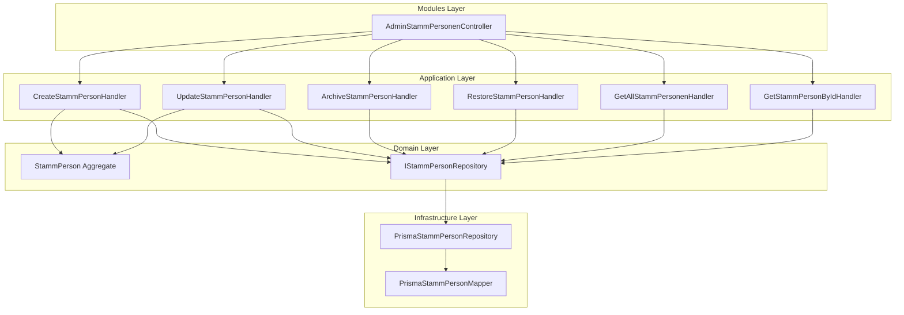

# Story 2.2: Stamm-Personen verwalten

Status: done

## Story

**Als** Admin (Maria),
**möchte ich** Personen-Stammdaten vollständig verwalten und Qualifikationen zuweisen,
**damit** die Mitglieder korrekt erfasst sind und ihre Qualifikationen für Einsätze verfügbar sind.

---

## Acceptance Criteria

### AC1: Personen-Liste anzeigen

**Given** ich bin als Admin eingeloggt
**When** ich `/api/v-alpha/admin/stammdaten/personen` aufrufe
**Then** erhalte ich eine Liste aller aktiven Personen (vorname, nachname, personalnummer, qualifikationen als Array)
**And** archivierte Personen sind per Default ausgeblendet (Query-Parameter `includeArchived=true` zeigt alle)

### AC2: Neue Person anlegen

**Given** ich bin authentifiziert als Admin
**When** ich `POST /api/v-alpha/admin/stammdaten/personen` mit validen Daten aufrufe
**Then** wird Person mit M:N-Qualifikations-Relation gespeichert
**And** ich erhalte HTTP 201 mit der erstellten Person inkl. ID
**And** `createdAt`, `createdBy` werden automatisch gesetzt

### AC3: Person bearbeiten

**Given** eine Person existiert
**When** ich `PATCH /api/v-alpha/admin/stammdaten/personen/:id` aufrufe
**Then** werden nur die übergebenen Felder aktualisiert (Partial Update)
**And** Qualifikationen können hinzugefügt/entfernt werden (vollständiger Ersatz der Liste)
**And** `updatedAt`, `updatedBy` werden gesetzt

### AC4: Person archivieren

**Given** eine Person ist aktiv (nicht archiviert)
**When** ich `PATCH /api/v-alpha/admin/stammdaten/personen/:id/archive` aufrufe
**Then** werden `archivedAt`, `archivedBy` gesetzt
**And** Person erscheint nicht mehr in Standard-Liste

### AC5: Qualifikationen Multi-Select

**Given** ich erstelle oder bearbeite eine Person
**When** ich `qualifikationIds` als Array von CUID-Strings übergebe
**Then** wird Junction-Table `StammPersonQualifikation` entsprechend aktualisiert
**And** nicht mehr zugewiesene Qualifikationen werden entfernt
**And** neue Qualifikationen werden hinzugefügt

**Semantik-Regeln:**
- `qualifikationIds: []` → Entfernt ALLE Qualifikationen der Person
- `qualifikationIds: ["id1", "id1"]` → Duplikate werden ignoriert (idempotent)
- `qualifikationIds` nicht im Request → Qualifikationen bleiben unverändert (PATCH-Semantik)
- Ungültige IDs → HTTP 400 mit Liste der ungültigen IDs

### AC6: Validierung

**Given** ich sende ein Request
**When** Pflichtfelder fehlen (vorname, nachname, personalnummer) oder ungültig sind
**Then** erhalte ich HTTP 400 mit strukturierten Fehlermeldungen

### AC7: Authorization

**Given** ich bin NICHT als Admin eingeloggt
**When** ich auf Personenverwaltungs-Endpoints zugreife
**Then** erhalte ich HTTP 403 Forbidden

### AC8: Person reaktivieren

**Given** eine Person ist archiviert
**When** ich `PATCH /api/v-alpha/admin/stammdaten/personen/:id/restore` aufrufe
**Then** werden `archivedAt`, `archivedBy` auf NULL gesetzt
**And** Person erscheint wieder in Standard-Liste
**And** `updatedAt`, `updatedBy` werden gesetzt

### AC9: Archivierte Person nicht bearbeitbar

**Given** eine Person ist archiviert
**When** ich `PATCH /api/v-alpha/admin/stammdaten/personen/:id` aufrufe
**Then** erhalte ich HTTP 409 Conflict mit Code `ARCHIVED_PERSON_MODIFICATION`
**And** Hinweis auf Reaktivierung im Response

---

## Tasks / Subtasks

### Phase 1: Domain Layer (7 Dateien)

- [x] Task 1: Value Object erstellen (AC: 2, 6)
  - [x] `stamm-person-id.ts` - EntityId<'StammPerson'> Pattern

- [x] Task 2: Aggregate Root erstellen (AC: 2, 3, 4, 5, 6)
  - [x] `stamm-person.aggregate.ts` mit create(), reconstitute(), update(), archive()
  - [x] M:N Qualifikationen als `qualifikationIds: string[]` im Aggregate
  - [x] Unit Tests in `__tests__/stamm-person.aggregate.spec.ts` (42 Tests!)

- [x] Task 3: Repository Port erstellen (AC: 1, 2, 3, 4)
  - [x] `i-stamm-person.repository.ts` Interface

- [x] Task 4: Error Codes + Validation Constants (AC: 6)
  - [x] `stamm-person-error-codes.ts`
  - [x] `stamm-person-validation.constants.ts`

- [x] Task 5: Domain Events (AC: 2, 3, 4)
  - [x] `stamm-person-created.event.ts`
  - [x] `stamm-person-updated.event.ts`

### Phase 2: Application Layer - Commands (6 Dateien)

- [x] Task 6: CreateStammPersonHandler (AC: 2, 5, 6)
  - [x] `create-stamm-person.command.ts`
  - [x] `create-stamm-person.handler.ts` (extends TransactionalCommandHandler)
  - [x] Uniqueness-Check für personalnummer
  - [x] **KRITISCH:** Qualifikationen-Existenz-Check VOR Junction-Table-Update

- [x] Task 7: UpdateStammPersonHandler (AC: 3, 5, 6, 9)
  - [x] `update-stamm-person.command.ts`
  - [x] `update-stamm-person.handler.ts`
  - [x] Qualifikationen-Sync (add/remove in Junction Table)
  - [x] **KRITISCH:** Prüfung auf `isArchived` → Result.fail(ARCHIVED_PERSON_MODIFICATION)

- [x] Task 8: ArchiveStammPersonHandler (AC: 4)
  - [x] `archive-stamm-person.command.ts`
  - [x] `archive-stamm-person.handler.ts`

- [x] Task 8b: RestoreStammPersonHandler (AC: 8)
  - [x] `restore-stamm-person.command.ts`
  - [x] `restore-stamm-person.handler.ts`
  - [x] Prüft ob Person archiviert ist, sonst Result.fail(NOT_ARCHIVED)

### Phase 3: Application Layer - Queries (5 Dateien)

- [x] Task 9: GetAllStammPersonenHandler (AC: 1)
  - [x] `get-all-stamm-personen.query.ts`
  - [x] `get-all-stamm-personen.handler.ts`
  - [x] **PFLICHT:** Batch-Loading für Qualifikationen via findByIds() (N+1 Fix!)

- [x] Task 10: GetStammPersonByIdHandler (AC: 1)
  - [x] `get-stamm-person-by-id.query.ts`
  - [x] `get-stamm-person-by-id.handler.ts`

- [x] Task 11: Query Mapper (AC: 1)
  - [x] `stamm-person-query.mapper.ts`

### Phase 4: Application Layer - DTOs + Module (7 Dateien)

- [x] Task 12: DTOs erstellen (AC: 2, 3, 6)
  - [x] `create-stamm-person.dto.ts` mit class-validator + OpenAPI + ArrayMaxSize(50)
  - [x] `update-stamm-person.dto.ts` (Partial, alle Felder optional) + ArrayMaxSize(50)
  - [x] `stamm-person.dto.ts` (Response DTO mit qualifikationen Array)
  - [x] `index.ts` Barrel Export

- [x] Task 13: Application Module (AC: alle)
  - [x] `stamm-personen-application.module.ts`
  - [x] `index.ts` Module Barrel Export
  - [x] `commands/index.ts` + `queries/index.ts` Barrel Exports

### Phase 5: Infrastructure Layer (2 Dateien)

- [x] Task 14: Prisma Repository (AC: 1, 2, 3, 4, 5)
  - [x] `prisma-stamm-person.repository.ts`
  - [x] Junction Table Sync für Qualifikationen (DIFF-BASED!)
  - [x] P2002 Error Handling (personalnummer duplicate)

- [x] Task 15: Mapper (AC: alle)
  - [x] `prisma-stamm-person.mapper.ts`
  - [x] **KRITISCH:** NULL → undefined Konvertierung für optionale Felder
  - [x] Include StammPersonQualifikation → QualifikationDto Mapping

### Phase 6: Modules Layer (1 Datei + 3 Modifikationen)

- [x] Task 16: Controller erstellen (AC: 1, 2, 3, 4, 7)
  - [x] `admin-stamm-personen.controller.ts`
  - [x] Rate Limiting: GET 30/min, Mutations 10/min
  - [x] OpenAPI Decorators vollständig

- [x] Task 17: DI Tokens + Module Registration (AC: alle)
  - [x] `di-tokens.ts` - STAMM_PERSON Symbol hinzufügen
  - [x] `kraefte-infrastructure.module.ts` - Repository registrieren
  - [x] `kraefte.module.ts` - Controller + Application Module importieren

### Phase 7: Testing + API Generation

- [x] Task 18: Domain Tests (AC: 6)
  - [x] 42 Unit Tests für Aggregate (übertrifft Anforderung von 10+)
  - [x] Validierung, create/update/archive Flows

- [x] Task 19: API Client generieren
  - [x] `pnpm run generate-api` ausführen
  - [x] Verifizieren: StammPersonen-Endpoints im Client

---

## Dev Notes

### Kritische Unterschiede zu Story 2.1 (StammFahrzeug)

| Aspekt | StammFahrzeug | StammPerson |
|--------|---------------|-------------|
| **Unique Field** | funkrufname | personalnummer |
| **FK Relation** | fahrzeugtypId (immutable) | KEINE immutable FK |
| **M:N Relation** | KEINE | qualifikationen via Junction Table |
| **Junction Table** | - | StammPersonQualifikation |
| **Sync Logic** | - | deleteMany + createMany für Qualifikationen |

### Kritische Semantiken

| Pattern | Verwendung | Regel |
|---------|------------|-------|
| `archivedAt/By` | Stammdaten | **KEIN `isDeleted`!** Archiviert = ausgeblendet, historisch verfügbar |
| `personalnummer` | StammPerson | **UNIQUE!** Personalnummer muss eindeutig sein |
| `qualifikationIds` | Create/Update | Array von CUID-Strings, **VOLLSTÄNDIGER ERSATZ** (nicht inkrementell) |

### Architektur-Übersicht



### Quick Reference

| Aktion | Endpoint | Handler | Error Codes |
|--------|----------|---------|-------------|
| Liste | `GET /` | GetAllStammPersonenHandler | - |
| Detail | `GET /:id` | GetStammPersonByIdHandler | NOT_FOUND |
| Create | `POST /` | CreateStammPersonHandler | PERSONALNUMMER_DUPLICATE, INVALID_QUALIFIKATION |
| Update | `PATCH /:id` | UpdateStammPersonHandler | NOT_FOUND, PERSONALNUMMER_DUPLICATE, INVALID_QUALIFIKATION, ARCHIVED_PERSON_MODIFICATION |
| Archive | `PATCH /:id/archive` | ArchiveStammPersonHandler | NOT_FOUND, ALREADY_ARCHIVED |
| Restore | `PATCH /:id/restore` | RestoreStammPersonHandler | NOT_FOUND, NOT_ARCHIVED |

### Quick Start

```bash
# 1. Backend starten (Port 3090)
pnpm --filter @bluelight-hub/backend dev

# 2. Nach Implementierung: API-Client generieren
pnpm run generate-api

# 3. TypeScript Check
pnpm --filter @bluelight-hub/backend exec tsc --noEmit

# 4. Tests ausführen
DATABASE_URL="" pnpm --filter @bluelight-hub/backend exec jest stamm-person --no-coverage
```

---

## Technical Implementation Details

### Prisma Schema (bereits implementiert in Story 2.0)

```prisma
model StammPerson {
  id             String   @id @default(cuid())
  vorname        String   @db.VarChar(100)
  nachname       String   @db.VarChar(100)
  personalnummer String   @unique @db.VarChar(50)
  funkkenungBOS  String?  @db.VarChar(50)

  archivedAt DateTime?
  archivedBy String?   @db.VarChar(100)

  createdAt DateTime @default(now())
  updatedAt DateTime @updatedAt
  createdBy String   @db.VarChar(100)
  updatedBy String?  @db.VarChar(100)

  creator  User  @relation("StammPersonCreator", fields: [createdBy], references: [id], onDelete: Restrict)
  updater  User? @relation("StammPersonUpdater", fields: [updatedBy], references: [id], onDelete: SetNull)
  archiver User? @relation("StammPersonArchiver", fields: [archivedBy], references: [id], onDelete: SetNull)

  qualifikationen StammPersonQualifikation[]

  @@index([archivedAt])
  @@index([archivedAt, nachname])
  @@index([createdBy])
  @@map("stamm_personen")
}

model StammPersonQualifikation {
  id              String   @id @default(cuid())
  personId        String
  qualifikationId String

  createdAt DateTime @default(now())
  updatedAt DateTime @updatedAt
  createdBy String   @db.VarChar(100)
  updatedBy String?  @db.VarChar(100)

  person        StammPerson   @relation(fields: [personId], references: [id], onDelete: Cascade)
  qualifikation Qualifikation @relation(fields: [qualifikationId], references: [id], onDelete: Restrict)
  creator       User          @relation("StammPersonQualifikationCreator", fields: [createdBy], references: [id], onDelete: Restrict)
  updater       User?         @relation("StammPersonQualifikationUpdater", fields: [updatedBy], references: [id], onDelete: SetNull)

  @@unique([personId, qualifikationId])
  @@index([personId])                    // Für Person → Qualifikationen Lookups
  @@index([qualifikationId])             // KRITISCH: Für Reverse Lookups (Qualifikation → Personen)
  @@map("stamm_person_qualifikationen")
}
```

### Domain Aggregate Pattern

```typescript
// packages/backend/src/domain/kraefte/aggregates/stamm-person.aggregate.ts

export interface CreateStammPersonProps {
  vorname: string;
  nachname: string;
  personalnummer: string;
  funkkenungBOS?: string;
  qualifikationIds?: string[];
  createdBy: string;
}

export interface UpdateStammPersonProps {
  vorname?: string;
  nachname?: string;
  funkkenungBOS?: string;
  qualifikationIds?: string[];  // Vollständiger Ersatz!
  updatedBy: string;
}

export class StammPerson extends AggregateRoot<StammPersonId> {
  private constructor(/* ... */) { super(id); }

  // Factory Methods
  static create(props: CreateStammPersonProps): Result<StammPerson>;
  static reconstitute(props: ReconstituteStammPersonProps): Result<StammPerson>;

  // Business Methods
  update(props: UpdateStammPersonProps): Result<void>;
  archive(archivedBy: string): Result<void>;
  restore(restoredBy: string): Result<void>;  // NEU: AC8

  // Getters
  get vorname(): string;
  get nachname(): string;
  get personalnummer(): string;
  get funkkenungBOS(): string | undefined;
  get qualifikationIds(): string[];
  get isArchived(): boolean;
}
```

### Repository Interface

```typescript
// packages/backend/src/domain/kraefte/repositories/i-stamm-person.repository.ts

export interface IStammPersonRepository {
  save(aggregate: StammPerson, tx?: TransactionContext): Promise<Result<void>>;
  findById(id: StammPersonId, tx?: TransactionContext): Promise<Result<StammPerson | null>>;
  findByPersonalnummer(personalnummer: string, tx?: TransactionContext): Promise<Result<StammPerson | null>>;
  findAll(filter?: { includeArchived?: boolean }, tx?: TransactionContext): Promise<Result<StammPerson[]>>;
  exists(personalnummer: string, tx?: TransactionContext): Promise<Result<boolean>>;
}
```

### Error Codes

```typescript
// packages/backend/src/domain/kraefte/common/stamm-person-error-codes.ts

export const STAMM_PERSON_ERROR_CODES = {
  NOT_FOUND: 'STAMM_PERSON_NOT_FOUND',
  PERSONALNUMMER_DUPLICATE: 'STAMM_PERSON_PERSONALNUMMER_DUPLICATE',
  ALREADY_ARCHIVED: 'STAMM_PERSON_ALREADY_ARCHIVED',
  NOT_ARCHIVED: 'STAMM_PERSON_NOT_ARCHIVED',                        // NEU: Für Restore
  ARCHIVED_PERSON_MODIFICATION: 'STAMM_PERSON_ARCHIVED_MODIFICATION', // NEU: AC9
  INVALID_QUALIFIKATION: 'STAMM_PERSON_INVALID_QUALIFIKATION',
  QUALIFIKATION_NOT_FOUND: 'STAMM_PERSON_QUALIFIKATION_NOT_FOUND',  // NEU: Einzelne ID
  VALIDATION_ERROR: 'STAMM_PERSON_VALIDATION_ERROR',
} as const;
```

**Error Code → HTTP Status Mapping:**

| Error Code | HTTP Status | Beschreibung |
|------------|-------------|--------------|
| `NOT_FOUND` | 404 | Person existiert nicht |
| `PERSONALNUMMER_DUPLICATE` | 409 | Personalnummer vergeben |
| `ALREADY_ARCHIVED` | 409 | Person bereits archiviert |
| `NOT_ARCHIVED` | 409 | Person nicht archiviert (für Restore) |
| `ARCHIVED_PERSON_MODIFICATION` | 409 | Archivierte Person kann nicht bearbeitet werden |
| `INVALID_QUALIFIKATION` | 400 | Eine oder mehrere Qualifikationen ungültig |
| `QUALIFIKATION_NOT_FOUND` | 400 | Spezifische Qualifikation nicht gefunden |
| `VALIDATION_ERROR` | 400 | Allgemeiner Validierungsfehler |

### Qualifikationen-Existenz-Check (PFLICHT vor Junction-Update!)

> **KRITISCH:** Prüfe ob alle `qualifikationIds` existieren BEVOR Junction-Table-Updates!
> Sonst: Kryptische P2003 Fehler statt Business-Error.

```typescript
// Im CreateStammPersonHandler oder UpdateStammPersonHandler

private async validateQualifikationen(
  qualifikationIds: string[],
  tx: TransactionContext
): Promise<Result<void>> {
  if (qualifikationIds.length === 0) return Result.ok();

  // Deduplizieren
  const uniqueIds = [...new Set(qualifikationIds)];

  // Existenz prüfen via Repository
  const existingQuals = await this.qualifikationRepository.findByIds(uniqueIds, tx);

  if (existingQuals.length !== uniqueIds.length) {
    const existingSet = new Set(existingQuals.map(q => q.id.value));
    const invalidIds = uniqueIds.filter(id => !existingSet.has(id));

    return Result.fail(
      `${STAMM_PERSON_ERROR_CODES.INVALID_QUALIFIKATION}: ${invalidIds.join(', ')}`
    );
  }

  return Result.ok();
}

// Verwendung im Handler:
protected async executeInTransaction(
  command: CreateStammPersonCommand,
  tx: TransactionContext,
): Promise<{ result: string; events: DomainEvent[] }> {
  // 1. Qualifikationen validieren ZUERST
  if (command.qualifikationIds?.length) {
    const validationResult = await this.validateQualifikationen(command.qualifikationIds, tx);
    if (validationResult.isFailure) {
      // Controller mapped diesen Error zu HTTP 400
      throw new Error(validationResult.error);
    }
  }

  // 2. Dann erst Aggregate erstellen und speichern
  const personResult = StammPerson.create({...});
  // ...
}
```

### Junction Table Sync Pattern (KRITISCH - Diff-basiert!)

> **WICHTIG:** Nutze DIFF-BASED Updates statt deleteMany+createMany für Thread-Safety!

```typescript
// In PrismaStammPersonRepository.save()

async save(aggregate: StammPerson, tx?: TransactionContext): Promise<Result<void>> {
  const client = (tx as PrismaTransactionClient | undefined) ?? this.prisma;

  try {
    // 1. Upsert StammPerson
    await client.stammPerson.upsert({
      where: { id: aggregate.id.value },
      update: PrismaStammPersonMapper.toPersistence(aggregate),
      create: PrismaStammPersonMapper.toPersistence(aggregate),
    });

    // 2. DIFF-BASED Qualifikationen-Sync (Thread-Safe!)
    const existingQuals = await client.stammPersonQualifikation.findMany({
      where: { personId: aggregate.id.value },
      select: { qualifikationId: true },
    });

    const existingIds = new Set(existingQuals.map(q => q.qualifikationId));
    const newIds = new Set(aggregate.qualifikationIds);

    // IDs zum Entfernen (existieren, aber nicht mehr gewünscht)
    const toDelete = existingQuals
      .filter(q => !newIds.has(q.qualifikationId))
      .map(q => q.qualifikationId);

    // IDs zum Hinzufügen (gewünscht, aber existieren noch nicht)
    const toAdd = aggregate.qualifikationIds.filter(id => !existingIds.has(id));

    // 3. Nur Deltas anwenden
    if (toDelete.length > 0) {
      await client.stammPersonQualifikation.deleteMany({
        where: {
          personId: aggregate.id.value,
          qualifikationId: { in: toDelete },
        },
      });
    }

    if (toAdd.length > 0) {
      await client.stammPersonQualifikation.createMany({
        data: toAdd.map(qId => ({
          personId: aggregate.id.value,
          qualifikationId: qId,
          createdBy: aggregate.updatedBy ?? aggregate.createdBy,
        })),
      });
    }

    return Result.ok<void>(undefined);
  } catch (error) {
    if (error instanceof Prisma.PrismaClientKnownRequestError) {
      if (error.code === 'P2002') {
        return Result.fail(STAMM_PERSON_ERROR_CODES.PERSONALNUMMER_DUPLICATE);
      }
      if (error.code === 'P2003') {
        return Result.fail(STAMM_PERSON_ERROR_CODES.INVALID_QUALIFIKATION);
      }
    }
    throw error;
  }
}
```

**Vorteile des Diff-Based Patterns:**
- ✅ Thread-Safe bei concurrent Updates
- ✅ Weniger DB-Writes (nur Änderungen)
- ✅ Erhält Junction-Table-IDs für existierende Zuweisungen
- ✅ Audit-Trail bleibt konsistent (createdAt/createdBy bleiben)

### Eager Loading Pattern (PFLICHT für Query-Handler!)

> **KRITISCH:** Verhindere N+1 Queries durch korrektes Include!

```typescript
// In PrismaStammPersonRepository.findAll() und findById()

async findAll(filter?: { includeArchived?: boolean }): Promise<Result<StammPerson[]>> {
  const personen = await this.prisma.stammPerson.findMany({
    where: filter?.includeArchived ? {} : { archivedAt: null },
    include: {
      qualifikationen: {           // M:N Junction Table
        include: {
          qualifikation: true,     // Die verknüpfte Qualifikation laden
        },
      },
    },
    orderBy: { nachname: 'asc' },
  });

  return Result.ok(personen.map(p => PrismaStammPersonMapper.toDomain(p).value!));
}

async findById(id: StammPersonId): Promise<Result<StammPerson | null>> {
  const person = await this.prisma.stammPerson.findUnique({
    where: { id: id.value },
    include: {
      qualifikationen: {
        include: {
          qualifikation: true,
        },
      },
    },
  });

  if (!person) return Result.ok(null);
  return PrismaStammPersonMapper.toDomain(person);
}
```

**Performance-Hinweis:** Bei >100 Personen sollte Pagination implementiert werden.

### Mapper (KRITISCH: NULL → undefined!)

> **HÄUFIGSTER BUG aus Epic 1!** Prisma gibt `null` für optionale Felder zurück, Domain verwendet `undefined`.
> **ALLE optionalen Felder müssen konvertiert werden:**

| Prisma Typ | Domain Typ | Konvertierung |
|------------|------------|---------------|
| `string \| null` | `string \| undefined` | `(entity.field as string \| null) ?? undefined` |
| `Date \| null` | `Date \| undefined` | `(entity.field as Date \| null) ?? undefined` |

```typescript
// packages/backend/src/infrastructure/kraefte/mappers/prisma-stamm-person.mapper.ts

export class PrismaStammPersonMapper {
  static toDomain(entity: PrismaStammPersonWithRelations): Result<StammPerson> {
    return StammPerson.reconstitute({
      id: entity.id,
      vorname: entity.vorname,
      nachname: entity.nachname,
      personalnummer: entity.personalnummer,
      // KRITISCH: NULL → undefined für ALLE optionalen Felder!
      funkkenungBOS: (entity.funkkenungBOS as string | null) ?? undefined,
      archivedAt: (entity.archivedAt as Date | null) ?? undefined,
      archivedBy: (entity.archivedBy as string | null) ?? undefined,
      updatedBy: (entity.updatedBy as string | null) ?? undefined,
      createdAt: entity.createdAt,
      updatedAt: entity.updatedAt,
      createdBy: entity.createdBy,
      // Qualifikationen aus Junction Table
      qualifikationIds: entity.qualifikationen?.map(q => q.qualifikationId) ?? [],
    });
  }

  static toPersistence(aggregate: StammPerson): Omit<PrismaStammPerson, 'createdAt' | 'updatedAt'> {
    return {
      id: aggregate.id.value,
      vorname: aggregate.vorname,
      nachname: aggregate.nachname,
      personalnummer: aggregate.personalnummer,
      funkkenungBOS: aggregate.funkkenungBOS ?? null,
      archivedAt: aggregate.archivedAt ?? null,
      archivedBy: aggregate.archivedBy ?? null,
      createdBy: aggregate.createdBy,
      updatedBy: aggregate.updatedBy ?? null,
    };
  }
}
```

### DTOs

```typescript
// packages/backend/src/application/kraefte/stamm-personen/dto/create-stamm-person.dto.ts

export class CreateStammPersonDto {
  @ApiProperty({ description: 'Vorname', minLength: 2, maxLength: 100 })
  @IsString()
  @MinLength(STAMM_PERSON_VORNAME_MIN_LENGTH)
  @MaxLength(STAMM_PERSON_VORNAME_MAX_LENGTH)
  vorname!: string;

  @ApiProperty({ description: 'Nachname', minLength: 2, maxLength: 100 })
  @IsString()
  @MinLength(STAMM_PERSON_NACHNAME_MIN_LENGTH)
  @MaxLength(STAMM_PERSON_NACHNAME_MAX_LENGTH)
  nachname!: string;

  @ApiProperty({ description: 'Personalnummer (eindeutig)', minLength: 1, maxLength: 50 })
  @IsString()
  @MinLength(1)
  @MaxLength(50)
  personalnummer!: string;

  @ApiPropertyOptional({ description: 'BOS-Funkkennung' })
  @IsOptional()
  @IsString()
  @MaxLength(50)
  funkkenungBOS?: string;

  @ApiPropertyOptional({ description: 'Qualifikation-IDs (CUIDs)', type: [String] })
  @IsOptional()
  @IsArray()
  @IsString({ each: true })
  qualifikationIds?: string[];
}
```

```typescript
// packages/backend/src/application/kraefte/stamm-personen/dto/stamm-person.dto.ts

// Junction-Table Zuweisung mit Audit-Feldern
export class StammPersonQualifikationDto {
  @ApiProperty({ description: 'ID der Qualifikation' })
  id!: string;

  @ApiProperty({ description: 'Name der Qualifikation' })
  name!: string;

  @ApiProperty({ description: 'Kürzel der Qualifikation' })
  kuerzel!: string;

  @ApiProperty({ description: 'Wann wurde Qualifikation zugewiesen' })
  zugewiesenAm!: Date;

  @ApiProperty({ description: 'Wer hat Qualifikation zugewiesen' })
  zugewiesenVon!: string;
}

export class StammPersonDto {
  @ApiProperty() id!: string;
  @ApiProperty() vorname!: string;
  @ApiProperty() nachname!: string;
  @ApiProperty() personalnummer!: string;
  @ApiPropertyOptional() funkkenungBOS?: string;

  @ApiProperty({ type: [StammPersonQualifikationDto], description: 'Zugewiesene Qualifikationen mit Audit-Infos' })
  qualifikationen!: StammPersonQualifikationDto[];

  @ApiPropertyOptional() archivedAt?: Date;
  @ApiPropertyOptional() archivedBy?: string;
  @ApiProperty() createdAt!: Date;
  @ApiProperty() createdBy!: string;
  @ApiPropertyOptional() updatedAt?: Date;
  @ApiPropertyOptional() updatedBy?: string;
}
```

> **HINWEIS:** `StammPersonQualifikationDto` enthält sowohl die Qualifikations-Daten als auch Audit-Infos (wann/wer zugewiesen).

### Controller

```typescript
// packages/backend/src/modules/kraefte/controllers/admin-stamm-personen.controller.ts

@Controller({ path: 'admin/stammdaten/personen', version: 'alpha' })
@ApiTags('admin-stammdaten-personen')
@ApiBearerAuth()
@UseGuards(AdminJwtAuthGuard)
export class AdminStammPersonenController {
  constructor(
    private readonly createHandler: CreateStammPersonHandler,
    private readonly updateHandler: UpdateStammPersonHandler,
    private readonly archiveHandler: ArchiveStammPersonHandler,
    private readonly restoreHandler: RestoreStammPersonHandler,
    private readonly getAllHandler: GetAllStammPersonenHandler,
    private readonly getByIdHandler: GetStammPersonByIdHandler,
  ) {}

  @Get()
  @Throttle({ default: { limit: 30, ttl: 60000 } })
  @ApiOperation({ summary: 'Alle Stamm-Personen abrufen' })
  @ApiOkResponse({ type: [StammPersonDto] })
  @ApiQuery({ name: 'includeArchived', required: false, type: Boolean })
  async findAll(
    @Query('includeArchived', new ParseBoolPipe({ optional: true })) includeArchived?: boolean,
  ): Promise<StammPersonDto[]> {
    const result = await this.getAllHandler.execute(
      GetAllStammPersonenQuery.create({ includeArchived }).value!,
    );
    if (result.isFailure) {
      throw new InternalServerErrorException(result.error);
    }
    return result.value;
  }

  @Get(':id')
  @Throttle({ default: { limit: 30, ttl: 60000 } })
  @ApiOperation({ summary: 'Stamm-Person nach ID abrufen' })
  @ApiOkResponse({ type: StammPersonDto })
  @ApiNotFoundResponse({ description: 'Person nicht gefunden' })
  async findById(@Param('id') id: string): Promise<StammPersonDto> {
    const result = await this.getByIdHandler.execute(
      GetStammPersonByIdQuery.create({ id }).value!,
    );
    if (result.isFailure) {
      throw new InternalServerErrorException(result.error);
    }
    if (!result.value) {
      throw new NotFoundException('Person nicht gefunden');
    }
    return result.value;
  }

  @Post()
  @Throttle({ default: { limit: 10, ttl: 60000 } })
  @ApiOperation({ summary: 'Neue Stamm-Person anlegen' })
  @ApiCreatedResponse({ type: StammPersonDto })
  @ApiBadRequestResponse({ description: 'Validierungsfehler' })
  @ApiConflictResponse({ description: 'Personalnummer bereits vergeben' })
  async create(
    @Body() dto: CreateStammPersonDto,
    @CurrentUser() user: UserPayload,
  ): Promise<StammPersonDto> {
    const commandResult = CreateStammPersonCommand.create(dto, user.sub);
    if (commandResult.isFailure) {
      throw new BadRequestException(commandResult.error);
    }

    const result = await this.createHandler.execute(commandResult.value);
    if (result.isFailure) {
      if (result.error === STAMM_PERSON_ERROR_CODES.PERSONALNUMMER_DUPLICATE) {
        throw new ConflictException(`Personalnummer '${dto.personalnummer}' ist bereits vergeben`);
      }
      if (result.error === STAMM_PERSON_ERROR_CODES.INVALID_QUALIFIKATION) {
        throw new BadRequestException('Eine oder mehrere Qualifikationen existieren nicht');
      }
      throw new InternalServerErrorException(result.error);
    }
    return result.value;
  }

  @Patch(':id')
  @Throttle({ default: { limit: 10, ttl: 60000 } })
  @ApiOperation({ summary: 'Stamm-Person bearbeiten' })
  @ApiOkResponse({ type: StammPersonDto })
  @ApiBadRequestResponse({ description: 'Validierungsfehler' })
  @ApiNotFoundResponse({ description: 'Person nicht gefunden' })
  @ApiConflictResponse({ description: 'Personalnummer bereits vergeben' })
  async update(
    @Param('id') id: string,
    @Body() dto: UpdateStammPersonDto,
    @CurrentUser() user: UserPayload,
  ): Promise<StammPersonDto> {
    const commandResult = UpdateStammPersonCommand.create(dto, id, user.sub);
    if (commandResult.isFailure) {
      throw new BadRequestException(commandResult.error);
    }

    const result = await this.updateHandler.execute(commandResult.value);
    if (result.isFailure) {
      if (result.error === STAMM_PERSON_ERROR_CODES.NOT_FOUND) {
        throw new NotFoundException('Person nicht gefunden');
      }
      if (result.error === STAMM_PERSON_ERROR_CODES.PERSONALNUMMER_DUPLICATE) {
        throw new ConflictException(`Personalnummer '${dto.personalnummer}' ist bereits vergeben`);
      }
      if (result.error === STAMM_PERSON_ERROR_CODES.INVALID_QUALIFIKATION) {
        throw new BadRequestException('Eine oder mehrere Qualifikationen existieren nicht');
      }
      throw new InternalServerErrorException(result.error);
    }
    return result.value;
  }

  @Patch(':id/archive')
  @Throttle({ default: { limit: 10, ttl: 60000 } })
  @ApiOperation({ summary: 'Stamm-Person archivieren' })
  @ApiOkResponse({ type: StammPersonDto })
  @ApiNotFoundResponse({ description: 'Person nicht gefunden' })
  @ApiConflictResponse({ description: 'Person bereits archiviert' })
  async archive(
    @Param('id') id: string,
    @CurrentUser() user: UserPayload,
  ): Promise<StammPersonDto> {
    const commandResult = ArchiveStammPersonCommand.create({ id, archivedBy: user.sub });
    if (commandResult.isFailure) {
      throw new BadRequestException(commandResult.error);
    }

    const result = await this.archiveHandler.execute(commandResult.value);
    if (result.isFailure) {
      if (result.error === STAMM_PERSON_ERROR_CODES.NOT_FOUND) {
        throw new NotFoundException('Person nicht gefunden');
      }
      if (result.error === STAMM_PERSON_ERROR_CODES.ALREADY_ARCHIVED) {
        throw new ConflictException('Person ist bereits archiviert');
      }
      throw new InternalServerErrorException(result.error);
    }
    return result.value;
  }

  @Patch(':id/restore')
  @Throttle({ default: { limit: 10, ttl: 60000 } })
  @ApiOperation({ summary: 'Archivierte Stamm-Person reaktivieren' })
  @ApiOkResponse({ type: StammPersonDto })
  @ApiNotFoundResponse({ description: 'Person nicht gefunden' })
  @ApiConflictResponse({ description: 'Person ist nicht archiviert' })
  async restore(
    @Param('id') id: string,
    @CurrentUser() user: UserPayload,
  ): Promise<StammPersonDto> {
    const commandResult = RestoreStammPersonCommand.create({ id, restoredBy: user.sub });
    if (commandResult.isFailure) {
      throw new BadRequestException(commandResult.error);
    }

    const result = await this.restoreHandler.execute(commandResult.value);
    if (result.isFailure) {
      if (result.error === STAMM_PERSON_ERROR_CODES.NOT_FOUND) {
        throw new NotFoundException('Person nicht gefunden');
      }
      if (result.error === STAMM_PERSON_ERROR_CODES.NOT_ARCHIVED) {
        throw new ConflictException('Person ist nicht archiviert');
      }
      throw new InternalServerErrorException(result.error);
    }
    return result.value;
  }
}
```

---

## File Structure

**Domain Layer (7 Dateien):**
```
packages/backend/src/domain/kraefte/
├── aggregates/
│   ├── stamm-person.aggregate.ts                        [CREATE]
│   └── __tests__/stamm-person.aggregate.spec.ts         [CREATE]
├── value-objects/
│   └── stamm-person-id.ts                               [CREATE]
├── repositories/
│   └── i-stamm-person.repository.ts                     [CREATE]
├── constants/
│   └── stamm-person-validation.constants.ts             [CREATE]
├── common/
│   └── stamm-person-error-codes.ts                      [CREATE]
└── events/
    ├── stamm-person-created.event.ts                    [CREATE]
    └── stamm-person-updated.event.ts                    [CREATE]
```

**Application Layer - Commands (8 Dateien):**
```
packages/backend/src/application/kraefte/stamm-personen/
├── commands/
│   ├── create-stamm-person/
│   │   ├── create-stamm-person.command.ts               [CREATE]
│   │   └── create-stamm-person.handler.ts               [CREATE]
│   ├── update-stamm-person/
│   │   ├── update-stamm-person.command.ts               [CREATE]
│   │   └── update-stamm-person.handler.ts               [CREATE]
│   ├── archive-stamm-person/
│   │   ├── archive-stamm-person.command.ts              [CREATE]
│   │   └── archive-stamm-person.handler.ts              [CREATE]
│   └── restore-stamm-person/
│       ├── restore-stamm-person.command.ts              [CREATE]
│       └── restore-stamm-person.handler.ts              [CREATE]
```

**Application Layer - Queries (5 Dateien):**
```
├── queries/
│   ├── stamm-person-query.mapper.ts                     [CREATE]
│   ├── get-all-stamm-personen/
│   │   ├── get-all-stamm-personen.query.ts              [CREATE]
│   │   └── get-all-stamm-personen.handler.ts            [CREATE]
│   └── get-stamm-person-by-id/
│       ├── get-stamm-person-by-id.query.ts              [CREATE]
│       └── get-stamm-person-by-id.handler.ts            [CREATE]
```

**Application Layer - DTOs + Module (7 Dateien):**
```
├── dto/
│   ├── index.ts                                         [CREATE]
│   ├── create-stamm-person.dto.ts                       [CREATE]
│   ├── update-stamm-person.dto.ts                       [CREATE]
│   └── stamm-person.dto.ts                              [CREATE]
├── commands/
│   └── index.ts                                         [CREATE]
├── queries/
│   └── index.ts                                         [CREATE]
├── stamm-personen-application.module.ts                 [CREATE]
└── index.ts                                             [CREATE]
```

**Infrastructure Layer (2 Dateien):**
```
packages/backend/src/infrastructure/kraefte/
├── repositories/
│   └── prisma-stamm-person.repository.ts                [CREATE]
└── mappers/
    └── prisma-stamm-person.mapper.ts                    [CREATE]
```

**Modules Layer (1 Datei + 3 Modifikationen):**
```
packages/backend/src/modules/kraefte/controllers/
└── admin-stamm-personen.controller.ts                   [CREATE]

Modifikationen:
├── packages/backend/src/infrastructure/di-tokens.ts     [MODIFY]
├── packages/backend/src/infrastructure/kraefte/kraefte-infrastructure.module.ts [MODIFY]
└── packages/backend/src/modules/kraefte/kraefte.module.ts [MODIFY]
```

**Total: 30 neue Dateien + 3 Modifikationen**

---

## Testing Strategy

### Unit Tests Required

**Domain Layer:**
- `stamm-person.aggregate.spec.ts`
  - create() success mit validen Daten
  - create() fail bei fehlendem vorname
  - create() fail bei fehlendem nachname
  - create() fail bei fehlender personalnummer
  - update() success
  - update() mit qualifikationIds Sync
  - archive() success
  - archive() already archived rejected
  - reconstitute() success
  - reconstitute() mit qualifikationen

### Manual Testing (Swagger UI)

```bash
# Backend starten
pnpm --filter @bluelight-hub/backend dev

# Swagger UI öffnen: http://localhost:3090/api

# Test-Sequenz:
# 1. GET /api/v-alpha/admin/stammdaten/personen → Leere Liste oder Seed-Daten
# 2. POST mit validen Daten → 201 Created
# 3. POST mit gleicher personalnummer → 409 Conflict
# 4. PATCH /:id mit qualifikationIds → Qualifikationen werden gesynct
# 5. PATCH /:id/archive → Person archiviert
# 6. GET ?includeArchived=true → Archivierte Person sichtbar
```

---

## API Response Examples

### GET /api/v-alpha/admin/stammdaten/personen

```json
[
  {
    "id": "cm4abc123",
    "vorname": "Max",
    "nachname": "Mustermann",
    "personalnummer": "P-001",
    "funkkenungBOS": "Rotkreuz 83/1",
    "qualifikationen": [
      { "id": "cm4xyz789", "name": "Rettungssanitäter", "kuerzel": "RS" },
      { "id": "cm4xyz790", "name": "Rettungsassistent", "kuerzel": "RA" }
    ],
    "createdAt": "2025-12-16T10:00:00.000Z",
    "createdBy": "cm4user123"
  }
]
```

### POST /api/v-alpha/admin/stammdaten/personen

**Request:**
```json
{
  "vorname": "Erika",
  "nachname": "Musterfrau",
  "personalnummer": "P-002",
  "funkkenungBOS": "Rotkreuz 83/2",
  "qualifikationIds": ["cm4xyz789", "cm4xyz790"]
}
```

**Response (201 Created):**
```json
{
  "id": "cm4new456",
  "vorname": "Erika",
  "nachname": "Musterfrau",
  "personalnummer": "P-002",
  "funkkenungBOS": "Rotkreuz 83/2",
  "qualifikationen": [
    { "id": "cm4xyz789", "name": "Rettungssanitäter", "kuerzel": "RS" },
    { "id": "cm4xyz790", "name": "Rettungsassistent", "kuerzel": "RA" }
  ],
  "createdAt": "2025-12-16T14:30:00.000Z",
  "createdBy": "cm4admin789"
}
```

### Error Responses

- `400 Bad Request`: Validierungsfehler (fehlende Pflichtfelder, ungültige Qualifikation-IDs)
- `403 Forbidden`: Nicht als Admin authentifiziert
- `404 Not Found`: Person nicht gefunden (NOT_FOUND)
- `409 Conflict`: Personalnummer bereits vergeben (PERSONALNUMMER_DUPLICATE) / Bereits archiviert (ALREADY_ARCHIVED)
- `429 Too Many Requests`: Rate Limit überschritten

---

## Architecture Compliance (AC1-AC6 Checklist)

- [ ] **AC1: DI Import Check** - Keine `import type` für Injectable Classes
- [ ] **AC2: DI Token Constants** - `KRAEFTE_REPOSITORIES.STAMM_PERSON` Symbol in di-tokens.ts
- [ ] **AC3: Framework-Agnostizität** - Application Layer importiert KEINE HTTP-Exceptions
- [ ] **AC4: Result Pattern** - Alle Handler geben `Result<T>` zurück
- [ ] **AC5: Outbox Integration** - TransactionalCommandHandler für Domain Events
- [ ] **AC6: Test Pattern** - AAA Pattern mit Given-When-Then Kommentaren
- [ ] **AC7: Rate Limiting** - GET 30/min, Mutations 10/min
- [ ] **AC8: Error Mapping** - ALREADY_ARCHIVED → 409 Conflict

---

## Project Context Reference

Alle kritischen Regeln und Patterns sind dokumentiert in:
- `/docs/project-context.md` - Projekt-weite Regeln
- `/docs/sprint-artifacts/2-1-stamm-fahrzeuge-verwalten.md` - Blueprint für CRUD-Pattern

---

### Project Structure Notes

- Alignment mit Story 2.1 (StammFahrzeuge) als Blueprint
- M:N Junction Table Pattern für Qualifikationen (neu gegenüber 2.1)
- Kein IMMUTABLE Foreign Key (kein fahrzeugtypId-Äquivalent)

### References

- [Source: docs/epics.md#Epic-2-Story-2.2]
- [Source: docs/project-context.md#Backend-Rules]
- [Source: docs/sprint-artifacts/2-1-stamm-fahrzeuge-verwalten.md] - Blueprint
- [Source: docs/sprint-artifacts/2-0-prisma-schema-stammdaten.md] - Schema-Entscheidungen
- [Source: packages/backend/prisma/schema.prisma#StammPerson]

---

## Dev Agent Record

### Context Reference

Story 2.1 als Blueprint, Story 2.0 für Schema, Epic 2 aus epics.md

### Agent Model Used

Claude Opus 4.5 (via BMad Scrum Master Workflow)

### Debug Log References

### Completion Notes List

- Ultimate context engine analysis completed
- M:N Junction Table Pattern für Qualifikationen dokumentiert
- NULL → undefined Mapper-Bug aus Epic 1 dokumentiert
- Rate Limiting korrigiert (30/min GET, 10/min Mutations)

### File List

| Datei | Aktion |
|-------|--------|
| `packages/backend/src/domain/kraefte/aggregates/stamm-person.aggregate.ts` | CREATE |
| `packages/backend/src/domain/kraefte/aggregates/__tests__/stamm-person.aggregate.spec.ts` | CREATE |
| `packages/backend/src/domain/kraefte/value-objects/stamm-person-id.ts` | CREATE |
| `packages/backend/src/domain/kraefte/repositories/i-stamm-person.repository.ts` | CREATE |
| `packages/backend/src/domain/kraefte/constants/stamm-person-validation.constants.ts` | CREATE |
| `packages/backend/src/domain/kraefte/common/stamm-person-error-codes.ts` | CREATE |
| `packages/backend/src/domain/kraefte/events/stamm-person-created.event.ts` | CREATE |
| `packages/backend/src/domain/kraefte/events/stamm-person-updated.event.ts` | CREATE |
| `packages/backend/src/application/kraefte/stamm-personen/commands/create-stamm-person/create-stamm-person.command.ts` | CREATE |
| `packages/backend/src/application/kraefte/stamm-personen/commands/create-stamm-person/create-stamm-person.handler.ts` | CREATE |
| `packages/backend/src/application/kraefte/stamm-personen/commands/update-stamm-person/update-stamm-person.command.ts` | CREATE |
| `packages/backend/src/application/kraefte/stamm-personen/commands/update-stamm-person/update-stamm-person.handler.ts` | CREATE |
| `packages/backend/src/application/kraefte/stamm-personen/commands/archive-stamm-person/archive-stamm-person.command.ts` | CREATE |
| `packages/backend/src/application/kraefte/stamm-personen/commands/archive-stamm-person/archive-stamm-person.handler.ts` | CREATE |
| `packages/backend/src/application/kraefte/stamm-personen/commands/restore-stamm-person/restore-stamm-person.command.ts` | CREATE |
| `packages/backend/src/application/kraefte/stamm-personen/commands/restore-stamm-person/restore-stamm-person.handler.ts` | CREATE |
| `packages/backend/src/application/kraefte/stamm-personen/queries/stamm-person-query.mapper.ts` | CREATE |
| `packages/backend/src/application/kraefte/stamm-personen/queries/get-all-stamm-personen/get-all-stamm-personen.query.ts` | CREATE |
| `packages/backend/src/application/kraefte/stamm-personen/queries/get-all-stamm-personen/get-all-stamm-personen.handler.ts` | CREATE |
| `packages/backend/src/application/kraefte/stamm-personen/queries/get-stamm-person-by-id/get-stamm-person-by-id.query.ts` | CREATE |
| `packages/backend/src/application/kraefte/stamm-personen/queries/get-stamm-person-by-id/get-stamm-person-by-id.handler.ts` | CREATE |
| `packages/backend/src/application/kraefte/stamm-personen/dto/index.ts` | CREATE |
| `packages/backend/src/application/kraefte/stamm-personen/dto/create-stamm-person.dto.ts` | CREATE |
| `packages/backend/src/application/kraefte/stamm-personen/dto/update-stamm-person.dto.ts` | CREATE |
| `packages/backend/src/application/kraefte/stamm-personen/dto/stamm-person.dto.ts` | CREATE |
| `packages/backend/src/application/kraefte/stamm-personen/commands/index.ts` | CREATE |
| `packages/backend/src/application/kraefte/stamm-personen/queries/index.ts` | CREATE |
| `packages/backend/src/application/kraefte/stamm-personen/stamm-personen-application.module.ts` | CREATE |
| `packages/backend/src/application/kraefte/stamm-personen/index.ts` | CREATE |
| `packages/backend/src/infrastructure/kraefte/repositories/prisma-stamm-person.repository.ts` | CREATE |
| `packages/backend/src/infrastructure/kraefte/mappers/prisma-stamm-person.mapper.ts` | CREATE |
| `packages/backend/src/modules/kraefte/controllers/admin-stamm-personen.controller.ts` | CREATE |
| `packages/backend/src/infrastructure/di-tokens.ts` | MODIFY |
| `packages/backend/src/infrastructure/kraefte/kraefte-infrastructure.module.ts` | MODIFY |
| `packages/backend/src/modules/kraefte/kraefte.module.ts` | MODIFY |
