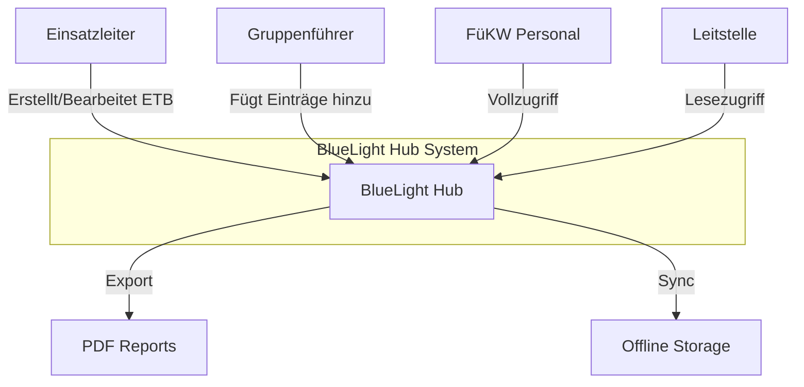
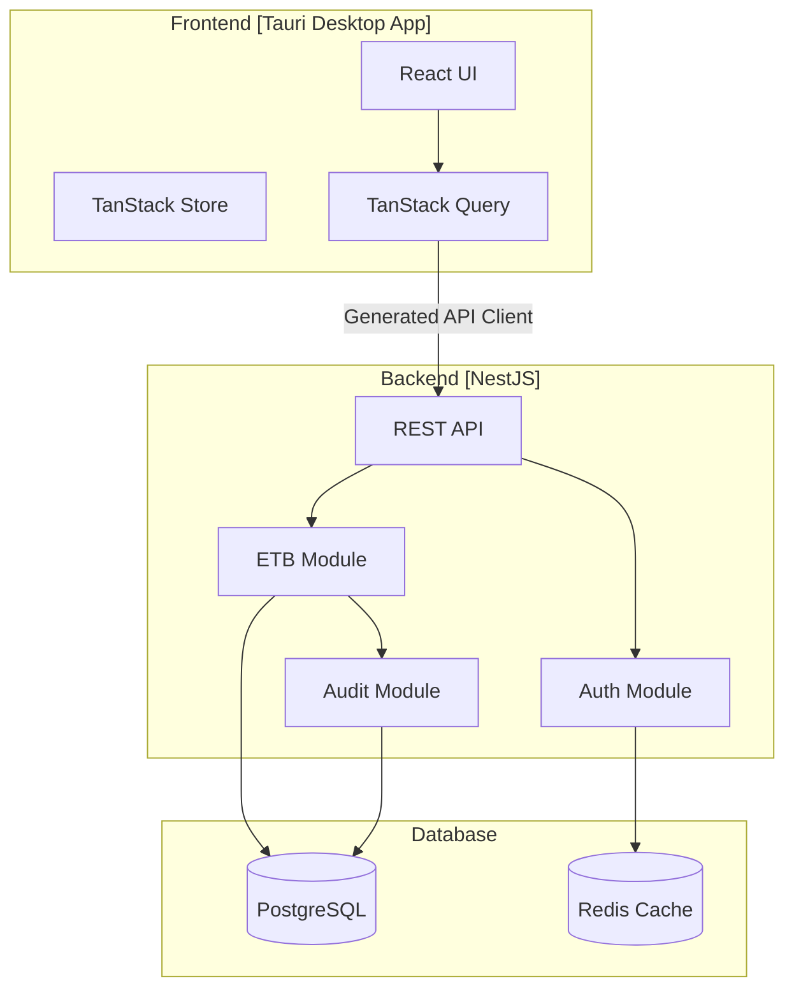
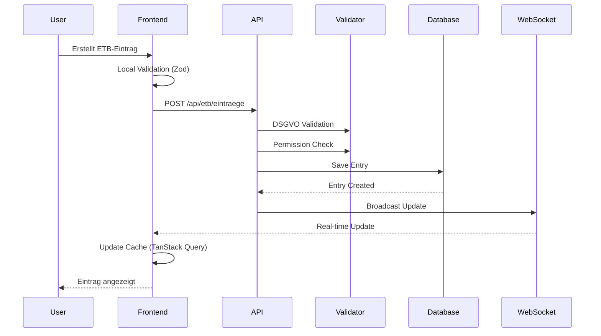
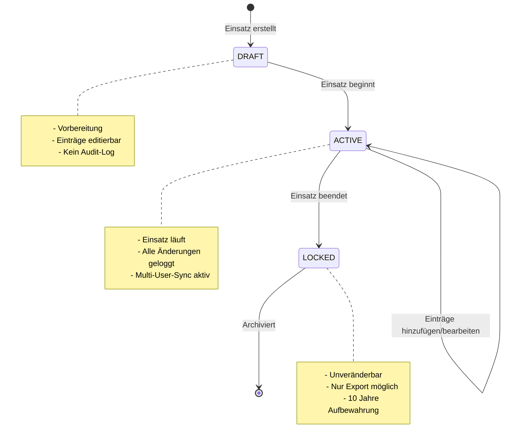
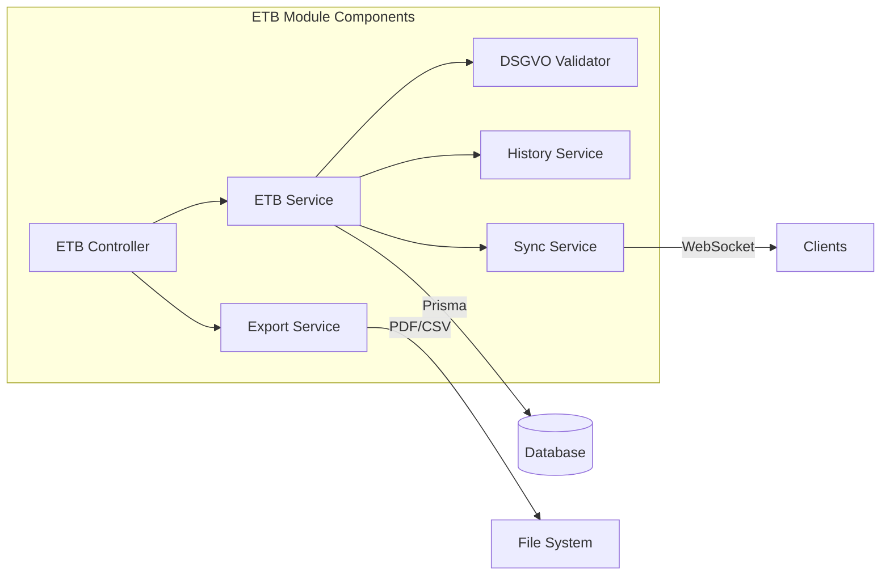

# Story: ETB Architecture Diagrams & Data Flow Documentation

## Story ID
etb-1.13

## Titel
Architektur-Diagramme und Datenfluss-Dokumentation für ETB

## Beschreibung
Als **Entwickler** möchte ich klare Architektur-Diagramme und Datenfluss-Dokumentation haben, damit AI Agents und neue Teammitglieder das System schnell verstehen und korrekt implementieren können.

## Akzeptanzkriterien
- [ ] C4-Model Diagramme (Context, Container, Component) erstellt
- [ ] Datenfluss-Diagramm für ETB-Einträge (Create, Update, Lock)
- [ ] Sequenz-Diagramm für Multi-User-Synchronisation
- [ ] State-Machine-Diagramm für ETB-Status-Übergänge
- [ ] API-Flow-Diagramm für Frontend-Backend-Kommunikation
- [ ] Mermaid-Diagramme in Markdown eingebettet

## Technical Implementation

### 1. System Context Diagram (C4 Level 1)


### 2. Container Diagram (C4 Level 2)


### 3. ETB Data Flow Diagram


### 4. ETB Status State Machine


### 5. Component Interaction (ETB Module)


## File Locations
```text
docs/
├── architecture/
│   ├── diagrams/
│   │   ├── etb-c4-context.md
│   │   ├── etb-c4-container.md
│   │   ├── etb-data-flow.md
│   │   ├── etb-state-machine.md
│   │   └── etb-components.md
│   └── 08-concepts.adoc  # Integration der Diagramme
```

## Dependencies
- Mermaid.js für Diagramm-Rendering
- arc42 Template-Integration

## Aufwandsschätzung
- Diagramm-Erstellung: 5 Story Points
- Integration in Docs: 2 Story Points

## Testing
- Validierung der Diagramme gegen Code-Realität
- Review durch Tech Lead